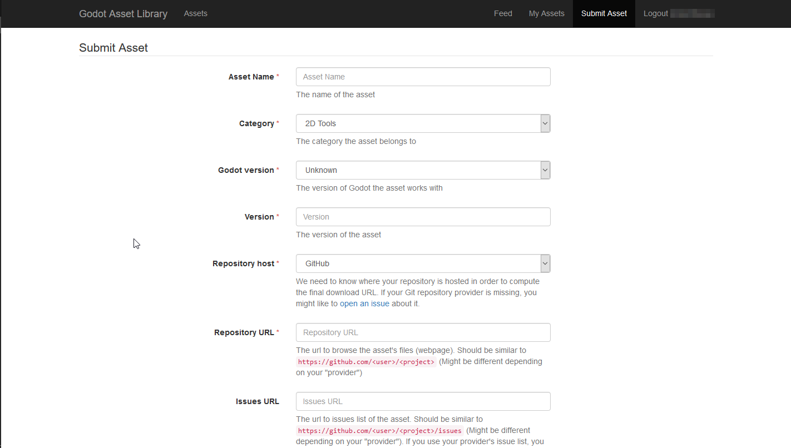

.. _doc_submitting_to_assetlib:

Submitting to the Asset Library
===============================

Introduction
------------

This tutorial aims to serve as a guide on how you can submit your own assets
to the `Godot Asset Library <https://godotengine.org/asset-library/asset>`_
and share them with the Godot community.

As mentioned in the :ref:`doc_using_assetlib` document, in order to be able to
submit assets to the AssetLib, you need to have a registered account, and be
logged in.

Submission guidelines
---------------------

Before submitting your asset, please ensure it follows all of the
requirements, and also consider following the recommendations.

Requirements
~~~~~~~~~~~~

Generally speaking, most assets people submit to the asset library
are accepted. However, in order for your asset to be accepted, there
are a few requirements your asset needs to meet to be approved.

* The asset must **work**. If the asset doesn't run or otherwise doesn't
  work in the specified Godot version, then it will be rejected.

* The asset must have a proper **.gitignore** file. It's important to
  keep redundant data out of the repository.
  `Here's a template. <https://raw.githubusercontent.com/aaronfranke/gitignore/godot/Godot.gitignore>`_

* No **submodules**, or any submodules must be non-essential. GitHub
  does not include submodules in the downloaded ZIP file, so if the
  asset needs the contents of the submodule, your asset won't work.

* The **license** needs to be correct. The license listed on the asset
  library must match the license in the repository. The repo MUST
  have a license file, called either "LICENSE" or "LICENSE.md".
  This file must contain the license text itself and a copyright
  statement that includes the year(s) and copyright holder.

* Use proper **English** for the name and description of your asset.
  This includes using correct capitalization, and using full
  sentences in the description. You can also include other languages,
  but there should at least be an English version.

* The icon link must be a **direct link**. For icons hosted on GitHub, the
  link must start with "raw.githubusercontent.com", not "github.com".

Recommendations
~~~~~~~~~~~~~~~

These things are not required for your asset to be approved, but
if you follow these recommendations, you can help make the asset
library a better place for all users.

* When creating non-project assets, it is common practice to place your files
  inside of an **addons/asset_name/** folder. Do this to avoid having your files 
  clash with other assets, or with the files of users installing your asset. 
  This folder will **not** be automatically generated when a user installs your asset.

* Fix or suppress all script **warnings**. The warning system is there to
  help identify issues with your code, but people using your asset
  don't need to see them.

* Make your code conform to the official **style guides**. Having a
  consistent style helps other people read your code, and it also helps
  if other people wish to contribute to your asset. See: the
  :ref:`doc_gdscript_styleguide` or the :ref:`doc_c_sharp_styleguide`.

* If you have screenshots in your repo, place them in their own subfolder
  and add an empty **.gdignore** file in the same folder (note: **gd**, not **git**).
  This prevents Godot from importing your screenshots.
  On Windows, open a command prompt in the project folder and run
  ``type nul > .gdignore`` to create a file whose name starts with a period.

* If your asset is a library for working with other files,
  consider including **example files** in the asset.

* Consider adding a **.gitattributes** file to your repo. This file allows
  giving extra instructions to Git, such as specifying line endings and listing
  files not required for your asset to function with the ``export-ignore``
  directive. This directive removes such files from the resulting ZIP file,
  preventing them from being downloaded by the asset library users.
  These are common examples of **.gitattributes**:

  .. tabs::

   .. tab:: Projects / Templates

      .. code-block:: shell

        # Normalize line endings for all files that Git considers text files.
        * text=auto eol=lf

   .. tab:: Addons / Asset Packs

      .. code-block:: shell

        # Normalize line endings for all files that Git considers text files.
        * text=auto eol=lf

        # Only include the addons folder when downloading from the Asset Library.
        /**        export-ignore
        /addons    !export-ignore
        /addons/** !export-ignore

* If you are submitting a plugin, add a **copy** of your license and readme
  to the plugin folder itself. This is the folder that users are guaranteed to
  keep with their project, so a copy ensures they always have those files handy
  (and helps them fulfill your licensing terms).

* While the asset library allows more than just GitHub, consider
  hosting your asset's source code on **GitHub**. Other services may not
  work reliably, and a lack of familiarity can be a barrier to contributors.

Submitting
----------

Once you are logged in, you will be able to head over to the "Submit Assets" page
of the AssetLib, which will look like this:

|image0|

While it may look like a lot (and there is more as you scroll down), each field is
described in terms of what you should put in. We will nonetheless go over what
is required in the submission form here as well.

* **Asset Name**:
    The name of your asset. Should be a unique, descriptive title of
    what your asset is.
* **Category**:
    The category that your asset belongs to, and will be shown in
    search results. The category is split into **Addons** and **Projects**.
    In-editor, assets of the Project type (Templates, Demos, Projects) only show
    up when viewing the AssetLib from the Project Manager, while assets of the
    Addon type will only be visible from inside a project.
* **Godot version**:
    The version of the engine that the asset works with.
    Currently, it's not possible to have a single asset entry contain downloads for
    multiple engine versions, so you may need to re-submit the asset multiple times,
    with an entry for each Godot version it supports. This is particularly important
    when dealing with major versions of the engine, such as Godot 2.x and Godot 3.x.
* **Version**:
    The version number of the asset. While you are free to choose
    and use any versioning scheme that you like, you may want to look into
    something such as `SemVer <https://semver.org>`_ if you want your asset's
    versioning scheme to be clear and consistent. Note that there is also an
    internal version number, incremented every time the asset download URL is
    changed or updated.
* **Repository host**:
    Assets uploaded to the AssetLib are not hosted on it
    directly. Instead, they point to repositories hosted on third-party Git providers,
    such as GitHub, GitLab or Bitbucket. This is where you choose which provider
    your asset uses, so the site can compute the final download link.
* **Repository URL**:
    The URL to your asset's files/webpage. This will vary
    based on your choice of provider, but it should look similar to `https://github.com/<user>/<project>`.
* **Issues URL**:
    The URL to your asset's issue tracker. Again, this will differ
    from repository host to repository host, but will likely look similar to
    `https://github.com/<user>/<project>/issues`. You may leave this field empty
    if you use your provider's issue tracker, and it's part of the same repository.
* **Download Commit**:
    The commit of the asset. For example,
    `b1d3172f89b86e52465a74f63a74ac84c491d3e1`. The site computes
    the actual download URL from this.
* **Icon URL**:
    The URL to your asset's icon (which will be used as a thumbnail
    in the AssetLib search results and on the asset's page). Should be an image
    in either the PNG or JPG format.

    The **icon** must be square (1:1 aspect ratio). It should have a minimum
    resolution of 128×128 pixels.

* **License**:
    The license under which you are distributing the asset. The list
    includes a variety of free and open source software licenses, such as GPL
    (v2 and v3), MIT, BSD and Boost Software License. You can visit `OpenSource.org <https://opensource.org>`_
    for a detailed description of each of the listed licenses.
* **Description**:
    Finally, you can use the Description field for a textual
    overview of your asset, its features and behavior, a changelog, et cetera. In the
    future, formatting with Markdown will be supported, but currently, your only
    option is plain text.

You may also include up to three video and/or image previews, which will be shown
at the bottom of the asset page. Use the "Enable" checkbox on each of the preview
submission boxes to enable them.

* **Type**:
    Either an image, or a video.
* **Image/YouTube URL**:
    Either a link to the image, or to a video, hosted on YouTube.
* **Thumbnail URL**:
    A URL to an image that will be used as a thumbnail for the
    preview. This option will be removed eventually, and thumbnails will be automatically
    computed instead.

Once you are done, press "Submit". Your asset will be entered into the review queue.
You can check all assets currently pending a review `here <https://godotengine.org/asset-library/asset/edit?&asset=-1>`_ .
The approval process is manual and may take up to a few days for your asset to be accepted (or rejected), so please
be patient!

.. note::

    You may have some luck accelerating the approval process by messaging the
    moderators and AssetLib reviewers on the `Godot Contributors Chat <https://chat.godotengine.org/>`_,
    or the official Discord server.

You will be informed when your asset is reviewed. If it was rejected,
you will be told why that may have been, and you will be able to submit it again
with the appropriate changes.

