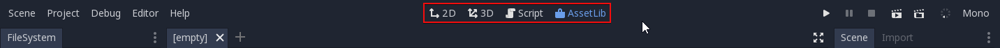
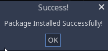

.. _doc_using_assetlib:

Using the Asset Library
=======================

On the website
--------------

Overview
~~~~~~~~

As mentioned before, you can access the web frontend of the Asset Library on
`Godot's official website <https://godotengine.org/asset-library/asset>`_.
This is what it looks like when you first visit it:

|image0|

At the top, you see the **header**, which takes you to various other parts of the
AssetLib - at the moment, it's empty, as we are not logged in.

Searching
~~~~~~~~~

In the center is the **search bar + settings** section, and the **assets** section
below it - this lets you filter out certain kinds of assets based on a host
of criteria. These include the asset **category** (such as 2D tools, scripts
and demos), **engine version** they are intended for, **sorting order** (by
update date, by name, etc.) and **support level**.

While most other filter settings should be fairly self-explanatory, it's worth
going over what "support level" means in the Asset Library.
Currently there are three support levels, and each asset can belong to only one.

**Official** assets are created and maintained by the official Godot Engine
developers. Currently, these include the official engine demos, which showcase
how various areas of the engine work.

**Community** assets are submitted and maintained by the members of the
Godot community.

**Testing** assets are works-in-progress, and may contain bugs and usability
issues. They are not recommended for use in serious projects, but you are
encouraged to download, test them, and submit issues to the original authors.

You can mix and match any of the search filters and criteria, and upon clicking
the Search button, receive the list of all assets in the Library that match them.

|image1|

Note that the search results are not updated in real-time, so you will have to
re-submit the search query each time you change the query settings.

Breakdown of an asset
~~~~~~~~~~~~~~~~~~~~~

Now let's take a look at what an asset's page looks like and what it contains.

|image2|

1. Asset's thumbnail/icon.
2. Asset's name.
3. Current version number of the asset.
4. Asset's category, Godot version, and support status.
5. Asset's original author/submitter.
6. The license the asset is distributed under.
7. The date of the asset's latest edit/update.
8. A textual description of the asset.
9. Links related to the asset (download link, file list, issue tracker).
10. Images and videos showcasing the asset.

Registering and logging in
~~~~~~~~~~~~~~~~~~~~~~~~~~

In order to upload assets to the AssetLib, you need to be logged in, and to do
that, you need a registered user account. In the future, this may also give you
access to other features, such as commenting on or rating the existing assets.
You do *not* need to be logged in to browse and download the assets.

The login/registration page can be accessed from the AssetLib header.

|image3|

From here, you can register your account, which requires a valid email address,
a username, and a (preferably strong) password.

|image4|

Then, you can use your username and password to log in.

|image5|

This will change the look of the AssetLib header. Now you get access to a handful of
new functions:

- The feed, which shows a list of status updates on your submitted assets (and possibly more in the future).
- A list of your uploaded assets.
- The ability to submit new assets.

|image6|

You can learn how to submit assets to the Library, and what the asset submission
guidelines are, in the next part of this tutorial, :ref:`doc_submitting_to_assetlib`.

.. _doc_using_assetlib_editor:

In the editor
-------------

.. note::

    The editor will display different categories of assets depending on whether
    you're browsing the Project Manager's **Asset Library Projects** tab or the editor's
    **AssetLib** tab.

    The Project Manager's **Asset Library Projects** tab will only display assets that are
    standalone projects by themselves. This is denoted on the asset library with
    the *Templates*, *Demos* and *Projects* categories.

    The editor's **AssetLib** tab will only display assets that are *not* standalone
    projects by themselves. In other words, it will display assets from all
    categories except *Templates*, *Demos* and *Projects*.

You can also access the AssetLib directly from Godot:

|image7|

|image14|

Click on it, and Godot will fetch info about the assets from the AssetLib. Once
it's finished, you will see a window similar to what the AssetLib website looks
like, with some differences:

|image8|

Similarly to the web version of the AssetLib, here you can search
for assets by category, name, and sort them by factors such as name or edit date.

Notably, you can only fetch assets for the current version of Godot you are running.
Projects, Demos and Templates can be downloaded from the Project Manager
view of the AssetLib. Addons (tools, scripts, materials etc.) can be downloaded from
the in-project AssetLib and added to the current project.
In addition, unlike when using the web frontend, the search results are updated
in real-time (you do not have to press Search after every change to your search
query for the changes to take place).

In the future, you will be able to choose a different AssetLib provider to fetch
assets from (using the Site dropdown menu), however currently only the official
`Godot website <https://godotengine.org>`_ version of the AssetLib is supported,
as well as the version that may be running on your local machine's web server
(the localhost option).

When you click on an asset, you will see more information about it.

|image9|

If you click on the Install button, Godot will fetch an archive of the asset,
and will track download progress of it at the bottom of the editor window. If
the download fails, you can retry it using the Retry button.

|image10|

When it finishes, you can proceed to install it using the Install button.
This will bring up the Package Installer window.

|image11|

Here you can see a list of all the files that will be installed. You can tick off
any of the files that you do not wish to install, and Godot will also inform you
about any problems with files that it cannot install. These files will be shown
in red, and hovering over them will show you a message stating why it cannot be
installed.

|image12|

Once you are done, you can press the Install button, which will unzip all the
files in the archive, and import any assets contained therein, such as images or
3D models. Once this is done, you should see a message stating that the Package
installation is complete.

|image13|

You may also use the Import button to import asset archives obtained
elsewhere (such as downloading them directly from the AssetLib web frontend),
which will take you through the same package installation procedure as with the
assets downloaded directly via Godot that we just covered.

.. |image0| image:: img/assetlib_website.png
.. |image1| image:: img/assetlib_search.png
.. |image2| image:: img/assetlib_asset.png
.. |image3| image:: img/assetlib_register-login.png
.. |image4| image:: img/assetlib_register.png
.. |image5| image:: img/assetlib_login.png
.. |image6| image:: img/assetlib_login_header.png

.. |image14| image:: img/assetlib_editor_projects.webp
