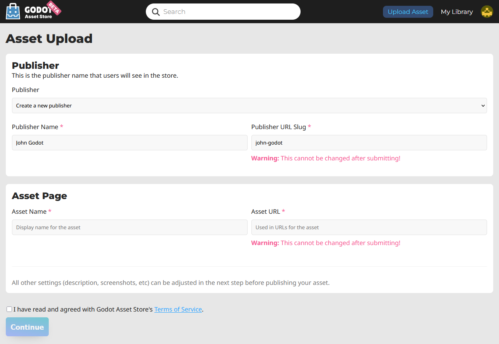
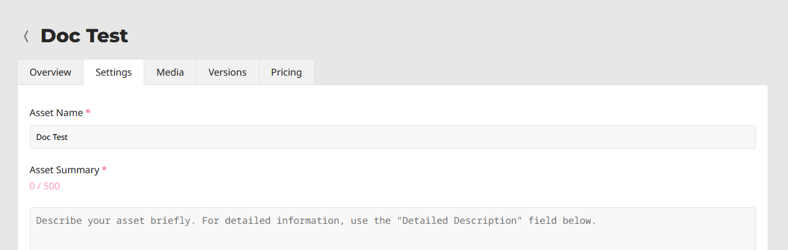

.. _doc_submitting_to_asset_store:

Submitting to the Asset Store
=============================

Introduction
------------

This tutorial aims to serve as a guide on how you can submit your own assets
to the `Godot Asset Store <https://store.godotengine.org/>`_
and share them with the Godot community.

As mentioned in the :ref:`doc_using_asset_store_website` page, in order to be able to
submit assets to the Asset Store, you need to have a registered account, and be
logged in.

Submission guidelines
---------------------

Before submitting your asset, please ensure it follows all of the
requirements, and also consider following the recommendations.

Requirements
~~~~~~~~~~~~

Generally speaking, most assets people submit to the Asset Store
are accepted. However, in order for your asset to be accepted, there
are a few requirements it needs to meet to be approved.

* The asset must **work**. If the asset doesn't run or otherwise doesn't
  work in the specified Godot version, then it will be rejected.

* The asset must have a proper **.gitignore** file. It's important to
  keep redundant data out of the repository.
  `Here's a template. <https://raw.githubusercontent.com/aaronfranke/gitignore/godot/Godot.gitignore>`_

* No **submodules**, or any submodules must be non-essential. GitHub
  does not include submodules in the downloaded ZIP file, so if the
  asset needs the contents of the submodule, your asset won't work.

* The **license** needs to be correct. The license listed on the Asset
  Store must match the license in the repository. The repo **must**
  have a license file, called either "LICENSE" or "LICENSE.md".
  This file must contain the license text itself and a copyright
  statement that includes the year(s) and copyright holder.

* Use proper **English** for the name and description of your asset.
  This includes using correct capitalization, and using full
  sentences in the description. You can also include other languages,
  but there should at least be an English version.

* The icon link must be a **direct link**. For icons hosted on GitHub, the
  link must start with "raw.githubusercontent.com", not "github.com".

Recommendations
~~~~~~~~~~~~~~~

These things are not required for your asset to be approved, but
if you follow these recommendations, you can help make the asset
store a better place for all users.

* When creating non-project assets, it is common practice to place your files
  inside of an **addons/asset_name/** folder. Do this to avoid having your files 
  clash with other assets, or with the files of users installing your asset. 
  This folder will **not** be automatically generated when a user installs your asset.

* Fix or suppress all script **warnings**. The warning system is there to
  help identify issues with your code, but people using your asset
  don't need to see them.

* Make your code conform to the official **style guides**. Having a
  consistent style helps other people read your code, and it also helps
  if other people wish to contribute to your asset. See the
  :ref:`doc_gdscript_styleguide` or the :ref:`doc_c_sharp_styleguide`.

* If you have screenshots in your repo, place them in their own subfolder
  and add an empty **.gdignore** file in the same folder (note: **gd**, not **git**).
  This prevents Godot from importing your screenshots.
  On Windows, open a command prompt in the project folder and run
  ``type nul > .gdignore`` to create a file whose name starts with a period.

* If your asset is a library for working with other files,
  consider including **example files** in the asset.

* Consider adding a **.gitattributes** file to your repo. This file allows
  giving extra instructions to Git, such as specifying line endings and listing
  files not required for your asset to function with the ``export-ignore``
  directive. This directive removes such files from the resulting ZIP file,
  preventing them from being downloaded by Asset Store users.
  These are common examples of **.gitattributes**:

  .. tabs::

   .. tab:: Projects / Templates

      .. code-block:: shell

        # Normalize line endings for all files that Git considers text files.
        * text=auto eol=lf

   .. tab:: Addons / Asset Packs

      .. code-block:: shell

        # Normalize line endings for all files that Git considers text files.
        * text=auto eol=lf

        # Only include the addons folder when downloading from the Asset Store.
        /**        export-ignore
        /addons    !export-ignore
        /addons/** !export-ignore

* If you are submitting a plugin, add a **copy** of your license and readme
  to the plugin folder itself. This is the folder that users are guaranteed to
  keep with their project, so a copy ensures they always have those files handy
  (and helps them fulfill your licensing terms).

* While the Asset Store allows more than just GitHub, consider
  hosting your asset's source code on **GitHub**. Other services may not
  work reliably, and a lack of familiarity can be a barrier to contributors.

Submitting
----------

Once you are logged in, click on **Upload Asset** on the top right of the website.
It will take you to the following page:

Here is a breakdown of each field:

* **Publisher**: This is the public name associated with the asset. For example, the
  XR Tools asset has the publisher "Godot XR".

* **Publisher Name**: The name of the new publisher you are creating.

* **Publisher URL Slug**: how the publisher will appear in its link. For example,
  the XR Tools asset has the following URL: ``https://store.godotengine.org/asset/godot-xr/godot-xr-tools/``

  The publisher URL Slug in that is "godot-xr".

* **Asset Name**: The name of your asset. Should be a unique, descriptive title of
  what your asset is.

* **Asset URL**: How the asset will be named in its link. For example,
  the XR Tools asset has the following URL: ``https://store.godotengine.org/asset/godot-xr/godot-xr-tools/``

  The asset URL for that link is "godot-xr-tools".

After filling out those fields, agree to the terms of service after reading them,
and click "Continue". You will be brought to the asset's management page, where
you can edit almost everything about how it will appear on the store, as well as
upload different versions.

Management pages
----------------

Overview
~~~~~~~~

The overview tab lets you submit your asset for review. You can also view
analytics including how many times it's been downloaded, page visits, and the number
of people who have added it to their library.

You can also delete the asset at the bottom of the page from this tab.

Settings
~~~~~~~~

This tab is where you set up the following general information about your asset:

* Asset Summary
* Detailed description
* Tags
* Asset type (Full Project or Addon)
* License
* Link to source code
* AI usage disclosure (This is **mandatory** if you use AI)

Media
~~~~~

The media tab is where you upload your thumbnail, screenshots, an image for
the featured page if you want, and link to a YouTube video if you have one.

Versions
~~~~~~~~

This is where you upload the actual asset files. For each version you upload you can
give it a name, write a changelog, and specify the minimum Godot version (and
maximum if applicable). There is also an additional information field for anything
miscellaneous.

Each individual version has a maximum file size of 1GB.

Pricing
~~~~~~~

While paid assets can't be uploaded yet, there are some settings relevant to free
assets. You can link to another website where you accept donations, such as Patreon
or Ko-Fi. You can also disable reviews if you want (in the future paid assets will
**not** have this option). 

Submitting for review
---------------------

Once you are done, press "Submit". Your asset will be entered into the review queue.
You will be informed when your asset is reviewed. If it was rejected, you will be
told why that may have been, and you will be able to submit it again with the
appropriate changes.
