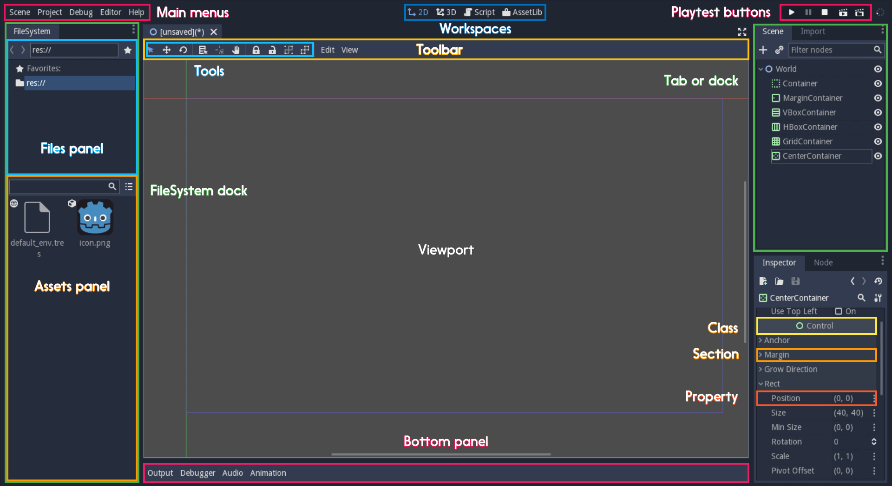

.. _doc_docs_writing_guidelines:

Docs writing guidelines
=============================

The Godot community is rich and international. Users come from all
around the world. Some of them are young, and many aren't native English
speakers. That's why we must all write using a clear and a common
language. For the class reference, the goal is to make it easy to read
for everyone and precise.

In summary, always try to:

1. Use the direct voice
2. Use precise action verbs
3. Avoid verbs that end in -ing
4. Remove unnecessary adverbs and adjectives.
5. Ban these 8 words: obvious, simple, basic, easy, actual, just, clear, and however
6. Use explicit references
7. Use 's to show possession
8. Use the Oxford comma

There are 3 rules to describe classes:

1. Give an overview of the node in the brief description
2. Mention what methods return if it's useful
3. Use "if true" to describe booleans

.. note::

    A technical writer's job is to pack as much information as possible into
    the smallest and clearest sentences possible. These guidelines will help
    you work towards that goal.

7 rules for a clear english
---------------------------

Use the direct voice
~~~~~~~~~~~~~~~~~~~~

Use the direct voice when possible. Take the classes, methods, and
constants you describe as the subject. It's natural to write using the
passive voice, but it's harder to read and produces longer sentences.

.. highlight:: none

Passive:

::

    The man **was bitten** by the dog.

Active:

::

    The dog bit the man.
    

**Don't** use the passive voice:

::

    void edit_set_pivot ( Vector2 pivot )
    [...] This method **is implemented** only in some nodes that inherit Node2D.

**Do** use the node's name as a noun:

::

    void edit_set_pivot ( Vector2 pivot )
    [...] Only some Node2Ds **implement** this method.

Use precise action verbs
~~~~~~~~~~~~~~~~~~~~~~~~

Favor precise yet common verbs over generic ones like ``make``, ``set``,
and any expression you can replace with a single word.

**Don't** repeat the method's name. It already states it sets the pivot
value to a new one:

::

    void edit_set_pivot ( Vector2 pivot )
    Set the pivot position of the 2D node to [code]pivot[/code] value. [...]

**Do** explain what's the consequence of this "set": use precise verbs
like ``place``, ``position``, ``rotate``, ``fade``, etc.

::

    void edit_set_pivot ( Vector2 pivot )
    Position the node's pivot to the [code]pivot[/code] value. [...]

Avoid verbs that end in -ing
~~~~~~~~~~~~~~~~~~~~~~~~~~~~

The progressive forms describe continuous actions. E.g. "is calling",
"is moving".

**Don't** use the progressive form for instant changes.

::

    Vector2 move ( Vector2 rel_vec )
    Move the body in the given direction, **stopping** if there is an obstacle. [...]

**Do** use simple present, preterit or future.

::

    Vector2 move ( Vector2 rel_vec )
    Moves the body in the vector's direction. The body **stops** if it collides with an obstacle. [...]

You may use the progressive tense to describe actions that are
continuous in time. Anything like animation or coroutines.

.. tip::

    Verbs can turn into adjectival nouns with -ing. This is not a
    conjugation, so you may use them: ``the remaining movement``,
    ``the missing file``, etc.

Remove unnecessary adverbs and adjectives
~~~~~~~~~~~~~~~~~~~~~~~~~~~~~~~~~~~~~~~~~

Write as few adjectives and adverbs as possible. Only use them if they
add key information to the description.

**Don't** use redundant or meaningless adverbs. Words that lengthen the
documentation but don't add any information:

::

    **Basically** a big texture [...]

**Do** write short sentences in a simple, descriptive language:

::

    A big texture [...]

Ban these 8 words
~~~~~~~~~~~~~~~~~

**Don't** ever use these 8 banned words:

1. obvious
2. simple
3. basic
4. easy
5. actual
6. just
7. clear
8. however (some uses)

Game creation and programming aren't simple, and nothing's easy to
someone learning to use the API for the first time. Other words in the
list, like ``just`` or ``actual`` won't add any info to the sentence.
Don't use corresponding adverbs either: obviously, simply, basically,
easily, actually, clearly.

**Don't** example. The banned words lengthen the description and take
attention away from the most important info:

::

    **TextureRect**
    Control frame that **simply** draws an assigned texture. It can stretch or not. It's a **simple** way to **just** show an image in a UI.

**Do** remove them:

::

    **TextureRect**
    [Control] node that displays a texture. The texture can stretch to the node's bounding box or stay in the center. Useful to display sprites in your UIs.

"Simple" never helps. Remember, for other users, anything could be
complex or frustrate them. There's nothing like a good old *it's simple*
to make you cringe. Here's the old brief description, the first sentence
on the Timer node's page:

::

    **Timer**
    A **simple** Timer node.

**Do** explain what the node does instead:

::

    **Timer**
    Calls a function of your choice after a certain duration.

**Don't** use "basic", it is too vague:

::

    **Vector3**
    Vector class, which performs **basic** 3D vector math operations.

**Do** use the brief description to offer an overview of the node:

::

    **Vector3**
    Provides essential math functions to manipulate 3D vectors: cross product, normalize, rotate, etc.

Use explicit references
~~~~~~~~~~~~~~~~~~~~~~~

Favor explicit references over implicit ones.

**Don't** use words like "the former", "the latter", etc. They're not
the most common in English, and they require you to check the reference.

::

    [code]w[/code] and [code]h[/code] define right and bottom margins. The **latter** two resize the texture so it fits in the defined margin.

**Do** repeat words. They remove all ambiguity:

::

    [code]w[/code] and [code]h[/code] define right and bottom margins. **[code]w[/code] and [code]h[/code]** resize the texture so it fits the margin.

If you need to repeat the same variable name 3 or 4 times, you probably
need to rephrase your description.

Use 's to show possession
~~~~~~~~~~~~~~~~~~~~~~~~~~~

Avoid "The milk **of** the cow". It feels unnatural in English. Write "The cow's
milk" instead.

**Don't** write "of the X":

::

    The region **of the AtlasTexture that is** used.

**Do** use ``'s``. It lets you put the main subject at the start of the
sentence, and keep it short:

::

    The **AtlasTexture's** used region.

Use the Oxford comma to enumerate anything
~~~~~~~~~~~~~~~~~~~~~~~~~~~~~~~~~~~~~~~~~~

From the Oxford dictionary:

    The 'Oxford comma' is an optional comma before the word 'and' at the end of a list:
    *We sell books, videos, and magazines.*

    [...] Not all writers and publishers use it, but it can clarify the meaning of a sentence when the items in a list are not single words:
    *These items are available in black and white, red and yellow, and blue and green.*

**Don't** leave the last element of a list without a comma:

::

    Create a KinematicBody2D node, a CollisionShape2D node and a sprite node.

**Do** add a comma before `and` or `or`, for the last
element of a list with more than two elements.

::

    Create a KinematicBody2D node, a CollisionShape2D node, and a sprite node.

How to write methods and classes
--------------------------------

Give an overview of the node in the brief description
~~~~~~~~~~~~~~~~~~~~~~~~~~~~~~~~~~~~~~~~~~~~~~~~~~~~~

The brief description is the reference's most important sentence. It's
the user's first contact with a node:

1. It's the only description in the "Create New Node" dialog.
2. It's at the top of every page in the reference

The brief description should explain the node's role and its
functionality, in up to 200 characters.

**Don't** write tiny and vague summaries:

::

    **Node2D**
    Base node for 2D system.

**Do** give an overview of the node's functionality:

::

    **Node2D**
    2D game object, parent of all 2D related nodes. Has a position, rotation, scale and z-index.

Use the node's full description to provide more information, and a code
example, if possible.

Mention what methods return if it's useful
~~~~~~~~~~~~~~~~~~~~~~~~~~~~~~~~~~~~~~~~~~

Some methods return important values. Describe them at the end of the
description, ideally on a new line. No need to mention the return values
for any method whose name starts with ``set`` or ``get``.

**Don't** use the passive voice:

::

    Vector2 move ( Vector2 rel_vec )
    [...] The returned vector is how much movement was remaining before being stopped.

**Do** always use "Returns".

::

    Vector2 move ( Vector2 rel_vec )
    [...] Returns the remaining movement before the body was stopped.

Notice the exception to the "direct voice" rule: with the move method,
an external collider can influence the method and the body that calls
``move``. In this case, you can use the passive voice.

Use "if true" to describe booleans
~~~~~~~~~~~~~~~~~~~~~~~~~~~~~~~~~~

For boolean member variables, always use ``if true`` and/or
``if false``, to stay explicit. ``Controls whether or not`` may be
ambiguous and won't work for every member variable.

Also surround boolean values, variable names and methods with [code][/code].

**Do** start with "if true":

::

    Timer.autostart
    If [code]true[/code] the timer will automatically start when it enters the scene tree. Default value: [code]false[/code].

Use [code] around arguments
~~~~~~~~~~~~~~~~~~~~~~~~~~~

In the class reference, always surround arguments with [code][/code]. In the documentation and in Godot, it will display like ``this``. When you edit XML files in the Godot repository, replace existing arguments written like 'this' or \`this\` with [code]this[/code].

Common vocabulary to use in godot's docs
----------------------------------------

The developers chose some specific words to refer to areas of the
interface. They're used in the sources, in the documentation, and you
should always use them instead of synonyms, so the users know what
you're talking about.

   Overview of the interface and common vocabulary

In the top left corner of the editor lie the ``main menus``. In the
center, the buttons change the ``workspace``. And together the buttons
in the top right are the ``playtest buttons``. The area in the center,
that displays the 2D or the 3D space, is the ``viewport``. At its top,
you find a list of ``tools`` inside the ``toolbar``.

The tabs or dockable panels on either side of the viewport are
``docks``. You have the ``FileSystem dock``, the ``Scene dock`` that
contains your scene tree, the ``Import dock``, the ``Node dock``, and
the ``Inspector`` or ``Inspector dock``. With the default layout you may
call the tabbed docks ``tabs``: the ``Scene tab``, the ``Node tab``...

The Animation, Debugger, etc. at the bottom of the viewport are
``panels``. Together they make up the ``bottom panels``.

Foldable areas of the Inspector are ``sections``. The node's parent
class names, which you can't fold, are ``Classes`` e.g. the
``KinematicBody2D class``. And individual lines with key-value pairs are
``properties``. E.g. ``position`` or ``modulate color`` are both
``properties``.

Image Contribution guidelines
-----------------------------

A significant part of the documentation is images, and there are several important
guidelines to follow.

First, you should always be using the default editor theme and text when taking screenshots.

For 3D screenshots use 4xMSAA, enable anisotropic filtering on the projects textures,
and set the anisotropic filter quality to 16x in Project Settings

Screenshot size should not exceed 1920x1080.

When you need to highlight an area of the editor to show something, like a 
button or option, use a 2 pixel thick outline without a bevel.

Before you add or replace any images in the documentation, they should be run through
a png compressor to save size. The built in lossless compressor in programs like Krita
or Photoshop should be done. However you should also use a lossy one, such as `pngquant <https://pngquant.org/>`_
where almost no image quality is lost during compression.