.. _doc_community_tutorials:

Tutorials and resources
=======================

This is a list of third-party tutorials and resources created by the Godot
community. For resources, remember that there is the official
`Godot Asset Library <https://godotengine.org/asset-library/asset>`_ full of
official and community resources too!

Think there is something missing here? Feel free to submit a `Pull Request <https://github.com/godotengine/godot-docs/blob/master/community/tutorials.rst>`_ as always.

Where to start
--------------
Not entirely sure where to start? If you follow this flowchart all the way
to the bottom you should be well prepared to start experimenting with making
your very own games. If you're stuck, remember that you can always ask the
community for help!

.. raw:: html

    <object type="image/svg+xml" data="../_images/godotbeginnerchart.svg">
        Your browser does not support SVGs.
    </object>

The Godot video tutorials by `GDQuest <https://www.youtube.com/channel/UCxboW7x0jZqFdvMdCFKTMsQ/playlists>`_ are well-regarded in the community and often recommended as a gentle introduction to beginners.

GDQuest's *Learn GDScript From Zero* is a free and open source interactive tutorial for absolute beginners to learn to program with Godot's GDScript language. It is available as a `desktop application <https://gdquest.itch.io/learn-godot-gdscript>`_  or `in the browser <https://gdquest.github.io/learn-gdscript>`_.

Some tutorials mentioned below cover more advanced subjects, e.g. on 3D or shaders.

Video tutorials
---------------

For video tutorials we recommend looking on `YouTube <https://www.youtube.com/>`_.
There are many great channels covering a wide array of subjects.

Text tutorials
--------------

- `FinePointCGI website by Mitch <https://finepointcgi.io/>`__
- `Catlike Coding by Jasper Flick <https://catlikecoding.com/godot/>`__
- `GDScript website by Andrew Wilkes <https://gdscript.com>`__
- `Godot Recipes by KidsCanCode <https://kidscancode.org/godot_recipes/4.x/>`__
- `Godot Tutorials by SomethingLikeGames <https://www.somethinglikegames.de/en/tags/godot-engine/>`__
- `GameDev Academy by Zenva <https://gamedevacademy.org/category/godot-tutorials/godot-4/>`__
- `Game Dev Artisan website <https://gamedevartisan.com/>`__
- `Night Quest Games Blog <https://www.nightquestgames.com/blog-articles/>`__

Resources
---------

- `awesome-godot: A curated list of free/libre plugins, scripts and add-ons <https://github.com/godotengine/awesome-godot>`_
- `Godot Asset Library <https://godotengine.org/asset-library/asset>`_
- `Godot Shaders: A community-driven shader library <https://godotshaders.com/>`_

