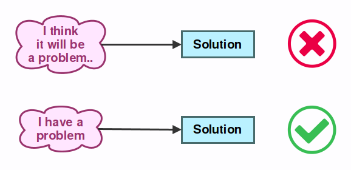
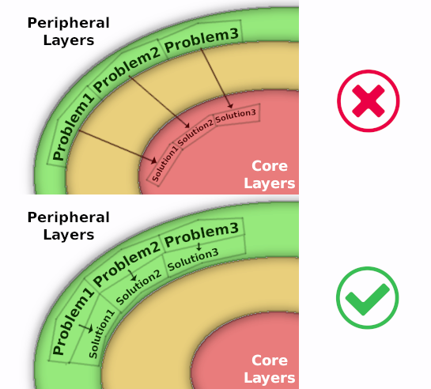
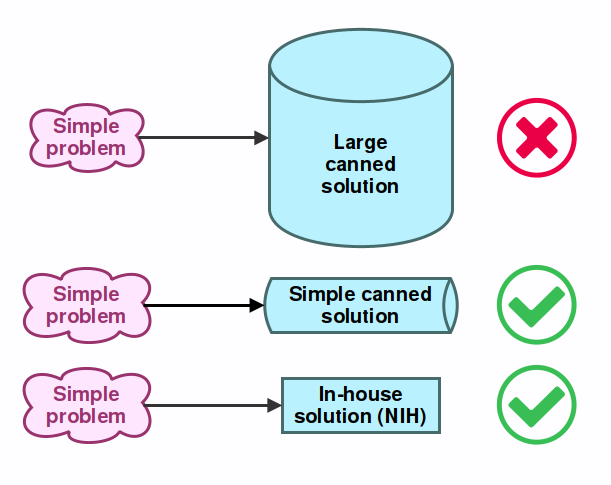

.. _doc_best_practices_for_engine_contributors:

Best practices for engine contributors
======================================

Introduction
------------

Godot has a large amount of users who have the ability to contribute because the
project itself is aimed mainly at users who can code. That being said, not all
of them have the same level of experience working in large projects or in
software engineering, which can lead to common misunderstandings and bad
practices during the process of contributing code to the project.

Language
--------

The scope of this document is to be a list of best practices for contributors to
follow, as well as to create a language they can use to refer to common
situations that arise in the process of submitting their contributions.

While a generalized list of software development best practices might be useful,
we'll focus on the situations that are most common in our project.

Contributions are most of the time categorized as bug fixes, enhancements or new
features. To abstract this idea, we will call them *Solutions*, because they
always seek to solve something that can be described as a *Problem*.

Best Practices
--------------

#1: The problem always comes first
~~~~~~~~~~~~~~~~~~~~~~~~~~~~~~~~~~

Many contributors are extremely creative and just enjoy the process of designing
abstract data structures, creating nice user interfaces, or simply love
programming. Whatever the case may be, they come up with cool ideas, which may
or may not solve real problems.

.. image:: img/best_practices1.png

These are usually called *solutions in search of a problem*. In an ideal world,
they would not be harmful but, in reality, code takes time to write, takes up
space and requires maintenance once it exists. Avoiding the addition of anything
unnecessary is always considered a good practice in software development.

#2: To solve the problem, it has to exist in the first place
~~~~~~~~~~~~~~~~~~~~~~~~~~~~~~~~~~~~~~~~~~~~~~~~~~~~~~~~~~~~

This is a variation of the previous practice. Adding anything unnecessary is not
a good idea, but what constitutes what is necessary and what isn't?

The answer to this question is that the problem needs to *exist* before it can
be actually solved. It must not be speculation or a belief. The user must be
using the software as intended to create something they *need*. In this process,
the user may stumble upon a problem that requires a solution to proceed, or in
order to achieve greater productivity. In this case, *a solution is needed*.

Believing that problems may arise in the future and that the software needs to
be ready to solve them by the time they appear is called *"Future proofing"* and
its characterized by lines of thought such as:

- I think it would be useful for users to...
- I think users will eventually need to...

This is generally considered a bad habit because trying to solve problems that
*don't actually exist* in the present will often lead to code that will be
written but never used, or that is considerably more complex to use and maintain
than it needs to be.

#3: The problem has to be complex or frequent
~~~~~~~~~~~~~~~~~~~~~~~~~~~~~~~~~~~~~~~~~~~~~

Software is designed to solve problems, but we can't expect it to solve *every
problem that exists under the sun*. As a game engine, Godot will help you make
games better and faster, but it won't make an *entire game* for you. A line must
be drawn somewhere.

.. image:: img/best_practices3.png

Whether a problem is worth solving is determined by the effort that is required
to work around it. The required effort depends on:

- The complexity of the problem
- The frequency the problem

If the problem is *too complex* for most users to solve, then the software
should offer a ready-made solution for it. Likewise, if the problem is easy for
the user to work around, offering such a solution is unnecessary.

The exception, however, is when the user encounters a problem *frequently
enough* that having to do the simple solution every time becomes an annoyance.
In this case, the software should offer a solution to simplify the use case.

It's usually easy to tell if a problem is complex or frequent, but it can be
difficult. This is why discussing with other developers (next point) is always
advised.

#4: The solution must be discussed with others
~~~~~~~~~~~~~~~~~~~~~~~~~~~~~~~~~~~~~~~~~~~~~~

Often, users will be immersed in their own projects when they stumble upon
problems. These users will naturally try to solve the problem from their
perspective, thinking only about their own use case. As a result, user proposed
solutions don't always contemplate all use cases and are often biased towards
the user's own requirements.

.. image:: img/best_practices4.png

For developers, the perspective is different. They may find the user's problem
too unique to justify a solution (instead of a workaround), or they might
suggest a partial (usually simpler or lower level) solution that applies to a
wider range of known problems and leave the rest of the solution up to the
user.

In any case, before attempting to contribute, it is important to discuss the
actual problems with the other developers or contributors, so a better agreement
on implementation can be reached.

The only exception is when an area of code has a clear agreed upon owner, who
talks to users directly and has the most knowledge to implement a solution
directly.

Also, Godot's philosophy is to favor ease of use and maintenance over absolute
performance. Performance optimizations will be considered, but they may not
be accepted if they make something too difficult to use or if they add too much
complexity to the codebase.

#5: To each problem, its own solution
~~~~~~~~~~~~~~~~~~~~~~~~~~~~~~~~~~~~~

For programmers, it is always a most enjoyable challenge to find the most
optimal solutions to problems. It is possible to go overboard, though.
Sometimes, contributors will try to come up with solutions that solve as many
problems as possible.

The situation will often take a turn for the worse when, in order to make this
solution appear even more fantastic and flexible, the pure speculation-based
problems (as described in #2) also make their appearance on stage.

.. image:: img/best_practices5.png

The main problem is that, in reality, it rarely works this way. Most of the
time, writing an individual solution to each problem results in code that
is simpler and more maintainable.

Additionally, solutions that target individual problems are better for the
users. Targeted solutions allow users find something that does exactly what they
need, without having to learn a more complex system they will only need for simple
tasks.

Big and flexible solutions also have an additional drawback which is that, over
time, they are rarely flexible enough for all users. Users end up requesting
more and more functionality which ends up making the API and codebase
more and more complex.

#6: Cater to common use cases, leave the door open for the rare ones
~~~~~~~~~~~~~~~~~~~~~~~~~~~~~~~~~~~~~~~~~~~~~~~~~~~~~~~~~~~~~~~~~~~~

This is a continuation of the previous point, which further explains why this
way of thinking and designing software is preferred.

As mentioned before (in point #2), it is very difficult for us (as human beings
who design software) to actually understand all future user needs. Trying to
write very flexible structures that cater to many use cases at once is often a
mistake.

We may come up with something we believe is brilliant but later find out that
users will never even use half of it or that they require features that don't
quite fit into our original design, forcing us to either throw it away
or make it even more complex.

The question is then, how do we design software that both allows users to do
*what we know they need to do* now and allows them to do *what we don't yet know
they'll need to do* in the future?

.. image:: img/best_practices6.png

The answer to this question is that, to ensure users still can do what they want
to do, we need to give them access to a *low level API* that they can use to
achieve what they want, even if it's more work for them because it means
reimplementing some logic that already exists.

In real-life scenarios, these use cases will be at most rare and uncommon
anyway, so it makes sense a custom solution needs to be written. This is why
it's important to still provide users the basic building blocks to do it.

#7: Prefer local solutions
~~~~~~~~~~~~~~~~~~~~~~~~~~

When looking for a solution to a problem, be it implementing a new feature or
fixing a bug, sometimes the easiest path is to add data or a new function in the
core layers of code.

The main problem here is, adding something to the core layers that will only be
used from a single location far away will not only make the code more difficult
to follow (split in two), but also make the core API larger, more complex, more
difficult to understand in general.

This is bad, because readability and cleanness of core APIs is always of extreme
importance given how much code relies on it, and because it's key for new
contributors as a starting point to learning the codebase.

A common reason for wanting to do this is that it's usually less code to simply
add a hack in the core layers.

Doing so is not advised. Generally, the code for a solution should be closer to
where the problem originates, even if it involves additional, duplicated, more
complex, or less efficient code. More creativity might be needed, but this path
is always the advised one.

#8: Don't use complex canned solutions for simple problems
~~~~~~~~~~~~~~~~~~~~~~~~~~~~~~~~~~~~~~~~~~~~~~~~~~~~~~~~~~

Not every problem has a simple solution and, many times, the right choice is to
use a third party library to solve the problem.

As Godot requires to be shipped in a large amount of platforms, we can't
link libraries dynamically. Instead, we bundle them in our source tree.

As a result, we are very picky with what goes in, and we tend to prefer smaller
libraries (single header ones are our favorite). We will only bundle something
larger if there is no other choice.

.. _doc_best_practices_for_engine_contributors_license_compliance:

Libraries must use a permissive enough license to be included into Godot.
Some examples of acceptable licenses are Apache 2.0, BSD, MIT, ISC, and MPL 2.0.
In particular, we cannot accept libraries licensed under the GPL or LGPL since
these licenses effectively disallow static linking in proprietary software
(which Godot is distributed as in most exported projects). This requirement also
applies to the editor, since we may want to run it on iOS in the long term.
Since iOS doesn't support dynamic linking, static linking is the only option on
that platform.
