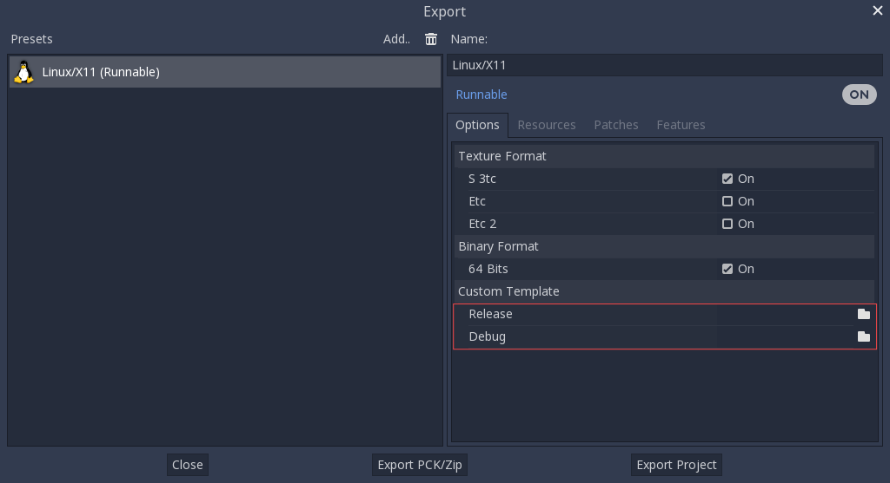

.. _doc_compiling_for_linuxbsd:

Compiling for Linux, \*BSD
==========================

.. highlight:: shell

.. seealso::

    This page describes how to compile Linux editor and export template binaries from source.
    If you're looking to export your project to Linux instead, read :ref:`doc_exporting_for_linux`.

Requirements
------------

For compiling under Linux or other Unix variants, the following is
required:

- GCC 7+ or Clang 6+.

- `Python 3.6+ <https://www.python.org/downloads/>`_.

- `SCons 3.0+ <https://scons.org/pages/download.html>`_ build system.

  .. note::

      If your distribution uses Python 2 by default, or you are using a version of SCons prior to 3.1.2,
      you will need to change the version of Python that SCons uses by changing the shebang
      (the first line) of the SCons script file to ``#! /usr/bin/python3``.
      Use the command ``which scons`` to find the location of the SCons script file.

- pkg-config (used to detect the development libraries listed below).
- Development libraries:

  - X11, Xcursor, Xinerama, Xi and XRandR.
  - MesaGL.
  - ALSA.
  - PulseAudio.

- *Optional* - libudev (build with ``udev=yes``).

.. seealso::

    To get the Godot source code for compiling, see :ref:`doc_getting_source`.

    For a general overview of SCons usage for Godot, see :ref:`doc_introduction_to_the_buildsystem`.

.. _doc_compiling_for_linuxbsd_oneliners:

Distro-specific one-liners
^^^^^^^^^^^^^^^^^^^^^^^^^^

.. tabs::

    .. tab:: Alpine Linux

        ::

            apk add \
              scons \
              pkgconf \
              gcc \
              g++ \
              libx11-dev \
              libxcursor-dev \
              libxinerama-dev \
              libxi-dev \
              libxrandr-dev \
              mesa-dev \
              libexecinfo-dev \
              eudev-dev \
              alsa-lib-dev \
              pulseaudio-dev

    .. tab:: Arch Linux

        ::

            pacman -S --needed \
              scons \
              pkgconf \
              gcc \
              libxcursor \
              libxinerama \
              libxi \
              libxrandr \
              mesa \
              glu \
              libglvnd \
              alsa-lib \
              pulseaudio

    .. tab:: Debian/Ubuntu

        ::

            apt-get install \
              build-essential \
              scons \
              pkg-config \
              libx11-dev \
              libxcursor-dev \
              libxinerama-dev \
              libgl1-mesa-dev \
              libglu-dev \
              libasound2-dev \
              libpulse-dev \
              libudev-dev \
              libxi-dev \
              libxrandr-dev

    .. tab:: Fedora

        ::

            dnf install \
              scons \
              pkgconfig \
              libX11-devel \
              libXcursor-devel \
              libXrandr-devel \
              libXinerama-devel \
              libXi-devel \
              mesa-libGL-devel \
              mesa-libGLU-devel \
              alsa-lib-devel \
              pulseaudio-libs-devel \
              libudev-devel \
              gcc-c++ \
              libstdc++-static \
              libatomic-static

    .. tab:: FreeBSD

        ::

            pkg install \
              py37-scons \
              pkgconf \
              xorg-libraries \
              libXcursor \
              libXrandr \
              libXi \
              xorgproto libGLU \
              alsa-lib \
              pulseaudio

    .. tab:: Gentoo

        ::

            emerge -an \
              dev-util/scons \
              x11-libs/libX11 \
              x11-libs/libXcursor \
              x11-libs/libXinerama \
              x11-libs/libXi \
              media-libs/mesa \
              media-libs/glu \
              media-libs/alsa-lib \
              media-sound/pulseaudio

    .. tab:: Mageia

        ::

            urpmi \
              scons \
              task-c++-devel \
              pkgconfig \
              "pkgconfig(alsa)" \
              "pkgconfig(glu)" \
              "pkgconfig(libpulse)" \
              "pkgconfig(udev)" \
              "pkgconfig(x11)" \
              "pkgconfig(xcursor)" \
              "pkgconfig(xinerama)" \
              "pkgconfig(xi)" \
              "pkgconfig(xrandr)"

    .. tab:: OpenBSD

        ::

            pkg_add \
              python \
              scons \
              llvm

    .. tab:: openSUSE

        ::

            zypper install \
              scons \
              pkgconfig \
              libX11-devel \
              libXcursor-devel \
              libXrandr-devel \
              libXinerama-devel \
              libXi-devel \
              Mesa-libGL-devel \
              alsa-devel \
              libpulse-devel \
              libudev-devel \
              gcc-c++ \
              libGLU1

    .. tab:: NetBSD

        ::

            pkg_add \
              pkg-config \
              py37-scons

        .. hint::

            For audio support, you can optionally install ``pulseaudio``.

    .. tab:: Solus

        ::

            eopkg install -c \
              system.devel \
              scons \
              libxcursor-devel \
              libxinerama-devel \
              libxi-devel \
              libxrandr-devel \
              mesalib-devel \
              libglu \
              alsa-lib-devel \
              pulseaudio-devel

Compiling
---------

Start a terminal, go to the root dir of the engine source code and type:

::

    scons platform=linuxbsd

.. note::

    Prior to Godot 4.0, the Linux/\*BSD target was called ``x11`` instead of
    ``linuxbsd``. If you are looking to compile Godot 3.x, make sure to use the
    `3.x branch of this documentation <https://docs.godotengine.org/en/3.6/development/compiling/compiling_for_x11.html>`__.

If all goes well, the resulting binary executable will be placed in the
"bin" subdirectory. This executable file contains the whole engine and
runs without any dependencies. Executing it will bring up the Project
Manager.

.. note::

    If you wish to compile using Clang rather than GCC, use this command:

    ::

        scons platform=linuxbsd use_llvm=yes

    Using Clang appears to be a requirement for OpenBSD, otherwise fonts
    would not build.
    For RISC-V architecture devices, use the Clang compiler instead of the GCC compiler.

.. tip:: If you are compiling Godot for production use, you can
         make the final executable smaller and faster by adding the
         SCons option ``production=yes``. This enables additional compiler
         optimizations and link-time optimization.

         LTO takes some time to run and requires about 7 GB of available RAM
         while compiling. If you're running out of memory with the above option,
         use ``production=yes lto=none`` or ``production=yes lto=thin`` for a
         lightweight but less effective form of LTO.

.. note:: If you want to use separate editor settings for your own Godot builds
          and official releases, you can enable
          :ref:`doc_data_paths_self_contained_mode` by creating a file called
          ``._sc_`` or ``_sc_`` in the ``bin/`` folder.

Running a headless/server build
-------------------------------

To run in *headless* mode which provides editor functionality to export
projects in an automated manner, use the normal build::

    scons platform=linuxbsd target=editor

And then use the ``--headless`` command line argument::

    ./bin/godot.linuxbsd.editor.x86_64 --headless

To compile a debug *server* build which can be used with
:ref:`remote debugging tools <doc_command_line_tutorial>`, use::

    scons platform=linuxbsd target=template_debug

To compile a *server* build which is optimized to run dedicated game servers,
use::

    scons platform=linuxbsd target=template_release production=yes

Building export templates
-------------------------

.. warning:: Linux binaries usually won't run on distributions that are
             older than the distribution they were built on. If you wish to
             distribute binaries that work on most distributions,
             you should build them on an old distribution such as Ubuntu 16.04.
             You can use a virtual machine or a container to set up a suitable
             build environment.

To build Linux or \*BSD export templates, run the build system with the
following parameters:

-  (32 bits)

::

    scons platform=linuxbsd target=template_release arch=x86_32
    scons platform=linuxbsd target=template_debug arch=x86_32

-  (64 bits)

::

    scons platform=linuxbsd target=template_release arch=x86_64
    scons platform=linuxbsd target=template_debug arch=x86_64

Note that cross-compiling for the opposite bits (64/32) as your host
platform is not always straight-forward and might need a chroot environment.

To create standard export templates, the resulting files in the ``bin/`` folder
must be copied to:

::

    $HOME/.local/share/godot/export_templates/<version>/

and named like this (even for \*BSD which is seen as "Linux/X11" by Godot):

::

    linux_x11_32_debug
    linux_x11_32_release
    linux_x11_64_debug
    linux_x11_64_release

However, if you are writing your custom modules or custom C++ code, you
might instead want to configure your binaries as custom export templates
here:

You don't even need to copy them, you can just reference the resulting
files in the ``bin/`` directory of your Godot source folder, so the next
time you build, you automatically have the custom templates referenced.

Using Clang and LLD for faster development
------------------------------------------

You can also use Clang and LLD to build Godot. This has two upsides compared to
the default GCC + GNU ld setup:

- LLD links Godot significantly faster compared to GNU ld or gold. This leads to
  faster iteration times.
- Clang tends to give more useful error messages compared to GCC.

To do so, install Clang and the ``lld`` package from your distribution's package manager
then use the following SCons command::

    scons platform=linuxbsd use_llvm=yes linker=lld

After the build is completed, a new binary with a ``.llvm`` suffix will be
created in the ``bin/`` folder.

It's still recommended to use GCC for production builds as they can be compiled using
link-time optimization, making the resulting binaries smaller and faster.

If this error occurs::

    /usr/bin/ld: cannot find -l:libatomic.a: No such file or directory

There are two solutions:

- In your SCons command, add the parameter ``use_static_cpp=no``.
- Follow `these instructions <https://github.com/ivmai/libatomic_ops#installation-and-usage>`__ to configure, build, and
  install ``libatomic_ops``. Then, copy ``/usr/lib/libatomic_ops.a`` to ``/usr/lib/libatomic.a``, or create a soft link
  to ``libatomic_ops`` by command ``ln -s /usr/lib/libatomic_ops.a /usr/lib/libatomic.a``. The soft link can ensure the
  latest ``libatomic_ops`` will be used without the need to copy it everytime when it is updated.

Using mold for faster development
---------------------------------

For even faster linking compared to LLD, you can use `mold <https://github.com/rui314/mold>`__.
mold can be used with either GCC or Clang.

As of January 2023, mold is not readily available in Linux distribution
repositories, so you will have to install its binaries manually.

- Download mold binaries from its `releases page <https://github.com/rui314/mold/releases/latest>`__.
- Extract the ``.tar.gz`` file, then move the extraced folder to a location such as ``.local/share/mold``.
- Add ``$HOME/.local/share/mold/bin`` to your user's ``PATH`` environment variable.
  For example, you can add the following line at the end of your ``$HOME/.bash_profile`` file:

::

    PATH="$HOME/.local/share/mold/bin:$PATH"

- Open a new terminal (or run ``source "$HOME/.bash_profile"``),
  then use the following SCons command when compiling Godot::

    scons platform=linuxbsd linker=mold

Using system libraries for faster development
---------------------------------------------

`Godot bundles the source code of various third-party libraries. <https://github.com/godotengine/godot/tree/master/thirdparty>`__
You can choose to use system versions of third-party libraries instead.
This makes the Godot binary faster to link, as third-party libraries are
dynamically linked. Therefore, they don't need to be statically linked
every time you build the engine (even on small incremental changes).

However, not all Linux distributions have packages for third-party libraries
available (or they may not be up-to-date).

Moving to system libraries can reduce linking times by several seconds on slow
CPUs, but it requires manual testing depending on your Linux distribution. Also,
you may not be able to use system libraries for everything due to bugs in the
system library packages (or in the build system, as this feature is less
tested).

To compile Godot with system libraries, install these dependencies *on top* of the ones
listed in the :ref:`doc_compiling_for_linuxbsd_oneliners`:

+------------------+-----------------------------------------------------------------------------------------------------------+
| **Fedora**       | ::                                                                                                        |
|                  |                                                                                                           |
|                  |     sudo dnf install embree3-devel enet-devel glslang-devel graphite2-devel harfbuzz-devel libicu-devel \ |
|                  |         libsquish-devel libtheora-devel libvorbis-devel libwebp-devel libzstd-devel mbedtls-devel \       |
|                  |         miniupnpc-devel                                                                                   |
+------------------+-----------------------------------------------------------------------------------------------------------+

After installing all required packages, use the following command to build Godot:

.. NOTE: Some `builtin_` options aren't used here because they break the build as of January 2023
   (tested on Fedora 37).

::

    scons platform=linuxbsd builtin_embree=no builtin_enet=no builtin_freetype=no builtin_graphite=no builtin_harfbuzz=no builtin_libogg=no builtin_libpng=no builtin_libtheora=no builtin_libvorbis=no builtin_libwebp=no builtin_mbedtls=no builtin_miniupnpc=no builtin_pcre2=no builtin_zlib=no builtin_zstd=no

You can view a list of all built-in libraries that have system alternatives by
running ``scons -h``, then looking for options starting with ``builtin_``.

.. warning::

    When using system libraries, the resulting library is **not** portable
    across Linux distributions anymore. Do not use this approach for creating
    binaries you intend to distribute to others, unless you're creating a
    package for a Linux distribution.

Using Pyston for faster development
-----------------------------------

You can use `Pyston <https://www.pyston.org/>`__ to run SCons. Pyston is a JIT-enabled
implementation of the Python language (which SCons is written in). It is currently
only compatible with Linux. Pyston can speed up incremental builds significantly,
often by a factor between 1.5× and 2×. Pyston can be combined with Clang and LLD
to get even faster builds.

- Download the `latest portable Pyston release <https://github.com/pyston/pyston/releases/latest>`__.
- Extract the portable ``.tar.gz`` to a set location, such as ``$HOME/.local/opt/pyston/`` (create folders as needed).
- Use ``cd`` to reach the extracted Pyston folder from a terminal,
  then run ``./pyston -m pip install scons`` to install SCons within Pyston.
- To make SCons via Pyston easier to run, create a symbolic link of its wrapper
  script to a location in your ``PATH`` environment variable::

    ln -s ~/.local/opt/pyston/bin/scons ~/.local/bin/pyston-scons

- Instead of running ``scons <build arguments>``, run ``pyston-scons <build arguments>``
  to compile Godot.

If you can't run ``pyston-scons`` after creating the symbolic link,
make sure ``$HOME/.local/bin/`` is part of your user's ``PATH`` environment variable.

.. note::

    Alternatively, you can run ``python -m pip install pyston_lite_autoload``
    then run SCons as usual. This will automatically load a subset of Pyston's
    optimizations in any Python program you run. However, this won't bring as
    much of a performance improvement compared to installing "full" Pyston.
