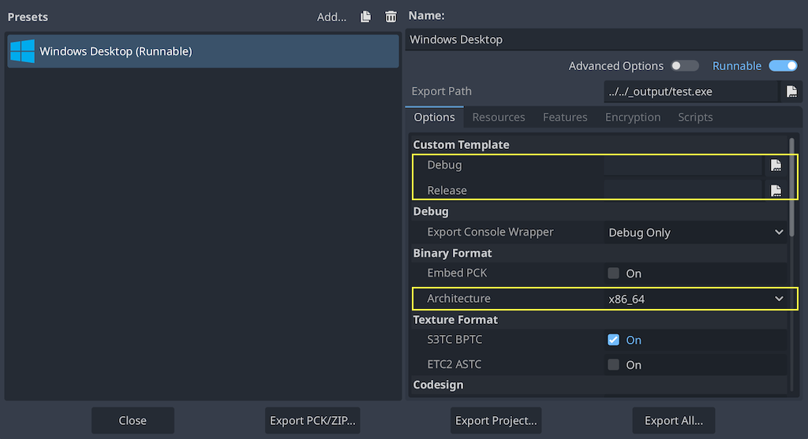

.. _doc_compiling_for_windows:

Compiling for Windows
=====================

.. highlight:: shell

.. seealso::

    This page describes how to compile Windows editor and export template binaries from source.
    If you're looking to export your project to Windows instead, read :ref:`doc_exporting_for_windows`.

Requirements
------------

For compiling under Windows, the following is required:

- A C++ compiler. Use one of the following:

    - `Visual Studio Community <https://www.visualstudio.com/vs/community/>`_,
      version 2019 or later. Visual Studio 2022 is recommended.
      **Make sure to enable C++ in the list of workflows to install.**
      If you've already installed Visual Studio without C++ support, run the installer
      again; it should present you a **Modify** button.
      Supports ``x86_64``, ``x86_32``, and ``arm64``.
    - `MinGW-w64 <https://mingw-w64.org/>`_ with GCC can be used as an alternative to
      Visual Studio. Be sure to install/configure it to use the ``posix`` thread model.
      **Important:** When using MinGW to compile the ``master`` branch, you need GCC 9 or later.
      Supports ``x86_64`` and ``x86_32`` only.
    - `MinGW-LLVM <https://github.com/mstorsjo/llvm-mingw/releases>`_ with clang can be used as
      an alternative to Visual Studio and MinGW-w64.
      Supports ``x86_64``, ``x86_32``, and ``arm64``.
- `Python 3.8+ <https://www.python.org/downloads/windows/>`_.
  **Make sure to enable the option to add Python to the** ``PATH`` **in the installer.**
- `SCons 4.0+ <https://scons.org/pages/download.html>`_ build system. Using the
  latest release is recommended, especially for proper support of recent Visual
  Studio releases.

.. note:: If you have `Scoop <https://scoop.sh/>`_ installed, you can easily
          install MinGW and other dependencies using the following command:

          ::

              scoop install python mingw

          Scons will still need to be installed via pip
.. note:: If you have `MSYS2 <https://www.msys2.org/>`_ installed, you can easily
          install MinGW and other dependencies using the following command:

          ::

              pacman -S mingw-w64-x86_64-gcc mingw-w64-i686-gcc make python-pip

          For each MSYS2 MinGW subsystem, you should then run
          `pip3 install scons` in its shell.

.. seealso:: To get the Godot source code for compiling, see
             :ref:`doc_getting_source`.

             For a general overview of SCons usage for Godot, see
             :ref:`doc_introduction_to_the_buildsystem`.

Setting up SCons
----------------

To install SCons, open the command prompt and run the following command:

::

    python -m pip install scons

If you are prompted with the message
``Defaulting to user installation because normal site-packages is not
writeable``, you may have to run that command again using elevated
permissions. Open a new command prompt as an Administrator then run the command
again to ensure that SCons is available from the ``PATH``.

To check whether you have installed Python and SCons correctly, you can
type ``python --version`` and ``scons --version`` into a command prompt
(``cmd.exe``).

If the commands above don't work, make sure to add Python to your ``PATH``
environment variable after installing it, then check again.
You can do so by running the Python installer again and enabling the option
to add Python to the ``PATH``.

If SCons cannot detect your Visual Studio installation, it might be that your
SCons version is too old. Update it to the latest version with
``python -m pip install --upgrade scons``.

.. _doc_compiling_for_windows_install_vs:

Downloading Godot's source
--------------------------

Refer to :ref:`doc_getting_source` for detailed instructions.

The tutorial will assume from now on that you placed the source code in
``C:\godot``.

.. warning::

    To prevent slowdowns caused by continuous virus scanning during compilation,
    add the Godot source folder to the list of exceptions in your antivirus
    software.

    For Windows Defender, hit the :kbd:`Windows` key, type "Windows Security"
    then hit :kbd:`Enter`. Click on **Virus & threat protection** on the left
    panel. Under **Virus & threat protection settings** click on **Manage Settings**
    and scroll down to **Exclusions**. Click **Add or remove exclusions** then
    add the Godot source folder.

Compiling
---------

Selecting a compiler
~~~~~~~~~~~~~~~~~~~~

SCons will automatically find and use an existing Visual Studio installation.
If you do not have Visual Studio installed, it will attempt to use
MinGW instead. If you already have Visual Studio installed and want to
use MinGW-w64, pass ``use_mingw=yes`` to the SCons command line. Note that MSVC
builds cannot be performed from the MSYS2 or MinGW shells. Use either
``cmd.exe`` or PowerShell instead. If you are using MinGW-LLVM, pass both
``use_mingw=yes`` and ``use_llvm=yes`` to the SCons command line.

.. tip::

    During development, using the Visual Studio compiler is usually a better
    idea, as it links the Godot binary much faster than MinGW. However, MinGW
    can produce more optimized binaries using link-time optimization (see
    below), making it a better choice for production use. This is particularly
    the case for the GDScript VM which performs much better with MinGW compared
    to MSVC. Therefore, it's recommended to use MinGW to produce builds that you
    distribute to players.

    All official Godot binaries are built in
    `custom containers <https://github.com/godotengine/build-containers>`__
    using MinGW.

Running SCons
~~~~~~~~~~~~~

After opening a command prompt, change to the root directory of
the engine source code (using ``cd``) and type:

.. code-block:: doscon

    C:\godot> scons platform=windows

.. note:: When compiling with multiple CPU threads, SCons may warn about
          pywin32 being missing. You can safely ignore this warning.

.. tip::
    If you are compiling Godot to make changes or contribute to the engine,
    you may want to use the SCons options ``dev_build=yes`` or ``dev_mode=yes``.
    See :ref:`doc_introduction_to_the_buildsystem_development_and_production_aliases`
    for more info.

If all goes well, the resulting binary executable will be placed in
``C:\godot\bin\`` with the name ``godot.windows.editor.x86_32.exe`` or
``godot.windows.editor.x86_64.exe``. By default, SCons will build a binary matching
your CPU architecture, but this can be overridden using ``arch=x86_64``,
``arch=x86_32``, or ``arch=arm64``.

This executable file contains the whole engine and runs without any
dependencies. Running it will bring up the Project Manager.

.. tip:: If you are compiling Godot for production use, you can
         make the final executable smaller and faster by adding the
         SCons option ``production=yes``. This enables additional compiler
         optimizations and link-time optimization.

         LTO takes some time to run and requires up to 30 GB of available RAM
         while compiling (depending on toolchain). If you're running out of memory
         with the above option, use ``production=yes lto=none`` or ``production=yes lto=thin``
         (LLVM only) for a lightweight but less effective form of LTO.

.. note:: If you want to use separate editor settings for your own Godot builds
          and official releases, you can enable
          :ref:`doc_data_paths_self_contained_mode` by creating a file called
          ``._sc_`` or ``_sc_`` in the ``bin/`` folder.

Compiling with support for Direct3D 12
--------------------------------------

By default, builds of Godot do not contain support for the Direct3D 12 graphics
API.

You can install the required dependencies by running
``python misc/scripts/install_d3d12_sdk_windows.py``
in the Godot source repository. After running this script, add the ``d3d12=yes``
SCons option to enable Direct3D 12 support. This will use the default paths for
the various dependencies, which match the ones used in the script.

You can find the detailed steps below if you wish to set up dependencies
manually, but the above script handles everything for you (including the
optional PIX and Agility SDK components).

- `godot-nir-static library <https://github.com/godotengine/godot-nir-static/releases/>`_.
  We compile the Mesa libraries you will need into a static library. Download it
  anywhere, unzip it and remember the path to the unzipped folder, you will
  need it below.

.. note:: You can optionally build the godot-nir-static libraries yourself with
          the following steps:

          1. Install the Python package `mako <https://www.makotemplates.org>`_
             which is needed to generate some files.
          2. Clone the `godot-nir-static <https://github.com/godotengine/godot-nir-static>`_
             directory and navigate to it.
          3. Run the following:

          ::

              git submodule update --init
              ./update_mesa.sh
              scons

             If you are building with MinGW-w64, add ``use_mingw=yes`` to the ``scons``
             command, you can also specify build architecture using ``arch={architecture}``.
             If you are building with MinGW-LLVM, add both ``use_mingw=yes`` and
             ``use_llvm=yes`` to the ``scons`` command.

             If you are building with MinGW and the binaries are not located in
             the ``PATH``, add ``mingw_prefix="/path/to/mingw"`` to the ``scons``
             command.

             Mesa static library should be built using the same compiler and the
             same CRT (if you are building with MinGW) you are using for building
             Godot.

Optionally, you can compile with the following for additional features:

- `PIX <https://devblogs.microsoft.com/pix/download>`_ is a performance tuning
  and debugging application for Direct3D12 applications. If you compile-in
  support for it, you can get much more detailed information through PIX that
  will help you optimize your game and troubleshoot graphics bugs. To use it,
  download the WinPixEventRuntime package. You will be taken to a NuGet package
  page where you can click "Download package" to get it. Once downloaded, change
  the file extension to .zip and unzip the file to some path.
- `Agility SDK <https://devblogs.microsoft.com/directx/directx12agility>`_ can
  be used to provide access to the latest Direct3D 12 features without relying
  on driver updates. To use it, download the latest Agility SDK package. You
  will be taken to a NuGet package page where you can click "Download package"
  to get it. Once downloaded, change the file extension to .zip and unzip the
  file to some path.

.. note:: If you use a preview version of the Agility SDK, remember to enable
          developer mode in Windows; otherwise it won't be used.

.. note:: If you want to use a PIX with MinGW build, navigate to PIX runtime
          directory and use the following commands to generate import library:

          ::

            # For x86-64:
            gendef ./bin/x64/WinPixEventRuntime.dll
            dlltool --machine i386:x86-64 --no-leading-underscore -d WinPixEventRuntime.def -D WinPixEventRuntime.dll -l ./bin/x64/libWinPixEventRuntime.a

            # For ARM64:
            gendef ./bin/ARM64/WinPixEventRuntime.dll
            dlltool --machine arm64 --no-leading-underscore -d WinPixEventRuntime.def -D WinPixEventRuntime.dll -l ./bin/ARM64/libWinPixEventRuntime.a

When building Godot, you will need to tell SCons to use Direct3D 12 and where to
look for the additional libraries:

.. code-block:: doscon

    C:\godot> scons platform=windows d3d12=yes mesa_libs=<...>

Or, with all options enabled:

.. code-block:: doscon

    C:\godot> scons platform=windows d3d12=yes mesa_libs=<...> agility_sdk_path=<...> pix_path=<...>

.. note:: For the Agility SDK's DLLs you have to explicitly choose the kind of
          workflow. Single-arch is the default (DLLs copied to ``bin/``). If you
          pass ``agility_sdk_multi_arch=yes`` to SCons, you'll opt-in for
          multi-arch. DLLs will be copied to the appropriate ``bin/<arch>/``
          subdirectories and at runtime the right one will be loaded.

Compiling with ANGLE support
----------------------------

ANGLE provides a translation layer from OpenGL ES 3.x to Direct3D 11 and can be used
to improve support for the Compatibility renderer on some older GPUs with outdated
OpenGL drivers and on Windows for ARM.

By default, Godot is built with dynamically linked ANGLE, you can use it by placing
``libEGL.dll`` and ``libGLESv2.dll`` alongside the executable.

.. note:: You can use dynamically linked ANGLE with export templates as well, rename
          aforementioned DLLs to ``libEGL.{architecture}.dll`` and ``libGLESv2.{architecture}.dll``
          and place them alongside export template executables, and libraries will
          be automatically copied during the export process.

To compile Godot with statically linked ANGLE:

- Download pre-built static libraries from `godot-angle-static library <https://github.com/godotengine/godot-angle-static/releases>`_, and unzip them.
- When building Godot, add ``angle_libs={path}`` to tell SCons where to look for the ANGLE libraries:

    ::

        scons platform=windows angle_libs=<...>

.. note:: You can optionally build the godot-angle-static libraries yourself with
          the following steps:

          1. Clone the `godot-angle-static <https://github.com/godotengine/godot-angle-static>`_
             directory and navigate to it.
          2. Run the following command:

          ::

              git submodule update --init
              ./update_angle.sh
              scons

             If you are buildng with MinGW, add ``use_mingw=yes`` to the command,
             you can also specify build architecture using ``arch={architecture}``.
             If you are building with MinGW-LLVM, add both ``use_mingw=yes`` and
             ``use_llvm=yes`` to the ``scons`` command.

             If you are building with MinGW and the binaries are not located in
             the ``PATH``, add ``mingw_prefix="/path/to/mingw"`` to the ``scons``
             command.

             ANGLE static library should be built using the same compiler and the
             same CRT (if you are building with MinGW) you are using for building
             Godot.

Development in Visual Studio
----------------------------

Using an IDE is not required to compile Godot, as SCons takes care of everything.
But if you intend to do engine development or debugging of the engine's C++ code,
you may be interested in configuring a code editor or an IDE.

Folder-based editors don't require any particular setup to start working with Godot's
codebase. To edit projects with Visual Studio they need to be set up as a solution.

You can create a Visual Studio solution via SCons by running SCons with
the ``vsproj=yes`` parameter, like this:

::

   scons platform=windows vsproj=yes

You will be able to open Godot's source in a Visual Studio solution now,
and able to build Godot using Visual Studio's **Build** button.

.. seealso:: See :ref:`doc_configuring_an_ide_vs` for further details.

Cross-compiling for Windows from other operating systems
--------------------------------------------------------

If you are a Linux or macOS user, you need to install
`MinGW-w64 <https://www.mingw-w64.org/>`__, which typically comes in 32-bit
and 64-bit variants, or `MinGW-LLVM <https://github.com/mstorsjo/llvm-mingw/releases>`_,
which comes as a single archive for all target architectures.
The package names may differ based on your distribution, here are some known ones:

+----------------+--------------------------------------------------------------+
| **Arch Linux** | ::                                                           |
|                |                                                              |
|                |     pacman -S mingw-w64                                      |
+----------------+--------------------------------------------------------------+
| **Debian** /   | ::                                                           |
| **Ubuntu**     |                                                              |
|                |     apt install mingw-w64                                    |
+----------------+--------------------------------------------------------------+
| **Fedora**     | ::                                                           |
|                |                                                              |
|                |     dnf install mingw64-gcc-c++ mingw64-winpthreads-static \ |
|                |                 mingw32-gcc-c++ mingw32-winpthreads-static   |
+----------------+--------------------------------------------------------------+
| **macOS**      | ::                                                           |
|                |                                                              |
|                |     brew install mingw-w64                                   |
+----------------+--------------------------------------------------------------+
| **Mageia**     | ::                                                           |
|                |                                                              |
|                |     urpmi mingw64-gcc-c++ mingw64-winpthreads-static \       |
|                |           mingw32-gcc-c++ mingw32-winpthreads-static         |
+----------------+--------------------------------------------------------------+

Before attempting the compilation, SCons will check for
the following binaries in your ``PATH`` environment variable:

::

    # for MinGW-w64
    i686-w64-mingw32-gcc
    x86_64-w64-mingw32-gcc

    # for MinGW-LLVM
    aarch64-w64-mingw32-clang
    i686-w64-mingw32-clang
    x86_64-w64-mingw32-clang

If the binaries are not located in the ``PATH`` (e.g. ``/usr/bin``),
you can define the following environment variable to give a hint to
the build system:

::

    export MINGW_PREFIX="/path/to/mingw"

Where ``/path/to/mingw`` is the path containing the ``bin`` directory where
``i686-w64-mingw32-gcc`` and ``x86_64-w64-mingw32-gcc`` are located (e.g.
``/opt/mingw-w64`` if the binaries are located in ``/opt/mingw-w64/bin``).

To make sure you are doing things correctly, executing the following in
the shell should result in a working compiler (the version output may
differ based on your system):

::

    ${MINGW_PREFIX}/bin/x86_64-w64-mingw32-gcc --version
    # x86_64-w64-mingw32-gcc (GCC) 13.2.0

.. note:: If you are building with MinGW-LLVM, add ``use_llvm=yes`` to the ``scons`` command.
.. note:: When cross-compiling for Windows using MinGW-w64, keep in mind only
          ``x86_64`` and ``x86_32`` architectures are supported. MinGW-LLVM supports
          ``arm64`` as well. Be sure to specify the right ``arch=`` option when
          invoking SCons if building from a different architecture.

Troubleshooting
~~~~~~~~~~~~~~~

Cross-compiling from some Ubuntu versions may lead to
`this bug <https://github.com/godotengine/godot/issues/9258>`_,
due to a default configuration lacking support for POSIX threading.

You can change that configuration following those instructions, for 64-bit:

::

    sudo update-alternatives --config x86_64-w64-mingw32-gcc
    <choose x86_64-w64-mingw32-gcc-posix from the list>
    sudo update-alternatives --config x86_64-w64-mingw32-g++
    <choose x86_64-w64-mingw32-g++-posix from the list>

And for 32-bit:

::

    sudo update-alternatives --config i686-w64-mingw32-gcc
    <choose i686-w64-mingw32-gcc-posix from the list>
    sudo update-alternatives --config i686-w64-mingw32-g++
    <choose i686-w64-mingw32-g++-posix from the list>

Creating Windows export templates
---------------------------------

Windows export templates are created by compiling Godot without the editor,
with the following flags:

.. code-block:: doscon

    C:\godot> scons platform=windows target=template_debug arch=x86_32
    C:\godot> scons platform=windows target=template_release arch=x86_32
    C:\godot> scons platform=windows target=template_debug arch=x86_64
    C:\godot> scons platform=windows target=template_release arch=x86_64
    C:\godot> scons platform=windows target=template_debug arch=arm64
    C:\godot> scons platform=windows target=template_release arch=arm64

If you plan on replacing the standard export templates, copy these to the
following location, replacing ``<version>`` with the version identifier
(such as ``4.2.1.stable`` or ``4.3.dev``):

.. code-block:: none

    %APPDATA%\Godot\export_templates\<version>\

With the following names:

::

    windows_debug_x86_32_console.exe
    windows_debug_x86_32.exe
    windows_debug_x86_64_console.exe
    windows_debug_x86_64.exe
    windows_debug_arm64_console.exe
    windows_debug_arm64.exe
    windows_release_x86_32_console.exe
    windows_release_x86_32.exe
    windows_release_x86_64_console.exe
    windows_release_x86_64.exe
    windows_release_arm64_console.exe
    windows_release_arm64.exe

However, if you are using custom modules or custom engine code, you
may instead want to configure your binaries as custom export templates
in the project export menu. You must have **Advanced Options** enabled
to set this.

You don't need to copy them in this case, just reference the resulting
files in the ``bin\`` directory of your Godot source folder, so the next
time you build, you will automatically have the custom templates referenced.
