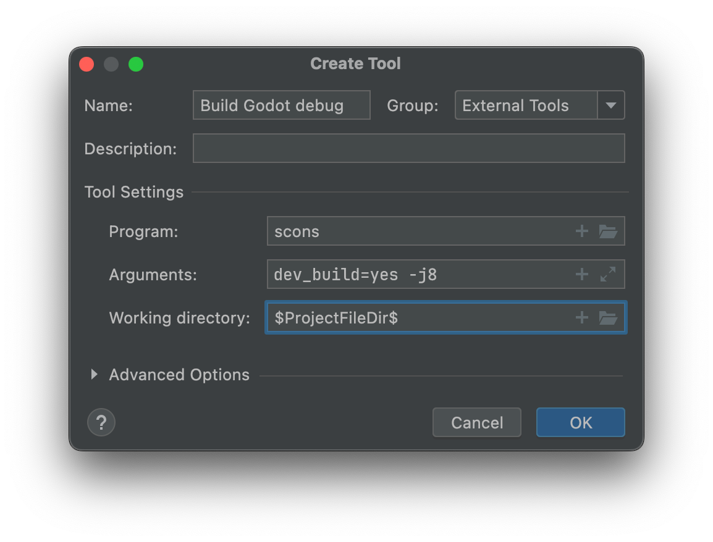

.. _doc_configuring_an_ide_clion:

CLion
=====

`CLion <https://www.jetbrains.com/clion/>`_ is a commercial
`JetBrains <https://www.jetbrains.com/>`_ IDE for C++.

Importing the project
---------------------

CLion can import a project by utilizing a `compilation database file <https://clang.llvm.org/docs/JSONCompilationDatabase.html>`_ named ``compile_commands.json``. 

Generate the compilation database file
^^^^^^^^^^^^^^^^^^^^^^^^^^^^^^^^^^^^^^

1. Open the terminal.
2. Change to the Godot root directory.
3. Generate ``compile_commands.json`` with the following command.

   ::

      scons compiledb=yes

.. note:: If you are unfamiliar with SCons, then you can learn `about it here <_doc_introduction_to_the_buildsystem>`_.

Import the compilation database file
^^^^^^^^^^^^^^^^^^^^^^^^^^^^^^^^^^^^

Once you have created a compilation database for your project, you can load it in CLion.

1. Navigate to **File | Open** on the main menu.
2. Choose the ``compile_commands.json`` file, and click **Open as Project**.
3. Select the toolchain needed to run the commands within the generated ``compile_commands.json``.

   .. figure:: img/clion-compilation-database-toolchain.png

4. Click **Apply** and then click **OK**.

CLion will `import the compilation database <https://www.jetbrains.com/help/clion/compilation-database.html#compdb_clion>`_, index the codebase, and provide autocompletion and other advanced code navigation and refactoring functionality.

Compiling and configuring the project for Godot
-----------------------------------------------

CLion does not support compiling and debugging Godot via SCons out of the box. 
This can be achieved by creating a custom build target and run configuration in CLion. 
Before creating a custom build target, you must :ref:`compile Godot <toc-devel-compiling>` once on the command line, to generate the Godot executable in the ``/bin`` folder. 

1. Open the terminal.
2. Change into the Godot root directory.
3. Compile Godot with the following command.

::

    scons

Creating a custom build target
^^^^^^^^^^^^^^^^^^^^^^^^^^^^^^

To add a custom build target that invokes SCons for compilation:

1. Navigate to **Preferences/Settings | Build, Execution, Deployment | Custom Build Targets**
2. Click **Add target** or the **+** button to add a new custom build target.

.. figure:: img/clion-preferences.png
   :align: center

3. Give the custom build target a name, such as: ``Godot debug``.
4. Click **...** next to **"Build:"**.

.. figure:: img/clion-target.png
   :align: center

5. Click the **+** button in the **External Tools** dialog to add a new external tool.

.. figure:: img/clion-external-tools.png
   :align: center
   :scale: 50%

6. Create an external tool for building godot via SCons.
   
   - Name the tool something like ``Build Godot debug``.
   - Set **Program** to ``scons``.
   - Set **Arguments** to ``dev_build=yes`` or to the :ref:`compilation settings you want <doc_introduction_to_the_buildsystem_target>`.
   - Set the **Working directory** to ``$ProjectFileDir$``, which is the Godot root directory.
   - Click **OK** to create the tool.

   .. note:: | CLion does not expand shell commands like ``scons -j$(nproc)``.
      | Use concrete values instead, such as: ``scons -j8``.

7. Back in the **External Tools** dialog, click the **+** button again to add a new external tool.
8. Add a second external tool for cleaning the Godot build via SCons. 
   
   - Name the tool something like ``Clean Godot debug``.
   - Set **Program** to ``scons``.
   - Set **Arguments** to ``-c`` (which will clean the build).
   - Set the **Working directory** to ``$ProjectFileDir$``.
   - Click **OK** to create the tool.

.. figure:: img/clion-create-clean-tool.png
   :align: center

9. Close the **External Tools** dialog.
10. Back in the **Custom Build Target** dialog for the custom ``Godot debug`` build target...
   
   - Set the **Build** selection to the ``Build Godot debug`` tool.
   - Set the **Clean** selection to the ``Clean Godot debug`` tool.
   - Click **OK** to create the custom build target.

.. figure:: img/clion-select-tools.png
   :align: center

Creating a run/debug configuration
^^^^^^^^^^^^^^^^^^^^^^^^^^^^^^^^^^

1. In the main IDE window, click **Add Configuration**.

.. figure:: img/clion-add-configuration.png

2. In the **Run/Debug Configuration** dialog, click **Add new...** or the **+** button.
3. Select **Custom Build Application** to create a new custom run/debug configuration.

.. figure:: img/clion-add-custom-build-application.png

.. _doc_configuring_an_ide_clion_run_debug_config:

4. Configure the run/debug configuration.
    
    - Give the run/debug configuration a name, such as: ``Godot debug``.
    - Set the **Target** to the ``Godot debug`` custom build target.
    - Set the **Executable** to the Godot executable in the ``bin/`` folder.
    - Set the **Program arguments** to ``--editor --path path-to-your-project/``.
    - Click **OK** to create the run/debug configuration.

   .. note:: | If you run the binary without any arguments, you will only debug the project manager window.
      | Don't forget to add the ``--path path-to-your-project/`` argument to debug a project.
      
      To learn more about command line arguments, refer to the :ref:`command line tutorial<doc_command_line_tutorial>`.

.. figure:: img/clion-run-configuration.png
   :align: center

Debugging the project
---------------------

You can now use the ``Godot debug`` run/debug configuration to build, run, debug, profile, and perform Valgrind checks on the Godot editor.

.. figure:: img/clion-build-run.png
   :scale: 80%

To start debugging, follow these steps:

1. Locate the toolbar at the top of the CLion window.
2. Ensure that the Godot debug configuration is selected from the dropdown menu.
3. Click the bug icon (or press Shift + F9) to initiate the Debug ``Godot debug`` process.

Upon starting the debug process, CLion will open the "Debug" tool window, allowing you to observe and control the debugging session. 
You can set breakpoints, step through code, inspect variables, and utilize various other debugging features offered by CLion.

Debugging a running project
^^^^^^^^^^^^^^^^^^^^^^^^^^^

You can also debug Godot by using the `Attach to process <https://www.jetbrains.com/help/clion/attaching-to-local-process.html>`_ feature.

1. When playing a scene, the Godot editor will spawn a separate process.
2. You can debug this process in CLion by going to **Run | Attach to process...**
3. Type ``godot`` to search for the process.  You can alternatively type the binary name or process ID.
4. Select the Godot process with the highest process ID (pid) because it is most likely the one running your current project.

   .. note:: When the Godot editor launches a game or project, it spawns a new process, and the highest pid generally corresponds to the most recently launched process.

   .. figure:: img/clion-attach-to-process-search.png
      :scale: 80%

Debugging the Godot editor or a specific project
^^^^^^^^^^^^^^^^^^^^^^^^^^^^^^^^^^^^^^^^^^^^^^^^

The ``--editor`` (or ``-e``) and ``--path path-to-your-project/`` arguments provided in the :ref:`"Creating a run/debug configuration" <doc_configuring_an_ide_clion_run_debug_config>` section are used for debugging the Godot editor. If you want to debug a specific project or scene, you may need to modify these arguments as follows:

- To debug a specific project, set the Program arguments to:
  
   ::

      --path path-to-your-project/

- To debug a specific scene within a project, set the Program arguments to:
  
   :: 

      --path path-to-your-project/ -e scene-name.tscn

Remember to replace ``path-to-your-project/`` with the actual path to your Godot project and ``scene-name.tscn`` with the name of the scene you want to debug.

Troubleshooting
---------------

| During the process of setting up CLion for Godot development, you might encounter some issues.
| Below are common issues and their respective solutions.

Importing the project issues
^^^^^^^^^^^^^^^^^^^^^^^^^^^^

Cannot find compiler executable: 'cl'
  - Try setting your toolchain to **Visual Studio**.
  - Ensure that you have Microsoft Visual Studio and its build tools installed on your system.
  - Make sure that the compiler executable (``cl.exe``) is added to your system's PATH environment variable.

CLion fails to index the codebase after importing with ``compile_commands.json``
  - Double-check that the ``compile_commands.json`` file was generated correctly and that it is located in the root of the Godot project directory. 

CLion's autocompletion and syntax highlighting features do not work correctly
  - Check if CLion has finished indexing the project.
  - If the problem persists, try invalidating the cache and restarting the IDE by going to **File | Invalidate Caches / Restart...** in the main menu.

Debugging issues
^^^^^^^^^^^^^^^^

Debugger fails to attach to the Godot process
   - Make sure that the Godot executable is compiled with debugging symbols enabled.
   - Check that the debugger is correctly configured in CLion under **File | Settings | Build, Execution, Deployment | Debugger**.

Debugging does not stop at breakpoints in CLion
  - Ensure that you have attached the debugger to the correct Godot process.
  - Verify that the debug symbols are generated correctly when building the project. 
  - | Make sure to :ref:`adjust the compilation flags <doc_introduction_to_the_buildsystem_target>` to include debug symbols.
    | For example, adding ``dev_build=yes`` to your ``Build Godot debug`` build target arguments.

Performance issues
^^^^^^^^^^^^^^^^^^

Performance issues when working with the Godot codebase in CLion
  - CLion's performance can be affected by the size of the Godot codebase. 
  - | Consider `increasing the memory allocated to CLion <https://www.jetbrains.com/help/clion/increasing-memory-heap.html>`_ by going to **Help | Change Memory Settings** or by adjusting the ``-Xmx`` setting in the ``clion64.vmoptions`` or ``clion.vmoptions`` file (platform dependant).
    | For example, set ``-Xmx2048m`` to allocate 2 GB of memory to CLion.

If you continue to face issues or have questions, consider reaching out to the Godot community or searching the Godot documentation for further assistance.
