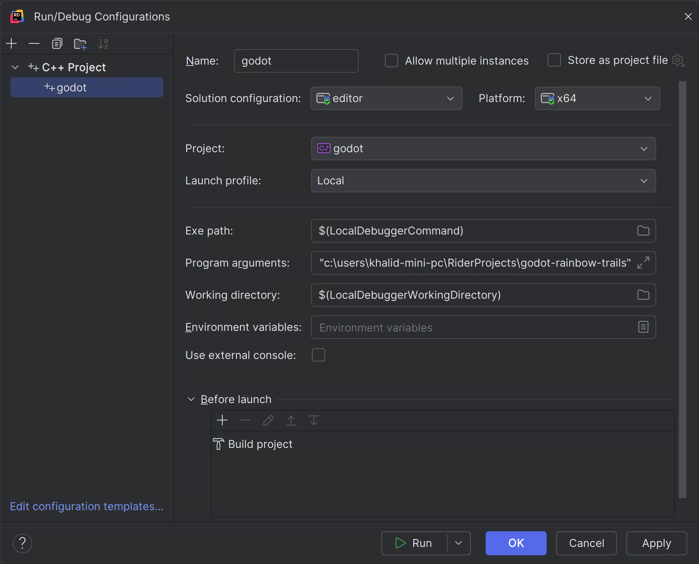

.. _doc_configuring_an_ide_rider:

JetBrains Rider
===============

`JetBrains Rider <https://www.jetbrains.com/rider/>`_ is a commercial
`JetBrains <https://www.jetbrains.com/>`_ IDE for C# and C++ that uses the same solution system as Visual Studio.

Importing the project
---------------------

You will need to install `Python <https://www.python.org/>`_ in your development environment
along with `MinGW <https://www.mingw-w64.org/downloads/>`_. You will also need the Visual Studio C++ Build Tools, which
you can install using the Visual Studio Installer. Ensure all dependencies are installed
before you continue to the next steps.

.. tip:: If you already use Visual Studio as your main IDE, you can use the same solution file in Rider.
         Rider and Visual Studio use the same solution format, so you can switch between the two IDEs without rebuilding the solution file.
         Debug configurations need to be changed when going from one IDE to another.

Rider requires a solution file to work on a C++ project. While Godot does not come
with a solution file, it can be generated using SCons.

- Navigate to the Godot root folder and open a Command Prompt or PowerShell window.
- Copy, paste and run the next command to generate the solution.

::

    scons platform=windows vsproj=yes dev_build=yes

The ``vsproj`` parameter signals that you want Visual Studio solution generated.
The ``dev_build`` parameter makes sure the debug symbols are included, allowing to e.g. step through code using breakpoints.

- If you have Rider setup as your main IDE for .sln, you can now open the project by double-clicking on the ``godot.sln`` in the project root
  or by using the **Open** option inside of Rider.

.. note:: Rider could fail to build the solution.
          If that is the case, try running `git clean -xdf` to remove all traces of the previous build artifacts
          and regenerate the build files using the `scons` command again. Restarting the terminal and your
          development environment may help.

Compiling and debugging the project
-----------------------------------
Rider comes with a built-in debugger that can be used to debug the Godot project. You can launch the debugger
by pressing the **Debug** icon at the top of the screen, this only works for the Project manager,
if you want to debug the editor, you need to configure the debugger first.

.. figure:: img/rider_run_debug.webp
   :align: center

- Click on the **Godot > Edit Configurations** option at the top of the screen.

- Ensure the following values for the C++ Project Run Configuration:

    - Exe Path : ``$(LocalDebuggerCommand)``
    - Program Arguments: ``-e --path <path to the Godot project>``
    - Working Directory: ``$(LocalDebuggerWorkingDirectory)``
    - Before Launch has a value of "Build Project"

This will tell the executable to debug the specified project without using the project manager.
Use the root path to the project folder, not ``project.godot`` file path.

- Finally click on "Apply" and "OK" to save the changes.

- When you press the **Debug** icon at the top of the screen, JetBrains Rider will launch the Godot editor with the debugger attached.

Alternatively you can use **Run > Attach to Process** to attach the debugger to a running Godot instance.

.. figure:: img/rider_attach_to_process.webp
   :align: center

- You can find the Godot instance by searching for ``godot.editor`` and then clicking ``Attach with LLDB``

Please consult the `JetBrains Rider <https://www.jetbrains.com/rider/documentation/>`_ documentation for any specific information about the JetBrains IDE.
