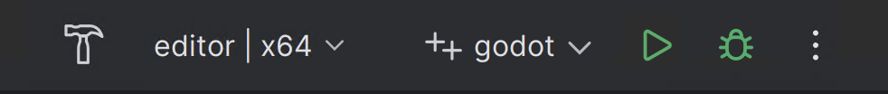

.. _doc_configuring_an_ide_rider:

Rider
=====

`Rider <https://www.jetbrains.com/rider/>`_ is a commercial
`JetBrains <https://www.jetbrains.com/>`_ IDE for C# and C++ that uses the same solution system as Visual Studio.

Importing the project
---------------------

.. tip:: If you already use Visual Studio as your main IDE, you can use the same solution file in Rider.
         Rider and Visual Studio use the same solution format, so you can switch between the two IDEs without rebuilding the solution file.
         Debug configurations need to be changed when going from one IDE to another.

Rider requires a solution file to work on a project. While Godot does not come
with the solution file, it can be generated using SCons.

- Navigate to the Godot root folder and open a Command Prompt or PowerShell window.
- Copy, paste and run the next command to generate the solution.

::

    scons platform=windows vsproj=yes dev_build=yes

The ``vsproj`` parameter signals that you want Visual Studio solution generated.
The ``dev_build`` parameter makes sure the debug symbols are included, allowing to e.g. step through code using breakpoints.

- If you have Rider setup as your main IDE for .sln, you can now open the project by double-clicking on the ``godot.sln`` in the project root
  or by using the **Open** option inside of Rider.

.. note:: Rider could fail to build the first time you open the project.
          If that is the case, you can close Rider and open the solution in Visual Studio, build it, close Visual Studio,
          and open the solution in Rider again. You are now able to build the project from Rider.

Compiling and debugging the project
-----------------------------------
Rider comes with a built-in debugger that can be used to debug the Godot project. You can launch the debugger
by pressing the **Debug** icon at the top of the screen, this only works for the Project manager,
if you want to debug the editor, you need to configure the debugger first.

- Click on the **Godot > Edit Configurations** option at the top of the screen.

.. figure:: img/rider_configurations.webp
   :align: center

- Delete what is under **Program arguments** and paste the following line:

::

  -e --path <path to the Godot project>

This will tell the executable to debug the specified project without using the project manager.
Use the root path to the project folder, not ``project.godot`` file path.

.. figure:: img/rider_configurations_changed.webp
   :align: center

- Finally click on apply and ok to save the changes.

- You can now launch the debugger by pressing the **Debug** icon at the top of the screen and it will open the project to debug.

Alternatively you can use **Run > Attach to Process** to attach the debugger to a running Godot instance.

.. figure:: img/rider_attach_to_process.webp
   :align: center
