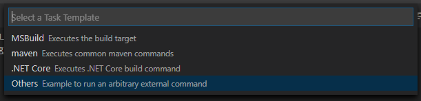
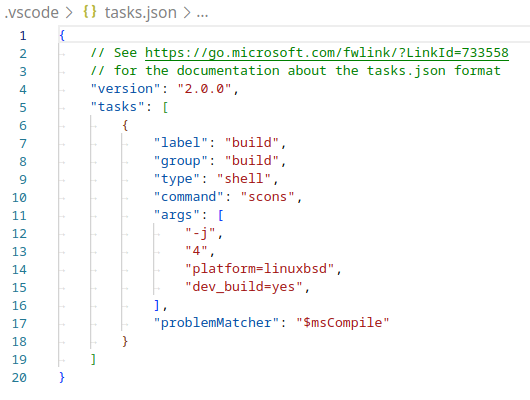
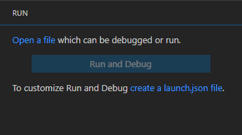
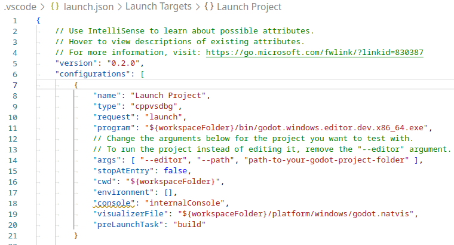
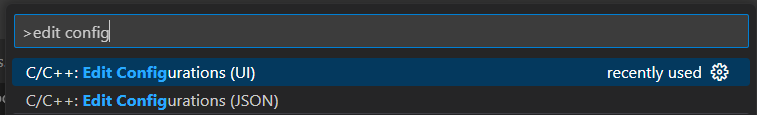

.. _doc_configuring_an_ide_vscode:

Visual Studio Code
==================

`Visual Studio Code <https://code.visualstudio.com>`_ is a free cross-platform code editor
by `Microsoft <https://microsoft.com>`_ (not to be confused with :ref:`doc_configuring_an_ide_vs`).

Importing the project
---------------------

- Make sure the C/C++ extension is installed. You can find instructions in
  the `official documentation <https://code.visualstudio.com/docs/languages/cpp>`_.
  Alternatively, `clangd <https://open-vsx.org/extension/llvm-vs-code-extensions/vscode-clangd>`_
  can be used instead.
- When using the clangd extension, run ``scons compiledb=yes``.
- From the Visual Studio Code's main screen open the Godot root folder with
  **File > Open Folder...**.
- Press :kbd:`Ctrl + Shift + P` to open the command prompt window and enter *Configure Task*.

.. figure:: img/vscode_configure_task.png
   :align: center

- Select the **Create tasks.json file from template** option.

.. figure:: img/vscode_create_tasksjson.png
   :align: center

- Then select **Others**.

- If there is no such option as **Create tasks.json file from template** available, either delete the file if it already exists in your folder or create a ``.vscode/tasks.json`` file manually. See `Tasks in Visual Studio Code <https://code.visualstudio.com/docs/editor/tasks#_custom-tasks>`_ for more details on tasks.

- Within the ``tasks.json`` file find the ``"tasks"`` array and add a new section to it:

  .. code-block:: js

    {
      "label": "build",
      "group": "build",
      "type": "shell",
      "command": "scons",
      "args": [
        // enable for debugging with breakpoints
        "dev_build=yes",
      ],
      "problemMatcher": "$msCompile"
    }

   An example of a filled out ``tasks.json``.

Arguments can be different based on your own setup and needs. See
:ref:`doc_introduction_to_the_buildsystem` for a full list of arguments.

Debugging the project
---------------------

To run and debug the project you need to create a new configuration in the ``launch.json`` file.

- Press :kbd:`Ctrl + Shift + D` to open the Run panel.
- If ``launch.json`` file is missing you will be prompted to create a new one.

- Select **C++ (GDB/LLDB)**. There may be another platform specific option here. If selected,
  adjust the configuration example provided accordingly.
- Within the ``launch.json`` file find the ``"configurations"`` array and add a new section to it:

.. tabs::
  .. code-tab:: js LinuxBSD

    {
      "name": "Launch Project",
      "type": "lldb",
      "request": "launch",
      // Change to godot.linuxbsd.editor.dev.x86_64.llvm for llvm-based builds.
      "program": "${workspaceFolder}/bin/godot.linuxbsd.editor.dev.x86_64",
      // Change the arguments below for the project you want to test with.
      // To run the project instead of editing it, remove the "--editor" argument.
      "args": [ "--editor", "--path", "path-to-your-godot-project-folder" ],
      "stopAtEntry": false,
      "cwd": "${workspaceFolder}",
      "environment": [],
      "externalConsole": false,
      "preLaunchTask": "build"
    }
  .. code-tab:: js LinuxBSD_gdb

    {
      "name": "Launch Project",
      "type": "cppdbg",
      "request": "launch",
      // Change to godot.linuxbsd.editor.dev.x86_64.llvm for llvm-based builds.
      "program": "${workspaceFolder}/bin/godot.linuxbsd.editor.dev.x86_64",
      // Change the arguments below for the project you want to test with.
      // To run the project instead of editing it, remove the "--editor" argument.
      "args": [ "--editor", "--path", "path-to-your-godot-project-folder" ],
      "stopAtEntry": false,
      "cwd": "${workspaceFolder}",
      "environment": [],
      "externalConsole": false,
      "setupCommands":
      [
        {
          "description": "Enable pretty-printing for gdb",
          "text": "-enable-pretty-printing",
          "ignoreFailures": true
        }
      ],
      "preLaunchTask": "build"
    }

  .. code-tab:: js Windows

    {
      "name": "Launch Project",
      "type": "cppvsdbg",
      "request": "launch",
      "program": "${workspaceFolder}/bin/godot.windows.editor.dev.x86_64.exe",
      // Change the arguments below for the project you want to test with.
      // To run the project instead of editing it, remove the "--editor" argument.
      "args": [ "--editor", "--path", "path-to-your-godot-project-folder" ],
      "stopAtEntry": false,
      "cwd": "${workspaceFolder}",
      "environment": [],
      "console": "internalConsole",
      "visualizerFile": "${workspaceFolder}/platform/windows/godot.natvis",
      "preLaunchTask": "build"
    }

   An example of a filled out ``launch.json``.

.. note::

    Due to sporadic performance issues, it is recommended to use LLDB over GDB on Unix-based systems.
    Make sure that the `CodeLLDB extension <https://marketplace.visualstudio.com/items?itemName=vadimcn.vscode-lldb>`_
    is installed.

    If you encounter issues with lldb, you may consider using gdb (see the LinuxBSD_gdb configuration).

    Do note that lldb may work better with LLVM-based builds. See :ref:`doc_compiling_for_linuxbsd` for further information.

The name under ``program`` depends on your build configuration,
e.g. ``godot.linuxbsd.editor.dev.x86_64`` for 64-bit LinuxBSD platform with
``platform=editor`` and ``dev_build=yes``.

Configuring Intellisense
------------------------

For the C/C++ extension:

To fix include errors you may be having, you need to configure some settings in the ``c_cpp_properties.json`` file.

- First, make sure to build the project since some files need to be generated.

- Edit the C/C++ Configuration file either with the UI or with text:

- Add an include path for your platform, for example, ``${workspaceFolder}/platform/windows``.

- Add defines for the editor ``TOOLS_ENABLED``, debug builds ``DEBUG_ENABLED``, and tests ``TESTS_ENABLED``.

- Make sure the compiler path is configured correctly to the compiler you are using. See :ref:`doc_introduction_to_the_buildsystem` for further information on your platform.

- The ``c_cpp_properties.json`` file should look similar to this for Windows:

  .. code-block:: js

    {
      "configurations": [
        {
          "name": "Win32",
          "includePath": [
            "${workspaceFolder}/**",
            "${workspaceFolder}/platform/windows"
          ],
          "defines": [
            "_DEBUG",
            "UNICODE",
            "_UNICODE",
            "TOOLS_ENABLED",
            "DEBUG_ENABLED",
            "TESTS_ENABLED"
          ],
          "windowsSdkVersion": "10.0.22621.0",
          "compilerPath": "C:/Program Files/Microsoft Visual Studio/2022/Community/VC/Tools/MSVC/14.39.33519/bin/Hostx64/x64/cl.exe",
          "cStandard": "c17",
          "cppStandard": "c++17",
          "intelliSenseMode": "windows-msvc-x64"
        }
      ],
      "version": 4
    }

- Alternatively, you can use the scons argument ``compiledb=yes`` and set the compile commands setting ``compileCommands`` to ``compile_commands.json``, found in the advanced section of the C/C++ Configuration UI.

  - This argument can be added to your build task in ``tasks.json`` since it will need to be run whenever files are added or moved.

If you run into any issues, ask for help in one of
`Godot's community channels <https://godotengine.org/community>`__.

.. tip::

    To get linting on class reference XML files, install the
    `vscode-xml extension <https://marketplace.visualstudio.com/items?itemName=redhat.vscode-xml>`__.
