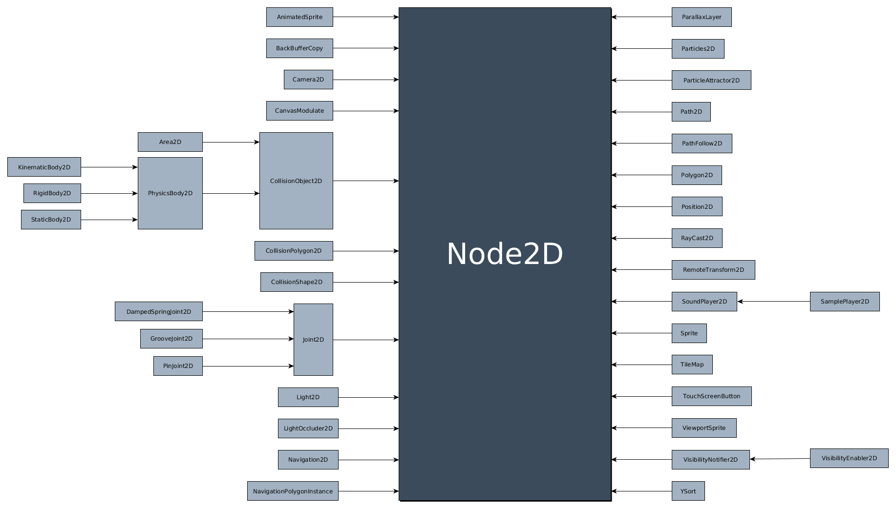

Inheritance class tree
======================

Object
------

.. image:: img/Object.png

Reference
---------

.. image:: img/Reference.png

Control
-------

.. image:: img/Control.png

Node2D
------

Node3D
------

.. image:: img/Spatial.png

Source files: :download:`class_tree.zip <files/class_tree.zip>`.
