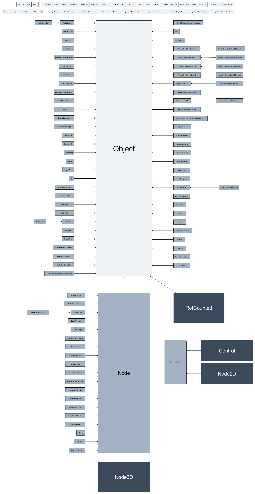
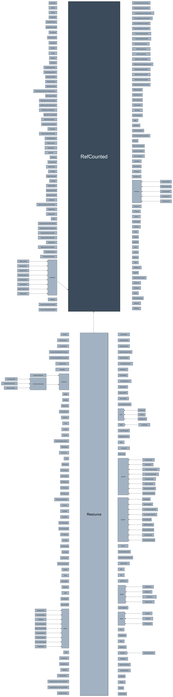
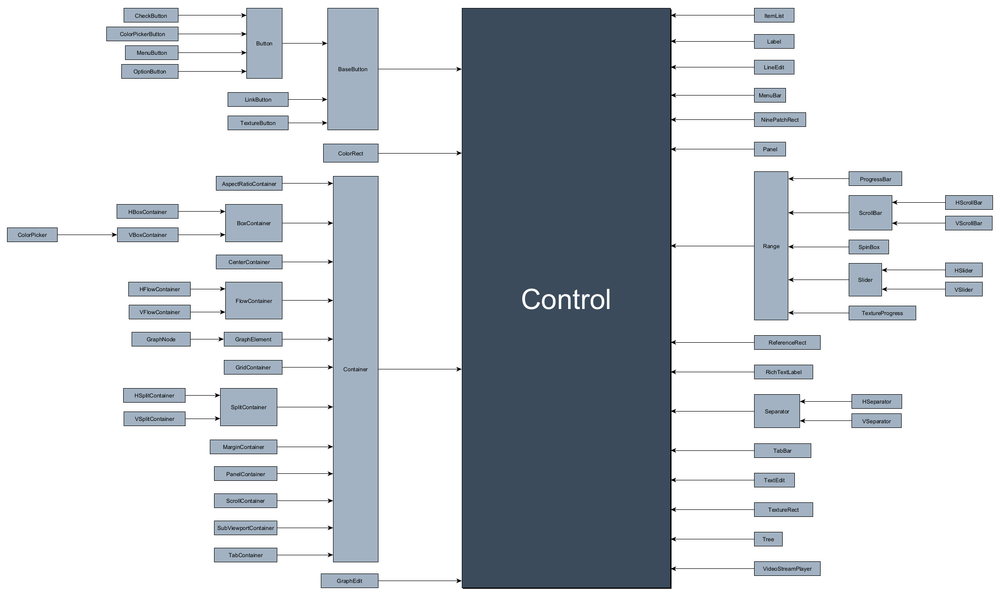
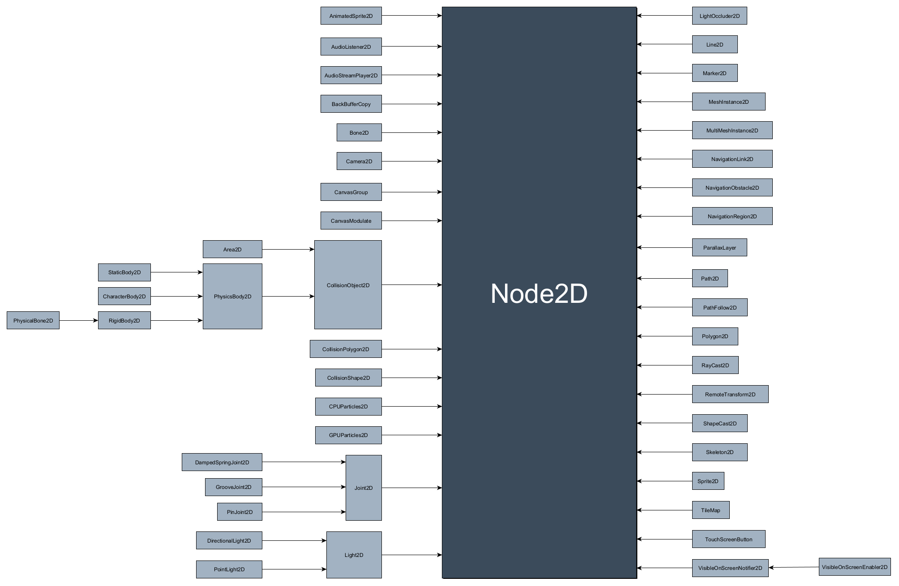
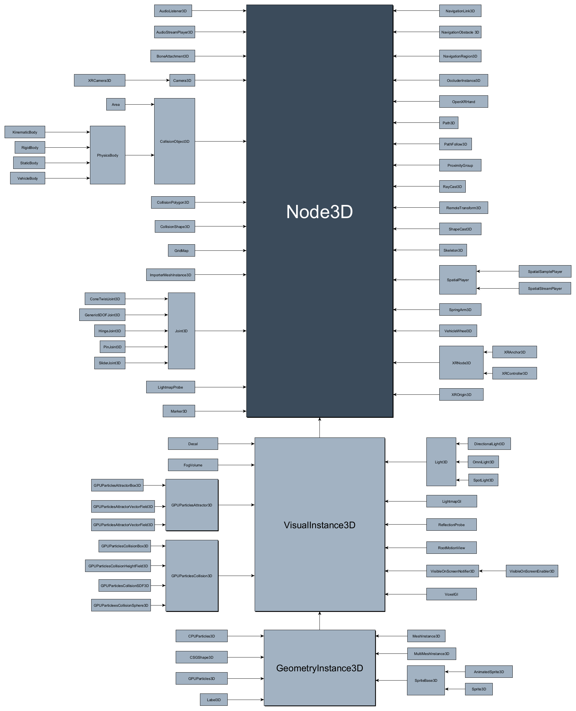

Inheritance class tree
======================

Object
------

Reference
---------

Control
-------

Node2D
------

Node3D
------

Source files: :download:`class_tree.zip <files/class_tree.zip>`.
