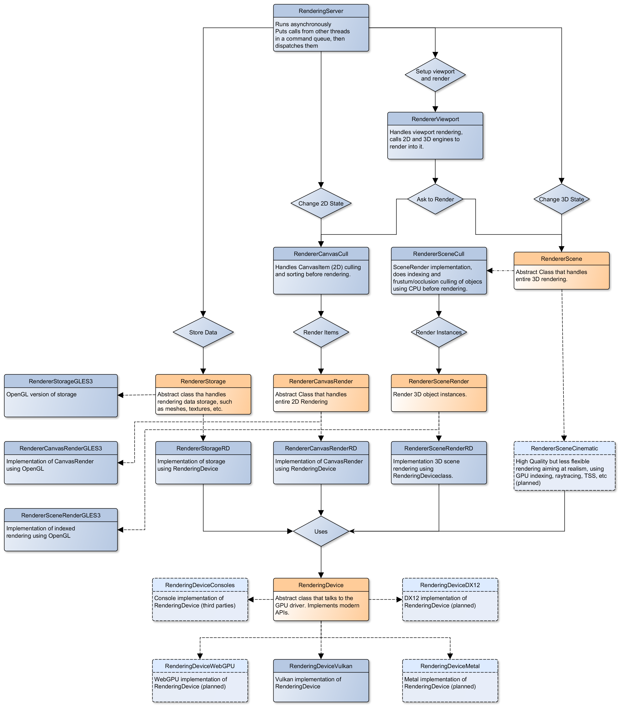

.. _doc_internal_rendering_architecture:

Internal rendering architecture
===============================

This page is a high-level overview of Godot 4's internal renderer design.
It does not apply to previous Godot versions.

The goal of this page is to document design decisions taken to best suit
:ref:`Godot's design philosophy <doc_best_practices_for_engine_contributors>`,
while providing a starting point for new rendering contributors.

If you have questions about rendering internals not answered here, feel free to
ask in the ``#rendering`` channel of the
`Godot Contributors Chat <https://chat.godotengine.org/channel/rendering>`__.

.. note::

    If you have difficulty understanding concepts on this page, it is
    recommended to go through an OpenGL tutorial such as
    `LearnOpenGL <https://learnopengl.com/>`__.

    Modern low-level APIs (Vulkan/Direct3D 12) require intermediate
    knowledge of higher-level APIs (OpenGL/Direct3D 11) to be used
    effectively. Thankfully, contributors rarely need to work directly with
    low-level APIs. Godot's renderers are built entirely on OpenGL and
    RenderingDevice, which is our abstraction over Vulkan/Direct3D 12.

.. _doc_internal_rendering_architecture_methods:

Rendering methods
-----------------

Forward+
^^^^^^^^

This is a forward renderer that uses a *clustered* approach to lighting.

Clustered lighting uses a compute shader to group lights into a 3D frustum
aligned grid. Then, at render time, pixels can lookup what lights affect the
grid cell they are in and only run light calculations for lights that might
affect that pixel.

This approach can greatly speed up rendering performance on desktop hardware,
but is substantially less efficient on mobile.

Forward Mobile
^^^^^^^^^^^^^^

This is a forward renderer that uses a traditional single-pass approach to lighting.

Intended for mobile platforms, but can also run on desktop platforms. This
rendering method is optimized to perform well on mobile GPUs. Mobile GPUs have a
very different architecture compared to desktop GPUs due to their unique
constraints around battery usage, heat, and overall bandwidth limitations of
reading and writing data. Compute shaders also have very limited support or
aren't supported at all. As a result, the mobile renderer purely uses
raster-based shaders (fragment/vertex).

Unlike desktop GPUs, mobile GPUs perform *tile-based rendering*. Instead of
rendering the whole image as a single unit, the image is divided in smaller
tiles that fit within the faster internal memory of the mobile GPU. Each tile is
rendered and then written out to the destination texture. This all happens
automatically on the graphics driver.

The problem is that this introduces bottlenecks in our traditional approach. For
desktop rendering, we render all opaque geometry, then handle the background,
then transparent geometry, then post-processing. Each pass will need to read the
current result into tile memory, perform its operations and then write it out
again. We then wait for all tiles to be completed before moving on to the next
pass.

The first important change in the mobile renderer is that the mobile renderer
does not use the RGBA16F texture formats that the desktop renderer does.
Instead, it is using a R10G10B10A2 UNORM texture format. This halves the bandwidth
required and has further improvements as mobile hardware often further optimizes
for 32-bit formats. The tradeoff is that the mobile renderer has limited HDR
capabilities due to the reduced precision and maximum values in the color data.

The second important change is the use of sub-passes whenever possible.
Sub-passes allows us to perform the rendering steps end-to-end per tile saving
on the overhead introduced by reading from and writing to the tiles between each
rendering pass. The ability to use sub-passes is limited by the inability to
read neighboring pixels, as we're constrained to working within a single tile.

This limitation of subpasses results in not being able to implement features
such as glow and depth of field efficiently. Similarly, if there is a
requirement to read from the screen texture or depth texture, we must fully
write out the rendering result limiting our ability to use sub-passes. When such
features are enabled, a mix of sub-passes and normal passes are used, and these
features result in a notable performance penalty.

On desktop platforms, the use of sub-passes won't have any impact on
performance. However, this rendering method can still perform better than
Clustered Forward in simple scenes thanks to its lower complexity and lower
bandwidth usage. This is especially noticeable on low-end GPUs, integrated
graphics or in VR applications.

Given its low-end focus, this rendering method does not provide high-end
rendering features such as SDFGI and :ref:`doc_volumetric_fog`. Several
post-processing effects are also not available.

.. _doc_internal_rendering_architecture_compatibility:

Compatibility
^^^^^^^^^^^^^

.. note::

    This is the only rendering method available when using the OpenGL driver.
    This rendering method is not available when using Vulkan or Direct3D 12.

This is a traditional (non-clustered) forward renderer. It's intended for old
GPUs that don't have Vulkan support, but still works very efficiently on newer
hardware. Specifically, it is optimized for older and lower-end mobile devices
However, many optimizations carry over making it a good choice for older and
lower-end desktop as well.

Like the Mobile renderer, the Compatibility renderer uses an R10G10B10A2 UNORM
texture for 3D rendering. Unlike the mobile renderer, colors are tonemapped and
stored in sRGB format so there is no HDR support. This avoids the need for a
tonemapping pass and allows us to use the lower bit texture without substantial
banding.

The Compatibility renderer uses a traditional forward single-pass approach to
drawing objects with lights, but it uses a multi-pass approach to draw lights
with shadows. Specifically, in the first pass, it can draw multiple lights
without shadows and up to one DirectionalLight3D with shadows. In each
subsequent pass, it can draw up to one OmniLight3D, one SpotLight3D and one
DirectionalLight3D with shadows. Lights with shadows will affect the scene
differently than lights without shadows, as the lighting is blended in sRGB space
instead of linear space. This difference in lighting will impact how the scene
looks and needs to be kept in mind when designing scenes for the Compatibility
renderer.

Given its low-end focus, this rendering method does not provide high-end
rendering features (even less so compared to Forward Mobile). Most
post-processing effects are not available.

Why not deferred rendering?
^^^^^^^^^^^^^^^^^^^^^^^^^^^

Forward rendering generally provides a better tradeoff for performance versus
flexibility, especially when a clustered approach to lighting is used. While
deferred rendering can be faster in some cases, it's also less flexible and
requires using hacks to be able to use MSAA. Since games with a less realistic
art style can benefit a lot from MSAA, we chose to go with forward rendering for
Godot 4 (like Godot 3).

That said, parts of the forward renderer *are* performed with a deferred approach
to allow for some optimizations when possible. This applies to VoxelGI and SDFGI
in particular.

A clustered deferred renderer may be developed in the future. This renderer
could be used in situations where performance is favored over flexibility.

Rendering drivers
-----------------

Godot 4 supports the following graphics APIs:

Vulkan
^^^^^^

This is the main driver in Godot 4, with most of the development focus going
towards this driver.

Vulkan 1.0 is required as a baseline, with optional Vulkan 1.1 and 1.2 features
used when available. `volk <https://github.com/zeux/volk>`__ is used as a Vulkan
loader, and
`Vulkan Memory Allocator <https://github.com/GPUOpen-LibrariesAndSDKs/VulkanMemoryAllocator>`__
is used for memory management.

Both the Forward+ and Mobile
:ref:`doc_internal_rendering_architecture_methods` are supported when using the
Vulkan driver.

**Vulkan context creation:**

- `drivers/vulkan/vulkan_context.cpp <https://github.com/godotengine/godot/blob/4.2/drivers/vulkan/vulkan_context.cpp>`__

**Direct3D 12 context creation:**

- `drivers/d3d12/d3d12_context.cpp <https://github.com/godotengine/godot/blob/master/drivers/d3d12/d3d12_context.cpp>`__

Direct3D 12
^^^^^^^^^^^

Like Vulkan, the Direct3D 12 driver targets modern platforms only. It is
designed to target both Windows and Xbox (whereas Vulkan can't be used directly on Xbox).

Both the Forward+ and Mobile :ref:`doc_internal_rendering_architecture_methods` can be
used with Direct3D 12.

:ref:`doc_internal_rendering_architecture_core_shaders` are shared with the
Vulkan renderer. Shaders are transpiled from GLSL to HLSL using
Mesa NIR (`more information <https://godotengine.org/article/d3d12-adventures-in-shaderland/>`__).
This means you don't need to know HLSL to work on the Direct3D 12 renderer,
although knowing the language's basics is recommended to ease debugging.

**This driver is still experimental and only available in Godot 4.3 and later.**
While Direct3D 12 allows supporting Direct3D-exclusive features on Windows 11 such
as windowed optimizations and Auto HDR, Vulkan is still recommended for most projects.
See the `pull request that introduced Direct3D 12 support <https://github.com/godotengine/godot/pull/70315>`__
for more information.

Metal
^^^^^

Godot supports Metal rendering via `MoltenVK <https://github.com/KhronosGroup/MoltenVK>`__,
as macOS and iOS do not support Vulkan natively.
This is done automatically when specifying the Vulkan driver in the Project Settings.

MoltenVK makes driver maintenance easy at the cost of some performance overhead.
Also, MoltenVK has several limitations that a native Metal driver implementation
wouldn't have. Both the clustered and mobile
:ref:`doc_internal_rendering_architecture_methods` can be used with a Metal
backend via MoltenVK.

A native Metal driver is planned in the future for better performance and
compatibility.

OpenGL
^^^^^^

This driver uses OpenGL ES 3.0 and targets legacy and low-end devices that don't
support Vulkan. OpenGL 3.3 Core Profile is used on desktop platforms to run this
driver, as most graphics drivers on desktop don't support OpenGL ES.
WebGL 2.0 is used for web exports.

Only the :ref:`doc_internal_rendering_architecture_compatibility` rendering
method can be used with the OpenGL driver.

:ref:`doc_internal_rendering_architecture_core_shaders` are entirely different
from the Vulkan renderer.

**As of May 2023, this driver is still in development.** Many features
are still not implemented, especially in 3D.

Summary of rendering drivers/methods
^^^^^^^^^^^^^^^^^^^^^^^^^^^^^^^^^^^^

The following rendering API + rendering method combinations are currently possible:

- Vulkan + Forward+
- Vulkan + Forward Mobile
- Direct3D 12 + Forward+
- Direct3D 12 + Forward Mobile
- Metal + Forward+ (via MoltenVK)
- Metal + Forward Mobile (via MoltenVK)
- OpenGL + Compatibility

Each combination has its own limitations and performance characteristics. Make
sure to test your changes on all rendering methods if possible before opening a
pull request.

RenderingDevice abstraction
---------------------------

.. note::

    The OpenGL driver does not use the RenderingDevice abstraction.

To make the complexity of modern low-level graphics APIs more manageable,
Godot uses its own abstraction called RenderingDevice.

This means that when writing code for modern rendering methods, you don't
actually use the Vulkan or Direct3D 12 APIs directly. While this is still
lower-level than an API like OpenGL, this makes working on the renderer easier,
as RenderingDevice will abstract many API-specific quirks for you. The
RenderingDevice presents a similar level of abstraction as Metal or WebGPU.

**Vulkan RenderingDevice implementation:**

- `drivers/vulkan/rendering_device_vulkan.cpp <https://github.com/godotengine/godot/blob/4.2/drivers/vulkan/rendering_device_vulkan.cpp>`__

**Direct3D 12 RenderingDevice implementation:**

- `drivers/d3d12/rendering_device_driver_d3d12.cpp <https://github.com/godotengine/godot/blob/master/drivers/d3d12/rendering_device_driver_d3d12.cpp>`__

Core rendering classes architecture
-----------------------------------

This diagram represents the structure of rendering classes in Godot, including the RenderingDevice abstraction:

`View at full size <https://raw.githubusercontent.com/godotengine/godot-docs/master/contributing/development/core_and_modules/img/rendering_architecture_diagram.webp>`__

.. _doc_internal_rendering_architecture_core_shaders:

Core shaders
------------

While shaders in Godot projects are written using a
:ref:`custom language inspired by GLSL <doc_shading_language>`, core shaders are
written directly in GLSL.

These core shaders are embedded in the editor and export template binaries at
compile-time. To see any changes you've made to those GLSL shaders, you need to
recompile the editor or export template binary.

Some material features such as height mapping, refraction and proximity fade are
not part of core shaders, and are performed in the default BaseMaterial3D using
the Godot shader language instead (not GLSL). This is done by procedurally
generating the required shader code depending on the features enabled in the
material.

By convention, shader files with ``_inc`` in their name are included in other
GLSL files for better code reuse. Standard GLSL preprocessing is used to achieve
this.

.. warning::

    Core material shaders will be used by every material in the scene – both
    with the default BaseMaterial3D and custom shaders. As a result, these
    shaders must be kept as simple as possible to avoid performance issues and
    ensure shader compilation doesn't become too slow.

    If you use ``if`` branching in a shader, performance may decrease as
    :abbr:`VGPR (Vector General-Purpose Register)` usage will increase in the
    shader. This happens even if all pixels evaluate to ``true`` or ``false`` in
    a given frame.

    If you use ``#if`` preprocessor branching, the number of required shader
    versions will increase in the scene. In a worst-case scenario, adding a
    single boolean ``#define`` can *double* the number of shader versions that
    may need to be compiled in a given scene. In some cases, Vulkan
    specialization constants can be used as a faster (but more limited)
    alternative.

    This means there is a high barrier to adding new built-in material features
    in Godot, both in the core shaders and BaseMaterial3D. While BaseMaterial3D
    can make use of dynamic code generation to only include the shader code if
    the feature is enabled, it'll still require generating more shader versions
    when these features are used in a project. This can make shader compilation
    stutter more noticeable in complex 3D scenes.

    See
    `The Shader Permutation Problem <https://therealmjp.github.io/posts/shader-permutations-part1/>`__
    and
    `Branching on a GPU <https://medium.com/@jasonbooth_86226/branching-on-a-gpu-18bfc83694f2>`__
    blog posts for more information.

**Core GLSL material shaders:**

- Forward+: `servers/rendering/renderer_rd/shaders/forward_clustered/scene_forward_clustered.glsl <https://github.com/godotengine/godot/blob/4.2/servers/rendering/renderer_rd/shaders/forward_clustered/scene_forward_clustered.glsl>`__
- Forward Mobile: `servers/rendering/renderer_rd/shaders/forward_mobile/scene_forward_mobile.glsl <https://github.com/godotengine/godot/blob/4.2/servers/rendering/renderer_rd/shaders/forward_mobile/scene_forward_mobile.glsl>`__
- Compatibility: `drivers/gles3/shaders/scene.glsl <https://github.com/godotengine/godot/blob/4.2/drivers/gles3/shaders/scene.glsl>`__

**Material shader generation:**

- `scene/resources/material.cpp <https://github.com/godotengine/godot/blob/4.2/scene/resources/material.cpp>`__

**Other GLSL shaders for Forward+ and Forward Mobile rendering methods:**

- `servers/rendering/renderer_rd/shaders/ <https://github.com/godotengine/godot/blob/4.2/servers/rendering/renderer_rd/shaders/>`__
- `modules/lightmapper_rd/ <https://github.com/godotengine/godot/blob/4.2/modules/lightmapper_rd>`__

**Other GLSL shaders for the Compatibility rendering method:**

- `drivers/gles3/shaders/ <https://github.com/godotengine/godot/blob/4.2/drivers/gles3/shaders/>`__

2D and 3D rendering separation
------------------------------

.. note::

    The following is only applicable in the Forward+ and Forward Mobile
    rendering methods, not in Compatibility. Multiple Viewports can be used to
    emulate this when using the Compatibility backend, or to perform 2D
    resolution scaling.

2D and 3D are rendered to separate buffers, as 2D rendering in Godot is performed
in :abbr:`LDR (Low Dynamic Range)` sRGB-space while 3D rendering uses
:abbr:`HDR (High Dynamic Range)` linear space.

The color format used for 2D rendering is RGB8 (RGBA8 if the **Transparent**
property on the Viewport is enabled). 3D rendering uses a 24-bit unsigned
normalized integer depth buffer, or 32-bit signed floating-point if a 24-bit
depth buffer is not supported by the hardware. 2D rendering does not use a depth
buffer.

3D resolution scaling is performed differently depending on whether bilinear or
FSR 1.0 scaling is used. When bilinear scaling is used, no special upscaling
shader is run. Instead, the viewport's texture is stretched and displayed with a
linear sampler (which makes the filtering happen directly on the hardware). This
allows maximizing the performance of bilinear 3D scaling.

The ``configure()`` function in RenderSceneBuffersRD reallocates the 2D/3D
buffers when the resolution or scaling changes.

Dynamic resolution scaling isn't supported yet, but is planned in a future Godot
release.

**2D and 3D rendering buffer configuration C++ code:**

- `servers/rendering/renderer_rd/storage_rd/render_scene_buffers_rd.cpp <https://github.com/godotengine/godot/blob/4.2/servers/rendering/renderer_rd/storage_rd/render_scene_buffers_rd.cpp>`__

**FSR 1.0:**

- `servers/rendering/renderer_rd/effects/fsr.cpp <https://github.com/godotengine/godot/blob/4.2/servers/rendering/renderer_rd/effects/fsr.cpp>`__
- `thirdparty/amd-fsr/ <https://github.com/godotengine/godot/tree/master/thirdparty/amd-fsr>`__

2D rendering techniques
-----------------------

2D light rendering is performed in a single pass to allow for better performance
with large amounts of lights.

The Forward+ and Mobile rendering methods don't feature 2D batching yet, but
it's planned for a future release.

The Compatibility backend features 2D batching to improve performance, which is
especially noticeable with lots of text on screen.

MSAA can be enabled in 2D to provide "automatic" line and polygon antialiasing,
but FXAA does not affect 2D rendering as it's calculated before 2D rendering
begins. Godot's 2D drawing methods such as the Line2D node or some CanvasItem
``draw_*()`` methods provide their own way of antialiasing based on triangle
strips and vertex colors, which don't require MSAA to work.

A 2D signed distance field representing LightOccluder2D nodes in the viewport is
automatically generated if an user shader requests it. This can be used for
various effects in custom shaders, such as 2D global illumination. It is also
used to calculate particle collisions in 2D.

**2D SDF generation GLSL shader:**

- `servers/rendering/renderer_rd/shaders/canvas_sdf.glsl <https://github.com/godotengine/godot/blob/4.2/servers/rendering/renderer_rd/shaders/canvas_sdf.glsl>`__

3D rendering techniques
-----------------------

Batching and instancing
^^^^^^^^^^^^^^^^^^^^^^^

In the Forward+ backend, Vulkan instancing is used to group rendering
of identical objects for performance. This is not as fast as static mesh
merging, but it still allows instances to be culled individually.

Light, decal and reflection probe rendering
^^^^^^^^^^^^^^^^^^^^^^^^^^^^^^^^^^^^^^^^^^^

.. note::

  Reflection probe and decal rendering are currently not available in the
  Compatibility backend.

As its name implies, the Forward+ backend uses clustered lighting. This
allows using as many lights as you want; performance largely depends on screen
coverage. Shadow-less lights can be almost free if they don't occupy much space
on screen.

All rendering methods also support rendering up to 8 directional lights at the
same time (albeit with lower shadow quality when more than one light has shadows
enabled).

The Forward Mobile backend uses a single-pass lighting approach, with a
limitation of 8 OmniLights + 8 SpotLights affecting each Mesh *resource* (plus a
limitation of 256 OmniLights + 256 SpotLights in the camera view). These limits
are hardcoded and can't be adjusted in the project settings.

The Compatibility backend uses a hybrid single-pass + multi-pass lighting
approach. Lights without shadows are rendered in a single pass. Lights with
shadows are rendered in multiple passes. This is required for performance
reasons on mobile devices. As a result, performance does not scale well with
many shadow-casting lights. It is recommended to only have a handful of lights
with shadows in the camera frustum at a time and for those lights to be spread
apart so that each object is only touched by 1 or 2 shadowed lights at a time.
The maximum number of lights visible at once can be adjusted in the project
settings.

In all 3 methods, lights without shadows are much cheaper than lights with
shadows. To improve performance, lights are only updated when the light is
modified or when objects in its radius are modified. Godot currently doesn't
separate static shadow rendering from dynamic shadow rendering, but this is
planned in a future release.

Clustering is also used for reflection probes and decal rendering in the
Forward+ backend.

Shadow mapping
^^^^^^^^^^^^^^

Both Forward+ and Forward Mobile methods use
:abbr:`PCF (Percentage Closer Filtering)` to filter shadow maps and create a
soft penumbra. Instead of using a fixed PCF pattern, these methods use a vogel
disk pattern which allows for changing the number of samples and smoothly
changing the quality.

Godot also supports percentage-closer soft shadows (PCSS) for more realistic
shadow penumbra rendering. PCSS shadows are limited to the Forward+
backend as they're too demanding to be usable in the Forward Mobile backend.
PCSS also uses a vogel-disk shaped kernel.

Additionally, both shadow-mapping techniques rotate the kernel on a per-pixel
basis to help soften under-sampling artifacts.

The Compatibility backend doesn't support shadow mapping for any light types yet.

Temporal antialiasing
^^^^^^^^^^^^^^^^^^^^^

.. note::

    Only available in the Forward+ backend, not the Forward Mobile or
    Compatibility methods.

Godot uses a custom TAA implementation based on the old TAA implementation from
`Spartan Engine <https://github.com/PanosK92/SpartanEngine>`__.

Temporal antialiasing requires motion vectors to work. If motion vectors
are not correctly generated, ghosting will occur when the camera or objects move.

Motion vectors are generated on the GPU in the main material shader. This is
done by running the vertex shader corresponding to the previous rendered frame
(with the previous camera transform) in addition to the vertex shader for the
current rendered frame, then storing the difference between them in a color buffer.

Alternatively, FSR 2.2 can be used as an upscaling solution that also provides
its own temporal antialiasing algorithm. FSR 2.2 is implemented on top of the
RenderingDevice abstraction as opposed to using AMD's reference code directly.

**TAA resolve:**

- `servers/rendering/renderer_rd/shaders/effects/taa_resolve.glsl <https://github.com/godotengine/godot/blob/4.2/servers/rendering/renderer_rd/shaders/effects/taa_resolve.glsl>`__

**FSR 2.2:**

- `servers/rendering/renderer_rd/effects/fsr2.cpp <https://github.com/godotengine/godot/blob/4.2/servers/rendering/renderer_rd/effects/fsr2.cpp>`__
- `servers/rendering/renderer_rd/shaders/effects/fsr2/ <https://github.com/godotengine/godot/tree/master/servers/rendering/renderer_rd/shaders/effects/fsr2>`__
- `thirdparty/amd-fsr2/ <https://github.com/godotengine/godot/tree/master/thirdparty/amd-fsr2>`__

Global illumination
^^^^^^^^^^^^^^^^^^^

.. note::

    VoxelGI and SDFGI are only available in the Forward+ backend, not the
    Forward Mobile or Compatibility methods.

    LightmapGI *baking* is only available in the Forward+ and Forward Mobile
    methods, and can only be performed within the editor (not in an exported
    project). LightmapGI *rendering* will eventually be supported by the
    Compatibility backend.

Godot supports voxel-based GI (VoxelGI), signed distance field GI (SDFGI) and
lightmap baking and rendering (LightmapGI). These techniques can be used
simultaneously if desired.

Lightmap baking happens on the GPU using Vulkan compute shaders. The GPU-based
lightmapper is implemented in the LightmapperRD class, which inherits from the
Lightmapper class. This allows for implementing additional lightmappers, paving
the way for a future port of the CPU-based lightmapper present in Godot 3.x.
This would allow baking lightmaps while using the Compatibility backend.

**Core GI C++ code:**

- `servers/rendering/renderer_rd/environment/gi.cpp <https://github.com/godotengine/godot/blob/4.2/servers/rendering/renderer_rd/environment/gi.cpp>`__
- `scene/3d/voxel_gi.cpp <https://github.com/godotengine/godot/blob/4.2/scene/3d/voxel_gi.cpp>`__ - VoxelGI node
- `editor/plugins/voxel_gi_editor_plugin.cpp <https://github.com/godotengine/godot/blob/4.2/editor/plugins/voxel_gi_editor_plugin.cpp>`__ - Editor UI for the VoxelGI node

**Core GI GLSL shaders:**

- `servers/rendering/renderer_rd/shaders/environment/voxel_gi.glsl <https://github.com/godotengine/godot/blob/4.2/servers/rendering/renderer_rd/shaders/environment/voxel_gi.glsl>`__
- `servers/rendering/renderer_rd/shaders/environment/voxel_gi_debug.glsl <https://github.com/godotengine/godot/blob/4.2/servers/rendering/renderer_rd/shaders/environment/voxel_gi_debug.glsl>`__ - VoxelGI debug draw mode
- `servers/rendering/renderer_rd/shaders/environment/sdfgi_debug.glsl <https://github.com/godotengine/godot/blob/4.2/servers/rendering/renderer_rd/shaders/environment/sdfgi_debug.glsl>`__ - SDFGI Cascades debug draw mode
- `servers/rendering/renderer_rd/shaders/environment/sdfgi_debug_probes.glsl <https://github.com/godotengine/godot/blob/4.2/servers/rendering/renderer_rd/shaders/environment/sdfgi_debug_probes.glsl>`__ - SDFGI Probes debug draw mode
- `servers/rendering/renderer_rd/shaders/environment/sdfgi_integrate.glsl <https://github.com/godotengine/godot/blob/4.2/servers/rendering/renderer_rd/shaders/environment/sdfgi_integrate.glsl>`__
- `servers/rendering/renderer_rd/shaders/environment/sdfgi_preprocess.glsl <https://github.com/godotengine/godot/blob/4.2/servers/rendering/renderer_rd/shaders/environment/sdfgi_preprocess.glsl>`__
- `servers/rendering/renderer_rd/shaders/environment/sdfgi_direct_light.glsl <https://github.com/godotengine/godot/blob/4.2/servers/rendering/renderer_rd/shaders/environment/sdfgi_direct_light.glsl>`__

**Lightmapper C++ code:**

- `scene/3d/lightmap_gi.cpp <https://github.com/godotengine/godot/blob/4.2/scene/3d/lightmap_gi.cpp>`__ - LightmapGI node
- `editor/plugins/lightmap_gi_editor_plugin.cpp <https://github.com/godotengine/godot/blob/4.2/editor/plugins/lightmap_gi_editor_plugin.cpp>`__ - Editor UI for the LightmapGI node
- `scene/3d/lightmapper.cpp <https://github.com/godotengine/godot/blob/4.2/scene/3d/lightmapper.cpp>`__ - Abstract class
- `modules/lightmapper_rd/lightmapper_rd.cpp <https://github.com/godotengine/godot/blob/4.2/modules/lightmapper_rd/lightmapper_rd.cpp>`__ - GPU-based lightmapper implementation

**Lightmapper GLSL shaders:**

- `modules/lightmapper_rd/lm_raster.glsl <https://github.com/godotengine/godot/blob/4.2/modules/lightmapper_rd/lm_raster.glsl>`__
- `modules/lightmapper_rd/lm_compute.glsl <https://github.com/godotengine/godot/blob/4.2/modules/lightmapper_rd/lm_compute.glsl>`__
- `modules/lightmapper_rd/lm_blendseams.glsl <https://github.com/godotengine/godot/blob/4.2/modules/lightmapper_rd/lm_blendseams.glsl>`__

Depth of field
^^^^^^^^^^^^^^

.. note::

    Only available in the Forward+ and Forward Mobile methods, not the
    Compatibility backend.

The Forward+ and Forward Mobile methods use different approaches to
DOF rendering, with different visual results. This is done to best
match the performance characteristics of the target hardware. In Clustered
Forward, DOF is performed using a compute shader. In Forward Mobile, DOF is
performed using a fragment shader (raster).

Box, hexagon and circle bokeh shapes are available (from fastest to slowest).
Depth of field can optionally be jittered every frame to improve its appearance
when temporal antialiasing is enabled.

**Depth of field C++ code:**

- `servers/rendering/renderer_rd/effects/bokeh_dof.cpp <https://github.com/godotengine/godot/blob/4.2/servers/rendering/renderer_rd/effects/bokeh_dof.cpp>`__

**Depth of field GLSL shader (compute - used for Forward+):**

- `servers/rendering/renderer_rd/shaders/effects/bokeh_dof.glsl <https://github.com/godotengine/godot/blob/4.2/servers/rendering/renderer_rd/shaders/effects/bokeh_dof.glsl>`__

**Depth of field GLSL shader (raster - used for Forward Mobile):**

- `servers/rendering/renderer_rd/shaders/effects/bokeh_dof_raster.glsl <https://github.com/godotengine/godot/blob/4.2/servers/rendering/renderer_rd/shaders/effects/bokeh_dof_raster.glsl>`__

Screen-space effects (SSAO, SSIL, SSR, SSS)
^^^^^^^^^^^^^^^^^^^^^^^^^^^^^^^^^^^^^^^^^^^

.. note::

    Only available in the Forward+ backend, not the Forward Mobile or
    Compatibility methods.

The Forward+ backend supports screen-space ambient occlusion,
screen-space indirect lighting, screen-space reflections and subsurface scattering.

SSAO uses an implementation derived from Intel's
`ASSAO <https://www.intel.com/content/www/us/en/developer/articles/technical/adaptive-screen-space-ambient-occlusion.html>`__
(converted to Vulkan). SSIL is derived from SSAO to provide high-performance
indirect lighting.

When both SSAO and SSIL are enabled, parts of SSAO and SSIL are shared to reduce
the performance impact.

SSAO and SSIL are performed at half resolution by default to improve performance.
SSR is always performed at half resolution to improve performance.

**Screen-space effects C++ code:**

- `servers/rendering/renderer_rd/effects/ss_effects.cpp <https://github.com/godotengine/godot/blob/4.2/servers/rendering/renderer_rd/effects/ss_effects.cpp>`__

**Screen-space ambient occlusion GLSL shader:**

- `servers/rendering/renderer_rd/shaders/effects/ssao.glsl <https://github.com/godotengine/godot/blob/4.2/servers/rendering/renderer_rd/shaders/effects/ssao.glsl>`__
- `servers/rendering/renderer_rd/shaders/effects/ssao_blur.glsl <https://github.com/godotengine/godot/blob/4.2/servers/rendering/renderer_rd/shaders/effects/ssao_blur.glsl>`__
- `servers/rendering/renderer_rd/shaders/effects/ssao_interleave.glsl <https://github.com/godotengine/godot/blob/4.2/servers/rendering/renderer_rd/shaders/effects/ssao_interleave.glsl>`__
- `servers/rendering/renderer_rd/shaders/effects/ssao_importance_map.glsl <https://github.com/godotengine/godot/blob/4.2/servers/rendering/renderer_rd/shaders/effects/ssao_importance_map.glsl>`__

**Screen-space indirect lighting GLSL shader:**

- `servers/rendering/renderer_rd/shaders/effects/ssil.glsl <https://github.com/godotengine/godot/blob/4.2/servers/rendering/renderer_rd/shaders/effects/ssil.glsl>`__
- `servers/rendering/renderer_rd/shaders/effects/ssil_blur.glsl <https://github.com/godotengine/godot/blob/4.2/servers/rendering/renderer_rd/shaders/effects/ssil_blur.glsl>`__
- `servers/rendering/renderer_rd/shaders/effects/ssil_interleave.glsl <https://github.com/godotengine/godot/blob/4.2/servers/rendering/renderer_rd/shaders/effects/ssil_interleave.glsl>`__
- `servers/rendering/renderer_rd/shaders/effects/ssil_importance_map.glsl <https://github.com/godotengine/godot/blob/4.2/servers/rendering/renderer_rd/shaders/effects/ssil_importance_map.glsl>`__

**Screen-space reflections GLSL shader:**

- `servers/rendering/renderer_rd/shaders/effects/screen_space_reflection.glsl <https://github.com/godotengine/godot/blob/4.2/servers/rendering/renderer_rd/shaders/effects/screen_space_reflection.glsl>`__
- `servers/rendering/renderer_rd/shaders/effects/screen_space_reflection_scale.glsl <https://github.com/godotengine/godot/blob/4.2/servers/rendering/renderer_rd/shaders/effects/screen_space_reflection_scale.glsl>`__
- `servers/rendering/renderer_rd/shaders/effects/screen_space_reflection_filter.glsl <https://github.com/godotengine/godot/blob/4.2/servers/rendering/renderer_rd/shaders/effects/screen_space_reflection_filter.glsl>`__

**Subsurface scattering GLSL:**

- `servers/rendering/renderer_rd/shaders/effects/subsurface_scattering.glsl <https://github.com/godotengine/godot/blob/4.2/servers/rendering/renderer_rd/shaders/effects/subsurface_scattering.glsl>`__

Sky rendering
^^^^^^^^^^^^^

.. seealso::

    :ref:`doc_sky_shader`

Godot supports using shaders to render the sky background. The radiance map
(which is used to provide ambient light and reflections for PBR materials) is
automatically updated based on the sky shader.

The SkyMaterial resources such as ProceduralSkyMaterial, PhysicalSkyMaterial and
PanoramaSkyMaterial generate a built-in shader for sky rendering. This is
similar to what BaseMaterial3D provides for 3D scene materials.

A detailed technical implementation can be found in the
`Custom sky shaders in Godot 4.0 <https://godotengine.org/article/custom-sky-shaders-godot-4-0>`__
article.

**Sky rendering C++ code:**

- `servers/rendering/renderer_rd/environment/sky.cpp <https://github.com/godotengine/godot/blob/4.2/servers/rendering/renderer_rd/environment/sky.cpp>`__ - Sky rendering
- `scene/resources/sky.cpp <https://github.com/godotengine/godot/blob/4.2/scene/resources/sky.cpp>`__ - Sky resource (not to be confused with sky rendering)
- `scene/resources/sky_material.cpp <https://github.com/godotengine/godot/blob/4.2/scene/resources/sky_material.cpp>`__ SkyMaterial resources (used in the Sky resource)

**Sky rendering GLSL shader:**

Volumetric fog
^^^^^^^^^^^^^^

.. note::

    Only available in the Forward+ backend, not the Forward Mobile or
    Compatibility methods.

.. seealso::

    :ref:`doc_fog_shader`

Godot supports a frustum-aligned voxel (froxel) approach to volumetric fog
rendering. As opposed to a post-processing filter, this approach is more
general-purpose as it can work with any light type. Fog can also use shaders for
custom behavior, which allows animating the fog or using a 3D texture to
represent density.

The FogMaterial resource generates a built-in shader for FogVolume nodes. This is
similar to what BaseMaterial3D provides for 3D scene materials.

A detailed technical explanation can be found in the
`Fog Volumes arrive in Godot 4.0 <https://godotengine.org/article/fog-volumes-arrive-in-godot-4>`__
article.

**Volumetric fog C++ code:**

- `servers/rendering/renderer_rd/environment/fog.cpp <https://github.com/godotengine/godot/blob/4.2/servers/rendering/renderer_rd/environment/fog.cpp>`__ - General volumetric fog
- `scene/3d/fog_volume.cpp <https://github.com/godotengine/godot/blob/4.2/scene/3d/fog_volume.cpp>`__ - FogVolume node
- `scene/resources/fog_material.cpp <https://github.com/godotengine/godot/blob/4.2/scene/resources/fog_material.cpp>`__ - FogMaterial resource (used by FogVolume)

**Volumetric fog GLSL shaders:**

- `servers/rendering/renderer_rd/shaders/environment/volumetric_fog.glsl <https://github.com/godotengine/godot/blob/4.2/servers/rendering/renderer_rd/shaders/environment/volumetric_fog.glsl>`__
- `servers/rendering/renderer_rd/shaders/environment/volumetric_fog_process.glsl <https://github.com/godotengine/godot/blob/4.2/servers/rendering/renderer_rd/shaders/environment/volumetric_fog_process.glsl>`__

Occlusion culling
^^^^^^^^^^^^^^^^^

While modern GPUs can handle drawing a lot of triangles, the number of draw
calls in complex scenes can still be a bottleneck (even with Vulkan and Direct3D
12).

Godot 4 supports occlusion culling to reduce overdraw (when the depth prepass
is disabled) and reduce vertex throughput.
This is done by rasterizing a low-resolution buffer on the CPU using
`Embree <https://github.com/embree/embree>`__. The buffer's resolution depends
on the number of CPU threads on the system, as this is done in parallel.
This buffer includes occluder shapes that were baked in the editor or created at
run-time.

As complex occluders can introduce a lot of strain on the CPU, baked occluders
can be simplified automatically when generated in the editor.

Godot's occlusion culling doesn't support dynamic occluders yet, but
OccluderInstance3D nodes can still have their visibility toggled or be moved.
However, this will be slow when updating complex occluders this way. Therefore,
updating occluders at run-time is best done only on simple occluder shapes such
as quads or cuboids.

This CPU-based approach has a few advantages over other solutions, such as
portals and rooms or a GPU-based culling solution:

- No manual setup required (but can be tweaked manually for best performance).
- No frame delay, which is problematic in cutscenes during camera cuts or when
  the camera moves fast behind a wall.
- Works the same on all rendering drivers and methods, with no unpredictable
  behavior depending on the driver or GPU hardware.

Occlusion culling is performed by registering occluder meshes, which is done
using OccluderInstance3D *nodes* (which themselves use Occluder3D *resources*).
RenderingServer then performs occlusion culling by calling Embree in
RendererSceneOcclusionCull.

**Occlusion culling C++ code:**

- `scene/3d/occluder_instance_3d.cpp <https://github.com/godotengine/godot/blob/4.2/scene/3d/occluder_instance_3d.cpp>`__
- `servers/rendering/renderer_scene_occlusion_cull.cpp <https://github.com/godotengine/godot/blob/4.2/servers/rendering/renderer_scene_occlusion_cull.cpp>`__

Visibility range (LOD)
^^^^^^^^^^^^^^^^^^^^^^^

Godot supports manually authored hierarchical level of detail (HLOD), with
distances specified by the user in the inspector.

In RenderingSceneCull, the ``_scene_cull()`` and ``_render_scene()`` functions
are where most of the LOD determination happens. Each viewport can render the
same mesh with different LODs (to allow for split screen rendering to look correct).

**Visibility range C++ code:**

- `servers/rendering/renderer_scene_cull.cpp <https://github.com/godotengine/godot/blob/4.2/servers/rendering/renderer_scene_cull.cpp>`__

Automatic mesh LOD
^^^^^^^^^^^^^^^^^^

The ImporterMesh class is used for the 3D mesh import workflow in the editor.
Its ``generate_lods()`` function handles generating using the
`meshoptimizer <https://meshoptimizer.org/>`__ library.

LOD mesh generation also generates shadow meshes at the same time. These are
meshes that have their vertices welded regardless of smoothing and materials.
This is used to improve shadow rendering performance by lowering the vertex
throughput required to render shadows.

The RenderingSceneCull class's ``_render_scene()`` function determines which
mesh LOD should be used when rendering. Each viewport can render the
same mesh with different LODs (to allow for split screen rendering to look correct).

The mesh LOD is automatically chosen based on a screen coverage metric. This
takes resolution and camera FOV changes into account without requiring user
intervention. The threshold multiplier can be adjusted in the project settings.

To improve performance, shadow rendering and reflection probe rendering also choose
their own mesh LOD thresholds (which can be different from the main scene rendering).

**Mesh LOD generation on import C++ code:**

- `scene/resources/importer_mesh.cpp <https://github.com/godotengine/godot/blob/4.2/scene/resources/importer_mesh.cpp>`__

**Mesh LOD determination C++ code:**

- `servers/rendering/renderer_scene_cull.cpp <https://github.com/godotengine/godot/blob/4.2/servers/rendering/renderer_scene_cull.cpp>`__
