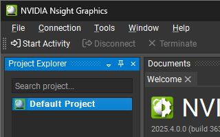
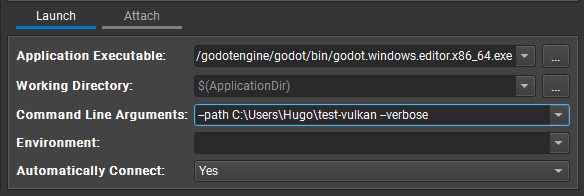
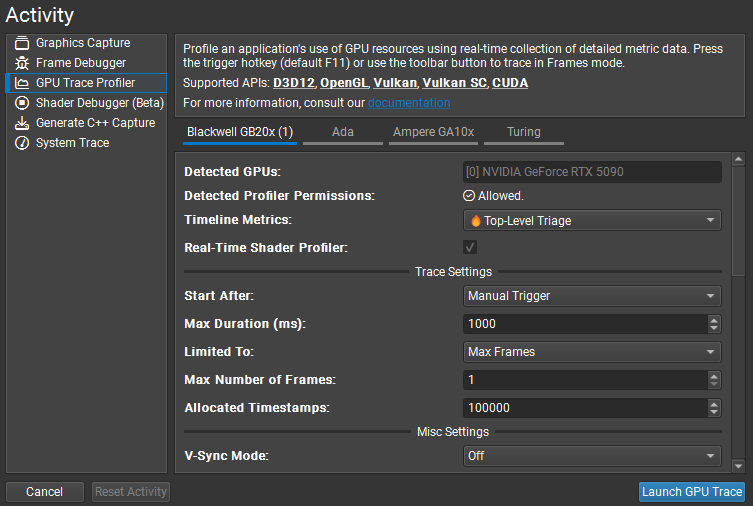
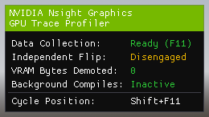
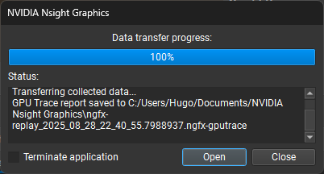
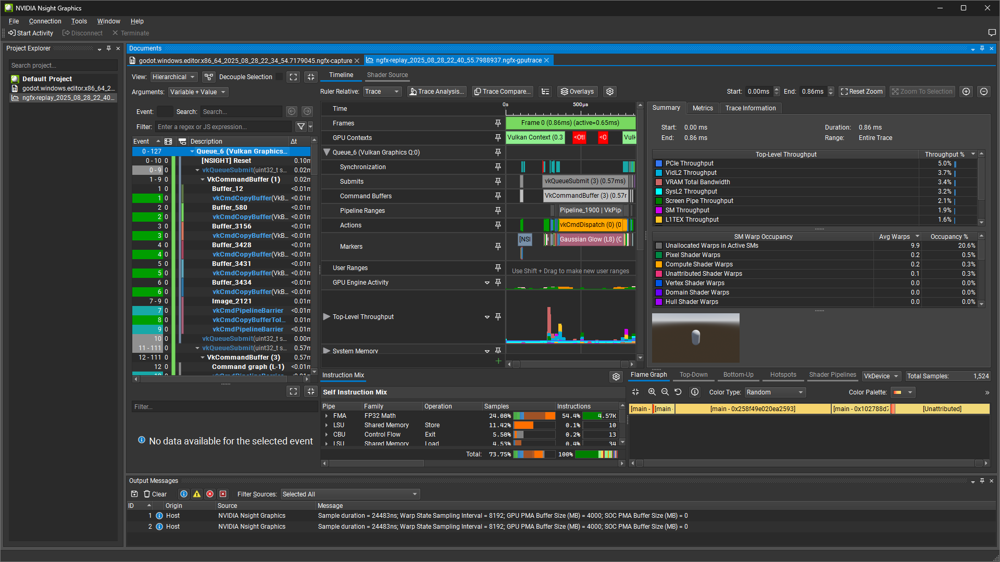
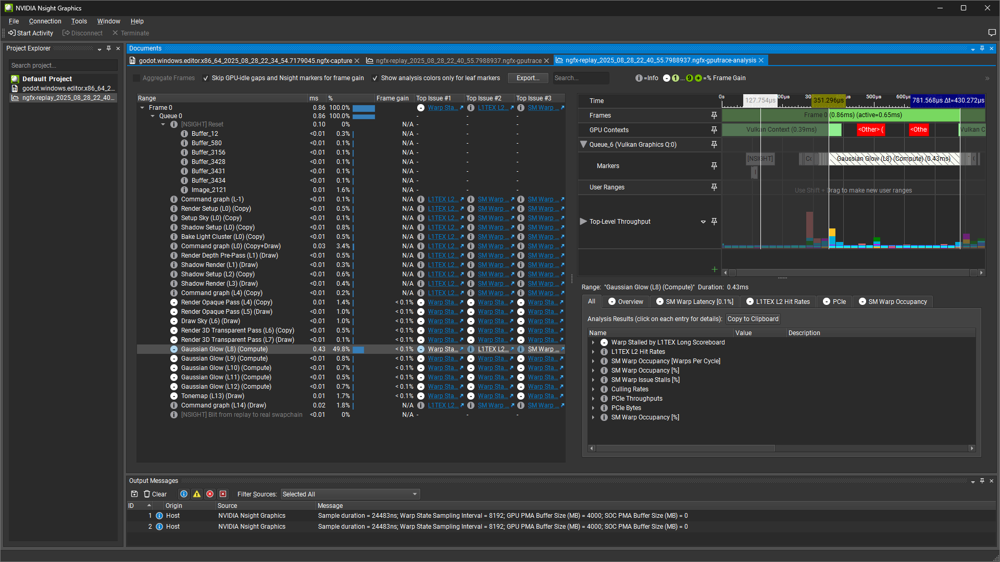
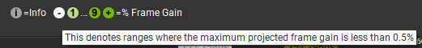
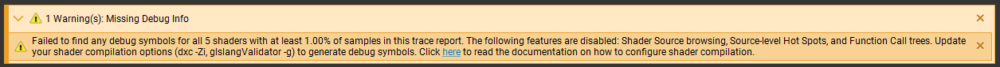

.. _doc_using_graphics_profilers:

Using graphics profilers
========================

This page covers how to set up graphics profilers for use with Godot.

.. seealso::

    To investigate rendering issues in the engine, you should use a
    :ref:`graphics debugger <doc_using_graphics_debuggers>`
    such as RenderDoc instead.

Setting up Godot
----------------

Unlike :ref:`C++ profilers <doc_using_cpp_profilers>`
it is not required to use an engine build that contains debugging symbols to get
useful graphics profiling information. However, using an editor or debug export
template build is strongly recommended, as release export templates strip most of the
debug information that GPU profilers can make use of.

Recommended profilers
---------------------

- `AMD Radeon GPU Profiler <https://gpuopen.com/rgp/>`__ (Windows/Linux, Vulkan/Direct3D 12)

  - Requires an AMD GPU.
  - Can be installed as part of the `Radeon Developer Tool Suite <https://gpuopen.com/tools/>`__,
    which includes other tools like a GPU memory analyzer.

- `NVIDIA NSight Graphics <https://developer.nvidia.com/nsight-graphics>`__
  (Windows/Linux, Vulkan/Direct3D 12)

  - Requires a NVIDIA GPU.
  - Not to be confused with NVIDIA NSight *Systems*, which is designed to profile
    compute workloads as opposed to gaming workloads.

- `PIX <https://devblogs.microsoft.com/pix/download/>`__
  (Windows, Direct3D 12 only)
- `Xcode <https://developer.apple.com/documentation/xcode/optimizing-gpu-performance>`__
  (macOS, Metal only)
- `Arm Performance Studio <https://developer.arm.com/Tools%20and%20Software/Arm%20Performance%20Studio>`__
  (Windows/macOS/Linux, Vulkan only, profile on mobile devices)

NSight Graphics-specific instructions
-------------------------------------

- Open NSight Graphics. Do not run Godot at this time, as NSight will run it later.

- Double-click :menu:`Default Project` in the list at the left:

   NSight default project.

Fill in the launch options to run a project directly:

   NSight launch options.

In the Activity section below the launch options, choose :menu:`GPU Trace`
and leave all options at their default values:

   Creating a GPU trace activity in NSight.

- Click :button:`Launch Application`. The project should start; if not, check that
  the project path is correct and points to a folder, not a file.
  Once the project is running, you'll see an overlay in the top-left corner of the window.
  Press :kbd:`F11` to capture a frame for profiling:

   NSight trace overlay in the running project.

You can capture multiple frames in the same session if needed.

- After capturing some frames, you'll see a popup appear on the NSight window. This confirms
  that the capture was done. Click :button:`Open` in the popup to open the profiler
  in a new window:

   GPU trace data transfer popup.

- You will then see the GPU trace results in a new window, where you can analyze the
  captured frames and their performance metrics:

   GPU trace results window.

Click :button:`Trace Analysis...` near the top to perform a detailed analysis of the currently profiled frame:

   GPU trace analysis window.

This opens a detailed analysis window, with a list of automatically detected problems and suggestions.
Each problem/suggestion is accompanied by a frame gain value, indicating its potential impact on performance.
The number in the circle represents the maximum percentage of performance increase that could be achieved
by fully addressing the problem/suggestion, relative to the current framerate. This is a theoretical value
and should be taken with caution.

   GPU trace analysis frame gain legend.

Troubleshooting
^^^^^^^^^^^^^^^

If you see a warning about missing shader debug information after opening the profile window,
it means the Godot process wasn't started with the correct command line arguments.

   GPU trace missing debug information warning.

To resolve this, TODO
