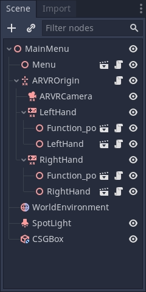
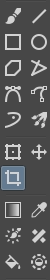
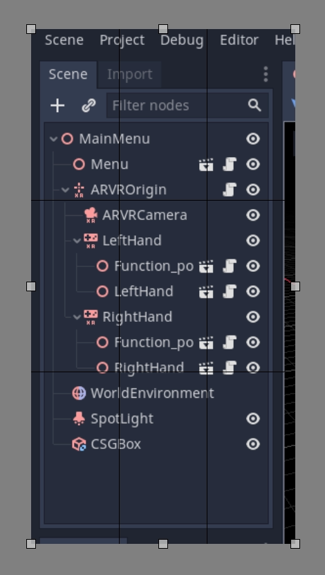
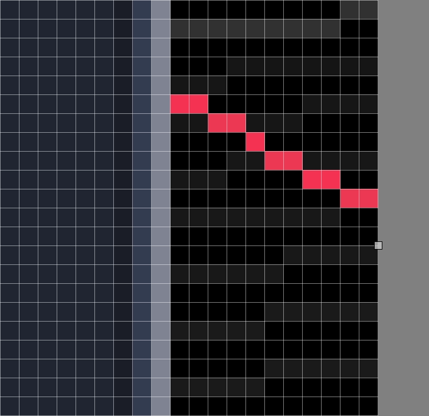

.. _docs_image_guidelines:

Creating documentation images and videos
========================================

Throughout the documentation, images are often needed to make the explanation
of a feature or concept as clear as possible for a reader. This page will
explain the process from beginning to end.

Images
------

Capturing an image
~~~~~~~~~~~~~~~~~~

To take a picture of something in Godot, a screen capture tool can be used.

On Windows 10 and 11 that would be the Snip & Sketch program.
Pressing :kbd:`Windows + Shift + S` lets you take a screenshot
of a portion of the screen and save it to the clipboard.
After pressing those keys, click and drag over
the area you wish to take a picture of.

On macOS, pressing :kbd:`Shift + Command + 3` does the same.
To take a picture of the entire screen press :kbd:`Shift + Command + 4`.
All screenshots taken will be saved to the desktop.

Each Linux desktop environment has it's own screenshot tool. For example,
on KDE Plasma the program Spectacle is used for taking screenshots. If your
distribution doesn't come with one by default try searching its package
repository, or Flathub if that's supported.

All screenshots should ideally be taken on a 1080p screen. Anything higher
resolution is adding detail that doesn't make the documentation better and
dramatically increases file size. If you're taking screenshots on a higher
resolution screen the screenshot should be scaled down. There are instructions
on how to do this later on this page.

Format conversion
~~~~~~~~~~~~~~~~~

The current format for images in Godot's documentation is WebP (``.webp``).
While some Linux programs will support saving screenshots in this format, macOS
and the Snip & Sketch program on Windows do not. For images that don't need
editing, such as precise cropping or adding outlines, Squoosh can be used.
`Squoosh <https://squoosh.app/>`_ is a converter developed by Google, is open
source, and doesn't give Google any image rights by using it. When choosing
compression if you can get an image that's under 300KB in size use lossless
compression. If it's over 300KB, use just enough lossy compression to get it
under that size. If this results in noticeable compression artifacts using less
compression is fine, even if the file size is bigger.

If you already have an image editor such as GIMP, Krita or Photoshop installed
it may have the ability to open an image then save it as a WebP file.

.. note::

    Since WebP supports animations and the documentation can display videos,
    GIFs should be avoided. Their compression is inefficient and they only support
    a 256-color palette with 1-bit transparency.

Cropping
~~~~~~~~

For a screenshot of a 2D or 3D scene in the editor, the above steps will be enough.
But for most UI images some extra work should be done, specifically cropping to
make an image look clean. Below is an example of good cropping.

For cropping Krita is the recommended program. While some screenshot programs do
have cropping built-in it's not always easy to get something precise. And while
Krita is designed as a painting program the cropping tool gives you pixel precision
by default. Of course, feel free to use a different program you are familiar with.

If you've never used Krita before download it from the `official Krita website <https://krita.org/en/download/>`_,
on Linux you may also be able to download it from your distributions repository,
flathub is also an option. Once it's installed on your computer open Krita then
open the image you want to crop. This button on the left panel is the crop tool.

After selecting it, click on the image, you should now have cropping tools available.

Click and drag the white boxes to adjust what gets cropped, if you zoom in close
to the image you will see the individual pixels in an image, which is useful for
precision.

If you make a mistake and overcrop don't worry, cropping is non-destructive in
Krita and can be adjusted. Click on the image with your cropping tool still selected
and the controls will return.

Scaling down an image
~~~~~~~~~~~~~~~~~~~~~

As explained earlier on this page, all images taken on a screen that is a higher resolution
than 1080p should be scaled down. To do this in Krita click on **Image** on the top bar, and
from the dropdown menu select **Scale Image To New Size**. This menu can also be opened by
pressing :kbd:`Ctrl + Alt + I`. On this menu you want to adjust the pixel dimensions. For
anything taken on a 4K monitor change the value of the width and height to half of its current
value, for anything taken on a 1440p monitor multiply the width and height by 0.75. Make
sure the **Constrain Proportions** box at the bottom of the menu is checked so you only have
to change 1 value.

Saving as WebP in Krita
~~~~~~~~~~~~~~~~~~~~~~~

To save an image as webp if it isn't already one, Go to **File > Save As**. Select **webp** from the
**Save as type:** dropdown, then choose wherever you want to save it. After clicking **Save** a menu
will popup with webp options. Make sure **Lossless** is checked and **Quality** is set to 100%. This
means the image will not lose detail and will be as small as possible.

If the image is over 300KB in size try compressing it losslessly using `Squoosh <https://squoosh.app/>`_.
If it's still over 300KB change to lossy compression and slowly increase the compression until it's under
300KB. If this results in noticeable compression artifacts using less compression is fine, even if the file
size is bigger.

Outlines, arrows and text
~~~~~~~~~~~~~~~~~~~~~~~~~

Sometimes an image needs something extra to properly direct the readers
attention, or make something clear. Outlines and arrows can be used
for this purpose. For these types of edits Inkscape is the recommended open
source program, it can be downloaded from the `official Inkscape website <https://inkscape.org/>`_.
Like Krita, if you're on Linux you can also check your distributions repository
or get it from Flathub.

A full tutorial on creating outlines is not provided here, we recommend searching
for various tutorials on how to use it online. However there are two standards
for doc image outlines and arrows. First, the color should be yellow, specifically
this hex color: ``fffb44`` (``fffb44ff`` if there is a transparency value like in Inkscape).
This color was chosen specifically to make sure color blind people do not have
issues reading the documentation, other colors can be used in addition to this yellow
if multiple outlines on an image are needed, red should be avoided. The second standard
is that all outlines and arrow lines should be 2 pixels wide.

Finally, some images might require text to differentiate multiple parts of an image.
There are no strict requirements other than use an easy to read non fancy font. As for
color the yellow color from before should also be used, but black or other colors can
be used if appropriate. For example, if yellow blends into the image, or if there are
multiple outlines in multiple colors.

Adding an image to a documentation page
~~~~~~~~~~~~~~~~~~~~~~~~~~~~~~~~~~~~~~~

Once you've finished working on your image, it can be added to the documentation.
All images are stored in folders named ``img`` next to the page they are used in.

To add your image, add it to the ``img`` folder that's in the same folder as the
``.rst`` file for the page (create it if it doesn't exist). In the ``.rst`` page,
images should be included with the following code snippet::

    .. image:: img/documentation_image.webp

Where ``documentation_image.webp`` would be changed to the name of the image you
created. Name your images in a way that makes their meaning clear, possibly with
a prefix that makes their relationship to a documentation page explicit.

Videos
------

Capturing a video
~~~~~~~~~~~~~~~~~

To record a video of something in Godot, a screen capture tool can be used.
Operating systems generally don't come with tools that are flexible enough
for this, so you'll need to install a third-party utility.

`OBS Studio <https://obsproject.com/>`__ is the most popular option, but
`SimpleScreenRecorder <https://www.maartenbaert.be/simplescreenrecorder/>`__
can be used as an alternative on Linux. `ShareX <https://getsharex.com/>`__
can be used as an alternative on Windows. All these tools can be configured
to record the entire screen, a specific window or a predetermined rectangle.

The recommended framerate for video recordings is 60 FPS, although you can use
30 FPS for longer videos to reduce their file size. For fullscreen videos,
use a resolution of 1280×720.

.. note::

    Godot's :ref:`Movie Maker mode <doc_creating_movies>` can be used to record
    the output of a running project, including its audio. This doesn't require
    installing any third-party software and avoids any frame drops (even when
    recording on a slow device), but it's less flexible.

Compressing the captured video
~~~~~~~~~~~~~~~~~~~~~~~~~~~~~~

The recommendation is to record your video in the highest quality possible
(without dropping frames due to excessive CPU/GPU utilization), then re-encode
it later to reduce its file size. This results in more efficient compression
than directly aiming for a small file size, as real-time compression methods are
less efficient than slower compression methods.

To re-encode videos for a smaller file size, use `HandBrake <https://handbrake.fr/>`__
or the `FFmpeg <https://ffmpeg.org/>` command line below:

::

    ffmpeg -i input.mp4 -crf 23 output.webm

The number after ``-crf`` adjusts the video quality, with higher numbers
resulting in *lower* quality (and smaller file sizes). A CRF of ``23`` is a good
starting point, but you may need to use a higher value for longer videos to
ensure the file size remains reasonable. Try to aim for a file size under 2 MB
if possible.

If the video was recorded in a higher resolution or framerate, you can adjust
its output resolution and framerate as follows:

::

    ffmpeg -i input.mp4 -crf 23 -vf scale=1280:-2 -r 30 output.webm

This results in a video resolution around 1280×720 at 30 FPS. The exact
video resolution will vary depending on the source's aspect ratio.

.. tip::

    If the video was recorded with an audio track but this audio track is not
    necessary, consider stripping it by adding the ``-an`` option to the FFmpeg
    command line (before the output file name). This will reduce file size and
    also ensure audio controls don't show up on the video when played in a
    browser.

Adding a video to a documentation page
--------------------------------------

Once you've finished working on your video, it can be added to the documentation.
All videos are stored in folders named ``video`` next to the page they are used in.

To add your video, add it to the ``video`` folder that's in the same folder as the
``.rst`` file for the page (create it if it doesn't exist). In the ``.rst`` page,
videos should be included with the following code snippet::

    .. video:: video/csg_tools.webm
       :alt: Put a text description of the video here
       :autoplay:
       :loop:
       :muted:

Where ``documentation_video.webp`` would be changed to the name of the video you
created. Name your videos in a way that makes their meaning clear, possibly with
a prefix that makes their relationship to a documentation page explicit.

The ``:autoplay:``, ``:loop:`` and ``:muted:`` flags should always be specified
unless the video needs to play audio. In this case, do not specify *any* of these flags.
