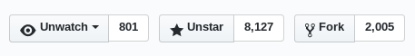
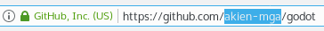
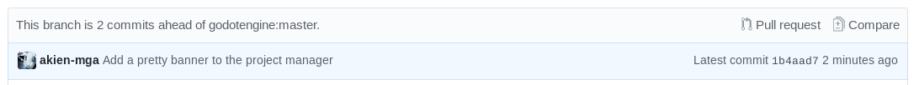

.. _doc_pr_workflow:

Pull request workflow
=====================

.. highlight:: shell

The so-called "PR workflow" used by Godot is common to many projects using
Git, and should be familiar to veteran free software contributors. The idea
is that only a small number (if any) commit directly to the *master* branch.
Instead, contributors *fork* the project (i.e. create a copy of it, which
they can modify as they wish), and then use the GitHub interface to request
a *pull* from one of their fork's branches to one branch of the original
(often named *upstream*) repository.

The resulting *pull request* (PR) can then be reviewed by other contributors,
which might approve it, reject it, or most often request that modifications
be done. Once approved, the PR can then be merged by one of the core
developers, and its commit(s) will become part of the target branch (usually
the *master* branch).

We will go together through an example to show the typical workflow and
associated Git commands. But first, let's have a quick look at the
organization of Godot's Git repository.

Git source repository
---------------------

The `repository on GitHub <https://github.com/godotengine/godot>`_ is a
`Git <https://git-scm.com>`_ code repository together with an embedded
issue tracker and PR system.

.. note:: If you are contributing to the documentation, its repository can
          be found `here <https://github.com/godotengine/godot-docs>`_.

The Git version control system is the tool used to keep track of successive
edits to the source code - to contribute efficiently to Godot, learning the
basics of the Git command line is *highly* recommended. There exist some
graphical interfaces for Git, but they usually encourage users to take bad
habits regarding the Git and PR workflow, and we therefore recommend not to
use them. In particular, we advise not to use GitHub's online editor for code
contributions (although it's tolerated for small fixes or documentation changes)
as it enforces one commit per file and per modification,
which quickly leads to PRs with an unreadable Git history (especially after peer review).

.. seealso:: The first sections of Git's "Book" are a good introduction to
             the tool's philosophy and the various commands you need to
             master in your daily workflow. You can read them online on the
             `Git SCM <https://git-scm.com/book/en/v2>`_ website.
             You can also try out `GitHub's interactive guide <https://try.github.io/>`__.

The branches on the Git repository are organized as follows:

-  The ``master`` branch is where the development of the next major version
   occurs. As a development branch, it can be unstable
   and is not meant for use in production. This is where PRs should be done
   in priority.
-  The stable branches are named after their version, e.g. ``3.1`` and ``2.1``.
   They are used to backport bugfixes and enhancements from the ``master``
   branch to the currently maintained stable release (e.g. 3.1.2 or 2.1.6).
   As a rule of thumb, the last stable branch is maintained until the next
   minor version (e.g. the ``3.0`` branch was maintained until the release of
   Godot 3.1).
   If you want to make PRs against a maintained stable branch, please check
   first if your changes are also relevant for the ``master`` branch, and if so
   make the PR for the ``master`` branch in priority. Release managers can then
   cherry-pick the fix to a stable branch if relevant.
-  There might occasionally be feature branches, usually meant to be merged into
   the ``master`` branch at some time.

Forking and cloning
-------------------

The first step is to *fork* the `godotengine/godot <https://github.com/godotengine/godot>`_
repository on GitHub. To do so, you will need to have a GitHub account and to
be logged in. In the top right corner of the repository's GitHub page, you
should see the "Fork" button as shown below:

Click it, and after a while you should be redirected to your own fork of the
Godot repo, with your GitHub username as namespace:

You can then *clone* your fork, i.e. create a local copy of the online
repository (in Git speak, the *origin remote*). If you haven't already,
download Git from `its website <https://git-scm.com>`_ if you're using Windows or
macOS, or install it through your package manager if you're using Linux.

.. note:: If you are on Windows, open Git Bash to type commands. macOS and Linux users
          can use their respective terminals.

To clone your fork from GitHub, use the following command:

::

    $ git clone https://github.com/USERNAME/godot

.. note:: In our examples, the "$" character denotes the command line prompt
          on typical UNIX shells. It is not part of the command and should
          not be typed.

After a little while, you should have a ``godot`` directory in your current
working directory. Move into it using the ``cd`` command:

::

    $ cd godot

We will start by setting up a reference to the original repository that we forked:

::

    $ git remote add upstream https://github.com/godotengine/godot
    $ git fetch upstream

This will create a reference named ``upstream`` pointing to the original
``godotengine/godot`` repository. This will be useful when you want to pull new
commits from its ``master`` branch to update your fork. You have another
remote reference named ``origin``, which points to your fork (``USERNAME/godot``).

You only need to do the above steps once, as long as you keep that local
``godot`` folder (which you can move around if you want, the relevant
metadata is hidden in its ``.git`` subfolder).

.. note:: *Branch it, pull it, code it, stage it, commit, push it, rebase
          it... technologic.*

          This bad take on Daft Punk's *Technologic* shows the general
          conception Git beginners have of its workflow: lots of strange
          commands to learn by copy and paste, hoping they will work as
          expected. And that's actually not a bad way to learn, as long as
          you're curious and don't hesitate to question your search engine
          when lost, so we will give you the basic commands to know when
          working in Git.

In the following, we will assume as an example that you want to implement a feature in
Godot's Project Manager, which is coded in the ``editor/project_manager.cpp``
file.

Branching
---------

By default, the ``git clone`` should have put you on the ``master`` branch of
your fork (``origin``). To start your own feature development, we will create
a feature branch:

::

    # Create the branch based on the current branch (master)
    $ git branch better-project-manager

    # Change the current branch to the new one
    $ git checkout better-project-manager

This command is equivalent:

::

    # Change the current branch to a new named one, based on the current branch
    $ git checkout -b better-project-manager

If you want to go back to the ``master`` branch, you'd use:

::

    $ git checkout master

You can see which branch you are currently on with the ``git branch``
command:

::

    $ git branch
      2.1
    * better-project-manager
      master

Be sure to always go back to the ``master`` branch before creating a new branch,
as your current branch will be used as the base for the new one. Alternatively,
you can specify a custom base branch after the new branch's name:

::

    $ git checkout -b my-new-feature master

Updating your branch
--------------------

This would not be needed the first time (just after you forked the upstream
repository). However, the next time you want to work on something, you will
notice that your fork's ``master`` is several commits behind the upstream
``master`` branch: pull requests from other contributors would have been merged
in the meantime.

To ensure there won't be conflicts between the feature you develop and the
current upstream ``master`` branch, you will have to update your branch by
*pulling* the upstream branch.

::

    $ git pull --rebase upstream master

The ``--rebase`` argument will ensure that any local changes that you committed
will be re-applied *on top* of the pulled branch, which is usually what we want
in our PR workflow. This way, when you open a pull request, your own commits will
be the only difference with the upstream ``master`` branch.

While rebasing, conflicts may arise if your commits modified code that has been
changed in the upstream branch in the meantime. If that happens, Git will stop at
the conflicting commit and will ask you to resolve the conflicts. You can do so
with any text editor, then stage the changes (more on that later), and proceed with
``git rebase --continue``. Repeat the operation if later commits have conflicts too,
until the rebase operation completes.

If you're unsure about what is going on during a rebase and you panic (no worry,
we all do the first few times), you can abort the rebase with ``git rebase --abort``.
You will then be back to the original state of your branch before calling
``git pull --rebase``.

.. note:: If you omit the ``--rebase`` argument, you will instead create a merge
          commit which tells Git what to make of the two distinct branches. If any
          conflicts arise, they would be resolved all at once via this merge commit.

          While this is a valid workflow and the default behavior of ``git pull``,
          merge commits within PRs are frowned upon in our PR workflow. We only use
          them when merging PRs into the upstream branch.

          The philosophy is that a PR should represent the final stage of the changes
          made to the codebase, and we are not interested in mistakes and fixes that
          would have been done in intermediate stages before merging.
          Git gives us great tools to "rewrite the history" and make it as if we got
          things right the first time, and we're happy to use it to ensure that
          changes are easy to review and understand long after they have been merged.

If you have already created a merge commit without using ``rebase``, or
have made any other changes that have resulted in undesired history, the best option
is to use an *interactive rebase* on the upstream branch. See the :ref:`dedicated
section <doc_pr_workflow_rebase>` for instructions.

.. tip:: If at any time you want to *reset* a local branch to a given commit or branch,
         you can do so with ``git reset --hard <commit ID>`` or
         ``git reset --hard <remote>/<branch>`` (e.g. ``git reset --hard upstream/master``).

         Be warned that this will remove any changes that you might have committed in
         this branch. If you ever lose commits by mistake, use the ``git reflog`` command
         to find the commit ID of the previous state that you would like to restore, and
         use it as argument of ``git reset --hard`` to go back to that state.

Making changes
--------------

You would then do your changes to our example's
``editor/project_manager.cpp`` file with your usual development environment
(text editor, IDE, etc.).

By default, those changes are *unstaged*. The staging area is a layer between
your working directory (where you make your modifications) and the local Git
repository (the commits and all the metadata in the ``.git`` folder). To
bring changes from the working directory to the Git repository, you need to
*stage* them with the ``git add`` command, and then to commit them with the
``git commit`` command.

There are various commands you should know to review your current work,
before staging it, while it is staged, and after it has been committed.

- ``git diff`` will show you the current unstaged changes, i.e. the
  differences between your working directory and the staging area.
- ``git checkout -- <files>`` will undo the unstaged changes to the given
  files.
- ``git add <files>`` will *stage* the changes on the listed files.
- ``git diff --staged`` will show the current staged changes, i.e. the
  differences between the staging area and the last commit.
- ``git reset HEAD <files>`` will *unstage* changes to the listed files.
- ``git status`` will show you what are the currently staged and unstaged
  modifications.
- ``git commit`` will commit the staged files. It will open a text editor
  (you can define the one you want to use with the ``GIT_EDITOR`` environment
  variable or the ``core.editor`` setting in your Git configuration) to let you
  write a commit log. You can use ``git commit -m "Cool commit log"`` to
  write the log directly.
- ``git commit --amend`` lets you amend the last commit with your currently
  staged changes (added with ``git add``). This is the best option if you
  want to fix a mistake in the last commit (bug, typo, style issue, etc.).
- ``git log`` will show you the last commits of your current branch. If you
  did local commits, they should be shown at the top.
- ``git show`` will show you the changes of the last commit. You can also
  specify a commit hash to see the changes for that commit.

That's a lot to memorize! Don't worry, just check this cheat sheet when you
need to make changes, and learn by doing.

Here's how the shell history could look like on our example:

::

    # It's nice to know where you're starting from
    $ git log

    # Do changes to the Project Manager with the nano text editor
    $ nano editor/project_manager.cpp

    # Find an unrelated bug in Control and fix it
    $ nano scene/gui/control.cpp

    # Review changes
    $ git status
    $ git diff

    # We'll do two commits for our unrelated changes,
    # starting by the Control changes necessary for the PM enhancements
    $ git add scene/gui/control.cpp
    $ git commit -m "Fix handling of margins in Control"

    # Check we did good
    $ git log
    $ git show
    $ git status

    # Make our second commit
    $ git add editor/project_manager.cpp
    $ git commit -m "Add a pretty banner to the Project Manager"
    $ git log

With this, we should have two new commits in our ``better-project-manager``
branch which were not in the ``master`` branch. They are still only local
though, the remote fork does not know about them, nor does the upstream repo.

Pushing changes to a remote
---------------------------

That's where ``git push`` will come into play. In Git, a commit is always
done in the local repository (unlike Subversion where a commit will modify
the remote repository directly). You need to *push* the new commits to a
remote branch to share them with the world. The syntax for this is:

::

    $ git push <remote> <local branch>[:<remote branch>]

The part about the remote branch can be omitted if you want it to have the
same name as the local branch, which is our case in this example, so we will
do:

::

    $ git push origin better-project-manager

Git will ask you for your username and password. For your password, enter your
GitHub Personal Access Token (PAT). If you do not have a GitHub Personal Access
Token, or do not have one with the correct permissions for your newly forked
repository, you will need to create one. Follow this link to create your Personal
Access Token: `Creating a personal access token
<https://docs.github.com/en/authentication/keeping-your-account-and-data-secure/creating-a-personal-access-token>`_.

After you have successfully verified your account using your PAT, the changes
will be sent to your remote repository. If you check the fork's page on GitHub,
you should see a new branch with your added commits.

Issuing a pull request
----------------------

When you load your fork's branch on GitHub, you should see a line saying
*"This branch is 2 commits ahead of godotengine:master."* (and potentially some
commits behind, if your ``master`` branch was out of sync with the upstream
``master`` branch).

On that line, there is a "Pull request" link. Clicking it will open a form
that will let you issue a pull request on the ``godotengine/godot`` upstream
repository. It should show you your two commits, and state "Able to merge".
If not (e.g. it has way more commits, or says there are merge conflicts),
don't create the PR yet, something went wrong. Go to our
`Godot Contributors Chat <https://chat.godotengine.org/>`_ and ask for support :)

Use an explicit title for the PR and put the necessary details in the comment
area. You can drag and drop screenshots, GIFs or zipped projects if relevant,
to showcase what your work implements. Click "Create a pull request", and
tadaa!

Modifying a pull request
------------------------

While it is reviewed by other contributors, you will often need to make
changes to your yet-unmerged PR, either because contributors requested them,
or because you found issues yourself while testing.

The good news is that you can modify a pull request simply by acting on the
branch you made the pull request from. You can e.g. make a new commit on that
branch, push it to your fork, and the PR will be updated automatically:

::

    # Check out your branch again if you had changed in the meantime
    $ git checkout better-project-manager

    # Fix a mistake
    $ nano editor/project_manager.cpp
    $ git add editor/project_manager.cpp
    $ git commit -m "Fix a typo in the banner's title"
    $ git push origin better-project-manager

However, be aware that in our PR workflow, we favor commits that bring the
codebase from one functional state to another functional state, without having
intermediate commits fixing up bugs in your own code or style issues. Most of
the time, we will prefer a single commit in a given PR (unless there's a good
reason to keep the changes separate). Instead of authoring a new commit,
consider using ``git commit --amend`` to amend the previous commit with your
fixes. The above example would then become:

::

    # Check out your branch again if you had changed in the meantime
    $ git checkout better-project-manager

    # Fix a mistake
    $ nano editor/project_manager.cpp
    $ git add editor/project_manager.cpp
    # --amend will change the previous commit, so you will have the opportunity
    # to edit its commit message if relevant.
    $ git commit --amend
    # As we modified the last commit, it no longer matches the one from your
    # remote branch, so we need to force push to overwrite that branch.
    $ git push --force origin better-project-manager

.. Kept for compatibility with the previous title, linked in many PRs.

.. _mastering-the-pr-workflow-the-rebase:

.. _doc_pr_workflow_rebase:

The interactive rebase
----------------------

If you didn't follow the above steps closely to *amend* changes into a commit
instead of creating fixup commits, or if you authored your changes without being
aware of our workflow and Git usage tips, reviewers might request you to
*rebase* your branch to *squash* some or all of the commits into one.

Indeed, if some commits have been made following reviews to fix bugs, typos, etc.
in the original commit, they are not relevant to a future changelog reader who
would want to know what happened in the Godot codebase, or when and how a given
file was last modified.

To squash those extraneous commits into the main one, we will have to *rewrite
history*. Right, we have that power. You may read that it's a bad practice, and
it's true when it comes to branches of the upstream repo. But in your fork, you
can do whatever you want, and everything is allowed to get neat PRs :)

We will use the *interactive rebase* ``git rebase -i`` to do this. This
command takes a commit ID or a branch name as argument, and will let you modify
all commits between that commit/branch and the last one in your working branch,
the so-called ``HEAD``.

While you can give any commit ID to ``git rebase -i`` and review everything in
between, the most common and convenient workflow involves rebasing on the
upstream ``master`` branch, which you can do with:

::

    $ git rebase -i upstream/master

.. note:: Referencing branches in Git is a bit tricky due to the distinction
          between remote and local branches. Here, ``upstream/master`` (with a
          `/`) is a local branch which has been pulled from the ``upstream``
          remote's ``master`` branch.

          Interactive rebases can only be done on local branches, so the `/`
          is important here. As the upstream remote changes frequently, your
          local ``upstream/master`` branch may become outdated, so you can
          update it with ``git fetch upstream master``. Contrarily to
          ``git pull --rebase upstream master`` which would update your
          currently checked out branch, ``fetch`` will only update the
          ``upstream/master`` reference (which is distinct from your local
          ``master`` branch... yes it's confusing, but you'll become familiar
          with this little by little).

This will open a text editor (``vi`` by default, see
`Git docs <https://git-scm.com/book/en/v2/Customizing-Git-Git-Configuration#_core_editor>`_
to configure your favorite one) with something which may look like this:

.. code-block:: text

    pick 1b4aad7 Add a pretty banner to the Project Manager
    pick e07077e Fix a typo in the banner's title

The editor will also show instructions regarding how you can act on those
commits. In particular, it should tell you that "pick" means to use that
commit (do nothing), and that "squash" and "fixup" can be used to *meld* the
commit in its parent commit. The difference between "squash" and "fixup" is
that "fixup" will discard the commit log from the squashed commit. In our
example, we are not interested in keeping the log of the "Fix a typo" commit,
so we use:

.. code-block:: text

    pick 1b4aad7 Add a pretty banner to the Project Manager
    fixup e07077e Fix a typo in the banner's title

Upon saving and quitting the editor, the rebase will occur. The second commit
will be melded into the first one, and ``git log`` and ``git show`` should
now confirm that you have only one commit with the changes from both previous
commits.

But! You rewrote the history, and now your local and remote branches have
diverged. Indeed, commit 1b4aad7 in the above example will have changed, and
therefore got a new commit hash. If you try to push to your remote branch, it
will raise an error:

::

    $ git push origin better-project-manager
    To https://github.com/akien-mga/godot
     ! [rejected]        better-project-manager -> better-project-manager (non-fast-forward)
    error: failed to push some refs to 'https://akien-mga@github.com/akien-mga/godot'
    hint: Updates were rejected because the tip of your current branch is behind
    hint: its remote counterpart.

This is reasonable behavior, Git will not let you push changes that would
override remote content. But that's actually what we want to do here, so we
will have to *force* it:

::

    $ git push --force origin better-project-manager

And tadaa! Git will happily *replace* your remote branch with what you had
locally (so make sure that's what you wanted, using ``git log``). This will
also update the PR accordingly.

Rebasing onto another branch
----------------------------

If you have accidentally opened your PR on the wrong branch, or need to target another branch
for some reason, you might need to filter out a lot of commits that differ between the old branch
(for example ``4.2``) and the new branch (for example ``master``). This can make rebasing difficult
and tedious. Fortunately ``git`` has a command just for this situation, ``git rebase --onto``.

If your PR was created from the ``4.2`` branch and you want to update it to instead start at ``master``
the following steps *should* fix this in one step:

.. code-block:: text

    $ git rebase -i --onto master 4.2

This will take all the commits on your branch *after* the ``4.2`` branch, and then splice them on top of ``master``,
ignoring any commits from the ``4.2`` branch not on the ``master`` branch. You may still need to do some fixing, but
this command should save you a lot of tedious work removing commits.

Just like above for the interactive rebase you need to force push your branch to handle the different changes:

::

    $ git push --force origin better-project-manager

Deleting a Git branch
---------------------

After your pull request gets merged, there's one last thing you should do: delete your
Git branch for the PR. There won't be issues if you don't delete your branch, but it's
good practice to do so. You'll need to do this twice, once for the local branch and another
for the remote branch on GitHub.

To delete our better Project Manager branch locally, use this command:

::

    $ git branch -d better-project-manager

Alternatively, if the branch hadn't been merged yet and we wanted to delete it anyway, instead
of ``-d`` you would use ``-D``.

Next, to delete the remote branch on GitHub use this command:

::

    $ git push origin -d better-project-manager

You can also delete the remote branch from the GitHub PR itself, a button should appear once
it has been merged or closed.
