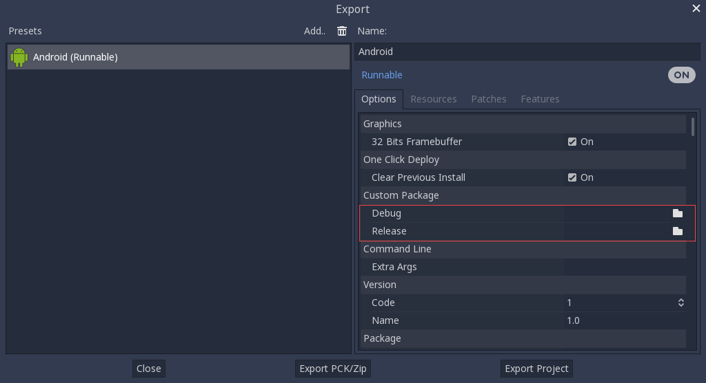

.. _doc_compiling_for_android:

Compiling for Android
=====================

.. highlight:: shell

Note
----

In most cases, using the built-in deployer and export templates is good
enough. Compiling the Android APK manually is mostly useful for custom
builds or custom packages for the deployer.

Also, you still need to follow the steps mentioned in the
:ref:`doc_exporting_for_android` tutorial before attempting to build
a custom export template.

Requirements
------------

For compiling under Windows, Linux or macOS, the following is required:

-  `Python 3.5+ <https://www.python.org/downloads/>`_.
-  `SCons 3.0+ <https://scons.org/pages/download.html>`_ build system.
-  `Android SDK <https://developer.android.com/studio/#command-tools>`_
   (command-line tools are sufficient).

   -  Required SDK components will be automatically installed by Gradle (except the NDK).

-  `Android NDK <https://developer.android.com/ndk/downloads/>`_ r17 or later.
-  Gradle (will be downloaded and installed automatically if missing).
-  JDK 8 (either OpenJDK or Oracle JDK).

   -  JDK 9 or later are not currently supported.
   -  You can download a build from `ojdkbuild <https://github.com/ojdkbuild/ojdkbuild>`_.

.. seealso:: For a general overview of SCons usage for Godot, see
             :ref:`doc_introduction_to_the_buildsystem`.

.. _doc_android_setting_up_the_buildsystem:

Setting up the buildsystem
--------------------------

Set the environment variable ``ANDROID_HOME`` to point to the Android
SDK. If you downloaded the Android command-line tools, this would be
the folder where you extracted the contents of the ZIP archive.
Later on, ``gradlew`` will install necessary SDK components in this folder.
However, you need to accept the SDK component licenses before they can be
downloaded by Gradle. This can be done by running the following command
from the root of the SDK directory, then answering all the prompts
with ``y``:

::

    tools/bin/sdkmanager --licenses

Set the environment variable ``ANDROID_NDK_ROOT`` to point to the
Android NDK. You also might need to set the variable ``ANDROID_NDK_HOME``
to the same path, especially if you are using custom Android modules,
since some Gradle plugins rely on the NDK and use this variable to
determine its location.

To set those environment variables on Windows, press :kbd:`Windows + R`, type
"control system", then click on **Advanced system settings** in the left
pane, then click on **Environment variables** on the window that
appears.

To set those environment variables on Linux or macOS, use
``export ANDROID_HOME=/path/to/android-sdk`` and
``export ANDROID_NDK_ROOT=/path/to/android-ndk``
where ``/path/to/android-sdk`` and ``/path/to/android-ndk`` point to
the root of the SDK and NDK directories.

Building the export templates
-----------------------------

Godot needs two export templates for Android: the optimized "release"
template (``android_release.apk``) and the debug template (``android_debug.apk``).
As Google will require all APKs to include ARMv8 (64-bit) libraries starting
from August 2019, the commands below will build an APK containing both
ARMv7 and ARMv8 libraries.

Compiling the standard export templates is done by calling SCons with
the following arguments:

-  Release template (used when exporting with **Debugging Enabled** unchecked)

::

    scons platform=android target=release android_arch=armv7
    scons platform=android target=release android_arch=arm64v8
    cd platform/android/java
    # On Windows
    .\gradlew generateGodotTemplates
    # On Linux and macOS
    ./gradlew generateGodotTemplates

The resulting APK will be located at ``bin/android_release.apk``.

-  Debug template (used when exporting with **Debugging Enabled** checked)

::

    scons platform=android target=release_debug android_arch=armv7
    scons platform=android target=release_debug android_arch=arm64v8
    cd platform/android/java
    # On Windows
    .\gradlew generateGodotTemplates
    # On Linux and macOS
    ./gradlew generateGodotTemplates

The resulting APK will be located at ``bin/android_debug.apk``.

Adding support for x86 devices
~~~~~~~~~~~~~~~~~~~~~~~~~~~~~~

If you also want to include support for x86 and x86-64 devices, run the SCons
command a third and fourth time with the ``android_arch=x86``, and
``android_arch=x86_64`` arguments before building the APK with Gradle. For
example, for the release template:

::

    scons platform=android target=release android_arch=armv7
    scons platform=android target=release android_arch=arm64v8
    scons platform=android target=release android_arch=x86
    scons platform=android target=release android_arch=x86_64
    cd platform/android/java
    # On Windows
    .\gradlew generateGodotTemplates
    # On Linux and macOS
    ./gradlew generateGodotTemplates

This will create a fat binary that works on all platforms.
The final APK size of exported projects will depend on the platforms you choose
to support when exporting; in other words, unused platforms will be removed from
the APK.

Cleaning the generated export templates
~~~~~~~~~~~~~~~~~~~~~~~~~~~~~~~~~~~~~~~

You can use the following commands to remove the generated export templates:

::

    cd platform/android/java
    # On Windows
    .\gradlew cleanGodotTemplates
    # On Linux and macOS
    ./gradlew cleanGodotTemplates

Using the export templates
--------------------------

Godot needs release and debug APKs that were compiled against the same
version/commit as the editor. If you are using official binaries
for the editor, make sure to install the matching export templates,
or build your own from the same version.

When exporting your game, Godot opens the APK, changes a few things inside and
adds your files.

Installing the templates
~~~~~~~~~~~~~~~~~~~~~~~~

The newly-compiled templates (``android_debug.apk``
and ``android_release.apk``) must be copied to Godot's templates folder
with their respective names. The templates folder can be located in:

-  Windows: ``%APPDATA%\Godot\templates\<version>\``
-  Linux: ``$HOME/.local/share/godot/templates/<version>/``
-  macOS: ``$HOME/Library/Application Support/Godot/templates/<version>/``

``<version>`` is of the form ``major.minor[.patch].status`` using values from
``version.py`` in your Godot source repository (e.g. ``3.0.5.stable`` or ``3.1.dev``).
You also need to write this same version string to a ``version.txt`` file located
next to your export templates.

.. TODO: Move these paths to a common reference page

However, if you are writing your custom modules or custom C++ code, you
might instead want to configure your APKs as custom export templates
here:

You don't even need to copy them, you can just reference the resulting
file in the ``bin\`` directory of your Godot source folder, so that the
next time you build you will automatically have the custom templates
referenced.

Troubleshooting
---------------

Platform doesn't appear in SCons
~~~~~~~~~~~~~~~~~~~~~~~~~~~~~~~~

Double-check that you've set both the ``ANDROID_HOME`` and ``ANDROID_NDK_ROOT``
environment variables. This is required for the platform to appear in SCons'
list of detected platforms.
See :ref:`Setting up the buildsystem <doc_android_setting_up_the_buildsystem>`
for more information.

Application not installed
~~~~~~~~~~~~~~~~~~~~~~~~~

Android might complain the application is not correctly installed.
If so:

-  Check that the debug keystore is properly generated.
-  Check that the jarsigner executable is from JDK 8.

If it still fails, open a command line and run `logcat <https://developer.android.com/studio/command-line/logcat>`_:

::

    adb logcat

Then check the output while the application is installed;
the error message should be presented there.
Seek assistance if you can't figure it out.

Application exits immediately
~~~~~~~~~~~~~~~~~~~~~~~~~~~~~

If the application runs but exits immediately, this might be due to
one of the following reasons:

-  Make sure to use export templates that match your editor version; if
   you use a new Godot version, you *have* to update the templates too.
-  ``libgodot_android.so`` is not in ``libs/<android_arch>/``
   where ``<android_arch>`` is the device's architecture.
-  The device's architecture does not match the exported one(s).
   Make sure your templates were built for that device's architecture,
   and that the export settings included support for that architecture.

In any case, ``adb logcat`` should also show the cause of the error.
