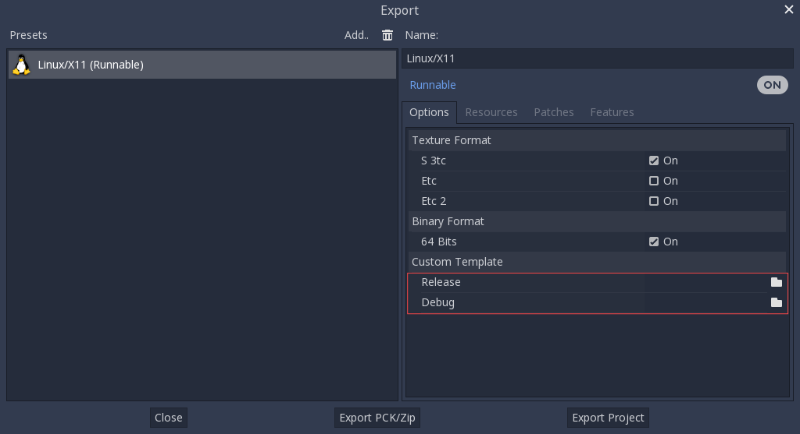

.. _doc_compiling_for_linuxbsd:

Compiling for Linux, \*BSD
==========================

.. highlight:: shell

.. seealso::

    This page describes how to compile Linux editor and export template binaries from source.
    If you're looking to export your project to Linux instead, read :ref:`doc_exporting_for_linux`.

Requirements
------------

For compiling under Linux or other Unix variants, the following is
required:

-  GCC 7+ or Clang 6+.
-  Python 3.5+.
-  SCons 3.0+ build system. If your distribution uses Python 2 by default,
   or you are using a version of SCons prior to 3.1.2, you will need to change
   the version of Python that SCons uses by changing the shebang (the first line)
   of the SCons script file to ``#! /usr/bin/python3``.
   Use the command ``which scons`` to find the location of the SCons script file.
-  pkg-config (used to detect the dependencies below).
-  X11, Xcursor, Xinerama, Xi and XRandR development libraries.
-  MesaGL development libraries.
-  ALSA development libraries.
-  PulseAudio development libraries.
-  *Optional* - libudev (build with ``udev=yes``).

.. seealso:: To get the Godot source code for compiling, see
             :ref:`doc_getting_source`.

             For a general overview of SCons usage for Godot, see
             :ref:`doc_introduction_to_the_buildsystem`.

Distro-specific one-liners
^^^^^^^^^^^^^^^^^^^^^^^^^^
+------------------+-----------------------------------------------------------------------------------------------------------+
| **Alpine Linux** | ::                                                                                                        |
|                  |                                                                                                           |
|                  |     apk add scons pkgconf gcc g++ libx11-dev libxcursor-dev libxinerama-dev libxi-dev libxrandr-dev \     |
|                  |         mesa-dev libexecinfo-dev eudev-dev alsa-lib-dev pulseaudio-dev                                    |
+------------------+-----------------------------------------------------------------------------------------------------------+
| **Arch Linux**   | ::                                                                                                        |
|                  |                                                                                                           |
|                  |     pacman -S --needed scons pkgconf gcc libxcursor libxinerama libxi libxrandr mesa glu libglvnd \       |
|                  |         alsa-lib pulseaudio                                                                               |
+------------------+-----------------------------------------------------------------------------------------------------------+
| **Debian** /     | ::                                                                                                        |
| **Ubuntu**       |                                                                                                           |
|                  |     sudo apt-get install build-essential scons pkg-config libx11-dev libxcursor-dev libxinerama-dev \     |
|                  |         libgl1-mesa-dev libglu-dev libasound2-dev libpulse-dev libudev-dev libxi-dev libxrandr-dev        |
+------------------+-----------------------------------------------------------------------------------------------------------+
| **Fedora**       | ::                                                                                                        |
|                  |                                                                                                           |
|                  |     sudo dnf install scons pkgconfig libX11-devel libXcursor-devel libXrandr-devel libXinerama-devel \    |
|                  |         libXi-devel mesa-libGL-devel mesa-libGLU-devel alsa-lib-devel pulseaudio-libs-devel \             |
|                  |         libudev-devel gcc-c++ libstdc++-static libatomic-static                                           |
+------------------+-----------------------------------------------------------------------------------------------------------+
| **FreeBSD**      | ::                                                                                                        |
|                  |                                                                                                           |
|                  |     sudo pkg install py37-scons pkgconf xorg-libraries libXcursor libXrandr libXi xorgproto libGLU \      |
|                  |         alsa-lib pulseaudio                                                                               |
|                  |                                                                                                           |
+------------------+-----------------------------------------------------------------------------------------------------------+
| **Gentoo**       | ::                                                                                                        |
|                  |                                                                                                           |
|                  |     emerge -an dev-util/scons x11-libs/libX11 x11-libs/libXcursor x11-libs/libXinerama x11-libs/libXi \   |
|                  |         media-libs/mesa media-libs/glu media-libs/alsa-lib media-sound/pulseaudio                         |
+------------------+-----------------------------------------------------------------------------------------------------------+
| **Mageia**       | ::                                                                                                        |
|                  |                                                                                                           |
|                  |     urpmi scons task-c++-devel pkgconfig "pkgconfig(alsa)" "pkgconfig(glu)" "pkgconfig(libpulse)" \       |
|                  |         "pkgconfig(udev)" "pkgconfig(x11)" "pkgconfig(xcursor)" "pkgconfig(xinerama)" "pkgconfig(xi)" \   |
|                  |         "pkgconfig(xrandr)"                                                                               |
+------------------+-----------------------------------------------------------------------------------------------------------+
| **OpenBSD**      | ::                                                                                                        |
|                  |                                                                                                           |
|                  |     pkg_add python scons llvm                                                                             |
+------------------+-----------------------------------------------------------------------------------------------------------+
| **openSUSE**     | ::                                                                                                        |
|                  |                                                                                                           |
|                  |     sudo zypper install scons pkgconfig libX11-devel libXcursor-devel libXrandr-devel libXinerama-devel \ |
|                  |             libXi-devel Mesa-libGL-devel alsa-devel libpulse-devel libudev-devel gcc-c++ libGLU1          |
+------------------+-----------------------------------------------------------------------------------------------------------+
| **NetBSD**       | ::                                                                                                        |
|                  |                                                                                                           |
|                  |     pkg_add pkg-config py37-scons                                                                         |
|                  |                                                                                                           |
|                  | For audio support, you can optionally install ``pulseaudio``.                                             |
+------------------+-----------------------------------------------------------------------------------------------------------+
| **Solus**        | ::                                                                                                        |
|                  |                                                                                                           |
|                  |     sudo eopkg install -c system.devel scons libxcursor-devel libxinerama-devel libxi-devel \             |
|                  |         libxrandr-devel mesalib-devel libglu alsa-lib-devel pulseaudio-devel                              |
+------------------+-----------------------------------------------------------------------------------------------------------+

Compiling
---------

Start a terminal, go to the root dir of the engine source code and type:

::

    scons -j8 platform=linuxbsd

A good rule of thumb for the ``-j`` (*jobs*) flag, is to have at least as many
threads compiling Godot as you have cores in your CPU, if not one or two more.
Feel free to add the ``-j`` option to any SCons command you see below.

You can automatically use all available CPU cores with command substitution.

On Linux, you can use ``nproc``:

::

    scons -j$(nproc)

On \*BSD, you can use ``sysctl -n hw.ncpu``:

::

    scons -j$(sysctl -n hw.ncpu)

.. note::

    Prior to Godot 4.0, the Linux/\*BSD target was called ``x11`` instead of
    ``linuxbsd``. If you are looking to compile Godot 3.x, make sure to use the
    `stable branch of this documentation <https://docs.godotengine.org/en/stable/development/compiling/compiling_for_x11.html>`__.

If all goes well, the resulting binary executable will be placed in the
"bin" subdirectory. This executable file contains the whole engine and
runs without any dependencies. Executing it will bring up the project
manager.

.. note::

    If you wish to compile using Clang rather than GCC, use this command:

    ::

        scons platform=linuxbsd use_llvm=yes

    Using Clang appears to be a requirement for OpenBSD, otherwise fonts
    would not build.

.. note:: If you are compiling Godot for production use, then you can
          make the final executable smaller and faster by adding the
          SCons option ``target=release_debug``.

          If you are compiling Godot with GCC, you can make the binary
          even smaller and faster by adding the SCons option ``use_lto=yes``.
          As link-time optimization is a memory-intensive process,
          this will require about 7 GB of available RAM while compiling.

.. note:: If you want to use separate editor settings for your own Godot builds
          and official releases, you can enable
          :ref:`doc_data_paths_self_contained_mode` by creating a file called
          ``._sc_`` or ``_sc_`` in the ``bin/`` folder.

Compiling a headless/server build
---------------------------------

To compile a *headless* build which provides editor functionality to export
projects in an automated manner, use::

    scons -j8 platform=server tools=yes target=release_debug

To compile a debug *server* build which can be used with
:ref:`remote debugging tools <doc_command_line_tutorial>`, use::

    scons -j8 platform=server tools=no target=release_debug

To compile a *server* build which is optimized to run dedicated game servers,
use::

    scons -j8 platform=server tools=no target=release

Building export templates
-------------------------

.. warning:: Linux binaries usually won't run on distributions that are
             older than the distribution they were built on. If you wish to
             distribute binaries that work on most distributions,
             you should build them on an old distribution such as Ubuntu 16.04.
             You can use a virtual machine or a container to set up a suitable
             build environment.

To build Linux or \*BSD export templates, run the build system with the
following parameters:

-  (32 bits)

::

    scons platform=linuxbsd tools=no target=release bits=32
    scons platform=linuxbsd tools=no target=release_debug bits=32

-  (64 bits)

::

    scons platform=linuxbsd tools=no target=release bits=64
    scons platform=linuxbsd tools=no target=release_debug bits=64

Note that cross-compiling for the opposite bits (64/32) as your host
platform is not always straight-forward and might need a chroot environment.

To create standard export templates, the resulting files in the ``bin/`` folder
must be copied to:

::

    $HOME/.local/share/godot/export_templates/<version>/

and named like this (even for \*BSD which is seen as "Linux/X11" by Godot):

::

    linux_x11_32_debug
    linux_x11_32_release
    linux_x11_64_debug
    linux_x11_64_release

However, if you are writing your custom modules or custom C++ code, you
might instead want to configure your binaries as custom export templates
here:

You don't even need to copy them, you can just reference the resulting
files in the ``bin/`` directory of your Godot source folder, so the next
time you build, you automatically have the custom templates referenced.

Using Clang and LLD for faster development
------------------------------------------

You can also use Clang and LLD to build Godot. This has two upsides compared to
the default GCC + GNU ld setup:

- LLD links Godot significantly faster compared to GNU ld or gold. This leads to
  faster iteration times.
- Clang tends to give more useful error messages compared to GCC.

To do so, install Clang and the ``lld`` package from your distribution's package manager
then use the following SCons command::

    scons platform=linuxbsd use_llvm=yes use_lld=yes

After the build is completed, a new binary with a ``.llvm`` suffix will be
created in the ``bin/`` folder.

It's still recommended to use GCC for production builds as they can be compiled using
link-time optimization, making the resulting binaries smaller and faster.

Using Pyston for faster development
-----------------------------------

You can use `Pyston <https://www.pyston.org/>`__ to run SCons. Pyston is a JIT-enabled
implementation of the Python language (which SCons is written in). It is currently
only compatible with Linux. Pyston can speed up incremental builds significantly,
often by a factor between 1.5× and 2×. Pyston can be combined with Clang and LLD
to get even faster builds.

- Download the `latest portable Pyston release <https://github.com/pyston/pyston/releases/latest>`__.
- Extract the portable ``.tar.gz`` to a set location, such as ``$HOME/.local/opt/pyston/`` (create folders as needed).
- Use ``cd`` to reach the extracted Pyston folder from a terminal,
  then run ``./pyston -m pip install scons`` to install SCons within Pyston.
- To make SCons via Pyston easier to run, create a symbolic link of its wrapper
  script to a location in your ``PATH`` environment variable::

    ln -s ~/.local/opt/pyston/bin/scons ~/.local/bin/pyston-scons

- Instead of running ``scons <build arguments>``, run ``pyston-scons <build arguments>``
  to compile Godot.

If you can't run ``pyston-scons`` after creating the symbolic link,
make sure ``$HOME/.local/bin/`` is part of your user's ``PATH`` environment variable.
