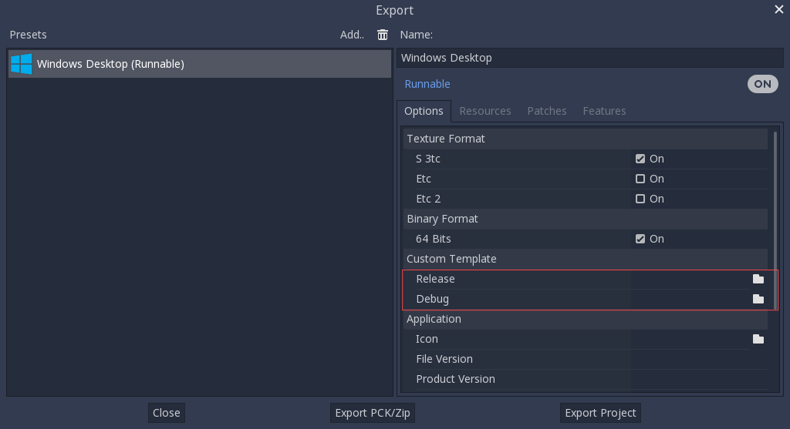

.. _doc_compiling_for_windows:

Compiling for Windows
=====================

.. highlight:: shell

Requirements
------------

For compiling under Windows, the following is required:

- `Visual Studio Community <https://www.visualstudio.com/vs/community/>`_,
  version 2017 or later. VS 2019 is recommended.
  **Make sure to read "Installing Visual Studio caveats" below or you
  will have to run/download the installer again.**
- `MinGW-w64 <http://mingw-w64.org/>`__ with GCC can be used as an alternative to
  Visual Studio. Be sure to install/configure it to use the ``posix`` thread model.
- `Python 3.5+ <https://www.python.org/downloads/windows/>`_.
- `SCons 3.0 <https://www.scons.org/>`_ build system. If using Visual Studio 2019,
  you need at least SCons 3.1.1.
- *Optional* - `yasm <https://yasm.tortall.net/>`_ (for WebM SIMD optimizations)

.. note:: If you have `Scoop <https://scoop.sh/>`_ installed, you can easily
          install MinGW and other dependencies using the following command::

              scoop install gcc python scons yasm make

.. note:: If you have `MSYS2 <https://www.msys2.org/>`_ installed, you can easily
          install MinGW and other dependencies using the following command::

              pacman -S mingw-w64-x86_64-python3-pip \
                  mingw-w64-x86_64-gcc mingw-w64-x86_64-yasm \
                  mingw-w64-i686-python3-pip mingw-w64-i686-gcc \
                  mingw-w64-i686-yasm make

          For each MSYS2 MinGW subsystem, you should then run
          `pip install scons` in its shell.

.. seealso:: For a general overview of SCons usage for Godot, see
             :ref:`doc_introduction_to_the_buildsystem`.

Setting up Python
-----------------

First you need to install Python 3.5 or newer. Make sure to enable the option
to add Python to the ``PATH`` in the Python installer. The SCons installer
should then detect and use the existing Python installation.

Setting up SCons
----------------

To install SCons open the command prompt and run the following command.

``python -m pip install scons``

To check whether you have installed Python and SCons correctly, you can
type ``python --version`` and ``scons --version`` into a command prompt
(``cmd.exe``).

If the commands above don't work, make sure to add Python to your ``PATH``
environment variable after installing it, then check again.
You can do so by running the Python installer again and enabling the option
to add Python to the ``PATH``.

.. _doc_compiling_for_windows_install_vs:

Installing Visual Studio caveats
--------------------------------

If installing Visual Studio 2017 or 2019, make sure to enable **C++** in
the list of workflows to install.

If installing Visual Studio 2015, make sure to run a **Custom**
installation instead of **Typical** and select **C++** as a language there.

If you've already made the mistake of installing Visual Studio without
C++ support, run the installer again; it should present you a **Modify** button.
Running the installer from *Add/Remove Programs* will only give you
a **Repair** option, which won't let you install C++ tools.

Downloading Godot's source
--------------------------

Godot's source code is `hosted on GitHub <https://github.com/godotengine/godot>`_.
Downloading it (cloning) using `Git <https://git-scm.com/>`_ is recommended.

The tutorial will assume from now on that you placed the source code in
``C:\godot``.

Compiling
---------

Selecting a compiler
~~~~~~~~~~~~~~~~~~~~

SCons will automatically find and use an existing Visual Studio installation.
If you do not have Visual Studio installed, it will attempt to use
MinGW instead. If you already have Visual Studio installed and want to
use MinGW, pass ``use_mingw=yes`` to the SCons command line.

During development, using the Visual Studio compiler is usually a better idea,
as it links the Godot binary much faster than MinGW. However, MinGW can
produce more optimized binaries using link-time optimization (see below),
making it a better choice for production use.

Running SCons
~~~~~~~~~~~~~

After opening a command prompt, change to the root directory of
the engine source code (using ``cd``) and type::

    C:\godot> scons platform=windows

You can specify a number of CPU threads to use to speed up the build::

    C:\godot> scons -j6 platform=windows

In general, it is OK to have at least as many threads compiling Godot as you
have cores in your CPU, if not one or two more. Feel free to add the ``-j``
option to any SCons command you see below.

.. note:: When compiling with multiple CPU threads, SCons may warn about
          pywin32 being missing. You can safely ignore this warning.

If all goes well, the resulting binary executable will be placed in
``C:\godot\bin\`` with the name ``godot.windows.tools.32.exe`` or
``godot.windows.tools.64.exe``. By default, SCons will build a binary matching
your CPU architecture, but this can be overridden using ``bits=64`` or
``bits=32``.

This executable file contains the whole engine and runs without any
dependencies. Running it will bring up the Project Manager.

.. note:: If you are compiling Godot for production use, then you can
          make the final executable smaller and faster by adding the
          SCons option ``target=release_debug``.

          If you are compiling Godot with MinGW, you can make the binary
          even smaller and faster by adding the SCons option ``use_lto=yes``.
          As link-time optimization is a memory-intensive process,
          this will require about 3 GB of available RAM while compiling.

.. note:: If you want to use separate editor settings for your own Godot builds
          and official releases, you can enable
          :ref:`doc_data_paths_self_contained_mode` by creating a file called
          ``._sc_`` or ``_sc_`` in the ``bin/`` folder.

Development in Visual Studio or other IDEs
------------------------------------------

For most projects, using only scripting is enough but when development
in C++ is needed, for creating modules or extending the engine, working
with an IDE is usually desirable.

You can create a Visual Studio solution via SCons by running SCons with
the ``vsproj=yes`` parameter, like this::

   scons p=windows vsproj=yes

You will be able to open Godot's source in a Visual Studio solution now,
and able to build Godot using Visual Studio's **Build** button.

If you need to edit the build commands, they are located in
"Godot" project settings, NMAKE sheet. SCons is called at the end of
the commands. If you make a mistake, copy the command from one of the
other build configurations (debug, release_debug, release) or
architectures (Win32/x64); they are equivalent.

Cross-compiling for Windows from other operating systems
--------------------------------------------------------

If you are a Linux or macOS user, you need to install
`MinGW-w64 <https://mingw-w64.org/doku.php>`__, which typically comes in 32-bit
and 64-bit variants. The package names may differ based on your distribution,
here are some known ones:

+----------------+--------------------------------------------------------------+
| **Arch Linux** | Install `mingw-w64-gcc from the AUR`_.                       |
+----------------+--------------------------------------------------------------+
| **Debian** /   | ::                                                           |
| **Ubuntu**     |                                                              |
|                |     apt install mingw-w64                                    |
+----------------+--------------------------------------------------------------+
| **Fedora**     | ::                                                           |
|                |                                                              |
|                |     dnf install mingw64-gcc-c++ mingw64-winpthreads-static \ |
|                |                 mingw32-gcc-c++ mingw32-winpthreads-static   |
+----------------+--------------------------------------------------------------+
| **macOS**      | ::                                                           |
|                |                                                              |
|                |     brew install mingw-w64                                   |
+----------------+--------------------------------------------------------------+
| **Mageia**     | ::                                                           |
|                |                                                              |
|                |     urpmi mingw64-gcc-c++ mingw64-winpthreads-static \       |
|                |           mingw32-gcc-c++ mingw32-winpthreads-static         |
+----------------+--------------------------------------------------------------+

.. _mingw-w64-gcc from the AUR: https://aur.archlinux.org/packages/mingw-w64-gcc/

Before attempting the compilation, SCons will check for
the following binaries in your ``PATH`` environment variable::

    i686-w64-mingw32-gcc
    x86_64-w64-mingw32-gcc

If the binaries are not located in the ``PATH`` (e.g. ``/usr/bin``),
you can define the following environment variables to give a hint to
the build system::

    export MINGW32_PREFIX="/path/to/i686-w64-mingw32-"
    export MINGW64_PREFIX="/path/to/x86_64-w64-mingw32-"

To make sure you are doing things correctly, executing the following in
the shell should result in a working compiler (the version output may
differ based on your system)::

    ${MINGW32_PREFIX}gcc --version
    # i686-w64-mingw32-gcc (GCC) 6.1.0 20160427 (Mageia MinGW 6.1.0-1.mga6)

Troubleshooting
~~~~~~~~~~~~~~~

Cross-compiling from some Ubuntu versions may lead to
`this bug <https://github.com/godotengine/godot/issues/9258>`_,
due to a default configuration lacking support for POSIX threading.

You can change that configuration following those instructions,
for 64-bit::

    sudo update-alternatives --config x86_64-w64-mingw32-gcc
    <choose x86_64-w64-mingw32-gcc-posix from the list>
    sudo update-alternatives --config x86_64-w64-mingw32-g++
    <choose x86_64-w64-mingw32-g++-posix from the list>

And for 32-bit::

    sudo update-alternatives --config i686-w64-mingw32-gcc
    <choose i686-w64-mingw32-gcc-posix from the list>
    sudo update-alternatives --config i686-w64-mingw32-g++
    <choose i686-w64-mingw32-g++-posix from the list>

Creating Windows export templates
---------------------------------

Windows export templates are created by compiling Godot without the editor,
with the following flags::

    C:\godot> scons platform=windows tools=no target=release_debug bits=32
    C:\godot> scons platform=windows tools=no target=release bits=32
    C:\godot> scons platform=windows tools=no target=release_debug bits=64
    C:\godot> scons platform=windows tools=no target=release bits=64

If you plan on replacing the standard export templates, copy these to the
following location, replacing ``<version>`` with the version identifier
(such as ``3.1.1.stable`` or ``3.2.dev``)::

    %USERPROFILE%\AppData\Roaming\Godot\templates\<version>\

With the following names::

    windows_32_debug.exe
    windows_32_release.exe
    windows_64_debug.exe
    windows_64_release.exe

However, if you are using custom modules or custom engine code, you
may instead want to configure your binaries as custom export templates
here:

You don't need to copy them in this case, just reference the resulting
files in the ``bin\`` directory of your Godot source folder, so the next
time you build, you will automatically have the custom templates referenced.
