.. _doc_configuring_an_ide:

Configuring an IDE
==================

We assume that you have already `cloned <https://github.com/godotengine/godot>`_
and :ref:`compiled <toc-devel-compiling>` Godot.

You can easily develop Godot with any text editor and by invoking ``scons``
on the command line, but if you want to work with an IDE (Integrated
Development Environment), here are setup instructions for some popular ones:

- :ref:`Qt Creator <doc_configuring_an_ide_qtcreator>` (all desktop platforms)
- :ref:`Kdevelop <doc_configuring_an_ide_kdevelop>` (all desktop platforms)
- :ref:`Xcode <doc_configuring_an_ide_xcode>` (macOS)
- :ref:`Visual Studio <doc_compiling_for_windows_install_vs>` (Windows)
- :ref:`Visual Studio Code<doc_configuring_an_ide_vscode>` (all desktop platforms)
- :ref:`Android Studio<doc_configuring_an_ide_android_studio>` (all desktop platforms)
- :ref:`CLion<doc_configuring_an_ide_clion>` (all desktop platforms)

It is possible to use other IDEs, but their setup is not documented yet.

.. _doc_configuring_an_ide_qtcreator:

Qt Creator
----------

Importing the project
^^^^^^^^^^^^^^^^^^^^^

-  Choose *New Project* -> *Import Project* -> *Import Existing Project*.

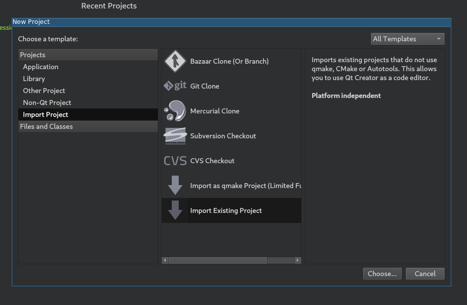

-  Set the path to your Godot root directory and enter the project name.

.. image:: img/qtcreator-set-project-path.png

-  Here you can choose which folders and files will be visible to the project. C/C++ files
   are added automatically. Potentially useful additions: \*.py for buildsystem files, \*.java for Android development,
   \*.mm for macOS. Click "Next".

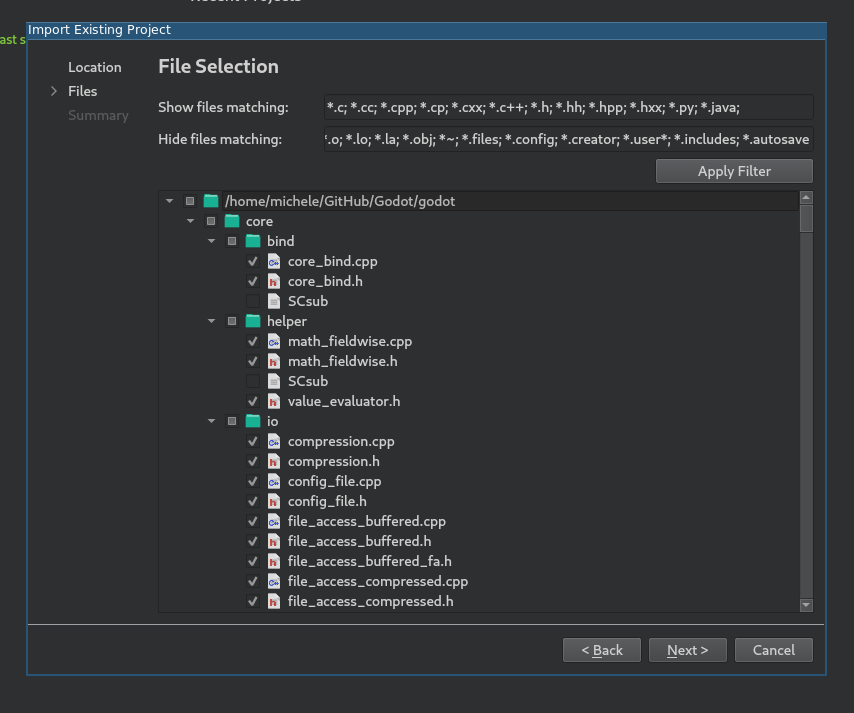

-  Click *Finish*.
-  Add a line containing ``.`` to *project_name.includes* to get working code completion.

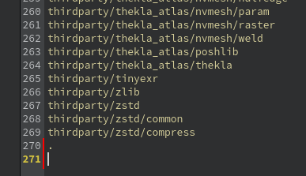

Build and run
^^^^^^^^^^^^^

Build configuration:

-  Click on *Projects* and open the *Build* tab.
-  Delete the pre-defined ``make`` build step.

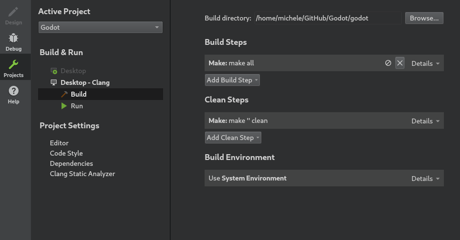

-  Click *Add Build Step* -> *Custom Process Step*.

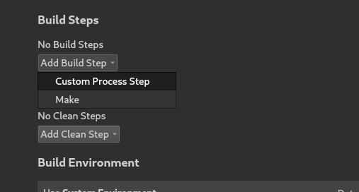

-  Type ``scons`` in the *Command* field. If it fails with 'Could not start process "scons"',
   it can mean that ``scons`` is not in your ``PATH`` environment variable, so you may have to
   use the full path to the SCons binary.
-  Fill the *Arguments* field with your compilation options. (e.g.: ``p=x11 target=debug -j 4``)

.. image:: img/qtcreator-set-scons-command.png

Run configuration:

-  Open the *Run* tab.
-  Point the *Executable* to your compiled Godot binary (e.g: ``%{buildDir}/bin/godot.x11.opt.tools.64``)
-  If you want to run a specific game or project, point *Working directory* to the game directory.
-  If you want to run the editor, add ``-e`` to the *Command line arguments* field.

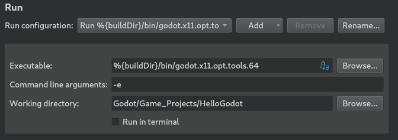

Updating sources after pulling latest commits
^^^^^^^^^^^^^^^^^^^^^^^^^^^^^^^^^^^^^^^^^^^^^

As a developer you usually want to frequently pull the latest commits
from the upstream git repository or a specific fork etc. However this
brings a little problem with it: as the development continues, source files
(and folders) are added or removed. These changes needs to be reflected in
your project files for Qt Creator too, so you continue to have a nice
experience coding in it. A simple way to check is to right click
at your root folder in the "Projects View" and click on "Edit files..."

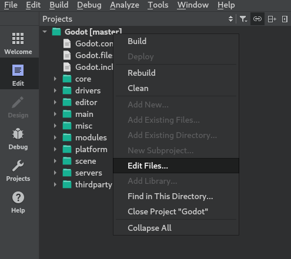

Now a new dialog should appear that is similar in functionality to the one in the third step
of the "Importing the project" section. Here you can check whether you want to add/remove
specific files and/or folders. You can chose by clicking with your mouse or just simply by
clicking the "Apply Filter" button. A simple click on "Ok" and you're ready to continue your work.

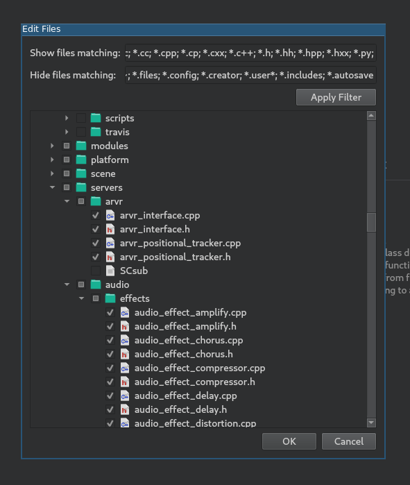

Code style configuration
^^^^^^^^^^^^^^^^^^^^^^^^

Developers must follow the project's :ref:`code style <doc_code_style_guidelines>`
and IDE should help them to do it. By default, Qt Creator does use spaces for indentation
which is incorrect for Godot project. You can change this behavior by
changing the "Code Style" in *Options* -> *C++*.

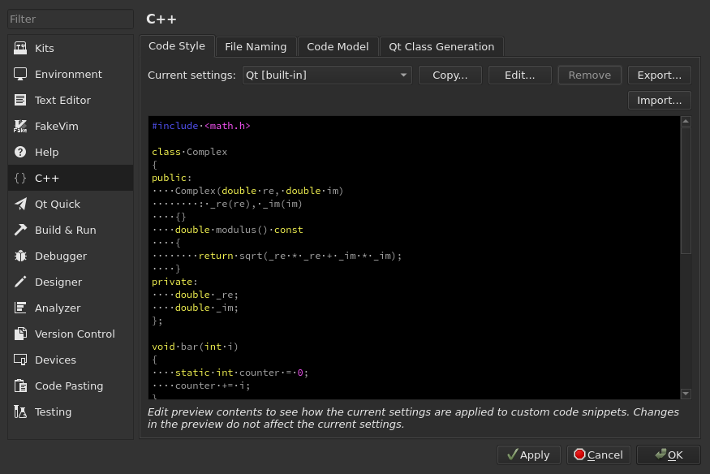

Click on *Edit* to change the current settings, then click on *Copy Built-in Code Style* button
to set a new code style. Set a name for it (e.g. Godot) and change the Tab policy
to be *Tabs Only*.

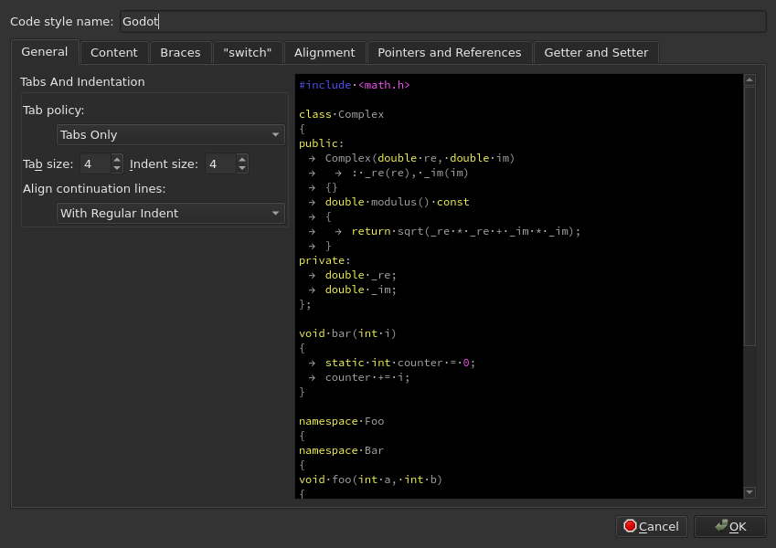

.. _doc_configuring_an_ide_kdevelop:

KDevelop
--------

`KDevelop <https://www.kdevelop.org>`_ is a free, open source IDE for all desktop platforms.

You can find a video tutorial `here <https://www.youtube.com/watch?v=yNVoWQi9TJA>`_.
Or you may follow this text version tutorial.

Start by opening KDevelop and choosing "open project".

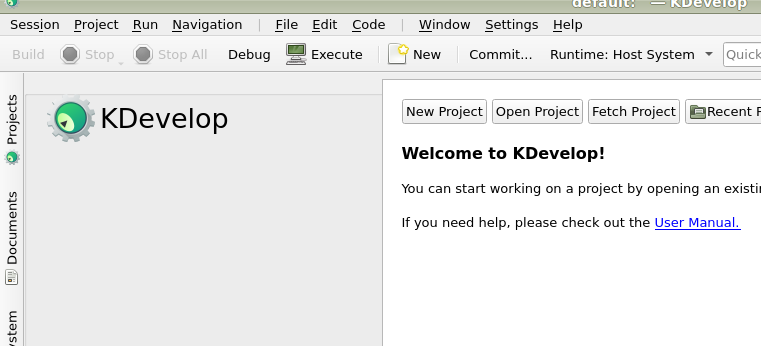

Choose the directory where you cloned Godot.

On the next screen, choose "Custom Build System" for the *Project manager*.

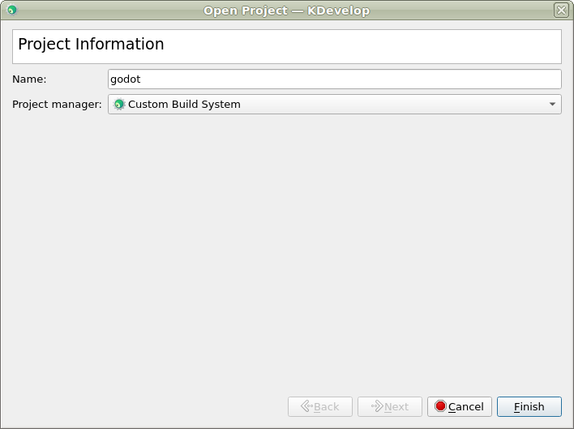

Now that the project has been imported, open the project configuration.

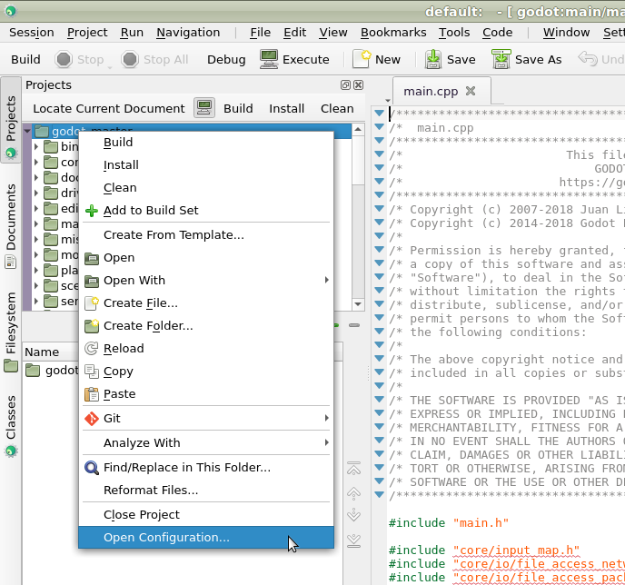

Add the following includes/imports:

::

    .  // a dot to indicate the root of the Godot project
    core/
    core/os/
    core/math/
    drivers/
    platform/x11/  // make that platform/osx/ if you're using macOS

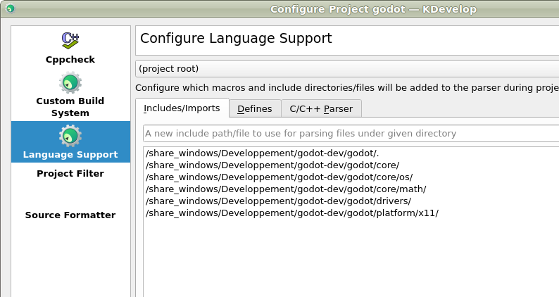

Apply the changes.

Switch to the "Custom Build System" tab. Add a build configuration
and keep the build directory blank. Enable build tools and add ``scons``
as the executable then add ``platform=x11 target=debug`` (``platform=osx``
if you're on macOS) as the arguments.

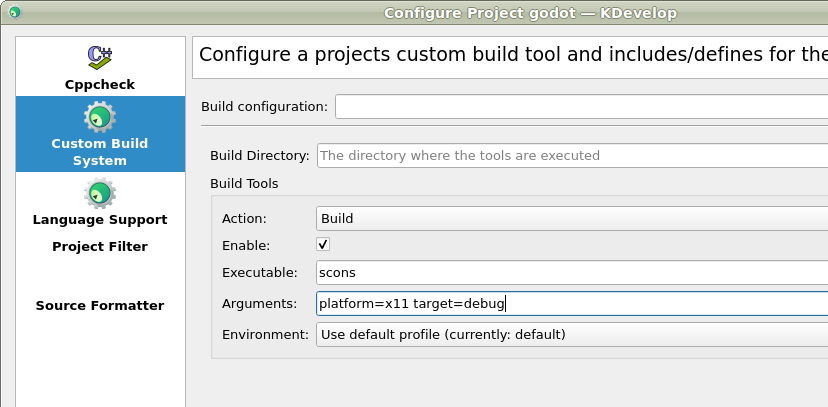

Next we need to tell KDevelop where to find the binary.
From the "Run" menu, choose "Configure Launches".

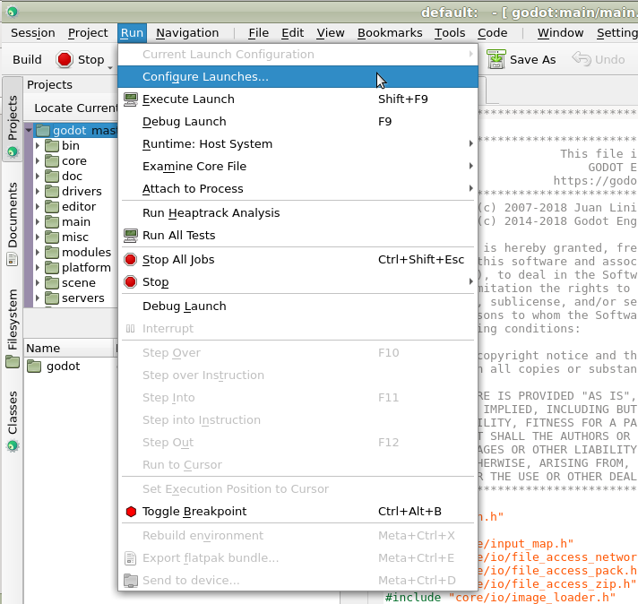

Click "Add" if no launcher exists. Then add the path to your
executable in the executable section. Your executable should be located
in the ``bin/`` sub-directory and should be named something like
``godot.x11.tools.64`` (the name could be different depending on your
platform and depending on your build options).

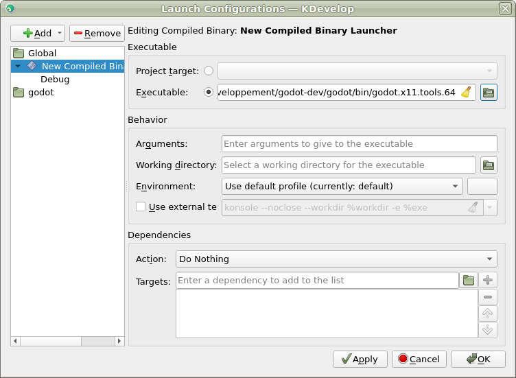

That's it! Now you should be good to go :)

.. _doc_configuring_an_ide_xcode:

Xcode
-----

Project setup
^^^^^^^^^^^^^

- Create an Xcode external build project anywhere

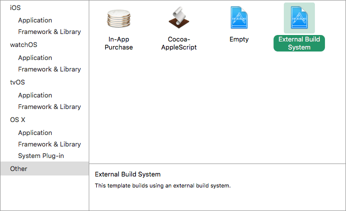

- Set the *Build tool* to the path to scons

Modify Build Target's Xcode Info Tab:

- Set *Arguments* to something like: platform=osx tools=yes bits=64 target=debug
- Set *Directory* to the path to Godot's source folder. Keep it blank if project is already there.
- You may uncheck *Pass build settings in environment*

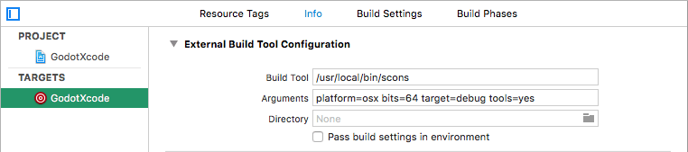

Add a Command Line Target:

- Go to Xcode File > New > Target... and add a new Xcode command line target

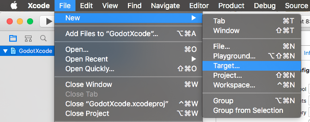

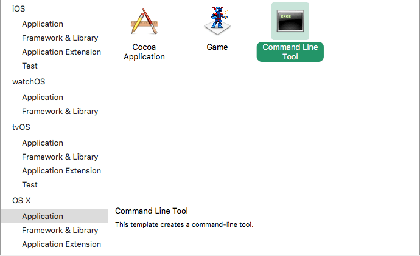

- Name it something so you know not to compile with this target
- e.g. ``GodotXcodeIndex``
- Goto the newly created target's *Build Settings* tab and search for *Header Search Paths*
- Set *Header Search Paths* to an absolute path to Godot's source folder
- Make it recursive by adding two \*'s to the end of the path
- e.g. ``/Users/me/repos/godot-source/\**``

Add Godot Source to the Project:

- Drag and drop Godot source into project file browser.
- Uncheck *Create External Build System*

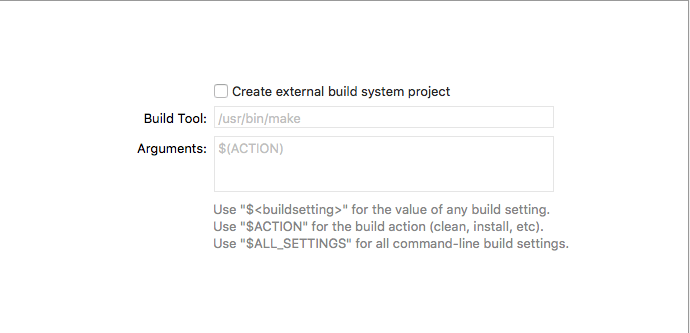

- Click Next
- Select *create groups*

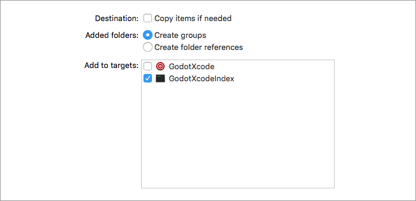

- Check off only your command line target in the *Add to targets* section
- Click finish. Xcode will now index the files.
- Grab a cup of coffee... Maybe make something to eat, too
- You should have jump to definition, auto completion, and full syntax highlighting when it is done.

Scheme setup
^^^^^^^^^^^^

Edit Build Scheme of External Build Target:

- Open scheme editor of external build target
- Expand the *Build* menu
- Goto *Post Actions*
- Add a new script run action, select your project in ``Provide build settings from`` as this allows you to use ``${PROJECT_DIR}`` variable.

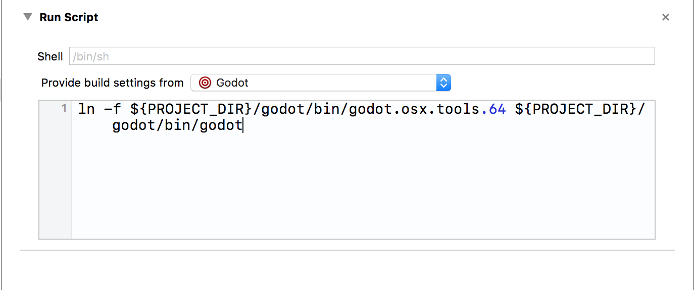

- Write a script that gives the binary a name that Xcode will recognize
- e.g. ``ln -f ${PROJECT_DIR}/godot/bin/godot.osx.tools.64 ${PROJECT_DIR}/godot/bin/godot``
- Build the external build target

Edit Run Scheme of External Build Target:

- Open the scheme editor again
- Click Run

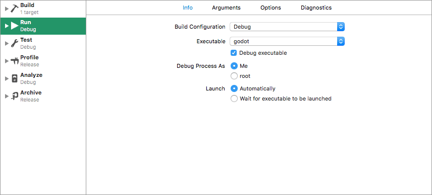

- Set the *Executable* to the file you linked in your post build action script
- Check *Debug executable* if it isn't already
- You can go to *Arguments* tab and add an -e and a -path to a project to debug the editor
  not the project selection screen

Test it:

- Set a breakpoint in platform/osx/godot_main_osx.mm
- It should break at the point!

.. _doc_configuring_an_ide_vscode:

Visual Studio Code
------------------

- Ensure that C/C++ extension is installed. You can find instructions in `docs <https://code.visualstudio.com/docs/languages/cpp>`_.

- Now open cloned godot folder in VS Code (File > Open Folder...)

In order to build the project, we need two configuration files: *launch.json* and *tasks.json*.
To create them:

- Open Debug view (Ctrl + Shift + D) and select cogwheel with an orange dot:

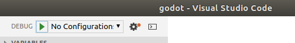

- Select *C++ (GDB/LLDB)* (it might be named differently on macOS or Windows)

- Update *launch.json* to match:

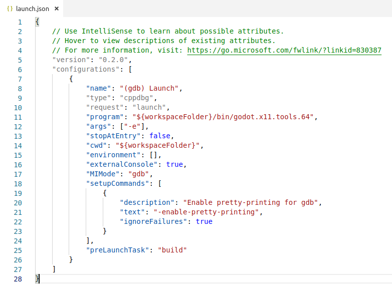

(Note that *godot.x11.tools.64* in "program" value might be named differently on macOS or Windows)

- Create *tasks.json* by starting the Debug process (F5). VS Code will show a dialog with a *Configure Task* button. Tap it and select *Create tasks.json file from template*, then select *Others*

- Update *tasks.json* to match:

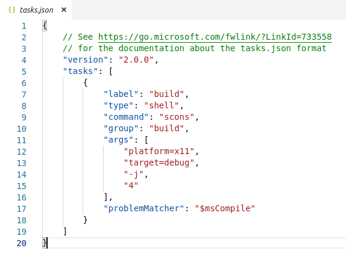

(Note that *platform=x11* will be different for macOX and Windows)

- You can now start the Debug process again to test that everything works.

- If the build phase fails, check the console for hints. On Linux it's most likely that some dependencies are missing. Check :ref:`Compiling for X11 (Linux, \*BSD) <doc_compiling_for_x11>`

.. _doc_configuring_an_ide_android_studio:

Android Studio
--------------

`Android Studio <https://developer.android.com/studio>`_ is a `Jetbrain <https://www.jetbrains.com/>`_ IDE for Android development. It has a feature-rich editor which supports Java and C/C++, so it can be used for development of the Godot core engine, and Android platform codebases.

Project setup
^^^^^^^^^^^^^

- From the Android Studio *Welcome to Android Studio* window, select *Open an existing Android Studio project*

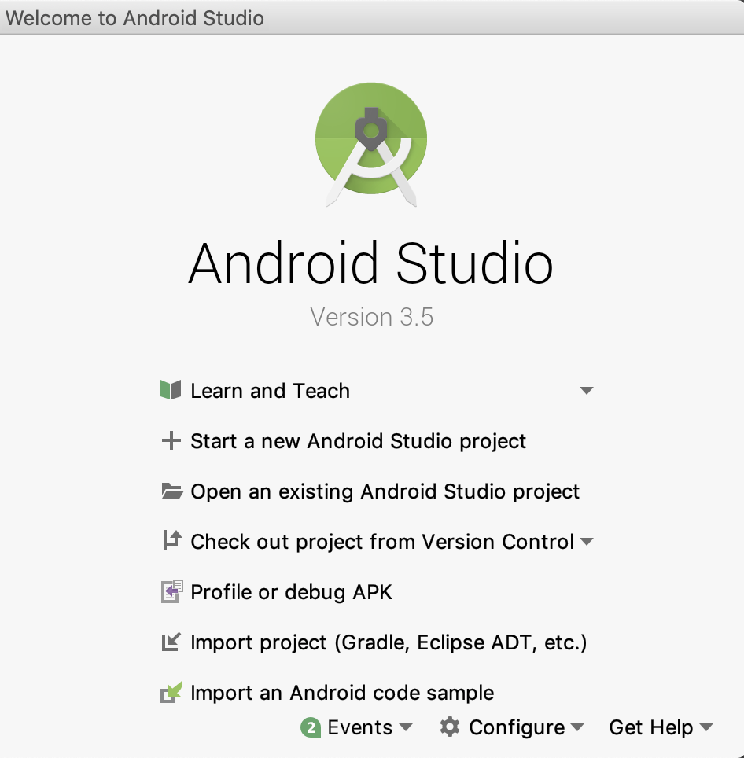

- Navigate to ``<godot root directory>/platform/android/java`` and select the ``settings.gradle`` gradle file.
- Android Studio will import and index the project.
- To build the project, follow the :ref:`compiling instructions <toc-devel-compiling>`.

.. _doc_configuring_an_ide_clion:

CLion
-----

`CLion <https://www.jetbrains.com/clion/>`_ is a commercial IDE for C++. It requires a ``CMakeLists.txt`` file as a project file, which is problematic for Godot which uses the SCons buildsystem and not CMake. However, there is a ``CMakeLists.txt`` configuration for :ref:`Android Studio <doc_configuring_an_ide_android_studio>` which can also be used by CLion.

- Choose *File* -> *Open*.

- Navigation to your Godot Git clone, and select the folder ``platform/android/java/lib`` (the ``CMakeLists.txt`` file is located there). Select the folder, not the ``CMakeLists.txt file``. Then click *Ok*.

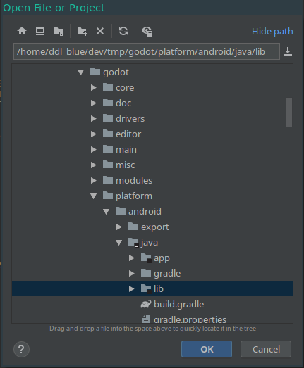

- If this popup window appears, select *This window* to open the project.

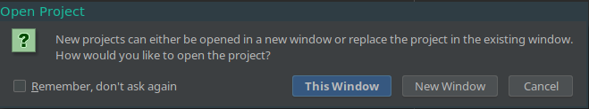

- Choose *Tools* -> *CMake* -> *Change Project Root* and select the root Godot folder.

.. image:: img/clion_3_change_project_root.png

- You should be now be able to see all the project files. Autocomplete should work, when the project finish indexing.
