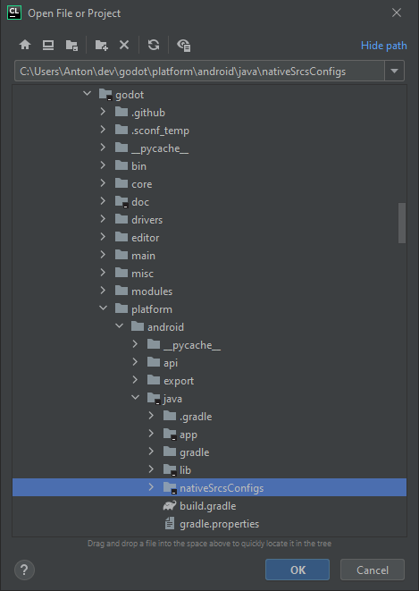
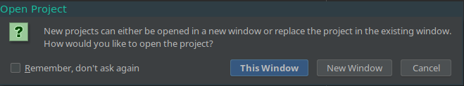
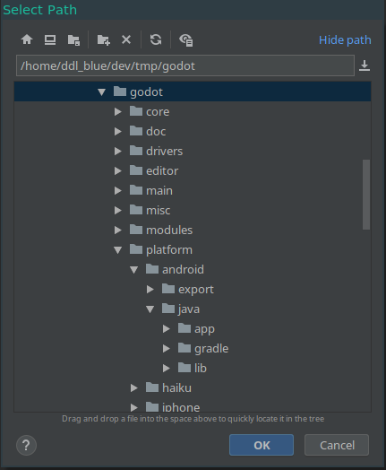

.. _doc_configuring_an_ide_clion:

CLion
=====

`CLion <https://www.jetbrains.com/clion/>`_ is a commercial 
`JetBrains <https://www.jetbrains.com/>`_ IDE for C++.

Importing the project
---------------------

CLion requires a ``CMakeLists.txt`` file as a project file, which is problematic
for Godot because it uses the SCons buildsystem instead of CMake. However, 
there is a ``CMakeLists.txt`` configuration for :ref:`Android Studio <doc_configuring_an_ide_android_studio>` 
which can also be used by CLion.

- From the CLion's welcome window choose the option to import an existing 
  project. If you've already opened another project, choose **File > Open**
  from the top menu.
- Navigate to ``<Godot root directory>/platform/android/java/lib`` (the 
  ``CMakeLists.txt`` file is located there) and select it (but *not* the
  ``CMakeLists.txt`` file itself), then click **OK**.

   The folder containing the ``CMakeLists.txt`` file.

- If this popup window appears, select **This Window** to open the project:

- Choose **Tools > CMake > Change Project Root** from the top menu and select 
  the Godot root folder.

- You should be now be able to see all the project files. Autocomplete should
  work once the project has finished indexing.

If you run into any issues, ask for help in one of
`Godot's community channels <https://godotengine.org/community>`__.
