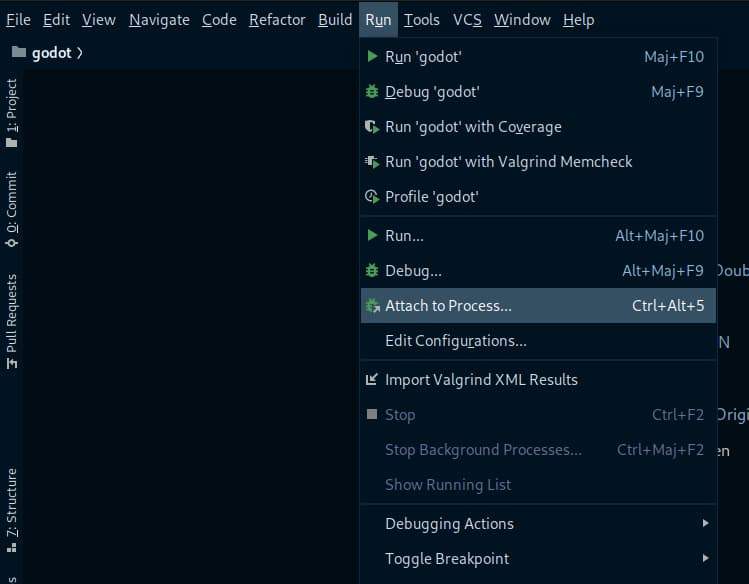
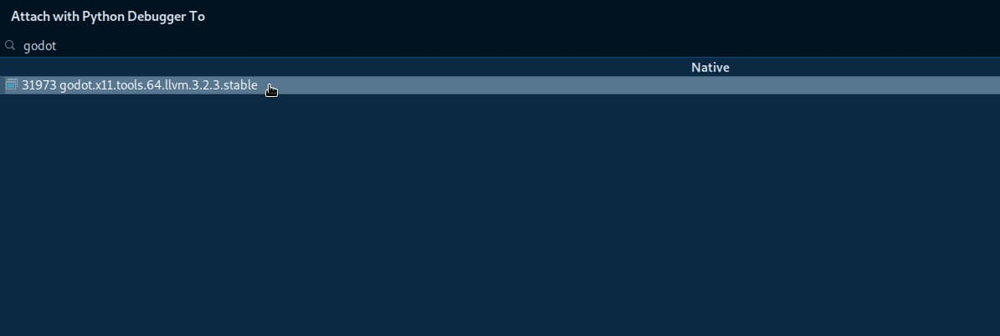

.. _doc_configuring_an_ide_clion:

CLion
=====

`CLion <https://www.jetbrains.com/clion/>`_ is a commercial 
`JetBrains <https://www.jetbrains.com/>`_ IDE for C++.

Importing the project
---------------------

CLion requires a ``CMakeLists.txt`` file as a project file, which is problematic
for Godot because it uses the SCons buildsystem instead of CMake. However, 
there is a ``CMakeLists.txt`` configuration for :ref:`Android Studio <doc_configuring_an_ide_android_studio>` 
which can also be used by CLion.

- From the CLion's welcome window choose the option to import an existing 
  project. If you've already opened another project, choose **File > Open**
  from the top menu.
- Navigate to ``<Godot root directory>/platform/android/java/nativeSrcsConfigs`` (the
  ``CMakeLists.txt`` file is located there) and select it (but *not* the
  ``CMakeLists.txt`` file itself), then click **OK**.

.. figure:: img/clion_1_open.png
   :align: center

   The folder containing the ``CMakeLists.txt`` file.

- If this popup window appears, select **This Window** to open the project:

.. figure:: img/clion_2_this_window.png
   :align: center

- Choose **Tools > CMake > Change Project Root** from the top menu and select 
  the Godot root folder.

.. figure:: img/clion_3_change_project_root.png
   :align: center

- You should be now be able to see all the project files. Autocomplete should
  work once the project has finished indexing.

If you run into any issues, ask for help in one of
`Godot's community channels <https://godotengine.org/community>`__.

Debugging the project
---------------------

Since CLion does not support SCons, you won't be able to compile, launch, and debug Godot from CLion in one step.
You will first need to `compile godot yourself <https://docs.godotengine.org/en/stable/development/compiling/index.html>`__ and run the binary without CLion. You will then be able to debug Godot by using the `Attach to process <https://www.jetbrains.com/help/clion/attaching-to-local-process.html>`__ feature.

- Run the compilation in debug mode by entering ``scons``.

- Run the binary you have created (in the bin directory). If you want to debug a specific project, run the binary with the following arguments : ``--editor --path path/to/your/godot/project``. To run the project instead of editing it, remove the ``--editor`` argument.

- In CLion, go to **Run > Attach to Process...**

- Find and Select godot in the list (or type the binary name/Process ID)

You can now use the debugging tools from CLion.

.. note::

    If you run the binary without any arguments, you will only debug the project manager window.
    Don't forget to add the ``--path path/to/your/godot/project`` argument to debug a project.
