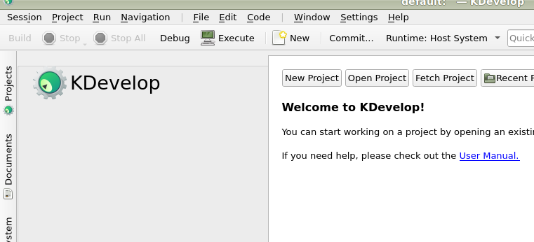
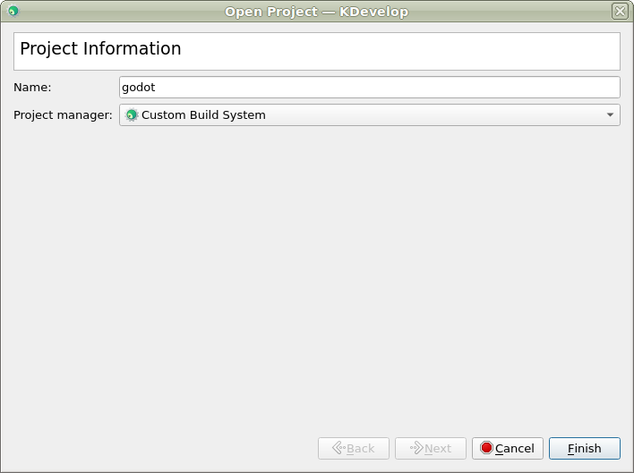
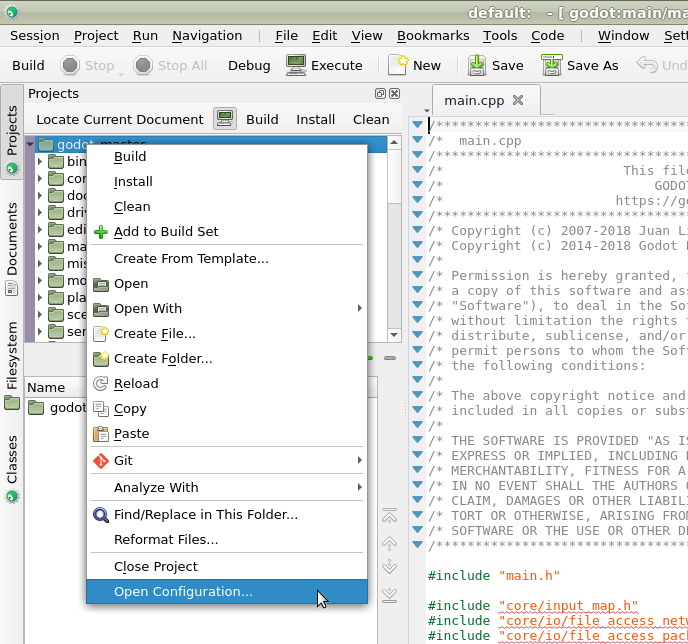
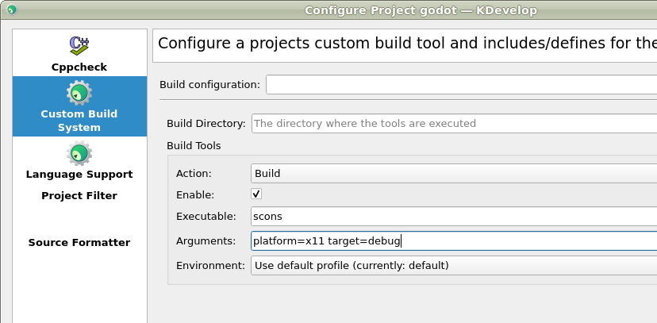
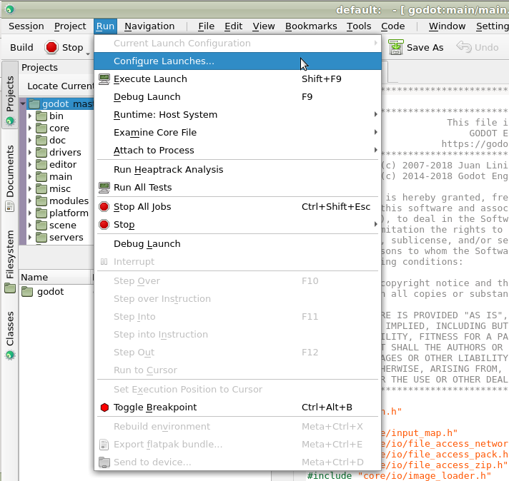
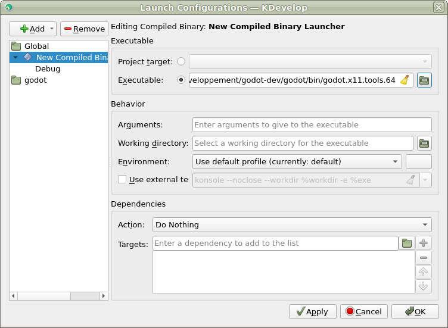

.. _doc_configuring_an_ide_kdevelop:

KDevelop
========

`KDevelop <https://www.kdevelop.org>`_ is a free, open source IDE for all desktop platforms.

Start by opening KDevelop and choosing **Open Project**.

Choose the directory where you cloned Godot.

On the next screen, choose **Custom Build System** for the **Project Manager**.

Now that the project has been imported, open the project configuration.

Add the following includes/imports:

.. code-block:: none

    .  // a dot to indicate the root of the Godot project
    core/
    core/os/
    core/math/
    drivers/
    platform/linuxbsd/  // make that platform/osx/ if you're using macOS

.. image:: img/kdevelop_addincludes.png

Apply the changes.

Switch to the **Custom Build System** tab. Add a build configuration
and keep the build directory blank. Enable build tools and add ``scons``
as the executable then add ``platform=linuxbsd target=debug`` (``platform=osx``
if you're on macOS) as the arguments.

Next, we need to tell KDevelop where to find the binary.
From the **Run** menu, choose **Configure Launches**.

Click **Add** if no launcher exists. Then add the path to your
executable in the executable section. Your executable should be located
in the ``bin/`` subdirectory and should be named something like
``godot.linuxbsd.tools.64`` (the name could be different depending on your
platform and build options).

If you run into any issues, ask for help in one of
`Godot's community channels <https://godotengine.org/community>`__.
