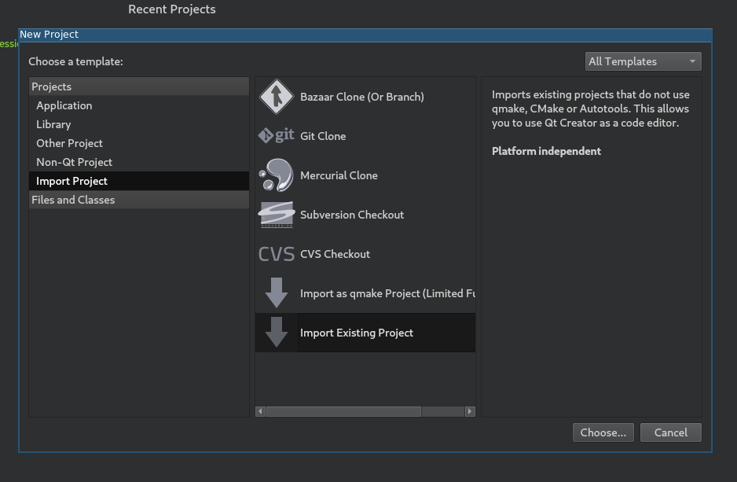
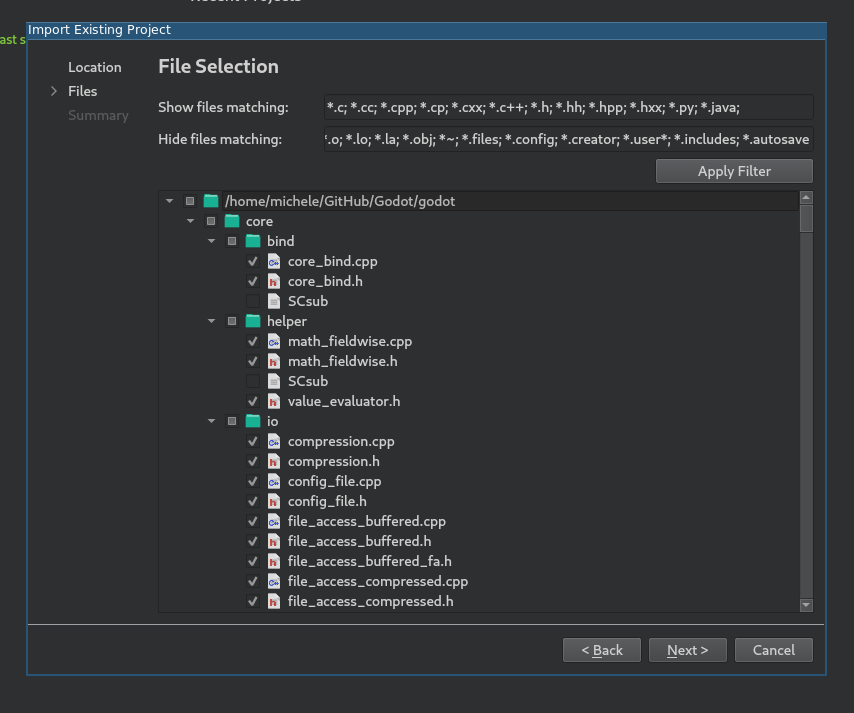
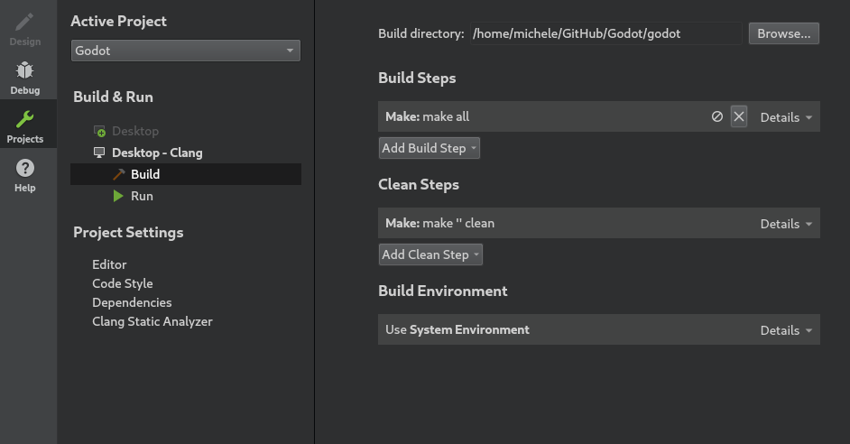
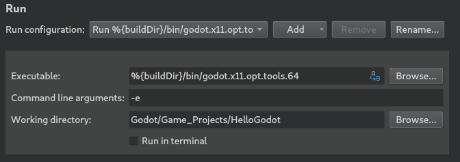
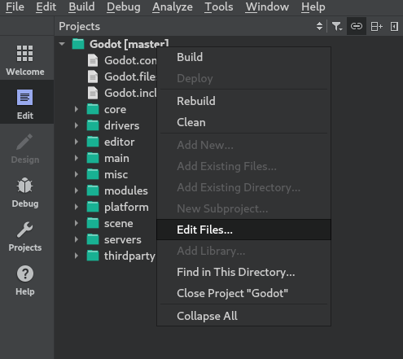

.. _doc_configuring_an_ide_qtcreator:

Qt Creator
==========

Qt Creator is a free, open source IDE for all desktop platforms.

Importing the project
---------------------

- Choose **New Project > Import Project > Import Existing Project**.

- Set the path to your Godot root directory and enter the project name.

.. image:: img/qtcreator-set-project-path.png

- Here you can choose which folders and files will be visible to the project.
  C/C++ files are added automatically. Potentially useful additions:
  ``*.py`` for buildsystem files, ``*.java`` for Android platform development,
  ``*.mm`` for macOS platform development. Click **Next**.

- Click **Finish**.
- Add a line containing ``.`` to ``project_name.includes`` to get working
  code completion.

.. image:: img/qtcreator-project-name-includes.png

Build and run
--------------

Build configuration:

- Click on **Projects** and open the **Build** tab.
- Delete the predefined ``make`` build step.

-  Click **Add Build Step > Custom Process Step**.

.. image:: img/qtcreator-add-custom-process-step.png

- Type ``scons`` in the **Command** field. If it fails with
  ``Could not start process "scons"``, it can mean that ``scons`` is not in
  your ``PATH`` environment variable. In this case, you'll have to specify the
  full path to the SCons binary.
- Fill the **Arguments** field with your compilation options
  (e.g.: ``p=linuxbsd target=debug -j 4``).

.. image:: img/qtcreator-set-scons-command.png

Run configuration:

- Open the **Run** tab.
- Point the **Executable** to your compiled Godot binary
  (e.g: ``%{buildDir}/bin/godot.linuxbsd.opt.tools.64``).
- If you want to run a specific project, point **Working directory** to the
  project folder.
- If you want to run the editor, add ``-e`` to the **Command line arguments**
  field.

Updating sources after pulling latest commits
---------------------------------------------

As a developer, you usually want to frequently pull the latest commits from the
upstream Git repository or a specific fork. However, this brings a problem with
it: as the development continues, source files (and folders) are added or
removed. These changes need to be reflected in your project files for Qt Creator
too, so you continue to have a nice programming experience. A simple way to
check is to right click at your root folder in the **Projects View** and click
on **Edit files...**.

Now a new dialog should appear that is similar in functionality to the one in
the third step of the *Importing the project* section above. Here, you can check
whether you want to add/remove specific files and/or folders. You can choose by
clicking with your mouse or just simply by clicking the **Apply Filter** button.
Click on **OK** and you're ready to continue working.

.. image:: img/qtcreator-edit-files-dialog.png

Code style configuration
------------------------

Developers must follow the project's :ref:`code style <doc_code_style_guidelines>`
and the IDE should help them follow it. By default, Qt Creator does use spaces
for indentation which doesn't match the Godot code style guidelines. You can
change this behavior by changing the **Code Style** in **Options > C++**.

.. image:: img/qtcreator-options-cpp.png

Click on **Edit** to change the current settings, then click on
**Copy Built-in Code Style** button to set a new code style. Set a name for it
(e.g. Godot) and change the Tab policy to be **Tabs Only**.

.. image:: img/qtcreator-edit-codestyle.png

If you run into any issues, ask for help in one of
`Godot's community channels <https://godotengine.org/community>`__.
