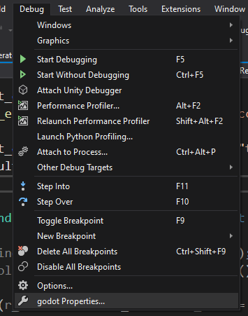
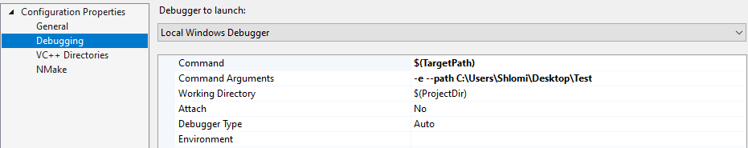
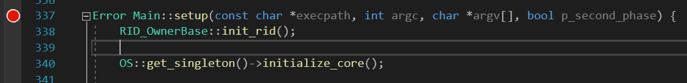

.. _doc_configuring_an_ide_vs:

Visual Studio
=============

Visual Studio Community is a Windows-only IDE that's free for non-commercial use.
It has many useful features, such as memory view, performance view, source
control and more. You can get it
`from Microsoft <https://visualstudio.microsoft.com/downloads/>`__.

Setup
-----

To start developing with Visual Studio, follow these steps:

- Open the Visual Studio Installer and install the C++ package:

.. image:: img/vs_1_install_cpp_package.png

- Open a Command Prompt or PowerShell window, use ``cd`` to reach the Godot source
  directory and run ``scons platform=windows vsproj=yes``.

- Now open the Godot folder by clicking **Open a project or solution** and choose
  ``godot.sln``.
  - You can also double-click the ``godot.sln`` file in Explorer.

You can now start developing with Visual Studio.

Debugging
---------

Visual Studio features a powerful debugger. This allows the user to examine Godot's
source code, stop at specific points in the code, make changes, and view them on the run.

.. note:: Debugging the Godot Engine inside the editor will require an extra setup step.

          Because opening Godot opens the Project Manager at first instead of the project
          you're working on, the debugger will detach as soon as you open a project.
          This means that the debugger will stop, even though Godot is still running in
          another process.

To overcome this, you need to edit the debugging command line arguments in VS. In your
project, click **Project > Project Properties**:

Then add this to the command arguments:

- The ``-e`` flag is for entering the editor directly (which skips the Project Manager).
- The ``--path`` argument should be an *absolute* path to a project directory (not a
  `project.godot` file).

To learn more about command line arguments, refer to the
:ref:`command line tutorial <doc_command_line_tutorial>`.

To check that everything is working, put a breakpoint in ``main.cpp`` and press F5 to
start debugging.

If you run into any issues, ask for help in one of
`Godot's community channels <https://godotengine.org/community>`__.
