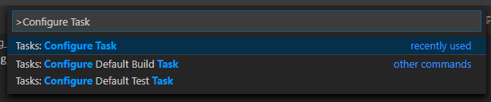
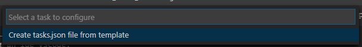
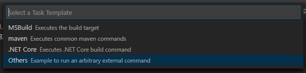
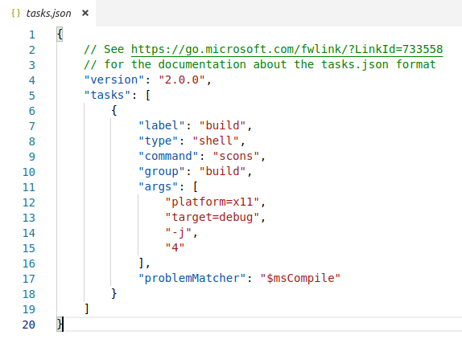
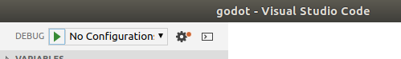
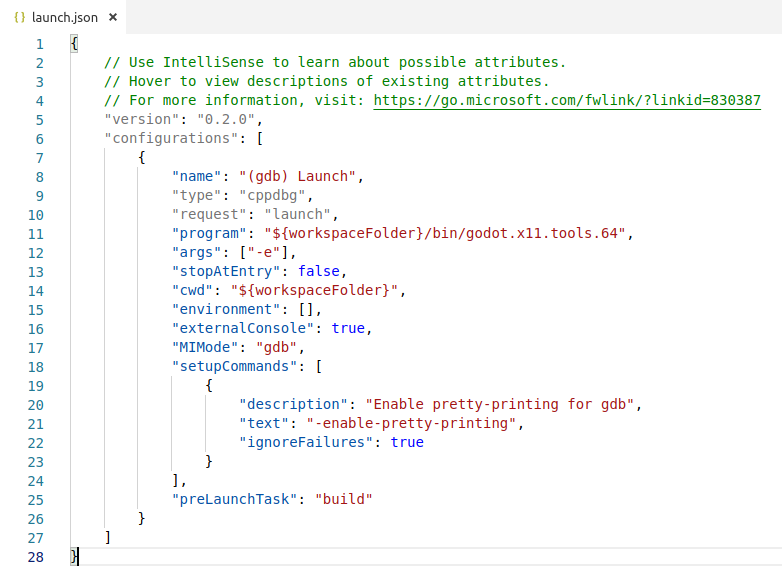

.. _doc_configuring_an_ide_vscode:

Visual Studio Code
==================

`Visual Studio Code <https://code.visualstudio.com>`_ is a free cross-platform IDE 
by `Microsoft <https://microsoft.com>`_ (not to be confused with :ref:`doc_configuring_an_ide_vs`).

Importing the project
---------------------

- Make sure the C/C++ extension is installed. You can find instructions in
  the `official documentation <https://code.visualstudio.com/docs/languages/cpp>`_.
- From the Visual Studio Code's main screen open the Godot root folder with
  **File > Open Folder...**.
- Press :kbd:`Ctrl + Shift + P` to open the command prompt window and enter *Configure Task*.

- Select the **Create tasks.json file from template** option.

- Then select **Others**.

- Within the ``tasks.json`` file find the ``"tasks"`` array and add a new section to it:

.. code-block:: js

  {
    "label": "build",
    "type": "shell",
    "command": "scons",
    "group": "build",
    "args": [
      "platform=x11", // Change to your current platform
      "target=debug",
      "-j4"
    ],
    "problemMatcher": "$msCompile"
  }

   An example of a filled out ``tasks.json``.

Arguments are can be different based on your own setup and needs. See 
:ref:`doc_introduction_to_the_buildsystem` for a full list of arguments.

Debugging the project
---------------------

To run and debug the project you need to create a new configuration in the ``launch.json`` file.

- Press :kbd:`Ctrl + Shift + D` to open the Run panel.
- If ``launch.json`` file is missing you will be prompted to create a new one.

- Select **C++ (GDB/LLDB)**. There may be another platform specific option here. If selected,
  adjust the configuration example provided accordingly.
- Within the ``launch.json`` file find the ``"configurations"`` array and add a new section to it:

.. code-block:: js

  {
    "name": "Launch",
    "type": "cppdbg",
    "request": "launch",
    "program": "${workspaceFolder}/bin/godot.x11.tools.64",
                                      // Change to your current platform
    "args": [ "-e" ],
    "stopAtEntry": false,
    "cwd": "${workspaceFolder}",
    "environment": [],
    "externalConsole": true,
    "MIMode": "gdb",
    "setupCommands": [
      {
        "description": "Enable pretty-printing for gdb",
        "text": "-enable-pretty-printing",
        "ignoreFailures": true
      }
    ],
    "preLaunchTask": "build"
  }

   An example of a filled out ``launch.json``.

The name under ``program`` depends on your build configuration,
e.g. ``godot.x11.tools.64`` for 64-bit X11 platform with ``tools`` enabled.

If you run into any issues, ask for help in one of
`Godot's community channels <https://godotengine.org/community>`__.
