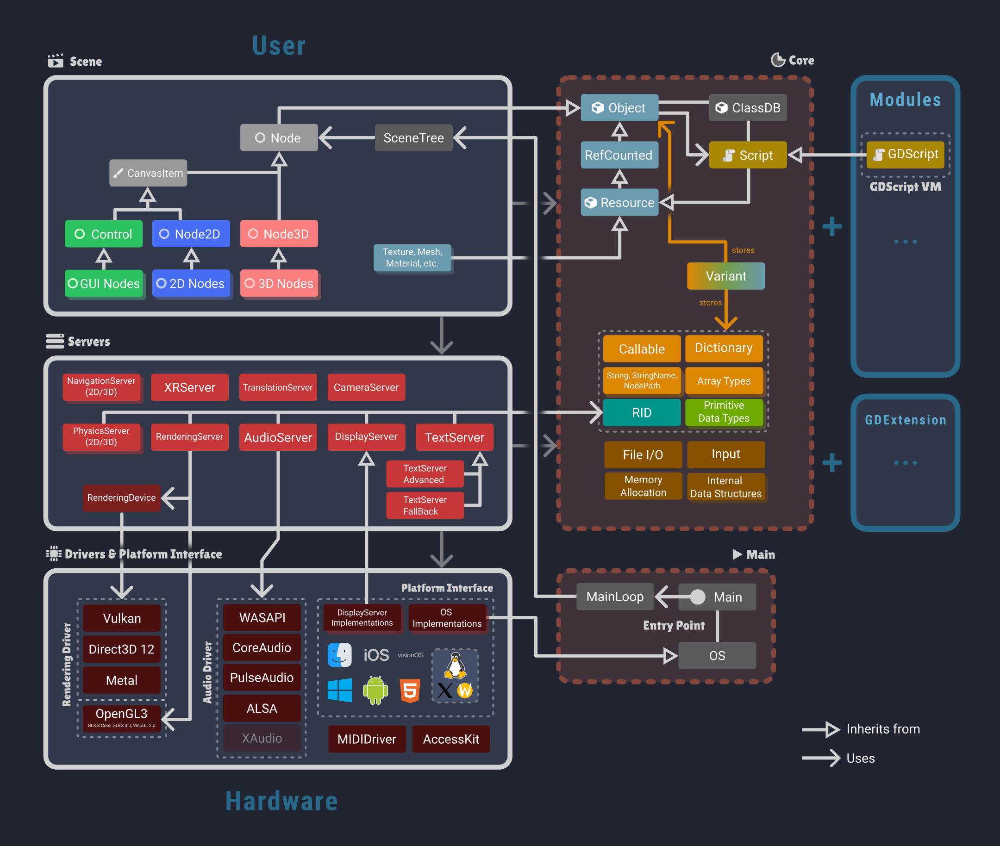

.. _doc_godot_architecture_diagram:

Godot's architecture overview
=============================

The following diagram describes the most important aspects of Godot's architecture.
It's not designed to be exhaustive, with the purpose of just giving a high-level overview of
the main components and their relationships to each other.

   Credit: `Hendrik Brucker <https://github.com/Geometror/godot-architecture-diagram>`__

Scene Layer
~~~~~~~~~~~

The Scene layer is the highest level of Godot's architecture, providing the scene system, which is the main way to build and structure your applications or games.
See :ref:`class_SceneTree` / :ref:`doc_scene_tree` and :ref:`class_Node` for more information.

Corresponding source code: `/scene/* <https://github.com/godotengine/godot/tree/master/scene>`__

Server Layer
~~~~~~~~~~~~

Server components implement most of Godot's subsystems (rendering, audio, physics, etc.). They are singleton objects initialized at engine startup.

`Why does Godot use servers and RIDs? <https://godotengine.org/article/why-does-godot-use-servers-and-rids>`__

Corresponding source code: `/servers/* <https://github.com/godotengine/godot/tree/master/servers>`__

Drivers / Platform Interface
~~~~~~~~~~~~~~~~~~~~~~~~~~~~

This layer abstracts low-level platform-specific details, containing drivers for graphics APIs, audio backends and operating system interfaces
(all platform-specific :ref:`class_OS` and :ref:`class_DisplayServer` implementations).

Corresponding source code: `/drivers/* <https://github.com/godotengine/godot/tree/master/drivers>`__ and `/platform/* <https://github.com/godotengine/godot/tree/master/platform>`__

Core
~~~~

The Engine's core contains essential functionality and data structures used throughout the engine,
like :ref:`class_Object` and :ref:`class_ClassDB`, :ref:`memory management <doc_core_types>`, :ref:`containers <doc_core_types>`, file I/O, :ref:`Variant <doc_variant_class>`, and :ref:`other utilities <doc_common_engine_methods_and_macros>`.

Corresponding source code: `/core/* <https://github.com/godotengine/godot/tree/master/core>`__

Main
~~~~

The Main component is responsible for initializing and managing the engine lifecycle, including startup, shutdown, and the main loop. See :ref:`class_MainLoop` for more details.

Corresponding source code: `/main/* <https://github.com/godotengine/godot/tree/master/main>`__

