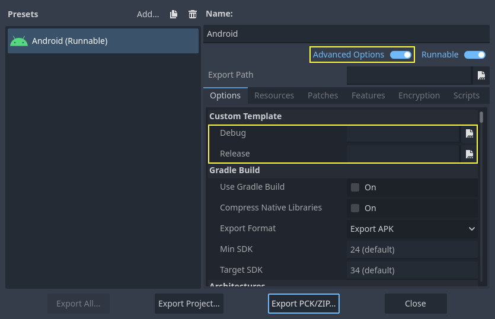

.. _doc_compiling_for_android:

Compiling for Android
=====================

.. highlight:: shell

.. seealso::

    This page describes how to compile Android export template binaries from source.
    If you're looking to export your project to Android instead, read :ref:`doc_exporting_for_android`.

Note
----

In most cases, using the built-in deployer and export templates is good
enough. Compiling the Android APK manually is mostly useful for custom
builds or custom packages for the deployer.

Also, you still need to follow the steps mentioned in the
:ref:`doc_exporting_for_android` tutorial before attempting to build
a custom export template.

Requirements
------------

For compiling under Windows, Linux or macOS, the following is required:

- `Python 3.8+ <https://www.python.org/downloads/>`_.
- `SCons 4.0+ <https://scons.org/pages/download.html>`_ build system.
- `Android SDK <https://developer.android.com/studio/#command-tools>`_
  (command-line tools are sufficient).

   - Required SDK components will be automatically installed.
   - On Linux, **do not use an Android SDK provided by your distribution's repositories** as it will often be outdated.
   - On macOS, **do not use an Android SDK provided by Homebrew** as it will not be installed in a unified location.

- Gradle (will be downloaded and installed automatically if missing).
- JDK 17 (either OpenJDK or Oracle JDK).

   - You can download a build from `Adoptium <https://adoptium.net/temurin/releases/?variant=openjdk17>`_.

.. seealso:: To get the Godot source code for compiling, see
             :ref:`doc_getting_source`.

             For a general overview of SCons usage for Godot, see
             :ref:`doc_introduction_to_the_buildsystem`.

.. _doc_android_setting_up_the_buildsystem:

Setting up the buildsystem
--------------------------

-  Set the environment variable ``ANDROID_HOME`` to point to the Android
   SDK. If you downloaded the Android command-line tools, this would be
   the folder where you extracted the contents of the ZIP archive.

    -  Windows: Press :kbd:`Windows + R`, type "control system",
       then click on **Advanced system settings** in the left pane,
       then click on **Environment variables** on the window that appears.

    -  Linux or macOS: Add the text ``export ANDROID_HOME="/path/to/android-sdk"``
       to your ``.bashrc`` or ``.zshrc`` where ``/path/to/android-sdk`` points to
       the root of the SDK directories.

-  Install the necessary SDK components in this folder:

    -  Accept the SDK component licenses by running the following command
       where ``android_sdk_path`` is the path to the Android SDK, then answering all the prompts with ``y``:

    ::

        cmdline-tools/latest/bin/sdkmanager --sdk_root=<android_sdk_path> --licenses

    -  Complete setup by running the following command where ``android_sdk_path`` is the path to the Android SDK.

    ::

        cmdline-tools/latest/bin/sdkmanager --sdk_root=<android_sdk_path> "platform-tools" "build-tools;35.0.0" "platforms;android-35" "cmdline-tools;latest" "cmake;3.10.2.4988404" "ndk;28.1.13356709"

-  After setting up the SDK and environment variables, be sure to
   **restart your terminal** to apply the changes. If you are using
   an IDE with an integrated terminal, you need to restart the IDE.

-  Run ``scons platform=android``. If this fails, go back and check the steps.
   If you completed the setup correctly, the NDK will begin downloading.
   If you are trying to compile GDExtension, you need to first compile
   the engine to download the NDK, then you can compile GDExtension.

Building the export templates
-----------------------------

Godot needs three export templates for Android: the optimized "release"
template (``android_release.apk``), the debug template (``android_debug.apk``),
and the Gradle build template (``android_source.zip``).
As Google requires all APKs to include ARMv8 (64-bit) libraries since August 2019,
the commands below build templates containing both ARMv7 and ARMv8 libraries.

Compiling the standard export templates is done by calling SCons from the Godot
root directory with the following arguments:

-  Release template (used when exporting with **Debugging Enabled** unchecked)

::

    scons platform=android target=template_release arch=arm32
    scons platform=android target=template_release arch=arm64 generate_android_binaries=yes

-  Debug template (used when exporting with **Debugging Enabled** checked)

::

    scons platform=android target=template_debug arch=arm32
    scons platform=android target=template_debug arch=arm64 generate_android_binaries=yes

- (**Optional**) Dev template (used when troubleshooting)

::

    scons platform=android target=template_debug arch=arm32 dev_build=yes
    scons platform=android target=template_debug arch=arm64 dev_build=yes generate_android_binaries=yes

The resulting templates will be located under the ``bin`` directory:

- ``bin/android_release.apk`` for the release template
- ``bin/android_debug.apk`` for the debug template
- ``bin/android_dev.apk`` for the dev template
- ``bin/android_source.zip`` for the Gradle build template

.. note::

   - If you are changing the list of architectures you're building, remember to add ``generate_android_binaries=yes`` to the *last* architecture you're building, so that the template files are generated after the build.

   - To include debug symbols in the generated templates, add the ``debug_symbols=yes`` parameters to the SCons command.

       - Note that you can include ``separate_debug_symbols=yes`` to generate the debug symbols in a separate ``*-native-debug-symbols.zip`` file.

.. seealso::

    If you want to enable Vulkan validation layers, see
    :ref:`Vulkan validation layers on Android <doc_vulkan_validation_layers_android>`.

Adding support for x86 devices
~~~~~~~~~~~~~~~~~~~~~~~~~~~~~~

If you also want to include support for x86 and x86_64 devices, run the SCons
command a third and fourth time with the ``arch=x86_32``, and
``arch=x86_64`` arguments before building the APK with Gradle. For
example, for the release template:

::

    scons platform=android target=template_release arch=arm32
    scons platform=android target=template_release arch=arm64
    scons platform=android target=template_release arch=x86_32
    scons platform=android target=template_release arch=x86_64 generate_android_binaries=yes

This will create template binaries that works on all platforms.
The final binary size of exported projects will depend on the platforms you choose
to support when exporting; in other words, unused platforms will be removed from
the binary.

Cleaning the generated export templates
~~~~~~~~~~~~~~~~~~~~~~~~~~~~~~~~~~~~~~~

You can use the following commands to remove the generated export templates:

::

    cd platform/android/java
    # On Windows
    .\gradlew clean
    # On Linux and macOS
    ./gradlew clean

Using the export templates
--------------------------

Godot needs release and debug binaries that were compiled against the same
version/commit as the editor. If you are using official binaries
for the editor, make sure to install the matching export templates,
or build your own from the same version.

When exporting your game, Godot uses the templates as a base, and updates their content as needed.

Installing the templates
~~~~~~~~~~~~~~~~~~~~~~~~

The newly-compiled templates (``android_debug.apk``
, ``android_release.apk``, and ``android_source.zip``) must be copied to Godot's templates folder
with their respective names. The templates folder can be located in:

-  Windows: ``%APPDATA%\Godot\export_templates\<version>\``
-  Linux: ``$HOME/.local/share/godot/export_templates/<version>/``
-  macOS: ``$HOME/Library/Application Support/Godot/export_templates/<version>/``

``<version>`` is of the form ``major.minor[.patch].status`` using values from
``version.py`` in your Godot source repository (e.g. ``4.1.3.stable`` or ``4.2.dev``).
You also need to write this same version string to a ``version.txt`` file located
next to your export templates.

.. TODO: Move these paths to a common reference page

However, if you are writing your custom modules or custom C++ code, you
might instead want to configure your template binaries as custom export templates
in the project export menu. You must have **Advanced Options** enabled to set this.

You don't even need to copy them, you can just reference the resulting
file in the ``bin\`` directory of your Godot source folder, so that the
next time you build you will automatically have the custom templates
referenced.

Building the Godot editor
-------------------------

Compiling the editor is done by calling SCons from the Godot
root directory with the following arguments:

::

   scons platform=android arch=arm32 production=yes target=editor
   scons platform=android arch=arm64 production=yes target=editor
   scons platform=android arch=x86_32 production=yes target=editor
   scons platform=android arch=x86_64 production=yes target=editor generate_android_binaries=yes

- You can add the ``dev_build=yes`` parameter to generate a dev build of the Godot editor.

- You can add the ``debug_symbols=yes`` parameters to include the debug symbols in the generated build.

    - Note that you can include ``separate_debug_symbols=yes`` to generate the debug symbols in a separate ``*-native-debug-symbols.zip`` file.

- You can skip certain architectures depending on your target device to speed up compilation.

Remember to add ``generate_android_binaries=yes`` to the *last* architecture you're building, so that binaries are generated after the build.

The resulting binaries will be located under ``bin/android_editor_builds/``.

Removing the Editor binaries
----------------------------

You can use the following commands to remove the generated editor binaries:

::

    cd platform/android/java
    # On Windows
   .\gradlew clean
   # On Linux and macOS
   ./gradlew clean

Installing the Godot editor APK
-------------------------------

With an Android device with Developer Options enabled, connect the Android device to your computer via its charging cable to a USB/USB-C port.
Open up a Terminal/Command Prompt and run the following commands from the root directory with the following arguments:

::

   adb install ./bin/android_editor_builds/android_editor-release.apk

Troubleshooting
---------------

Platform doesn't appear in SCons
~~~~~~~~~~~~~~~~~~~~~~~~~~~~~~~~

Double-check that you've set the ``ANDROID_HOME``
environment variable. This is required for the platform to appear in SCons'
list of detected platforms.
See :ref:`Setting up the buildsystem <doc_android_setting_up_the_buildsystem>`
for more information.

Application not installed
~~~~~~~~~~~~~~~~~~~~~~~~~

Android might complain the application is not correctly installed.
If so:

-  Check that the debug keystore is properly generated.
-  Check that the jarsigner executable is from JDK 8.

If it still fails, open a command line and run `logcat <https://developer.android.com/studio/command-line/logcat>`_:

::

    adb logcat

Then check the output while the application is installed;
the error message should be presented there.
Seek assistance if you can't figure it out.

Application exits immediately
~~~~~~~~~~~~~~~~~~~~~~~~~~~~~

If the application runs but exits immediately, this might be due to
one of the following reasons:

-  Make sure to use export templates that match your editor version; if
   you use a new Godot version, you *have* to update the templates too.
-  ``libgodot_android.so`` is not in ``libs/<arch>/``
   where ``<arch>`` is the device's architecture.
-  The device's architecture does not match the exported one(s).
   Make sure your templates were built for that device's architecture,
   and that the export settings included support for that architecture.

In any case, ``adb logcat`` should also show the cause of the error.
