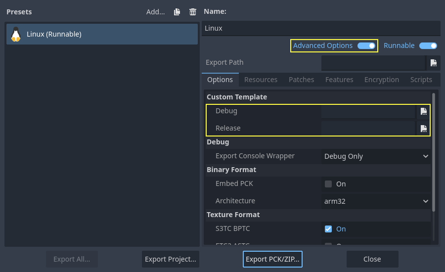

.. _doc_compiling_for_linuxbsd:

Compiling for Linux, \*BSD
==========================

.. highlight:: shell

.. seealso::

    This page describes how to compile Linux editor and export template binaries from source.
    If you're looking to export your project to Linux instead, read :ref:`doc_exporting_for_linux`.

Requirements
------------

For compiling under Linux or other Unix variants, the following is
required:

- GCC 9+ or Clang 6+.
- `Python 3.8+ <https://www.python.org/downloads/>`_.
- `SCons 4.0+ <https://scons.org/pages/download.html>`_ build system.
- pkg-config (used to detect the development libraries listed below).
- Development libraries:

  - X11, Xcursor, Xinerama, Xi and XRandR.
  - Wayland and wayland-scanner.
  - Mesa.
  - ALSA.
  - PulseAudio.

- *Optional* - libudev (build with ``udev=yes``).

.. seealso::

    To get the Godot source code for compiling, see :ref:`doc_getting_source`.

    For a general overview of SCons usage for Godot, see :ref:`doc_introduction_to_the_buildsystem`.

.. _doc_compiling_for_linuxbsd_oneliners:

Distro-specific one-liners
~~~~~~~~~~~~~~~~~~~~~~~~~~

.. tabs::

    .. tab:: Alpine Linux

        ::

            apk add \
              scons \
              pkgconf \
              gcc \
              g++ \
              libx11-dev \
              libxcursor-dev \
              libxinerama-dev \
              libxi-dev \
              libxrandr-dev \
              mesa-dev \
              eudev-dev \
              alsa-lib-dev \
              pulseaudio-dev

    .. tab:: Arch Linux

        ::

            pacman -Sy --noconfirm --needed \
              scons \
              pkgconf \
              gcc \
              libxcursor \
              libxinerama \
              libxi \
              libxrandr \
              wayland-utils \
              mesa \
              glu \
              libglvnd \
              alsa-lib \
              pulseaudio

    .. tab:: Debian/Ubuntu

        ::

            sudo apt-get update
            sudo apt-get install -y \
              build-essential \
              scons \
              pkg-config \
              libx11-dev \
              libxcursor-dev \
              libxinerama-dev \
              libgl1-mesa-dev \
              libglu1-mesa-dev \
              libasound2-dev \
              libpulse-dev \
              libudev-dev \
              libxi-dev \
              libxrandr-dev \
              libwayland-dev

    .. tab:: Fedora

        ::

            sudo dnf install -y \
              scons \
              pkgconfig \
              gcc-c++ \
              libstdc++-static \
              wayland-devel

    .. tab:: FreeBSD

        ::

            pkg install \
              py37-scons \
              pkgconf \
              xorg-libraries \
              libXcursor \
              libXrandr \
              libXi \
              xorgproto \
              libGLU \
              alsa-lib \
              pulseaudio

    .. tab:: Gentoo

        ::

            emerge --sync
            emerge -an \
              dev-build/scons \
              x11-libs/libX11 \
              x11-libs/libXcursor \
              x11-libs/libXinerama \
              x11-libs/libXi \
              dev-util/wayland-scanner \
              media-libs/mesa \
              media-libs/glu \
              media-libs/alsa-lib \
              media-sound/pulseaudio

    .. tab:: Mageia

        ::

            sudo urpmi --auto \
              scons \
              task-c++-devel \
              wayland-devel \
              "pkgconfig(alsa)" \
              "pkgconfig(glu)" \
              "pkgconfig(libpulse)" \
              "pkgconfig(udev)" \
              "pkgconfig(x11)" \
              "pkgconfig(xcursor)" \
              "pkgconfig(xinerama)" \
              "pkgconfig(xi)" \
              "pkgconfig(xrandr)"

    .. tab:: NetBSD

        ::

            pkg_add \
              pkg-config \
              py37-scons

        .. hint::

            For audio support, you can optionally install ``pulseaudio``.

    .. tab:: OpenBSD

        ::

            pkg_add \
              python \
              scons \
              llvm

    .. tab:: openKylin

        ::

            sudo apt update
            sudo apt install -y \
              python3-pip \
              build-essential \
              pkg-config \
              libx11-dev \
              libxcursor-dev \
              libxinerama-dev \
              libgl1-mesa-dev \
              libglu1-mesa-dev \
              libasound2-dev \
              libpulse-dev \
              libudev-dev \
              libxi-dev \
              libxrandr-dev \
              libwayland-dev
            sudo pip install scons

    .. tab:: openSUSE

        ::

            sudo zypper install -y \
              scons \
              pkgconfig \
              libX11-devel \
              libXcursor-devel \
              libXrandr-devel \
              libXinerama-devel \
              libXi-devel \
              wayland-devel \
              Mesa-libGL-devel \
              alsa-devel \
              libpulse-devel \
              libudev-devel \
              gcc-c++ \
              libGLU1

    .. tab:: Solus

        ::

            eopkg install -y \
              -c system.devel \
              scons \
              libxcursor-devel \
              libxinerama-devel \
              libxi-devel \
              libxrandr-devel \
              wayland-devel \
              mesalib-devel \
              libglu \
              alsa-lib-devel \
              pulseaudio-devel

Compiling
---------

Start a terminal, go to the root dir of the engine source code and type:

::

    scons platform=linuxbsd

.. note::

    Prior to Godot 4.0, the Linux/\*BSD target was called ``x11`` instead of
    ``linuxbsd``. If you are looking to compile Godot 3.x, make sure to use the
    `3.x branch of this documentation <https://docs.godotengine.org/en/3.6/development/compiling/compiling_for_x11.html>`__.

.. tip::
    If you are compiling Godot to make changes or contribute to the engine,
    you may want to use the SCons options ``dev_build=yes`` or ``dev_mode=yes``.
    See :ref:`doc_introduction_to_the_buildsystem_development_and_production_aliases`
    for more info.

If all goes well, the resulting binary executable will be placed in the
"bin" subdirectory. This executable file contains the whole engine and
runs without any dependencies. Executing it will bring up the Project
Manager.

.. note::

    If you wish to compile using Clang rather than GCC, use this command:

    ::

        scons platform=linuxbsd use_llvm=yes

    Using Clang appears to be a requirement for OpenBSD, otherwise fonts
    would not build.
    For RISC-V architecture devices, use the Clang compiler instead of the GCC compiler.

.. tip:: If you are compiling Godot for production use, you can
         make the final executable smaller and faster by adding the
         SCons option ``production=yes``. This enables additional compiler
         optimizations and link-time optimization.

         LTO takes some time to run and requires about 7 GB of available RAM
         while compiling. If you're running out of memory with the above option,
         use ``production=yes lto=none`` or ``production=yes lto=thin`` for a
         lightweight but less effective form of LTO.

.. note:: If you want to use separate editor settings for your own Godot builds
          and official releases, you can enable
          :ref:`doc_data_paths_self_contained_mode` by creating a file called
          ``._sc_`` or ``_sc_`` in the ``bin/`` folder.

Running a headless/server build
-------------------------------

To run in *headless* mode which provides editor functionality to export
projects in an automated manner, use the normal build:

::

    scons platform=linuxbsd target=editor

And then use the ``--headless`` command line argument:

::

    ./bin/godot.linuxbsd.editor.x86_64 --headless

To compile a debug *server* build which can be used with
:ref:`remote debugging tools <doc_command_line_tutorial>`, use:

::

    scons platform=linuxbsd target=template_debug

To compile a *server* build which is optimized to run dedicated game servers, use:

::

    scons platform=linuxbsd target=template_release production=yes

Building export templates
-------------------------

.. warning:: Linux binaries usually won't run on distributions that are
             older than the distribution they were built on. If you wish to
             distribute binaries that work on most distributions,
             you should build them on an old distribution such as Ubuntu 20.04.
             You can use a virtual machine or a container to set up a suitable
             build environment.

To build Linux or \*BSD export templates, run the build system with the
following parameters:

-  (32 bits)

::

    scons platform=linuxbsd target=template_release arch=x86_32
    scons platform=linuxbsd target=template_debug arch=x86_32

-  (64 bits)

::

    scons platform=linuxbsd target=template_release arch=x86_64
    scons platform=linuxbsd target=template_debug arch=x86_64

Note that cross-compiling for the opposite bits (64/32) as your host
platform is not always straight-forward and might need a chroot environment.

To create standard export templates, the resulting files in the ``bin/`` folder
must be copied to:

::

    $HOME/.local/share/godot/export_templates/<version>/

and named like this (even for \*BSD which is seen as "Linux/X11" by Godot):

.. code:: text

    linux_debug.arm32
    linux_debug.arm64
    linux_debug.x86_32
    linux_debug.x86_64
    linux_release.arm32
    linux_release.arm64
    linux_release.x86_32
    linux_release.x86_64

However, if you are writing your custom modules or custom C++ code, you
might instead want to configure your binaries as custom export templates
in the project export menu. You must have **Advanced Options** enabled
to set this.

You don't even need to copy them, you can just reference the resulting
files in the ``bin/`` directory of your Godot source folder, so the next
time you build, you automatically have the custom templates referenced.

Cross-compiling for RISC-V devices
----------------------------------

To cross-compile Godot for RISC-V devices, we need to setup the following items:

- `riscv-gnu-toolchain <https://github.com/riscv-collab/riscv-gnu-toolchain/releases>`__.
  While we are not going to use this directly, it provides us with a sysroot, as well
  as header and libraries files that we will need. There are many versions to choose
  from, however, the older the toolchain, the more compatible our final binaries will be.
  If in doubt, `use this version <https://github.com/riscv-collab/riscv-gnu-toolchain/releases/tag/2023.07.07>`__,
  and download ``riscv64-glibc-ubuntu-20.04-gcc-nightly-2023.07.07-nightly.tar.gz``. Extract
  it somewhere and remember its path.
- `mold <https://github.com/rui314/mold/releases>`__. This fast linker,
  is the only one that correctly links the resulting binary. Download it, extract it,
  and make sure to add its ``bin`` folder to your PATH. Run
  ``mold --help | grep support`` to check if your version of Mold supports RISC-V.
  If you don't see RISC-V, your Mold may need to be updated.

To make referencing our toolchain easier, we can set an environment
variable like this:

::

    export RISCV_TOOLCHAIN_PATH="path to toolchain here"

This way, we won't have to manually set the directory location
each time we want to reference it.

With all the above setup, we are now ready to build Godot.

Go to the root of the source code, and execute the following build command:

::

    PATH="$RISCV_TOOLCHAIN_PATH/bin:$PATH" \
    scons arch=rv64 use_llvm=yes linker=mold lto=none target=editor \
        ccflags="--sysroot=$RISCV_TOOLCHAIN_PATH/sysroot --gcc-toolchain=$RISCV_TOOLCHAIN_PATH -target riscv64-unknown-linux-gnu" \
        linkflags="--sysroot=$RISCV_TOOLCHAIN_PATH/sysroot --gcc-toolchain=$RISCV_TOOLCHAIN_PATH -target riscv64-unknown-linux-gnu"

.. note::

    RISC-V GCC has `bugs with its atomic operations <https://github.com/riscv-collab/riscv-gcc/issues/15>`__
    which prevent it from compiling Godot correctly. That's why Clang is used instead. Make sure that
    it *can* compile to RISC-V. You can verify by executing this command ``clang -print-targets``,
    make sure you see ``riscv64`` on the list of targets.

.. warning:: The code above includes adding ``$RISCV_TOOLCHAIN_PATH/bin`` to the PATH,
             but only for the following ``scons`` command. Since riscv-gnu-toolchain uses
             its own Clang located in the ``bin`` folder, adding ``$RISCV_TOOLCHAIN_PATH/bin``
             to your user's PATH environment variable may block you from accessing another
             version of Clang if one is installed. For this reason it's not recommended to make
             adding the bin folder permanent. You can also omit the ``PATH="$RISCV_TOOLCHAIN_PATH/bin:$PATH"`` line
             if you want to use scons with self-installed version of Clang, but it may have
             compatibility issues with riscv-gnu-toolchain.

The command is similar in nature, but with some key changes. ``ccflags`` and
``linkflags`` append additional flags to the build. ``--sysroot`` points to
a folder simulating a Linux system, it contains all the headers, libraries,
and ``.so`` files Clang will use. ``--gcc-toolchain`` tells Clang where
the complete toolchain is, and ``-target riscv64-unknown-linux-gnu``
indicates to Clang the target architecture, and OS we want to build for.

If all went well, you should now see a ``bin`` directory, and within it,
a binary similar to the following:

.. code:: text

    godot.linuxbsd.editor.rv64.llvm

You can now copy this executable to your favorite RISC-V device,
then launch it there by double-clicking, which should bring up
the project manager.

If you later decide to compile the export templates, copy the above
build command but change the value of ``target`` to ``template_debug`` for
a debug build, or ``template_release`` for a release build.

Using Clang and LLD for faster development
------------------------------------------

You can also use Clang and LLD to build Godot. This has two upsides compared to
the default GCC + GNU ld setup:

- LLD links Godot significantly faster compared to GNU ld or gold. This leads to
  faster iteration times.
- Clang tends to give more useful error messages compared to GCC.

To do so, install Clang and the ``lld`` package from your distribution's package manager
then use the following SCons command:

::

    scons platform=linuxbsd use_llvm=yes linker=lld

After the build is completed, a new binary with a ``.llvm`` suffix will be
created in the ``bin/`` folder.

It's still recommended to use GCC for production builds as they can be compiled using
link-time optimization, making the resulting binaries smaller and faster.

If this error occurs:

.. code:: text

    /usr/bin/ld: cannot find -l:libatomic.a: No such file or directory

There are two solutions:

- In your SCons command, add the parameter ``use_static_cpp=no``.
- Follow `these instructions <https://github.com/ivmai/libatomic_ops#installation-and-usage>`__ to configure, build, and
  install ``libatomic_ops``. Then, copy ``/usr/lib/libatomic_ops.a`` to ``/usr/lib/libatomic.a``, or create a soft link
  to ``libatomic_ops`` by command ``ln -s /usr/lib/libatomic_ops.a /usr/lib/libatomic.a``. The soft link can ensure the
  latest ``libatomic_ops`` will be used without the need to copy it every time when it is updated.

Using mold for faster development
---------------------------------

For even faster linking compared to LLD, you can use `mold <https://github.com/rui314/mold>`__.
mold can be used with either GCC or Clang.

As of January 2023, mold is not readily available in Linux distribution
repositories, so you will have to install its binaries manually.

- Download mold binaries from its `releases page <https://github.com/rui314/mold/releases/latest>`__.
- Extract the ``.tar.gz`` file, then move the extracted folder to a location such as ``.local/share/mold``.
- Add ``$HOME/.local/share/mold/bin`` to your user's ``PATH`` environment variable.
  For example, you can add the following line at the end of your ``$HOME/.bash_profile`` file:

::

    PATH="$HOME/.local/share/mold/bin:$PATH"

- Open a new terminal (or run ``source "$HOME/.bash_profile"``),
  then use the following SCons command when compiling Godot:

  ::

    scons platform=linuxbsd linker=mold

Using system libraries for faster development
---------------------------------------------

`Godot bundles the source code of various third-party libraries. <https://github.com/godotengine/godot/tree/master/thirdparty>`__
You can choose to use system versions of third-party libraries instead.
This makes the Godot binary faster to link, as third-party libraries are
dynamically linked. Therefore, they don't need to be statically linked
every time you build the engine (even on small incremental changes).

However, not all Linux distributions have packages for third-party libraries
available (or they may not be up-to-date).

Moving to system libraries can reduce linking times by several seconds on slow
CPUs, but it requires manual testing depending on your Linux distribution. Also,
you may not be able to use system libraries for everything due to bugs in the
system library packages (or in the build system, as this feature is less
tested).

To compile Godot with system libraries, install these dependencies **on top** of the ones
listed in the :ref:`doc_compiling_for_linuxbsd_oneliners`:

.. tabs::

    .. tab:: Debian/Ubuntu

        ::

            sudo apt-get update
            sudo apt-get install -y \
              libembree-dev \
              libenet-dev \
              libfreetype-dev \
              libpng-dev \
              zlib1g-dev \
              libgraphite2-dev \
              libharfbuzz-dev \
              libogg-dev \
              libtheora-dev \
              libvorbis-dev \
              libwebp-dev \
              libmbedtls-dev \
              libminiupnpc-dev \
              libpcre2-dev \
              libsdl3-dev \
              libzstd-dev \
              libsquish-dev \
              libicu-dev

    .. tab:: Fedora

        ::

            sudo dnf install -y \
              embree-devel \
              enet-devel \
              glslang-devel \
              graphite2-devel \
              harfbuzz-devel \
              libicu-devel \
              libsquish-devel \
              libtheora-devel \
              libvorbis-devel \
              libwebp-devel \
              libzstd-devel \
              mbedtls-devel \
              miniupnpc-devel \
              SDL3-devel

After installing all required packages, use the following command to build Godot:

.. NOTE: Some `builtin_` options aren't used here because they break the build as of January 2023
   (tested on Fedora 37).

::

    scons platform=linuxbsd builtin_embree=no builtin_enet=no builtin_freetype=no builtin_graphite=no builtin_harfbuzz=no builtin_libogg=no builtin_libpng=no builtin_libtheora=no builtin_libvorbis=no builtin_libwebp=no builtin_mbedtls=no builtin_miniupnpc=no builtin_pcre2=no builtin_sdl=no builtin_zlib=no builtin_zstd=no

On Debian stable, you will need to remove `builtin_embree=no` as the system-provided
Embree version is too old to work with Godot's latest `master` branch
(which requires Embree 4).

You can view a list of all built-in libraries that have system alternatives by
running ``scons -h``, then looking for options starting with ``builtin_``.

.. warning::

    When using system libraries, the resulting binary is **not** portable
    across Linux distributions anymore. Do not use this approach for creating
    binaries you intend to distribute to others, unless you're creating a
    package for a Linux distribution.
