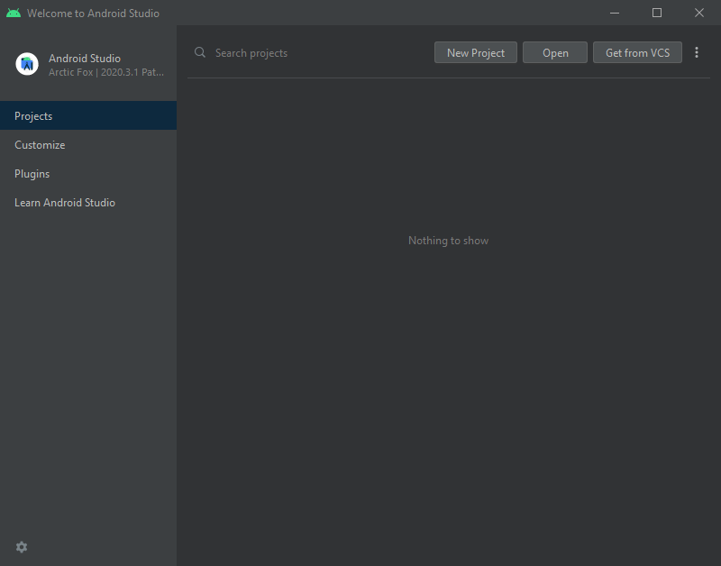

.. _doc_configuring_an_ide_android_studio:

Android Studio
==============

`Android Studio <https://developer.android.com/studio>`_ is a free
IDE for Android development made by `Google <https://about.google/>`_ and `JetBrains <https://www.jetbrains.com/>`_.
It's based on `IntelliJ IDEA <https://www.jetbrains.com/idea/>`_ and has a
feature-rich editor which supports Java and C/C++. It can be used to
work on Godot's core engine as well as the Android platform codebase.

Importing the project
---------------------

- From the Android Studio's welcome window select **Open**.

   Android Studio's welcome window.

- Navigate to ``<Godot root directory>/platform/android/java`` and select the ``settings.gradle`` file.
- Android Studio will import and index the project.

Android Studio project layout
-----------------------------

The project is organized using `Android Studio's modules <https://developer.android.com/studio/projects#ApplicationModules>`_:

- ``lib`` module:
   - Located under ``<Godot root directory>/platform/android/java/lib``, this is a **library module** that organizes
      the Godot java and native code and make it available as a reusable dependency / artifact.
   - The artifact generated by this module is made available for other Android modules / projects to use as a dependency, via `MavenCentral <https://repo1.maven.org/maven2/org/godotengine/godot/>`_.

- ``editor`` module:
   - Located under ``<Godot root directory>/platform/android/java/editor``, this is an **application module** that holds
      the source code for the Android port of the Godot Editor.
   - This module has a dependency on the ``lib`` module.

- ``app`` module:
   - Located under ``<Godot root directory>/platform/android/java/app``, this is an **application module** that holds
      the source code for the Android build templates.
   - This module has a dependency on the ``lib`` module.

Building & debugging the editor module
--------------------------------------

- To build the ``editor`` module:
   - Select the `Run/Debug Configurations drop down <https://developer.android.com/studio/run/rundebugconfig#running>`_ and select ``editor``.

   .. figure:: img/android_studio_editor_configurations_drop_down.webp
      :figclass: figure-w480
      :align: center

   - Select **Run > Run 'editor'** from the top menu or `click the Run icon <https://developer.android.com/studio/run/rundebugconfig#running>`_.
- To debug the ``editor`` module:
   - Open the **Build Variants** window using **View > Tools Windows > Build Variants** from the top menu.
   - In the **Build Variants** window, make sure that in the **Active Build Variant** column, the ``:editor`` entry is set to one of the **Dev** variants.

   .. figure:: img/android_studio_editor_build_variant.webp
      :figclass: figure-w480
      :align: center

   - Open the **Run/Debug Configurations** window by clicking on **Run > Edit Configurations...** on the top menu.
   - In the **Run/Debug Configurations** window, select the ``editor`` entry, and under **Debugger** make sure the **Debug Type** is set to ``Dual (Java + Native)``
   - Click the ``+`` sign under the **Symbol Directories** section, and add the ``lib`` module directory: ``platform/android/java/lib``

   .. figure:: img/android_studio_editor_debug_type_setup.webp
      :figclass: figure-w480
      :align: center

   - Select **Run > Debug 'editor'** from the top menu or `click the Debug icon <https://developer.android.com/studio/run/rundebugconfig#running>`_.

Building & debugging the app module
-----------------------------------

The ``app`` module requires the presence of a Godot project in its ``assets`` directory (``<Godot root directory>/platform/android/java/app/assets``) to run.
This is usually handled by the Godot Editor during the export process.
While developing in Android Studio, it's necessary to manually add a Godot project under that directory to replicate the export process.
Once that's done, you can follow the instructions below to run/debug the ``app`` module:

- To build the ``app`` module:
   - Select the `Run/Debug Configurations drop down <https://developer.android.com/studio/run/rundebugconfig#running>`_ and select ``app``.

   .. figure:: img/android_studio_app_configurations_drop_down.webp
      :figclass: figure-w480
      :align: center

   - Select **Run > Run 'app'** from the top menu or `click the Run icon <https://developer.android.com/studio/run/rundebugconfig#running>`_.
- To debug the ``app`` module:
   - Open the **Build Variants** window using **View > Tools Windows > Build Variants** from the top menu.
   - In the **Build Variants** window, make sure that in the **Active Build Variant** column, the ``:app`` entry is set to one of the **Dev** variants.

   .. figure:: img/android_studio_app_build_variant.webp
      :figclass: figure-w480
      :align: center

   - Open the **Run/Debug Configurations** window by clicking on **Run > Edit Configurations...** on the top menu.
   - In the **Run/Debug Configurations** window, select the ``app`` entry, and under **Debugger** make sure the **Debug Type** is set to ``Dual (Java + Native)``
   - Click the ``+`` sign under the **Symbol Directories** section, and add the ``lib`` module directory: ``platform/android/java/lib``

   .. figure:: img/android_studio_app_debug_type_setup.webp
      :figclass: figure-w480
      :align: center

   - Select **Run > Debug 'app'** from the top menu or `click the Debug icon <https://developer.android.com/studio/run/rundebugconfig#running>`_.

If you run into any issues, ask for help in
`Godot's Android dev channel <https://chat.godotengine.org/channel/android>`__.
