.. _doc_configuring_an_ide_clion:

CLion
=====

`CLion <https://www.jetbrains.com/clion/>`_ is a
`JetBrains <https://www.jetbrains.com/>`_ IDE for C++ that's free for individual, non-commercial development.

Importing the project
---------------------

CLion can import a project's `compilation database file <https://clang.llvm.org/docs/JSONCompilationDatabase.html>`_, commonly named ``compile_commands.json``. To generate the compilation database file, open the terminal, change to the Godot root directory, and run:

::

    scons compiledb=yes

Then, open the Godot root directory with CLion and wait for the project to be fully
indexed. If code completion, parameter information, or refactoring are not enabled,
you will need to load the project with CMake. To do this, find the ``CMakeLists.txt``
file in the ``platform\android\java\nativeSrcsConfigs`` directory, right click and
select :button:`Load CMake Project`. Once the project reloads, a ``godot`` build configuration
will be added. This configuration can be safely deleted as the CMake file will not
build the project and only exists for loading the project in JetBrains IDEs.

   .. note:: Windows Users:

      For ``compile_commands.json`` to load correctly in CLion, you must first have the Visual Studio toolchain configured for CLion.

      - Navigate to **Preferences > Build, Execution, Deployment > Toolchains**
      - Click the **+** button and select  ``Visual Studio``
      - CLion will attempt to detect your Visual Studio installation. If it is unsuccessful, use the file icon to the right of ``Toolset:`` to select the directory with your Visual Studio installation.

      You may exit and reload CLion and it will reload ``compile_commands.json``
  
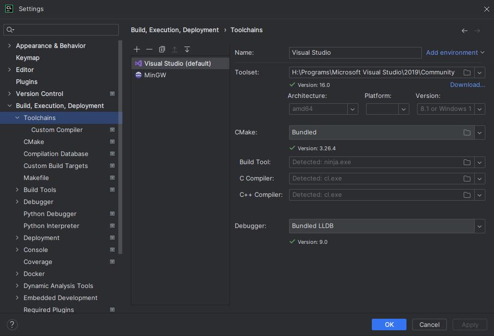

Compiling and debugging the project
-----------------------------------

CLion does not support compiling and debugging Godot via SCons out of the box. This can be achieved by creating a custom build target and run configuration in CLion. Before creating a custom build target, you must :ref:`compile Godot <toc-devel-compiling>` once on the command line, to generate the Godot executable. Open the terminal, change into the Godot root directory, and execute:

::

    scons dev_build=yes

To add a custom build target that invokes SCons for compilation:

- Open CLion and navigate to **Preferences > Build, Execution, Deployment > Custom Build Targets**

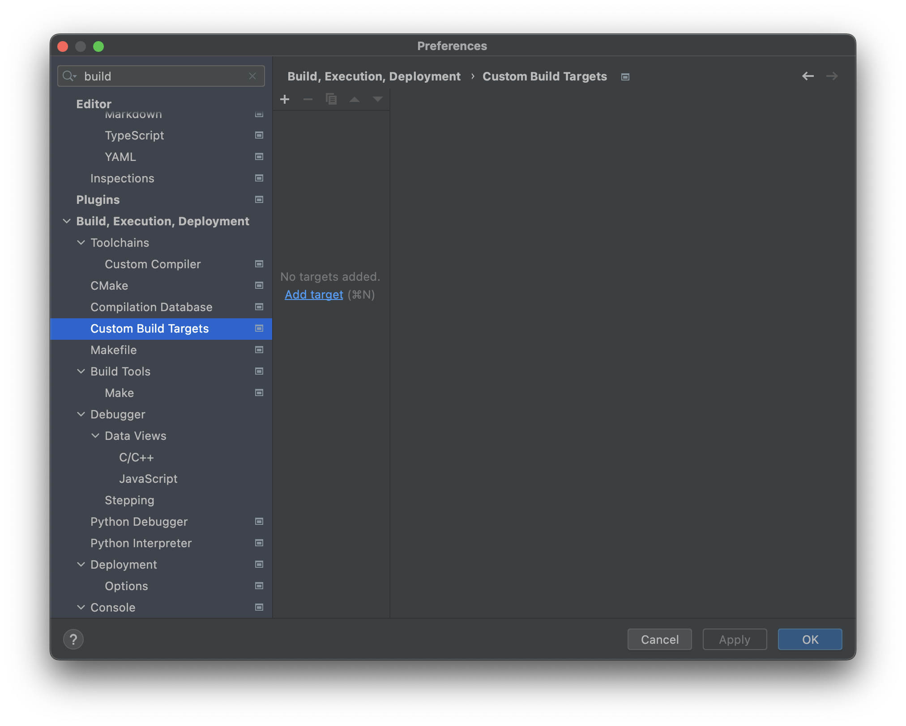

- Click **Add target** and give the target a name, e.g. ``Godot debug``.

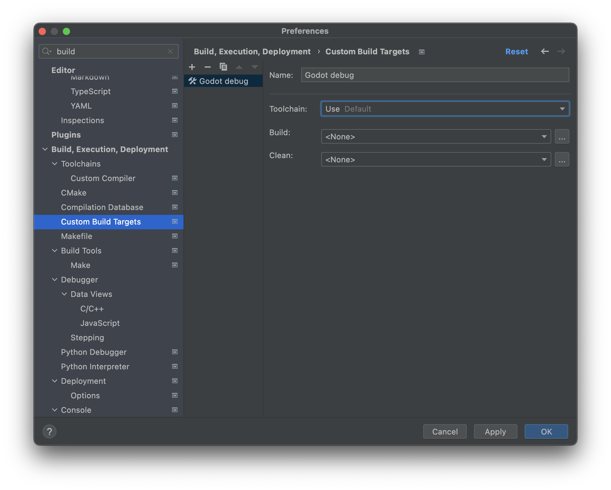

- Click **...** next to the **Build:** selectbox, then click the **+** button in the **External Tools** dialog to add a new external tool.

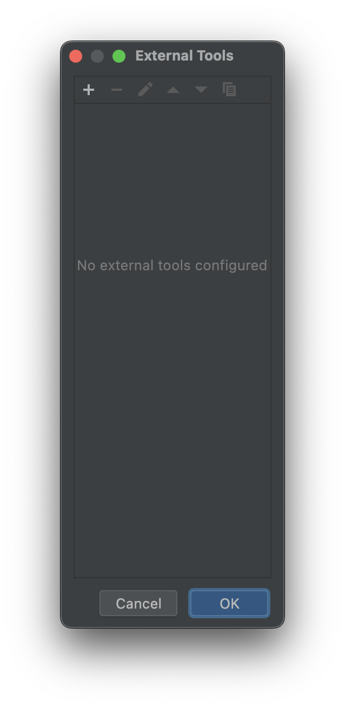

- Give the tool a name, e.g. ``Build Godot debug``, set **Program** to ``scons``, set **Arguments** to the compilation settings you want (see :ref:`compiling Godot <toc-devel-compiling>`), and set the **Working directory** to ``$ProjectFileDir$``, which equals the Godot root directory. Click **OK** to create the tool.

   .. note:: CLion does not expand shell commands like ``scons -j$(nproc)``. Use concrete values instead, e.g. ``scons -j8``.

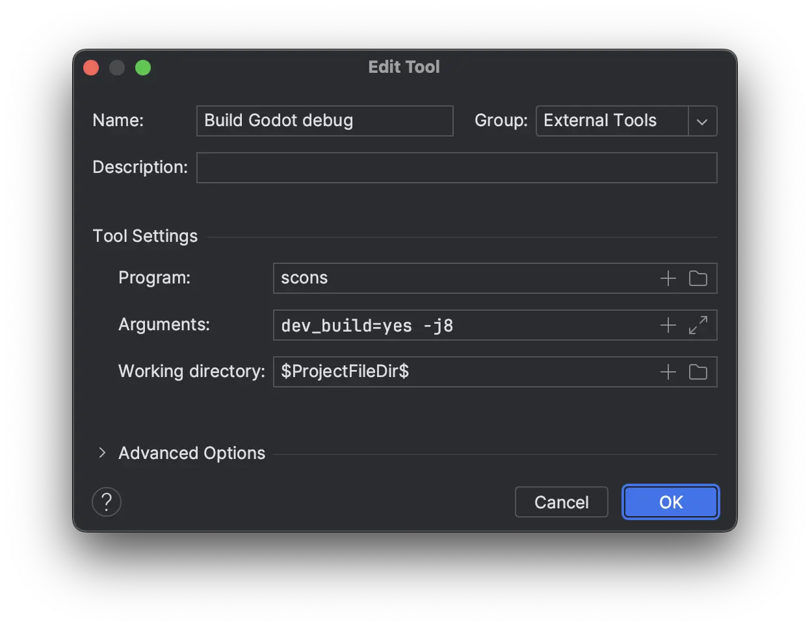

- Back in the **External Tools** dialog, click the **+** again to add a second external tool for cleaning the Godot build via SCons. Give the tool a name, e.g. ``Clean Godot debug``, set **Program** to ``scons``, set **Arguments** to ``-c`` (which will clean the build), and set the **Working directory** to ``$ProjectFileDir$``. Click **OK** to create the tool.

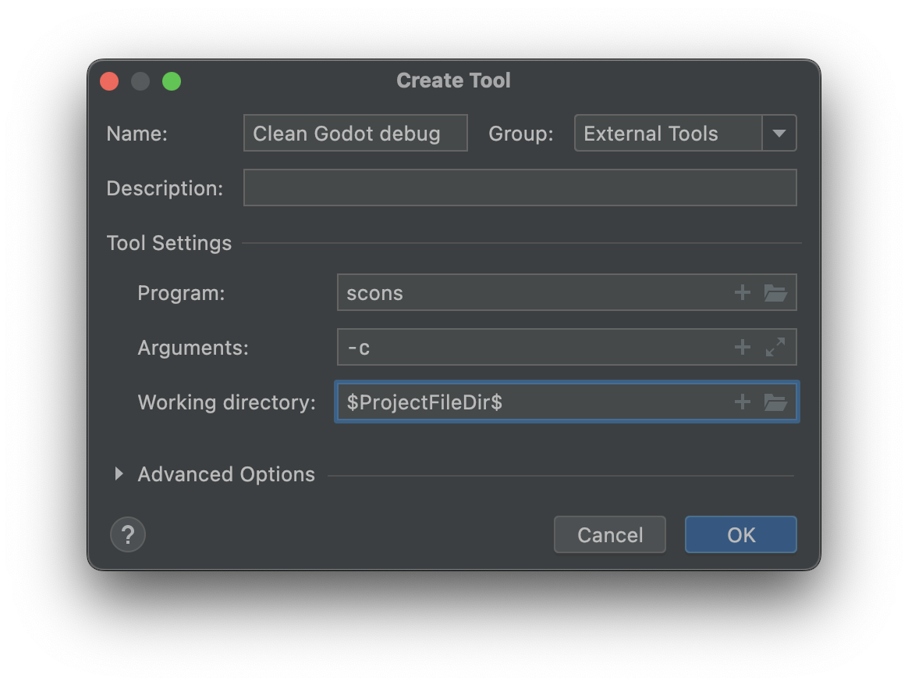

- Close the **External Tools** dialog. In the **Custom Build Target** dialog for the custom ``Godot debug`` build target, select the **Build Godot debug** tool from the **Build** select box, and select the **Clean Godot debug** tool from the **Clean** select box. Click **OK** to create the custom build target.

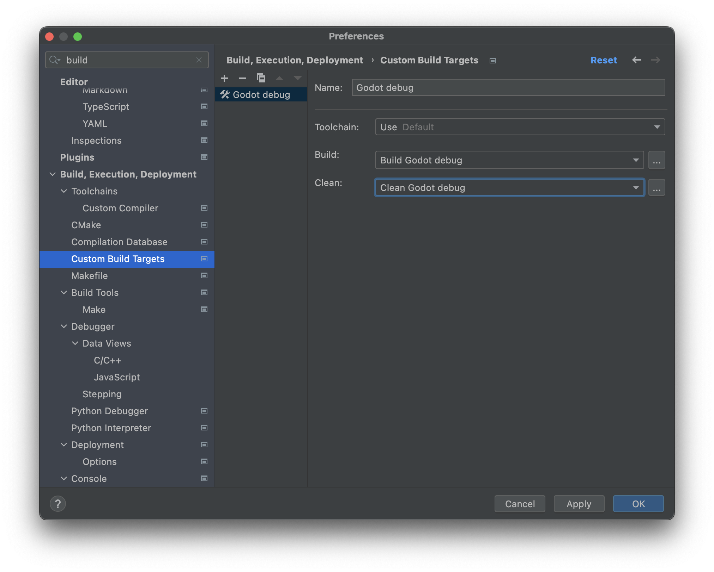

- In the main IDE window, click **Add Configuration**.

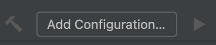

- In the **Run/Debug Configuration** dialog, click **Add new...**, then select **Custom Build Application** to create a new custom run/debug configuration.

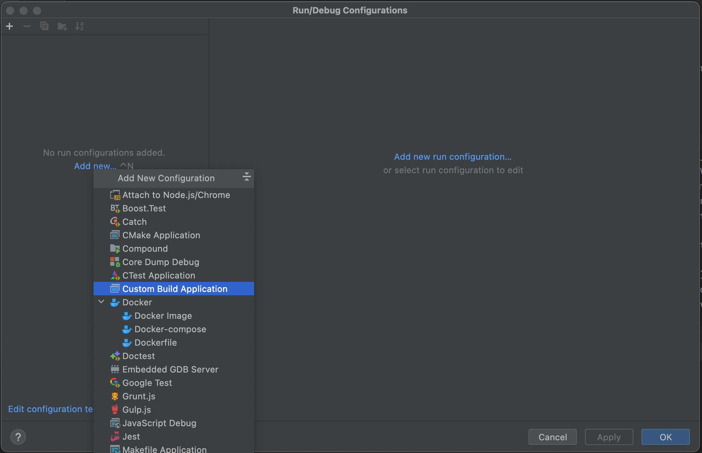

- Give the run/debug configuration a name, e.g. ``Godot debug``, select the ``Godot debug`` custom build target as the **Target**. Select the Godot executable in the ``bin/`` folder as the **Executable**, and set the **Program arguments** to ``--editor --path path-to-your-project/``, where ``path-to-your-project/`` should be a path pointing to an existing Godot project. If you omit the ``--path`` argument, you will only be able to debug the Godot Project Manager window. Click **OK** to create the run/debug configuration.

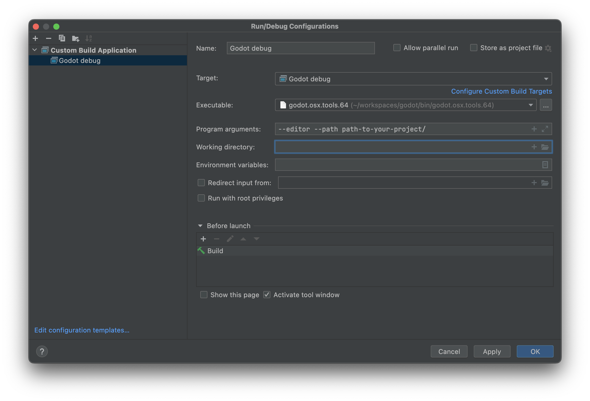

You can now build, run, debug, profile, and Valgrind check the Godot editor via the run configuration.

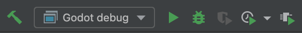

When playing a scene, the Godot editor will spawn a separate process. You can debug this process in CLion by going to **Run > Attach to process...**, typing ``godot``, and selecting the Godot process with the highest **pid** (process ID), which will usually be the running project.

Ignoring object and library files
-----------------------------------

After building Godot in CLion, you may see the object and library files showing up in the **Project** view.

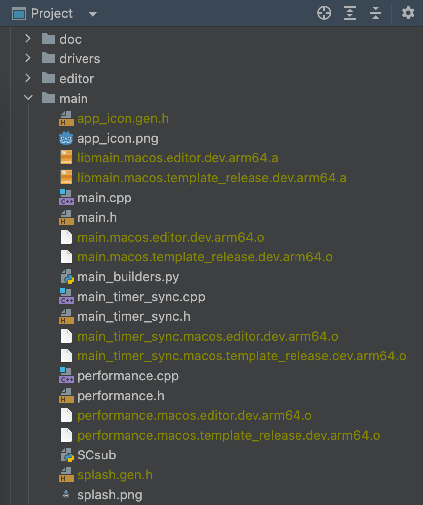

You can configure CLion to ignore those files:

- Open CLion and navigate to **Preferences > Editor > File Types > Ignored Files and Folders**
- Click the **+** button to add ``*.o`` and ``*.a`` to the list. In Windows, you would add ``*.obj`` and ``*.dll``.

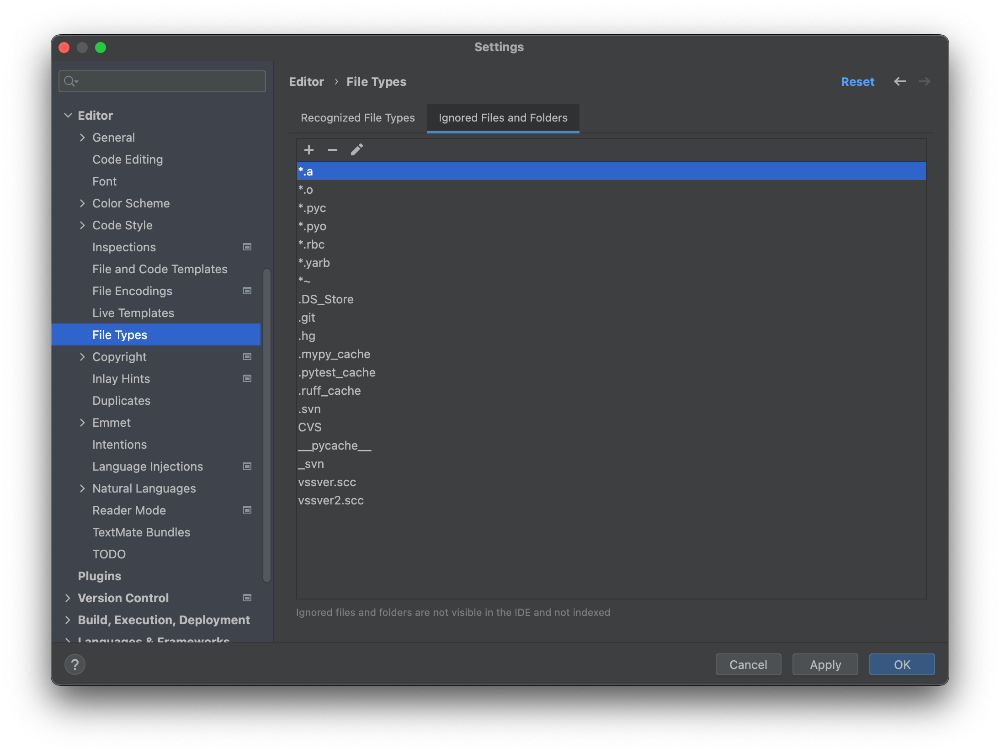

Now, the files should be ignored in the Project view.
