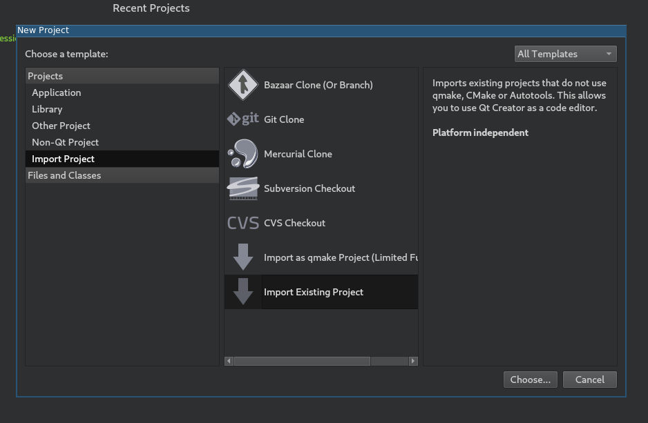
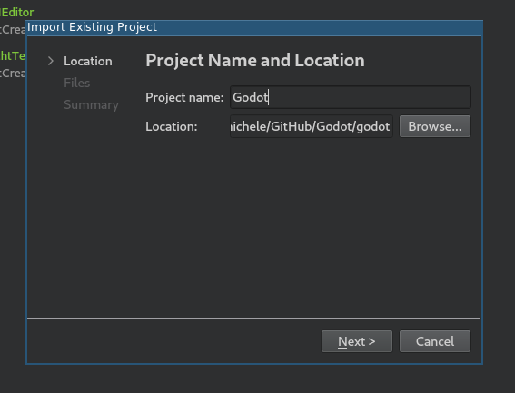
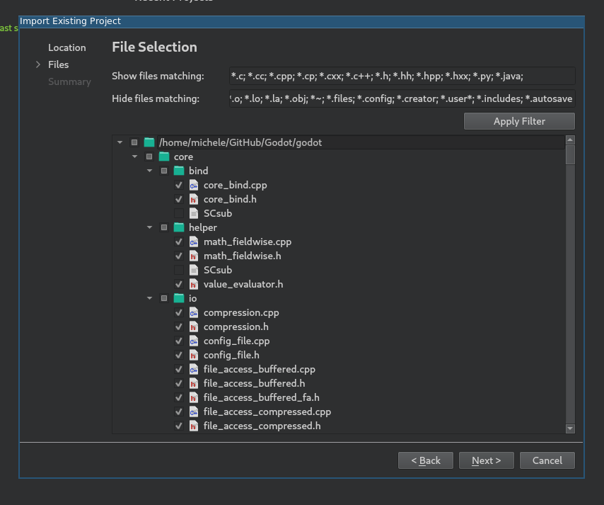
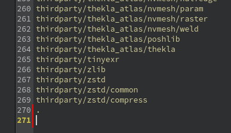
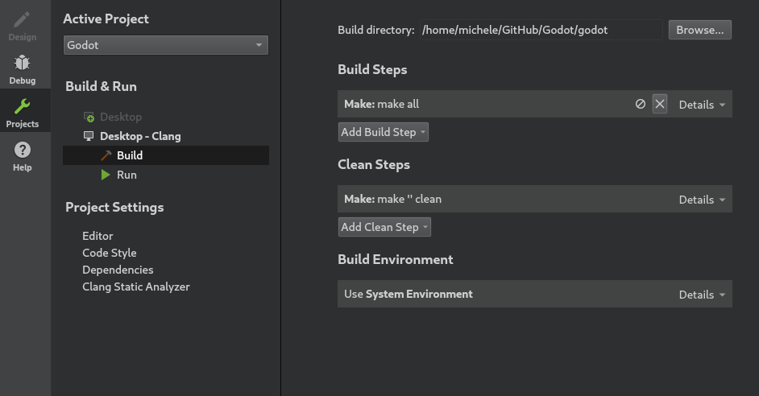
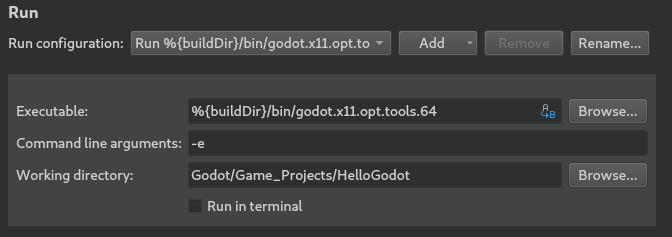
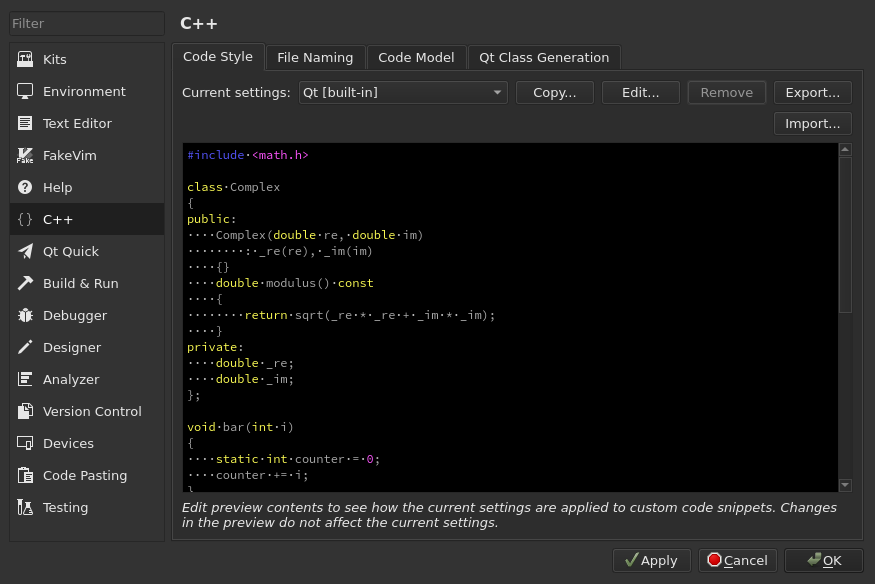
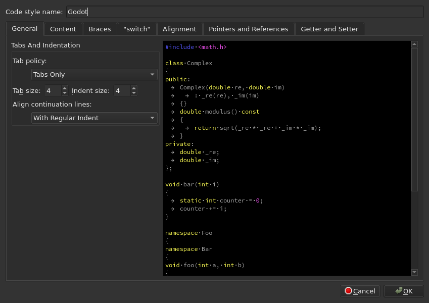

.. _doc_configuring_an_ide_qtcreator:

Qt Creator
==========

`Qt Creator <https://doc.qt.io/qtcreator/index.html>`_ is a free, open source IDE for all desktop platforms.

Importing the project
---------------------

- From the Qt Creator's main screen select **New Project > Import Project > Import Existing Project**.

- Under **Location** select the Godot root folder.

- Next, you can choose which folders and files will be visible to the project.
  While C/C++ files are added automatically, other extensions can be potentially useful:
  ``*.glsl`` for shader files, ``*.py`` for buildsystem files,
  ``*.java`` for Android platform development, ``*.mm`` for macOS platform development.

.. note:: You can change this configuration later by right-clicking on your project
          and selecting the **Edit Files...** option.

          .. figure:: img/qtcreator-edit-files-menu.png
            :figclass: figure-w480
            :align: center

- Finish the import.
- Open the ``project_name.includes`` file and add a line containing ``.`` to it
  to correctly enable the code completion.

- From the left-side menu select **Projects** and open the **Build** tab.
- Delete the predefined ``make`` build step.

- Click **Add Build Step > Custom Process Step** to add a new build step
  with the following settings:

  +-----------+------------------------------------------------------------------------------+
  | Command   | **scons**                                                                    |
  +-----------+------------------------------------------------------------------------------+
  | Arguments | See :ref:`doc_introduction_to_the_buildsystem` for a full list of arguments. |
  +-----------+------------------------------------------------------------------------------+

.. figure:: img/qtcreator-set-scons-command.png
   :figclass: figure-w480
   :align: center

.. note:: If the build fails with ``Could not start process "scons"``, it can mean that ``scons``
          is not in your ``PATH`` environment variable. In this case, you'll have to specify the
          full path to the SCons binary.

Debugging the project
---------------------

- From the left-side menu select **Projects** and open the **Run** tab.
- Under **Executable** specify the path to your executable located in
  the ``<Godot root directory>/bin`` folder. The name depends on your build configuration,
  e.g. ``godot.linuxbsd.editor.dev.x86_64`` for 64-bit LinuxBSD platform with
  ``platform=editor`` and ``dev_build=yes``.
  You can use ``%{buildDir}`` to reference the project root, e.g: ``%{buildDir}/bin/godot.linuxbsd.editor.dev.x86_64``.
- If you want to run a specific project, specify its root folder under **Working directory**.
- If you want to run the editor, add ``-e`` to the **Command line arguments** field.

To learn more about command line arguments, refer to the
:ref:`command line tutorial <doc_command_line_tutorial>`.

Code style configuration
------------------------

Developers must follow the project's `code style <https://contributing.godotengine.org/en/latest/engine/guidelines/code_style.html>`__
and the IDE should help them follow it. By default, Qt Creator uses spaces
for indentation which doesn't match the Godot code style guidelines. You can
change this behavior by changing the **Code Style** in **Tools > Options > C++**.

Click on **Edit** to change the current settings, then click on
**Copy Built-in Code Style** button to set a new code style. Set a name for it
(e.g. Godot) and change the Tab policy to be **Tabs Only**.

If you run into any issues, ask for help in one of
`Godot's community channels <https://godotengine.org/community>`__.
