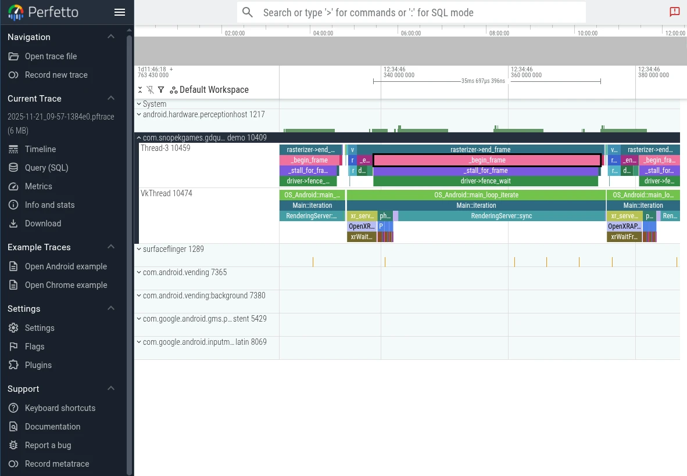

.. _doc_tracing_profilers:

Tracing Profilers
=================

Godot currently supports two tracing profilers:
`Tracy <https://github.com/wolfpld/tracy>`__ and `Perfetto <https://perfetto.dev>`__.

In order to use either of them, you'll need to build the engine from source.
If you've never done this before, please read
:ref:`these docs <doc_compiling_index>` for the platform you want to profile on.
You'll need to perform the same steps here, but with some additional arguments
for ``scons``.

.. _doc_tracy_profiler:

Tracy for Windows, Linux, and macOS
-----------------------------------

Tracy is an Open Source profiler that runs on a wide variety of platforms,
including Windows, Linux, and macOS. While it is primarily a tracing profiler,
it can also periodically sample data like a
:ref:`sampling profiler <doc_sampling_profilers>`, giving some of the benefits
of both approaches.

Build Godot with Tracy support
~~~~~~~~~~~~~~~~~~~~~~~~~~~~~~

First, clone the latest version of the Tracy source code ("0.13.0" at the
time of writing) using Git:

.. code-block:: shell

    git clone -b v0.13.0 --single-branch https://github.com/wolfpld/tracy.git

This will create a ``tracy`` directory - you can place this anywhere.

Next, build the release templates for your platform using ``scons``, but adding
the ``profiler=tracy profiler_path=path/to/tracy`` arguments with the real path
to the ``tracy`` directory, as well as ``debug_symbols=yes`` to allow Tracy's
sampling features to work.

.. note::

    You don't have to build release templates, you could also build debug
    templates, or even the editor. However, it's generally recommended to
    profile release templates, because that is the version your players will
    use, and it will perform differently than other types of builds.

For example, to build release templates for Windows:

.. code-block:: shell

    scons platform=windows target=template_release debug_symbols=yes profiler=tracy profiler_path=path/to/tracy

Get the Tracy "server"
~~~~~~~~~~~~~~~~~~~~~~

In Tracy terminology, the application you are profiling is the "client", and
the one receiving the data is the "server".

If you are on Windows, you can download a pre-built ``tracy-profiler.exe``
from the Tracy `releases page <https://github.com/wolfpld/tracy/releases>`_.

However, if you're on Linux or macOS, you'll either need to find a pre-built
binary from a package manager (like ``brew`` or ``nix``), or build it from
source yourself.

.. note::

    If you do use a pre-built binary, be sure to use the same version that
    you used when building Godot.

Build the Tracy server from source
++++++++++++++++++++++++++++++++++

In order to build Tracy, you'll need to install ``cmake``, which can be
downloaded from the `CMake website <https://cmake.org/download/>`_, or
possibly installed via a package manager (like ``brew`` or ``nix``).

The full instructions for building Tracy from source can be found in the
`Tracy manual <https://github.com/wolfpld/tracy/releases/latest/download/tracy.pdf>`_,
but here is the TL;DR:

.. code-block:: shell

    # On Linux, Tracy uses Wayland by default, so if you use X11 add -DLEGACY=1
    cmake -B profiler/build -S profiler -DCMAKE_BUILD_TYPE=Release
    cmake --build profiler/build --config Release --parallel

This will place the binary at ``tracy/profiler/build/tracy-profiler`` or
``tracy/profiler/build/tracy-profiler.exe`` (on Windows).

Record a trace
~~~~~~~~~~~~~~

Launch the Tracy server - you'll see something like this:

.. image:: img/cpp_profiler_tracy_start.webp

Press "connect". This will ensure tracy makes a connection immediately when
the game launches. If you forget to press "connect", Tracy will store system
events in RAM, which can quickly blow up your memory usage (see the
``TRACY_ON_DEMAND`` documentation).

Now, export your game using the release templates you built above, and run it.
As soon as both are running, and you have pressed the "Connect" button in
Tracy, you'll see data coming in:

.. image:: img/cpp_profiler_tracy_recording.webp

When you think you've gathered enough data, press the "Stop" button. If you
clicked somewhere and the box with the "Stop" button disappeared, you can
click the top-left most icon to bring it back.

Examining the trace
~~~~~~~~~~~~~~~~~~~

Here are some of the basic controls:

- Zoom in/out with the mouse wheel
- Right click and drag to move forward/backward on the timeline
- In the top bar, click the left and right arrow buttons by "Frames" to move a single frame on the timeline

To learn more, see the
`Tracy manual <https://github.com/wolfpld/tracy/releases/latest/download/tracy.pdf>`_.

Perfetto for Android
--------------------

Perfetto is the default tracing system for Android. In fact, its system tracing
service has been built into the platform since Android 9.

Build Godot with Perfetto support
~~~~~~~~~~~~~~~~~~~~~~~~~~~~~~~~~

First, clone the latest version of the Perfetto source code ("53.0" at the
time of writing) using Git:

.. code-block:: shell

    git clone -b v53.0 --single-branch https://github.com/google/perfetto.git

This will create a ``perfetto`` directory - you can place this anywhere.

Next, build the Android debug or release templates for your architecture using
``scons`` (per :ref:`Compiling for Android <doc_compiling_for_android>`), but
adding the ``profiler=perfetto profiler_path=path/to/perfetto`` arguments with
the real path to the ``perfetto`` directory.

.. note::

    It's generally recommended to profile release templates, because that is
    the version your players will use, and it will perform differently than
    other types of builds. However, in the case of Android, it can sometimes
    be useful to use debug templates, because Godot can only do remote
    debugging of games exported from debug templates.

For example, to build the release templates for arm64:

.. code-block:: shell

    scons platform=android target=template_release arch=arm64 generate_android_binaries=yes profiler=perfetto profiler_path=path/to/perfetto

Configuration
~~~~~~~~~~~~~

Perfetto requires a configuration file to tell it which events to track.

Create a file called ``godot.config`` inside of the ``perfetto`` directory
with this content:

.. code-block:: text

    # Trace for 10 seconds.
    duration_ms: 10000

    buffers {
        size_kb: 32768
        fill_policy: RING_BUFFER
    }

    # Write to file once every second to prevent overflowing the buffer.
    write_into_file: true
    file_write_period_ms: 1000

    # Track events in the "godot" category.
    data_sources {
        config {
            name: "track_event"
            track_event_config {
                enabled_categories: "godot"
            }
        }
    }

Record a trace
~~~~~~~~~~~~~~

Finally, launch your game on an Android device using the export templates you
built earlier.

When you're ready to record a trace (for example, when you've hit the part of
your game that is exhibiting performance issues), you can use this script that
comes with the Perfetto source code:

.. code-block:: shell

    cd perfetto
    ./tools/record_android_trace -c godot.config

This will record for 10 seconds (per the configuration), or until you press
:kbd:`Ctrl + C`.

Examining the trace
~~~~~~~~~~~~~~~~~~~

As soon as that script exits, it will launch the Perfetto UI in a web browser.

To see the Godot events, expand the row for your application by clicking on its
Android "Unique Name" (Perfetto will also include some events from system
services in the trace).

Then you can use the ``WASD`` keys to navigate the graph:

- Press :kbd:`A` or :kbd:`D` to navigate forward or backward along the timeline
- Press :kbd:`W` or :kbd:`S` to zoom in or out

You'll probably need to zoom a bit before you're able to see the individual
events from Godot.

To learn more, see the
`Perfetto UI documentation <https://perfetto.dev/docs/visualization/perfetto-ui>`_.
