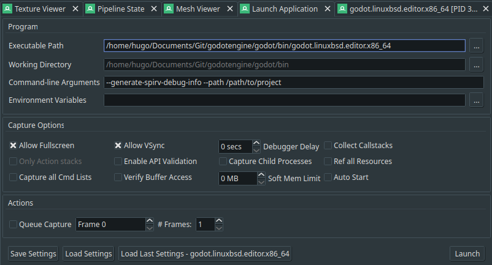
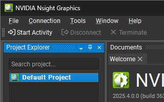
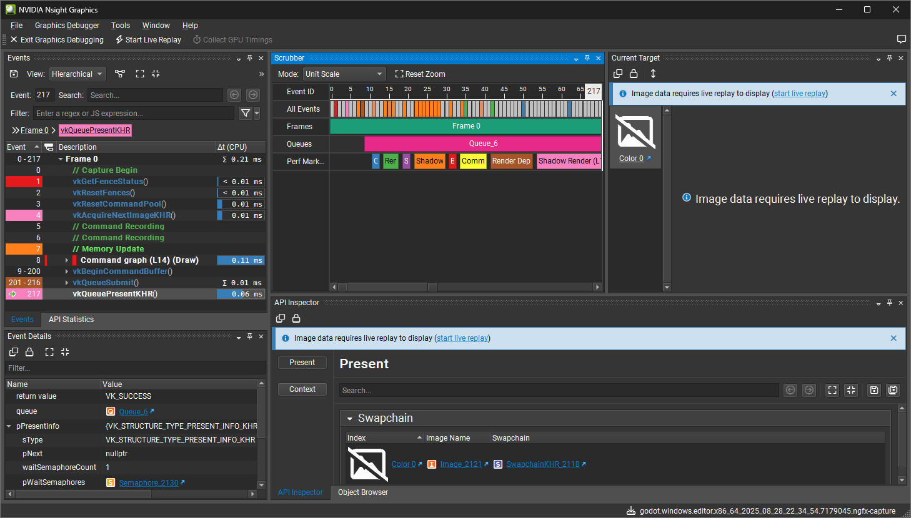

.. _doc_using_graphics_debuggers:

Using graphics debuggers
========================

This page covers how to set up graphics debuggers for use with Godot.

.. seealso::

    To investigate GPU performance issues in the engine, you should use a
    :ref:`graphics profiler <doc_using_graphics_profilers>` instead,
    as RenderDoc is not a profiler.

Setting up Godot
----------------

Unlike :ref:`C++ profilers <doc_using_cpp_profilers>`
it is not required to use an engine build that contains debugging symbols to get
useful graphics debugging information. However, using an editor or debug export
template build is strongly recommended, as release export templates strip most of the
debug information that GPU debuggers can make use of.

Additionally, when running Godot through a graphics debugger, you should
always run it using the ``--generate-spirv-debug-info``
:ref:`command line argument <doc_command_line_tutorial>`. Otherwise, source-level
shader debugging won't work.

In most situations, you want to run the project directly, rather than open the Godot editor
or project manager. In the instructions below, we'll always specify ``--path`` and the
path to the project directory in the command line arguments. To run a specific scene
instead of the main scene, you can also specify a path to a scene file afterwards:
``--path /path/to/project /path/to/project/scene.tscn``.
The path to the scene file can be absolute, or relative to the project folder
(i.e. ``--path /path/to/project scene.tscn`` would work here too).

Recommended debuggers
---------------------

- `RenderDoc <https://renderdoc.org/>`__ (Windows/Linux, Vulkan/Direct3D 12/OpenGL)
- `PIX <https://devblogs.microsoft.com/pix/download/>`__
  (Windows, Direct3D 12 only)
- `NVIDIA NSight Graphics <https://developer.nvidia.com/nsight-graphics>`__
  (Windows/Linux, Vulkan/Direct3D 12)

  - Requires a NVIDIA GPU.
  - Not to be confused with NVIDIA NSight *Systems*, which is designed to profile
    compute workloads as opposed to gaming workloads.

RenderDoc-specific instructions
-------------------------------

- Open RenderDoc. Do not run Godot at this time, as RenderDoc will run it later.
- You may see a warning in the middle of the window about missing Vulkan setup.
  Click the warning to install the Vulkan layer, which is required for profiling to work:

   Missing Vulkan setup warning in RenderDoc.

- Once this is done, fill in the :menu:`Launch Application` pane's fields as follows:

   Launch Application pane in RenderDoc (with filled options to run a specific project directly).

You can also configure RenderDoc to automatically capture the *second* rendered frame (*Frame 1*),
then add ``--quit`` to the command line arguments. This speeds up the process of iterating on RenderDoc
captures by making capturing only require clicking a single button. Godot will then quit immediately after
the capture is done, so it doesn't linger in the background.

.. note::

    Certain processes like radiance map generation will be running on the first rendered frames,
    so if you want to prevent those from showing up in the capture, you'll need to move the capture
    to a later frame number (*Frame 30* is a good starting point).

   Automatically capture the second rendered frame (Frame 1, as Frame 0 is the splash screen) and quit Godot immediately after.

- Click :button:`Launch Application`. The project should start; if not, check that
  the project path is correct and points to a folder, not a file. Once the project is running,
  you'll see an overlay in the top-left corner of the window. Press :kbd:`F12` or :kbd:`Print Screen`
  to capture a frame:

   RenderDoc overlay in the running project.

You can capture multiple frames in the same session if needed. Note that the capture
shortcut is global on Windows and Linux when using X11, so you can press it even if
the Godot window isn't focused.

- After capturing some frames, you'll see a summary in the RenderDoc window. Double-click
  any of the captures to open them in RenderDoc for inspection. You can also right-click
  a capture to open it in a new RenderDoc instance, which allows you to inspect multiple
  frames in parallel.

.. note::

    If only one frame is captured, RenderDoc will open it automatically
    when the project is closed.

   List of captures performed in RenderDoc. Right-clicking allows for additional actions (opening in a new window, renaming, deleting, ...).

RenderDoc usage
---------------

After a capture is opened for inspection, there are several things you can do:

- Inspect the list of draw calls using the :menu:`Event Browser` and :menu:`API Inspector` panes at the left:

   List of draw calls in RenderDoc.

You can time the draw calls by clicking the clock icon at the top:

   Measure time taken by each draw call in RenderDoc.

This will re-run the draw calls on the GPU to measure how much time they take.
The time is then displayed next to each draw call, which can be used to spot
the draw calls taking the most time.

 .. note::

    This is *not* a profiling feature, as the timings may be inaccurate due to various factors
    (e.g. the GPU downclocking as a power saving measure). Forcing the GPU to the highest
    performance state in the graphics driver control panel before clicking the clock icon
    can improve accuracy.

- View capture statistics using :menu:`Window > Statistics` at the top of the RenderDoc
  window. This opens a new pane:

   Capture statistics in RenderDoc.

.. tip::

    It is possible to interoperate
    `RenderDoc with Radeon GPU Profiler <https://gpuopen.com/manuals/rgp_manual/renderdoc_and_rgp_interop/>`__.
    This can be used to profile the same capture as used in RenderDoc.

PIX-specific instructions
-------------------------

- Open PIX. Do not run Godot at this time, as PIX will run it later.

- Click :button:`Launch Process` in the top-left corner:

   PIX interface on launch.

Fill in the launch options to run a project directly:

   PIX launch options.

You can also configure PIX to automatically capture the *second* rendered frame (*Frame 1*),
then add ``--quit`` to the command line arguments. This speeds up the process of iterating on PIX
captures by making capturing only require clicking a single button. Godot will then quit immediately after
the capture is done, so it doesn't linger in the background.

- Click :button:`Launch Application`. The project should start; if not, check that
  the project path is correct and points to a folder, not a file. Once the project is running,
  switch back to the PIX window and click :button:`Take Capture` in the top-left corner:

   Take Capture button in the PIX window.

You can capture multiple frames in the same session if needed.

- After capturing some frames, you'll see a summary in the PIX window. Double-click
  any of the captures to open them in PIX for inspection.

PIX usage
---------

After a capture is opened for inspection, there are several things you can do:

- Inspect the list of draw calls using the pane at the left:

   Capture results with draw call list in PIX.

This will re-run the draw calls on the GPU to measure how much time they take.
The time is then displayed next to each draw call, which can be used to spot
the draw calls taking the most time.

 .. note::

    This is *not* a profiling feature, as the timings may be inaccurate due to various factors
    (e.g. the GPU downclocking as a power saving measure). Forcing the GPU to the highest
    performance state in the graphics driver control panel before clicking the clock icon
    can improve accuracy.

    On NVIDIA GPUs (Ampere and later), PIX will automatically use the highest power state while
    collecting timing data by default.

Once timing data is collected, you'll be able to see timing data on the draw call list
(in the :menu:`EOP to EOP duration` column of the table) and in the timeline at the bottom:

   PIX capture with timing data.

The timeline can have its sections expanded to see more details. The data is based on the GPU's
performance counters, which allow seeing which parts of the GPU are being stressed the most.

Troubleshooting
^^^^^^^^^^^^^^^

If collecting the timing data fails on NVIDIA GPUs, make sure performance counters are configured
to be accessible by all users in the NVIDIA Control Panel:

   Enabling developer settings in NVIDIA Control Panel

   Configuring performance counters to be accessible by all users in NVIDIA Control Panel.

NSight-specific instructions
----------------------------

- Open NSight Graphics. Do not run Godot at this time, as NSight will run it later.

- Double-click :menu:`Default Project` in the list at the left:

   NSight default project.

Fill in the launch options to run a project directly:

.. figure:: img/using_graphics_debuggers_nsight_launch_options.webp
   :align: center
   :alt: NSight launch options.

   NSight launch options.

In the Activity section below the launch options, choose :menu:`Graphics Capture`
and leave all options at their default values:

   Creating a Graphics capture activity in NSight.

- Click :button:`Launch Application`. The project should start; if not, check that
  the project path is correct and points to a folder, not a file. Once the project is running,
  you'll see an overlay in the top-left corner of the window. Press :kbd:`F11`
  to capture a frame:

   NSight capture overlay in the running project.

You can capture multiple frames in the same session if needed.

- After capturing some frames, you'll see a summary in the NSight window. Select a capture
  on the left, then click :button:`Start Graphics Debugger` to open the capture results
  in a new window.

.. figure:: img/using_graphics_debuggers_nsight_capture_details.webp
   :align: center
   :alt: List of captures performed in NSight.

   List of captures performed in NSight.

NSight usage
------------

After a capture is opened for inspection, there are several things you can do:

- Inspect the list of draw calls using the pane at the left:

   Capture results with draw call list in NSight.

Some of the functionality isn't available until you enable live replay, which will re-run
the capture on the GPU. This allows features like viewing image data to work.
To enable live replay, click the :button:`start live replay` link in any of the notices
that appear on screen.

   Capture results with live replay in NSight.

NSight is also a profiler, so you can choose to use the current session as the basis for
profiling using the Run section in the current capture details:

   Run another activity from the current activity in NSight

.. seealso::

    Using NSight's profiler is covered in :ref:`doc_using_graphics_profilers`.
