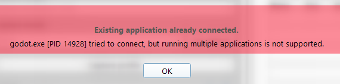
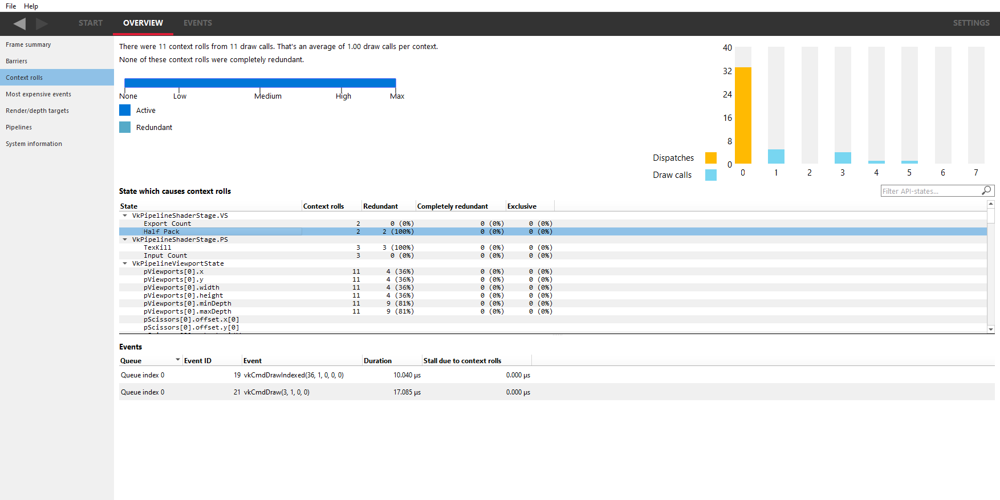

.. _doc_using_graphics_profilers:

Using graphics profilers
========================

This page covers how to set up graphics profilers for use with Godot.

.. seealso::

    To investigate rendering issues in the engine, you should use a
    :ref:`graphics debugger <doc_using_graphics_debuggers>`
    such as RenderDoc instead.

Setting up Godot
----------------

Unlike :ref:`C++ profilers <doc_using_cpp_profilers>`
it is not required to use an engine build that contains debugging symbols to get
useful graphics profiling information. However, using an editor or debug export
template build is strongly recommended, as release export templates strip most of the
debug information that GPU profilers can make use of.

Recommended profilers
---------------------

- `AMD Radeon GPU Profiler <https://gpuopen.com/rgp/>`__ (Windows/Linux, Vulkan/Direct3D 12)

  - Requires an AMD GPU.
  - Installed as part of the `Radeon Developer Tool Suite <https://gpuopen.com/tools/>`__,
    which includes other tools like a GPU memory analyzer.

- `NVIDIA NSight Graphics <https://developer.nvidia.com/nsight-graphics>`__
  (Windows/Linux, Vulkan/Direct3D 12)

  - Requires a NVIDIA GPU.
  - Not to be confused with NVIDIA NSight *Systems*, which is designed to profile
    compute workloads as opposed to gaming workloads.

- `PIX <https://devblogs.microsoft.com/pix/download/>`__
  (Windows, Direct3D 12 only)
- `Xcode <https://developer.apple.com/documentation/xcode/optimizing-gpu-performance>`__
  (macOS, Metal only)
- `Arm Performance Studio <https://developer.arm.com/Tools%20and%20Software/Arm%20Performance%20Studio>`__
  (Windows/macOS/Linux, Vulkan only, profile on mobile devices)

AMD Radeon GPU Profiler-specific instructions
---------------------------------------------

.. tip::

    It is possible to interoperate
    `RenderDoc with Radeon GPU Profiler <https://gpuopen.com/manuals/rgp_manual/renderdoc_and_rgp_interop/>`__.
    This can be used to profile the same capture as used in RenderDoc.

- Open Radeon Developer Panel, which is part of the Radeon Developer Tool Suite.
  Do not open Radeon GPU Profiler, as it will be opened later when needed.

- Create a local connection by leaving the parameters unchanged, then click
  :button:`Connect`:

   Creating a local connection in Radeon Developer Panel

- Add the **Profiling** feature on the panel at the left by clicking the
  :button:`+` icon next to its name:

   Adding the Profiling feature in Radeon Developer Panel

When adding the Profiling feature, you may see a warning message about
missing Primitive Sync support in DirectX 12 applications:

   Missing Primitive Sync support warning in Radeon Developer Panel

In this case, answer :button:`Yes` to enable this feature and accept the UAC prompt.
This is not required when profiling projects using Vulkan.

- Unlike other graphics debugging/profiling tools, you should run Godot yourself,
  as Radeon Developer Panel won't run it for you.
  Open the Project Manager, select your project and click :button:`Run`
  to run the project directly without the editor running in the background:

   Running the project directly from Godot's project manager

You can also run a project directly from the command line. The editor
must **not** be running at the same time, or capturing will fail
due to multiple Godot processes being open simultaneously:

   Error message when trying to capture with multiple Godot processes open

- Once the project is running, you will see Radeon Developer Panel detect it if
  the project is using Vulkan or Direct3D 12. Projects using OpenGL (including the project
  manager) won't be detected:

.. figure:: img/using_graphics_profilers_rdp_ready.webp
   :align: center
   :alt: Ready state in Radeon Developer Panel

   Ready state in Radeon Developer Panel

You will also see an overlay on the running project that confirms capturing is available:

   Overlay on running project

- Press :kbd:`Ctrl + Alt + C` or click :button:`Capture Profile` to capture a frame.

- You can now close Godot, or keep it open to capture more frames later.
  Select a frame in the list on the right, and double-click it to open it
  in Radeon GPU Profiler (abbreviated "RGP" below):

   Profile list after capturing a frame in Radeon Developer Panel

- Once you open the profile in RGP, you will land on the overview page
  in the :ui:`Frame summary` tab. This page presents a summary of what
  was captured, and provides an indication of whether the profile was
  CPU-bound or GPU-bound. Simple scenes with not much going on are often
  be CPU-bound:

   Frame summary in Radeon GPU Profiler

- The :ui:`Barriers` tab shows a list of all GPU memory barriers that were
  hit during the frame. This can be used to see how well the GPU's
  parallelism was made use of:

   Barriers in Radeon GPU Profiler

- The :ui:`Context Rolls` tab shows a timeline of the different contexts
  (command queues) that were used during the frame. This can be used
  to see how well the CPU was able to feed the GPU with work:

   Context rolls in Radeon GPU Profiler

- The :ui:`Most Expensive Events` tab shows a list of the most expensive draw calls
  in the capture, along with the usage share relative to the rest of the frame.
  You can also see which stages of the selected draw calls were the most expensive
  (graphics or asynchronous compute):

   Most expensive events in Radeon GPU Profiler

- The :ui:`Render/Depth targets` tab shows a list of all render and depth targets
  that were used during the frame. This can be used to see how many
  render targets were created and used, and their resolution and format.
  You can also see the number of draw calls that make use of each render target:

   Render depth targets in Radeon GPU Profiler

- The :ui:`Pipelines` tab shows a list of all graphics pipelines that were used
  during the frame. This can be used to see how many pipelines were created
  and used, and their state.

   Pipelines in Radeon GPU Profiler

- In the :ui:`Events` page at the top, you have access to different views.
  The first view is :ui:`Wavefront occupancy`, which shows how well the GPU's
  wavefronts are utilized during the frame. The pane on the right gives
  extra information, such as :abbr:`VGPR (Vector General Purpose Register)`
  and :abbr:`SGPR (Scalar General Purpose Register)` usage in each shader
  stage used in the draw call. These values should be as low as possible:

   Wavefront occupancy in Radeon GPU Profiler

- The second view is :menu:`Event Timing`, which shows a timeline of all
  GPU events that were captured during the frame. This can be used to see
  how well the GPU was kept busy, and if there are any gaps where the GPU
  was idle:

   Event timing in Radeon GPU Profiler

You can right-click any of the draw calls in the timeline to view it
in another context:

   Context menu when right-clicking one of the lines in Event timing

- The :ui:`Pipeline state` view gives details about how shaders were
  run for each draw call, including low-level information on how the
  GPU's resources were utilized:

   Pipeline state in Radeon GPU Profiler

The information displayed depends on the draw call selected. For instance,
draw calls that draw geometry will display the index and primitive (vertex)
count:

   View of another pipeline state in Radeon GPU Profiler

NSight Graphics-specific instructions
-------------------------------------

- Open NSight Graphics. Do not run Godot at this time, as NSight will run it later.

- Double-click :menu:`Default Project` in the list at the left:

.. figure:: img/using_graphics_debuggers_nsight_default_project.webp
   :align: center
   :alt: NSight default project.

   NSight default project.

Fill in the launch options to run a project directly:

   NSight launch options.

In the Activity section below the launch options, choose :menu:`GPU Trace`
and leave all options at their default values:

   Creating a GPU trace activity in NSight.

- Click :button:`Launch Application`. The project should start; if not, check that
  the project path is correct and points to a folder, not a file.
  Once the project is running, you'll see an overlay in the top-left corner of the window.
  Press :kbd:`F11` to capture a frame for profiling:

   NSight trace overlay in the running project.

You can capture multiple frames in the same session if needed.

- After capturing some frames, you'll see a popup appear on the NSight window. This confirms
  that the capture was done. Click :button:`Open` in the popup to open the profiler
  in a new window:

   GPU trace data transfer popup.

- You will then see the GPU trace results in a new window, where you can analyze the
  captured frames and their performance metrics:

   GPU trace results window.

Click :button:`Trace Analysis...` near the top to perform a detailed analysis of the currently profiled frame:

   GPU trace analysis window.

This opens a detailed analysis window, with a list of automatically detected problems
and suggestions. Each problem/suggestion is accompanied by a frame gain value,
indicating its potential impact on performance. The number in the circle represents
the maximum percentage of performance increase that could be achieved by fully addressing
the problem/suggestion, relative to the current framerate. This is a theoretical value
and should be taken with caution.

   GPU trace analysis frame gain legend.

Troubleshooting
^^^^^^^^^^^^^^^

If you see a warning about missing shader debug information after opening the profile window,
it means the Godot process wasn't started with the correct command line arguments.

   GPU trace missing debug information warning.

To resolve this, TODO
