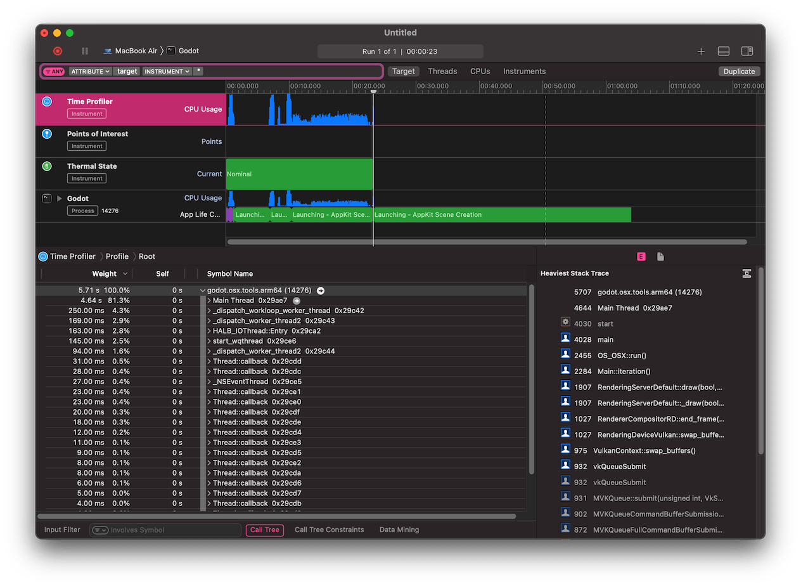

.. _doc_profiler_instruments:

Instruments
===========

.. seealso:: Please see the :ref:`sampling profiler instructions <doc_sampling_profilers>`
             and the :ref:`tracing profiler instructions <doc_tracing_profilers>` for
             more information.

- Open `Xcode <https://developer.apple.com/xcode/>`__.
  Select **Open Developer Tool** - **Instruments** from the **Xcode** app menu:
- Double-click on **Time Profiler** in the **Instruments** window:

.. image:: img/cpp_profiler_xcode_menu.png

- In the Time Profiler window, click on the **Target** menu, select **Choose target...**
  and specify the path to the Godot binary, command line arguments, and environment variables
  in the next window.

.. image:: img/cpp_profiler_time_profiler.png

- You can also attach the Time Profiler to a running process by selecting it from the **Target**
  menu.

- Click the **Start an immediate mode recording** button to start profiling.

.. image:: img/cpp_profiler_time_profiler_record.png

- Perform the actions you wish to profile in the editor or project. When you're done,
  click the **Stop** button.

- Wait for the results to appear.
- At the bottom of the window you will see a call tree for all CPU threads started, and
  the **Heaviest Stack Trace** overview.
- Select **Hide system libraries** in the **Call Tree** menu (at the bottom of the window) to
  remove external modules.
- You can use the timeline at the top of the window to display details for the specific time period.

