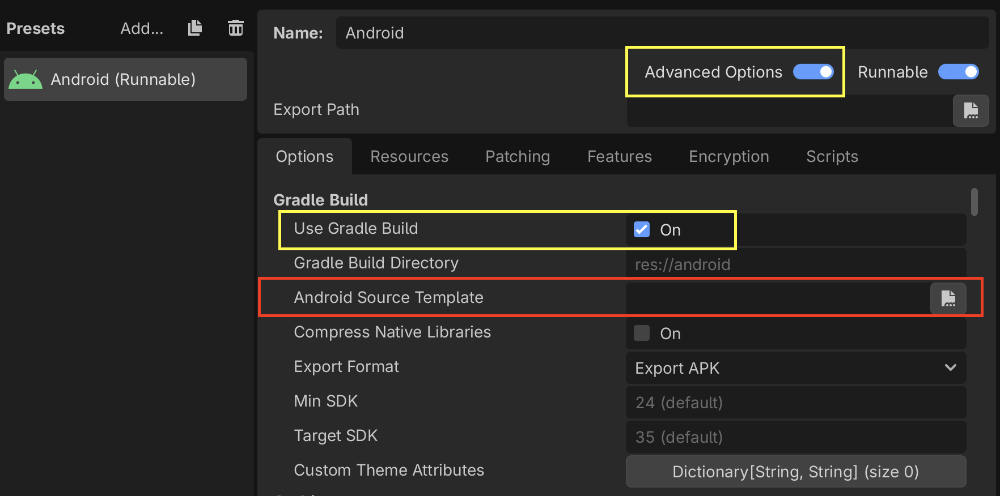
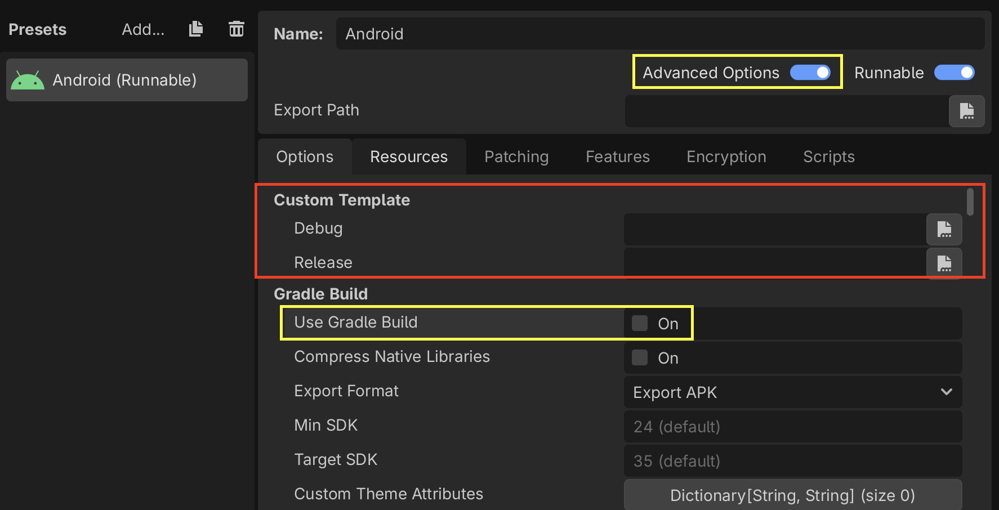
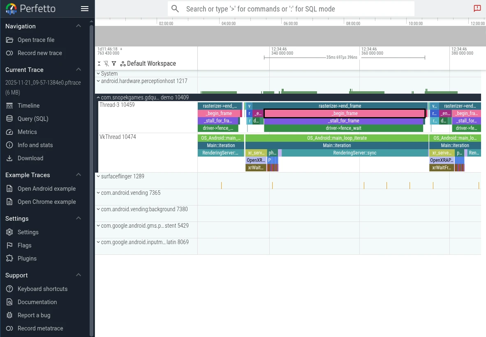

.. _doc_profiler_perfetto:

Perfetto
========

.. seealso:: Please see the :ref:`tracing profiler instructions <doc_tracing_profilers>` for more information.

`Perfetto <https://perfetto.dev>`__ is the default tracing system for Android. In fact, its system tracing
service has been built into the platform since Android 9.

Using official Perfetto templates
---------------------------------

Starting with Godot 4.7, Perfetto export templates are provided for every stable Godot release and can be 
downloaded from the `GitHub Releases page <https://github.com/godotengine/godot/releases/>`_.

Using the Gradle build template
~~~~~~~~~~~~~~~~~~~~~~~~~~~~~~~

- Navigate to the release page and download the ``Godot_v<godot_version>_android_source.perfetto.zip`` 
  release artifact where ``godot_version`` corresponds to the version of the engine being used.
- In the **Project > Export** dialog, **Advanced Options** and **Use Gradle Build** must be enabled.
- Point **Android Source Template** to the downloaded export template.

Follow the instructions in the :ref:`Configuration section <doc_profiler_perfetto_configuration>` to 
learn how to configure and create a trace.

Using non-gradle build templates
~~~~~~~~~~~~~~~~~~~~~~~~~~~~~~~~

- Navigate to the release page and download the following release artifacts 
  where ``godot_version`` corresponds to the version of the engine being used:

  - ``Godot_v<godot_version>_android_debug.perfetto.apk`` (for debug builds)
  - ``Godot_v<godot_version>_android_release.perfetto.apk`` (for release builds)

- In the **Project > Export** dialog:

  - **Advanced Options** must be enabled
  - **Use Gradle Build** must be disabled

- Point **Custom Template** to the downloaded export templates.

Follow the instructions in the :ref:`Configuration section <doc_profiler_perfetto_configuration>` to 
learn how to configure and create a trace.

Custom Godot builds with Perfetto support
-----------------------------------------

From the ``godot`` root directory, run the following python script to install 
the latest version of the Perfetto SDK under ``thirdparty/perfetto``:

.. code-block:: shell

    python misc/scripts/install_perfetto.py

Next, build the Android debug or release templates for your architecture using
``scons`` (per :ref:`Compiling for Android <doc_compiling_for_android>`), but
adding the ``profiler=perfetto`` argument.

.. note::

    It's generally recommended to profile release templates, because that is
    the version your players will use, and it will perform differently than
    other types of builds. However, in the case of Android, it can sometimes
    be useful to use debug templates, because Godot can only do remote
    debugging of games exported from debug templates.

For example, to build the release templates for arm64:

.. code-block:: shell

    scons platform=android target=template_release arch=arm64 generate_android_binaries=yes profiler=perfetto

.. _doc_profiler_perfetto_configuration:

Configuration
-------------

Perfetto requires a configuration file to tell it which events to track.

Create a file called ``godot.config`` with this content:

.. code-block:: text

    # Trace for 10 seconds.
    duration_ms: 10000

    buffers {
        size_kb: 32768
        fill_policy: RING_BUFFER
    }

    # Write to file once every second to prevent overflowing the buffer.
    write_into_file: true
    file_write_period_ms: 1000

    # Track events in the "godot" category.
    data_sources {
        config {
            name: "track_event"
            track_event_config {
                enabled_categories: "godot"
            }
        }
    }

.. note::

    Godot records two categories of track events:

    - **godot**: Used to record Godot engine events. This is used for performance analysis. 
      Event tracing overhead should not significantly impact performance. 
      This should be the typical tracing mode for most developers.
    - **godot_scripting**: Used to record Godot scripting events. 
      This is a slow category as it profiles the entire game scripting logic. 
      This is used for code understanding / debugging / finding what caused a frame hitch. 
      Performance is much slower, but it helps to find that one problematic function call that was otherwise hidden.

Record a trace
--------------

Finally, launch your game on an Android device using the export templates you
built earlier.

When you're ready to record a trace (for example, when you've hit the part of
your game that is exhibiting performance issues), you can 
use `this script from the Perfetto GitHub repository <https://github.com/google/perfetto/blob/main/tools/record_android_trace>`_.

.. code-block:: shell

    ./record_android_trace -c /path/to/godot.config

This will record for 10 seconds (per the configuration), or until you press
:kbd:`Ctrl + C`.

Examining the trace
-------------------

As soon as that script exits, it will launch the Perfetto UI in a web browser.

To see the Godot events, expand the row for your application by clicking on its
Android *Unique Name* / *Package Name* / *App ID* (Perfetto will also include some events from system
services in the trace).

Then you can use the ``WASD`` keys to navigate the graph:

- Press :kbd:`A` or :kbd:`D` to navigate forward or backward along the timeline
- Press :kbd:`W` or :kbd:`S` to zoom in or out

You'll probably need to zoom a bit before you're able to see the individual
events from Godot.

To learn more, see the
`Perfetto UI documentation <https://perfetto.dev/docs/visualization/perfetto-ui>`_.
