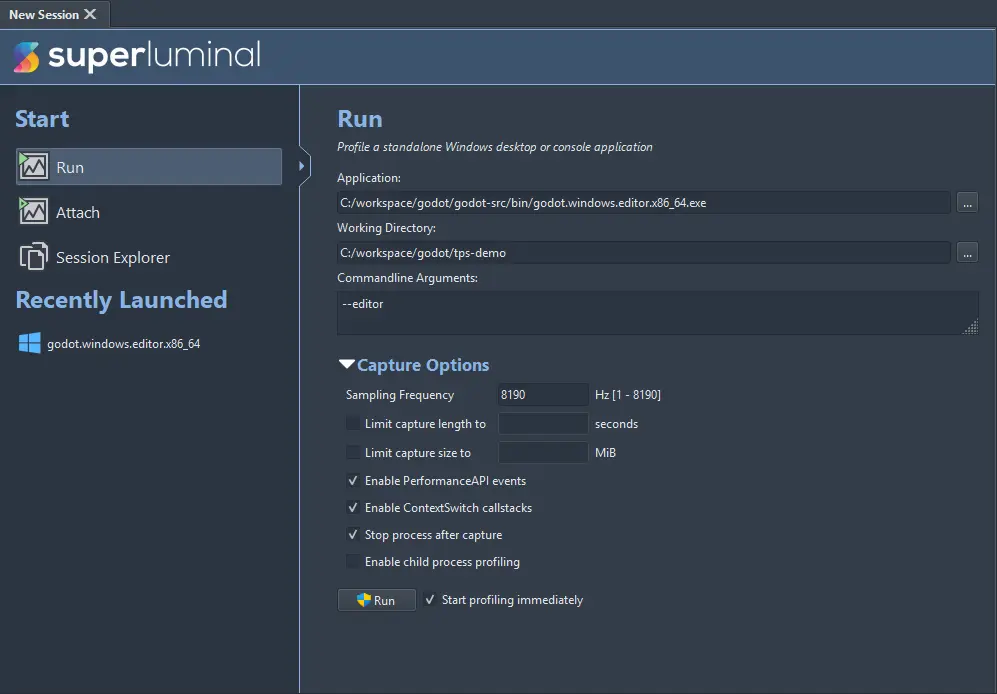
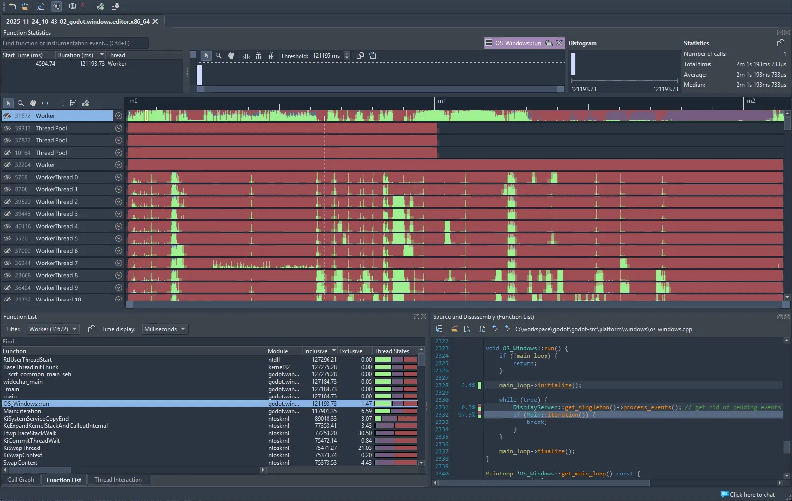

.. _doc_profiler_superluminal:

Superluminal
============

.. seealso:: Please see the :ref:`sampling profiler instructions <doc_sampling_profilers>` for more information on
             how to set up Godot to work with sampling profilers like Superluminal.

Superluminal is a commercial profiler with many features and a special focus on game development. It has support for
profiling on Windows, Linux, Xbox, and Playstation.

While it does not have a free version, it has more advanced features that aren't available in the open source profilers.

Here are the steps to use it:

- Open Superluminal. Set the **Application** field to the Godot executable path.
  Set the **Working Directory** to the project path.

- Set the **Commandline Arguments** field based on your needs. Use ``--editor`` if you want to profile
  the editor, for instance. You can leave it empty for profiling a running project.

- If needed, you can adjust the **Capture Options**. The defaults are usually fine.
  You can use this to enable child process profiling, which allows for profiling the editor
  and running the game from it on the same session.

- Click on the **Run** button to start profiling. The software will ask for elevated privileges
  which are necessary to capture the information.

- Perform the actions you need to profile on the running process.

- Once done, you can close the executable, or click on the **Start Analyzing** button (which will
  kill the executable process).

- The results will be shown on screen. For more information on how to use this, see the
  `Superluminal documentation <https://www.superluminal.eu/docs/documentation.html#navigating_ui>`__.