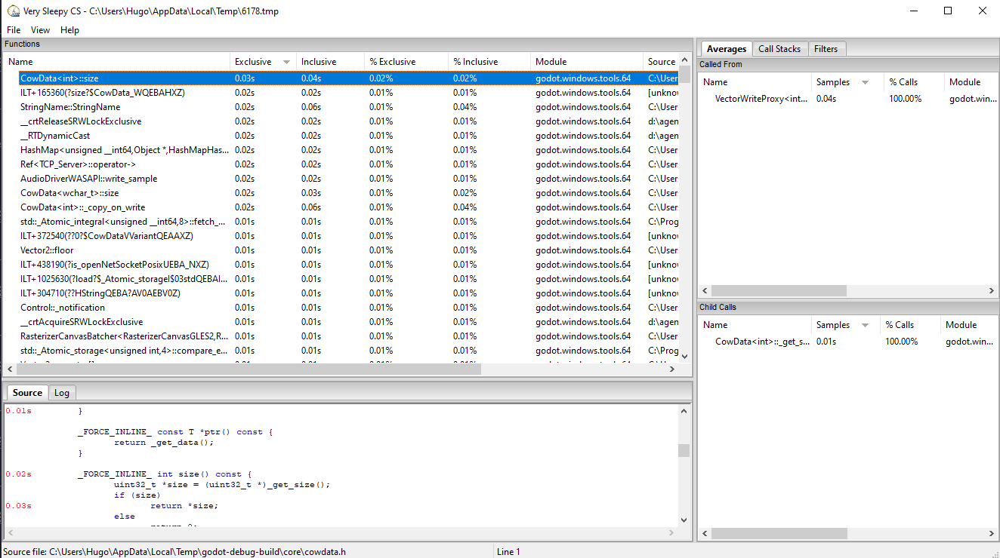

.. _doc_profiler_very_sleepy:

VerySleepy
==========

.. seealso:: Please see the :ref:`sampling profiler instructions <doc_sampling_profilers>` for more information.

- Start the Godot editor or your project first.
  If you start the Project Manager, make sure to edit or run a project first.
  Otherwise, the profiler will not track the child process since the Project Manager
  will spawn a child process for every project edited or run.
- Open `VerySleepy <https://github.com/VerySleepy/verysleepy>`__ and
  select the Godot executable in the list of processes on the left:

.. image:: img/cpp_profiler_verysleepy_select_process.png

- Click the **Profile All** button on the right to start profiling.
- Perform the actions you wish to profile in the editor or project. When you're done, click **Stop** (*not* Abort).
- Wait for the results window to appear.
- Once the results window appears, filter the view to remove external modules (such as the graphics driver).
  You can filter by module by finding a line whose **Module** matches the Godot
  executable name, right-clicking that line then choosing
  **Filter Module to <Godot executable name>** in the dropdown that appears.
- Your results window should now look something like this:

