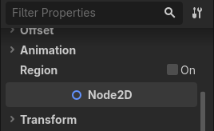
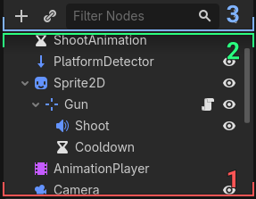
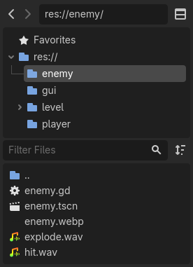

.. _doc_editor_theming:

Editor theming
==============

The editor has two default theme styles: **Modern**, the default starting with
version 4.6; and **Classic**, dating back to version 4.0. Each has a different
way to handle the presentation of the UI to the user, with the former focusing
on having clear, less noisy visuals.

Scroll hints
~~~~~~~~~~~~

Scroll hints were introduced with the Modern theme as a less distracting
alternative to background panels. They are used to show that more content is
available if the user scrolls in the direction the hint is pointing, while also
helping to visually delimit different UI elements:

They should be exclusively used in the Modern theme, and only under the
following conditions:

1. A background panel must not be present.
2. Both sides of the hint (depending if it's horizontal or vertical) should
   touch the borders of the UI element they are inside of.
3. There must be other UI elements on the other side of the hint.

To help with the second rule, UI elements that will be using scroll hints are
placed inside :ref:`MarginContainers <class_MarginContainer>`, those being set
with a specific theme variation that extrudes the contents outside the
container. There are multiple variations made for different border sizes, which
can be found in
`the file for the Modern theme <https://github.com/godotengine/godot/blob/master/editor/themes/theme_modern.cpp>`__,
with the name pattern ``NoBorder*``.

.. note::

    The theme variations are only set in the Modern theme, allowing for them to
    be ignored in the Classic theme, which relies on borders.

Background panels
~~~~~~~~~~~~~~~~~

Background panels are frequently used in the Classic theme to demarcate UI
content, but they still have uses in the Modern theme as well. Mostly, when
scrollable content doesn't fit all the three rules, but also when there are
multiple scrollables next to each other. For example, the FileSystem dock in
split mode:

In the Classic theme, nothing else needs to be done for the panels to show.
In the Modern theme, panels are themed with
:ref:`StyleBoxEmpty <class_StyleBoxEmpty>` (a style that doesn't display
anything), so a theme variation needs to be applied to them in order for panels
to be visible. There are variations for each UI element that contains a panel,
also found in
`the file for the Modern theme <https://github.com/godotengine/godot/blob/master/editor/themes/theme_modern.cpp>`__,
with the name pattern ``*Secondary``.

.. note::

    Just like the variations for scroll hints, these are only set in the Modern
    theme, being ignored in the Classic theme, which just makes use of the
    default panels.
