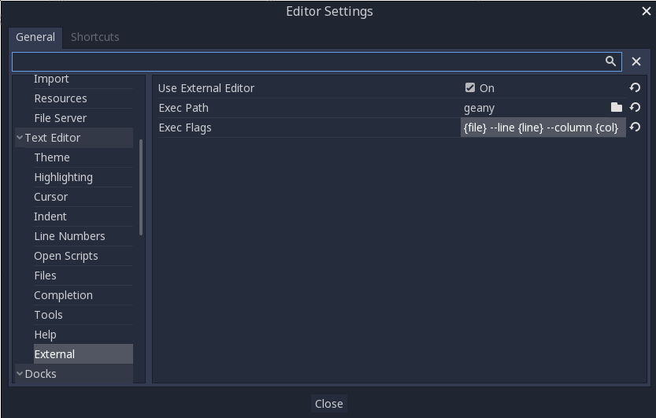

.. _doc_external_editor:

Using an external text editor
==============================

Godot can be used with an external text editor, such as Sublime Text or Visual Studio Code.
To enable an external text editor, browse to the relevant editor settings via:
``Editor -> Editor Settings -> Text Editor -> External``

There are two fields: the executable path and command line flags. The flags
allow you to integrate the editor with Godot, passing it the file path to open
and other relevant arguments. Godot will replace the following placeholders in
the flags string:

+---------------------+-----------------------------------------------------+
| Field in Exec Flags | Is replaced with                                    |
+=====================+=====================================================+
| ``{project}``       | The absolute path to the project directory          |
+---------------------+-----------------------------------------------------+
| ``{file}``          | The absolute path to the file                       |
+---------------------+-----------------------------------------------------+
| ``{col}``           | The column number of the error                      |
+---------------------+-----------------------------------------------------+
| ``{line}``          | The line number of the error                        |
+---------------------+-----------------------------------------------------+

Some example Exec Flags for various editors include:

+---------------------+-----------------------------------------------------+
| Editor              | Exec Flags                                          |
+=====================+=====================================================+
| Geany/Kate          | ``{file} --line {line} --column {col}``             |
+---------------------+-----------------------------------------------------+
| Atom/Sublime Text   | ``{file}:{line}``                                   |
+---------------------+-----------------------------------------------------+
| JetBrains Rider     | ``--line {line} {file}``                            |
+---------------------+-----------------------------------------------------+
| Visual Studio Code  | ``{project} --goto {file}:{line}:{col}``            |
+---------------------+-----------------------------------------------------+
| Vim (gVim)          | ``"+call cursor({line}, {col})" {file}``            |
+---------------------+-----------------------------------------------------+

.. note:: For Visual Studio Code you will have to point to the ``code.cmd`` file.
