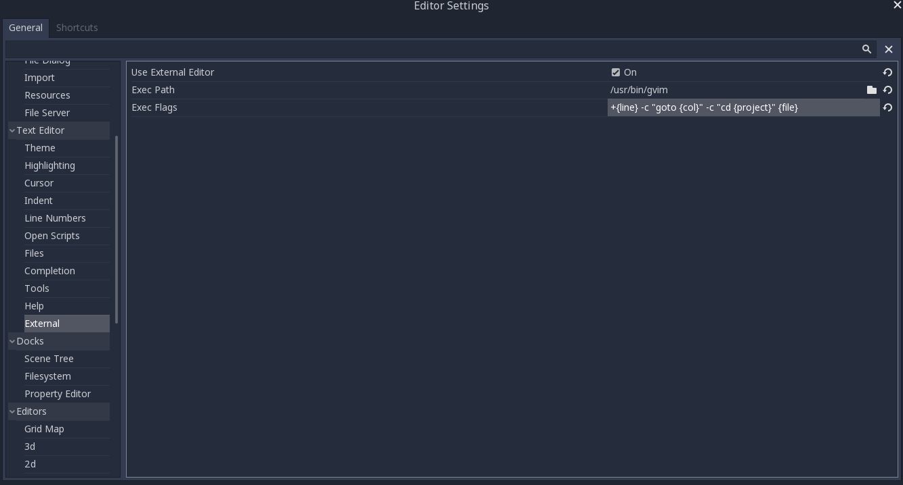

.. _doc_features:

Editor features
===============

Some editor settings or features need further explanation due to their niche status
or simply being Godot-specific.

External Editor
---------------

Setting up an external editor is done via ``Editor->Editor Settings->Text Editor``
dialog. The majority of the fields found there are self-explanatory but some further 
explanation is needed for the ``Exec Flags`` field. The ``Exec Flags`` field is a
string where you can customize the arguments given to the executable in the
``Exec Path`` field. In this string you can use special formatting keywords to get
various pieces of information on the file being opened into the executable's argument
string.

+---------------+-----------------------------------------------+
| Keyword       | Information                                   |
+===============+===============================================+
| file          | The path of the file being opened             |
+---------------+-----------------------------------------------+
| project       | The path to the project directory             |
+---------------+-----------------------------------------------+
| line          | The line number to jump to in the file        |
+---------------+-----------------------------------------------+
| col           | The column of the line to jump to in the file |
+---------------+-----------------------------------------------+

An example of using these with Vim/GVim would be:

