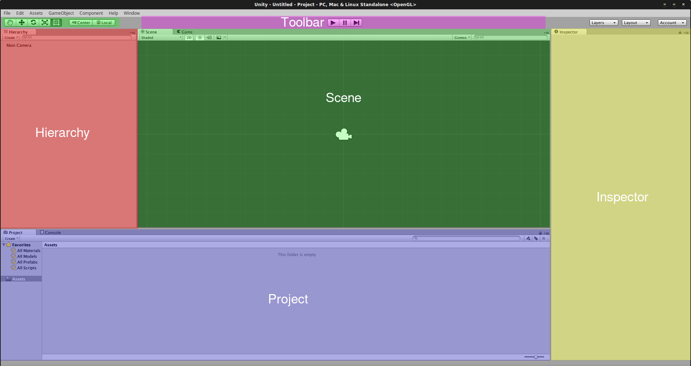
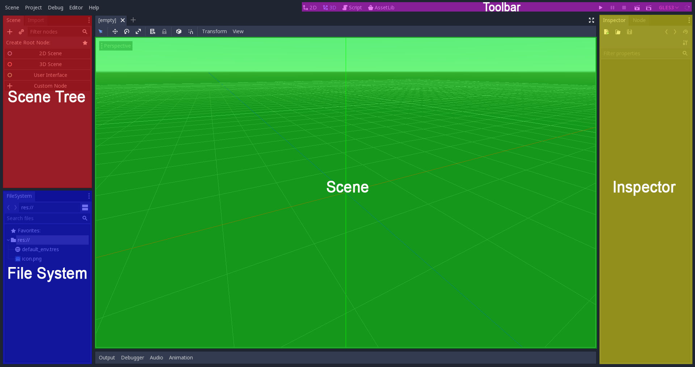
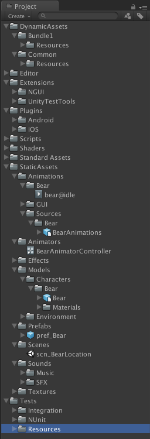
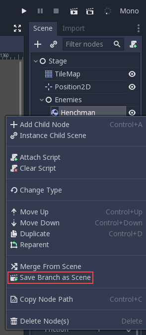
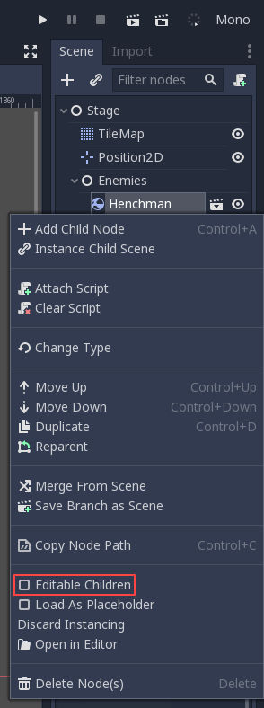

.. _unity_to_godot:

..    references :
..    https://wiki.unrealengine.com/Unity3D_Developer's_Guide_to_Unreal_Engine_4
..    https://docs.unrealengine.com/latest/INT/GettingStarted/FromUnity/

From Unity to Godot Engine
==========================

This guide provides an overview of Godot Engine from the viewpoint of a Unity user,
and aims to help you migrate your existing Unity experience into the world of Godot.

.. note::

   This article talks about older versions of Unity. Nestable prefabs ('Nested prefabs') were added to Unity 2018.3. Nestable prefabs are analogous to Godot's scenes, and allow a more Godot-like approach to scene organization.

Differences
-----------

+-------------------+------------------------------------------------------------------------------------+----------------------------------------------------------------------------------------------------------------+
|                   | Unity                                                                              | Godot                                                                                                          |
+===================+====================================================================================+================================================================================================================+
| License           | Proprietary, closed, free license with revenue caps and usage restrictions         | MIT license, free and fully open source without any restriction                                                |
+-------------------+------------------------------------------------------------------------------------+----------------------------------------------------------------------------------------------------------------+
| OS (editor)       | Windows, macOS, Linux                                                              | Windows, macOS, X11 (Linux, \*BSD)                                                                             |
+-------------------+------------------------------------------------------------------------------------+----------------------------------------------------------------------------------------------------------------+
| OS (export)       | * **Desktop:** Windows, macOS, Linux                                               | * **Desktop:** Windows, macOS, X11                                                                             |
|                   | * **Mobile:** Android, iOS, Windows Phone, Tizen                                   | * **Mobile:** Android, iOS                                                                                     |
|                   | * **Web:** WebAssembly or asm.js                                                   | * **Web:** WebAssembly                                                                                         |
|                   | * **Consoles:** PS4, PS Vita, Xbox One, Xbox 360, Wii U, Nintendo 3DS              | * **Console:** See :ref:`doc_consoles`                                                                         |
|                   | * **VR:** Oculus Rift, SteamVR, Google Cardboard, PlayStation VR, Gear VR, HoloLens| * **VR:** Oculus Rift, SteamVR                                                                                 |
|                   | * **TV:** Android TV, Samsung SMART TV, tvOS                                       |                                                                                                                |
+-------------------+------------------------------------------------------------------------------------+----------------------------------------------------------------------------------------------------------------+
| Scene system      | * Component/Scene (GameObject > Component)                                         | :ref:`Scene tree and nodes <doc_scenes_and_nodes>`, allowing scenes to be nested and/or inherit other scenes   |
|                   | * Prefabs                                                                          |                                                                                                                |
+-------------------+------------------------------------------------------------------------------------+----------------------------------------------------------------------------------------------------------------+
| Third-party tools | Visual Studio or VS Code                                                           | * :ref:`External editors are possible <doc_external_editor>`                                                   |
|                   |                                                                                    | * :ref:`Android SDK for Android export <doc_exporting_for_android>`                                            |
+-------------------+------------------------------------------------------------------------------------+----------------------------------------------------------------------------------------------------------------+
| Notable advantages| * Huge community                                                                   | * Scene System                                                                                                 |
|                   | * Large assets store                                                               | * :ref:`Animation Pipeline <doc_animations>`                                                                   |
|                   |                                                                                    | * :ref:`Easy to write Shaders <doc_shading_language>`                                                          |
|                   |                                                                                    | * Debug on Device                                                                                              |
|                   |                                                                                    |                                                                                                                |
|                   |                                                                                    |                                                                                                                |
+-------------------+------------------------------------------------------------------------------------+----------------------------------------------------------------------------------------------------------------+

The editor
----------

Godot Engine provides a rich-featured editor that allows you to build your games.
The pictures below display the default layouts of both editors with colored blocks to indicate common functionalities.

While both editors may seem similar, there are many differences below the surface.
Both let you organize the project using the filesystem,
but Godot's approach is simpler with a single configuration file, minimalist text format,
and no metadata. This makes Godot more friendly to VCS systems, such as Git, Subversion, or Mercurial.

Godot's Scene panel is similar to Unity's Hierarchy panel but, as each node has a specific function,
the approach used by Godot is more visually descriptive. It's easier to understand
what a scene does at a glance.

The Inspector in Godot is more minimal, it shows only properties.
Thanks to this, objects can expose more useful parameters to the user
without having to hide functionality in language APIs. As a plus, Godot allows animating any of those properties visually.
Changing colors, textures, enumerations, or even links to resources in real-time is possible without needing to write code.

The Toolbar at the top of the screen is similar in both editors, offering control over project playback.
Projects in Godot run in a separate window, rather than inside the editor
(but the tree and objects can still be explored in the debugger window).

This approach has several advantages:

- Running the project and closing it is fast (Unity has to save, run the project, close the project, and then reload the previous state).
- Live editing is a lot more useful because changes done to the editor take effect immediately in the game and are not lost (nor have to be synced) when the game is closed. This allows fantastic workflows, like creating levels while you play them.
- The editor is more stable because the game runs in a separate process.
- The running game can be explored from different angles by toggling the "Camera Override" button in the editor viewport, which will switch between using the editor view and the game camera view.

Finally, Godot's top toolbar includes a menu for remote debugging.
These options allow deployment to a device (connected phone, tablet, or browser via HTML5),
and debugging/live editing on it after the game is exported.

The scene system
----------------

This is the most important difference between Unity and Godot and the favorite feature of most Godot users.

Working on a 'level' in Unity usually means embedding all the required assets in a scene
and linking them together with components and scripts.

Godot's scene system is superficially similar to Unity. A 'level' consists of a collection of nodes, each with its own purpose: Sprite, Mesh, Light, etc. However, in Godot the nodes are arranged in a tree. Each node can have multiple children, which makes each a subscene of the main scene.
This means you can compose a whole scene with different scenes stored in different files.

For example, think of a platformer level. You would compose it with multiple elements:

- Bricks
- Coins
- The player
- The enemies

In Unity, you would put all the GameObjects in the scene: the player, multiple instances of enemies,
bricks everywhere to form the ground of the level and then multiple instances of coins all over the level.
You would then add various components to each element to link them and add logic in the level: For example,
you'd add a BoxCollider2D to all the elements of the scene so that they can collide. This principle is different in Godot.

In Godot, you would split your whole scene into three separate, smaller scenes, and instance them in the main scene.

1. **A scene for the Player alone.**

Consider the player as an element we'd like to use in different parent scenes (for instance 'level' scenes). In our case, the player element needs at least an AnimatedSprite node. This node contains the sprite textures necessary for various animations (for example, a walking animation).

2. **A scene for the Enemy.**

An enemy is also an element we'd like to use in several scenes. It's almost the same
as the Player node. The only differences are the script (it needs 'AI' routines to generate the enemy's behavior)
and the sprite textures used by the AnimatedSprite node.

3. **A Level scene.**

A Level scene is composed of Bricks (for platforms), Coins (for the player to collect) and a
number of instances of the Enemy scene. Each instance is a node in the Level scene tree. These instances are separate enemies,
which initially have shared behavior and appearance as defined in the Enemy scene. You can set different properties for each Enemy node (to change its color, for example).

4. **A Main scene.**
The Main scene would be composed of one root node with 2 children: a Player instance node, and a Level instance node.
The root node can be anything, generally a "root" type such as "Node" which is the most global type,
or "Node2D" (root type of all 2D-related nodes), "Spatial" (root type of all 3D-related nodes) or
"Control" (root type of all GUI-related nodes).

As you can see, every scene is organized as a tree. The same goes for nodes' properties: you don't *add* a
collision component to a node to make it collidable like Unity does. Instead, you make this node a *child* of a
new specific node that has collision properties. Godot features various collision types nodes, depending on the usage
(see the :ref:`Physics introduction <doc_physics_introduction>`).

- What are the advantages of this system? Wouldn't this system potentially increase the depth of the scene tree? And doesn't Unity already allow you to organize GameObjects by putting them inside empty GameObjects?

    - Godot's system is closer to the well-known object-oriented paradigm: Godot provides a number of nodes which are not clearly "Game Objects", but they provide their children with their own capabilities: this is inheritance.
    - Godot allows the extraction of a subtree of a scene to make it a scene of its own. So if a scene tree gets too deep, it can be split into smaller subtrees. This is better for reusability, as you can include any subtree as a child of any node. Putting multiple GameObjects in an empty GameObject in Unity does not provide the same functionality.

Project organization
--------------------

There is no perfect project architecture.
Any architecture can be made to work in either Unity and Godot.

However, a common architecture for Unity projects is to have one Assets folder in the root directory
that contains various folders, one per type of asset: Audio, Graphics, Models, Materials, Scripts, Scenes, and so on.

Since Godot allows splitting scenes into smaller scenes, each scene and subscene existing as a file in the project, we recommend organizing your project a bit differently.
This wiki provides a page for this: :ref:`doc_project_organization`.

Where are my prefabs?
---------------------

A prefab as provided by Unity is a 'template' element of the scene.
It is reusable, and each instance of the prefab that exists in the scene has an existence of its own,
but all of them have the same properties as defined by the prefab.

Godot does not provide prefabs as such, but the same functionality is provided by its scene system:
The scene system is organized as a tree. Godot allows you to save any subtree of a scene as a scene file. This new scene can then be instanced as many times as you want, as a child of any node.
Any change you make to this new, separate scene will be applied to its instances.
However, any change you make to the instance will not have any impact on the 'template' scene.

To be precise, you can modify the parameters of an instance in the Inspector panel.
The nodes that compose this instance are initially locked. You can unlock them if you need to by
right-clicking the instance in the Scene tree and selecting "Editable children" in the menu.
You don't need to do this to add *new* child nodes to this node.
Remember that any new children will belong to the instance, not to the 'template' scene on disk.
If you want to add new children to every instance of your 'template' scene, then you should add them in the 'template' scene.

Glossary correspondence
-----------------------

- GameObject -> Node
- Add a component -> Inheriting
- Prefab -> Reusable Scene file

Scripting: GDScript, C# and Visual Script
-----------------------------------------

Design
^^^^^^

Unity supports C#. C# benefits from its integration with Visual Studio and has desirable features such as static typing.

Godot provides its own scripting language, :ref:`GDScript <doc_scripting>` as well as support
for :ref:`Visual Script <toc-learn-scripting-visual_script>` and :ref:`C# <doc_c_sharp>`.
GDScript borrows its syntax from Python, but is not related to it. If you wonder about the reasoning for a custom scripting language,
please read the :ref:`doc_gdscript` and :ref:`doc_faq` pages. GDScript is strongly attached to the Godot API
and doesn't take long to learn: Between one evening for an experienced programmer and a week for a complete beginner.

Unity allows you to attach as many scripts as you want to a GameObject.
Each script adds a behavior to the GameObject: For example, you can attach a script so that it reacts to the player's controls,
and another that controls its specific game logic.

In Godot, you can only attach one script per node. You can use either an external GDScript file
or include the script directly in the node. If you need to attach more scripts to one node, then you may consider two solutions,
depending on your scene and on what you want to achieve:

- either add a new node between your target node and its current parent, then add a script to this new node.
- or, you can split your target node into multiple children and attach one script to each of them.

As you can see, it can be easy to turn a scene tree to a mess. Consider splitting any complicated scene into multiple, smaller branches.

Connections: groups and signals
^^^^^^^^^^^^^^^^^^^^^^^^^^^^^^^

You can control nodes by accessing them via script and calling built-in
or user-defined functions on them. You can also place nodes in a group
and call functions on all nodes in this group. See more in the
:ref:`scripting documentation <doc_scripting_continued>`.

Nodes can send a signal when a specified action occurs. A signal can
be set to call any function. You can define custom signals and specify
when they are triggered. See more in the :ref:`signals documentation <doc_gdscript_signals>`.

Script serialization
^^^^^^^^^^^^^^^^^^^^

Unity can handle script serialization in two ways:

- Implicit: All public fields in a class are automatically serialized if the type is a serializable type (``Dictionary`` is not serializable).
- Explicit: Non-public fields can be serialized using the ``[SerializeField]`` attribute.

Godot also has a built-in script serialization system, but it works only explicitly.
You can serialize any serializable type (:ref:`built-in and various engine types <doc_binary_serialization_api>`,
including :ref:`class_Array` and :ref:`class_Dictionary`) using the ``export`` keyword.
See the :ref:`exports documentation <doc_gdscript_exports>` for details.

Unity also has a data type called ``ScriptableObject`` used to serialize custom asset objects.
Its equivalent in Godot is the base class for all resources: :ref:`class_Resource`.
Creating a script that inherits :ref:`class_Resource` will allow you to create custom serializable objects. More information about resources can be found :ref:`here <doc_resources>`.

Using Godot in C++
------------------

Godot allows you to develop your project directly in C++ by using its API, which is not possible with Unity at the moment.
As an example, you can consider Godot Engine's editor as a "game" written in C++ using the Godot API.

If you are interested in using Godot in C++, you may want to start reading the :ref:`Developing in
C++ <doc_introduction_to_godot_development>` page.
