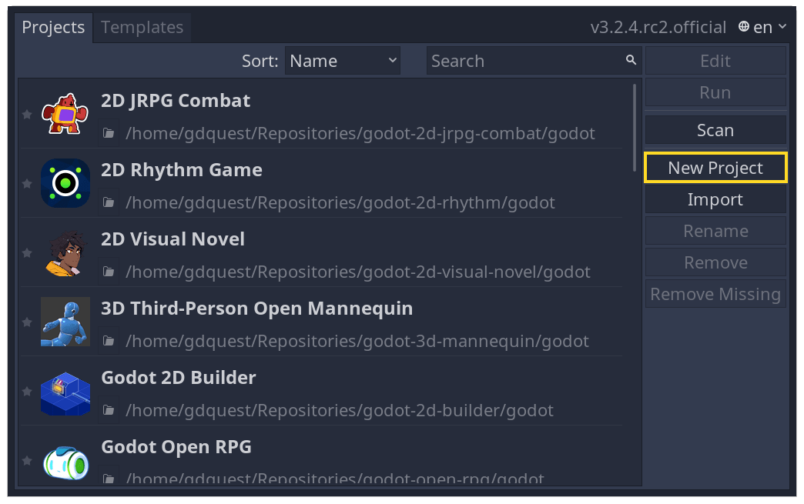
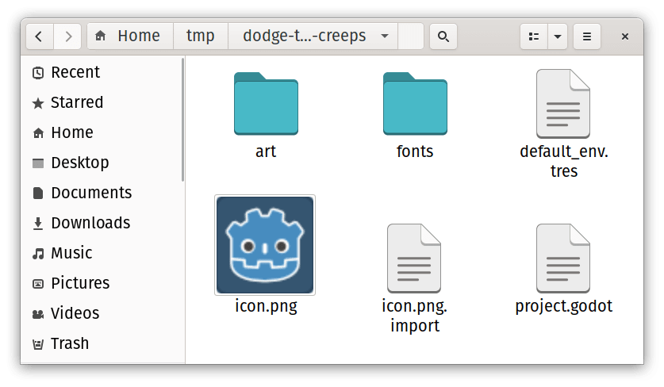
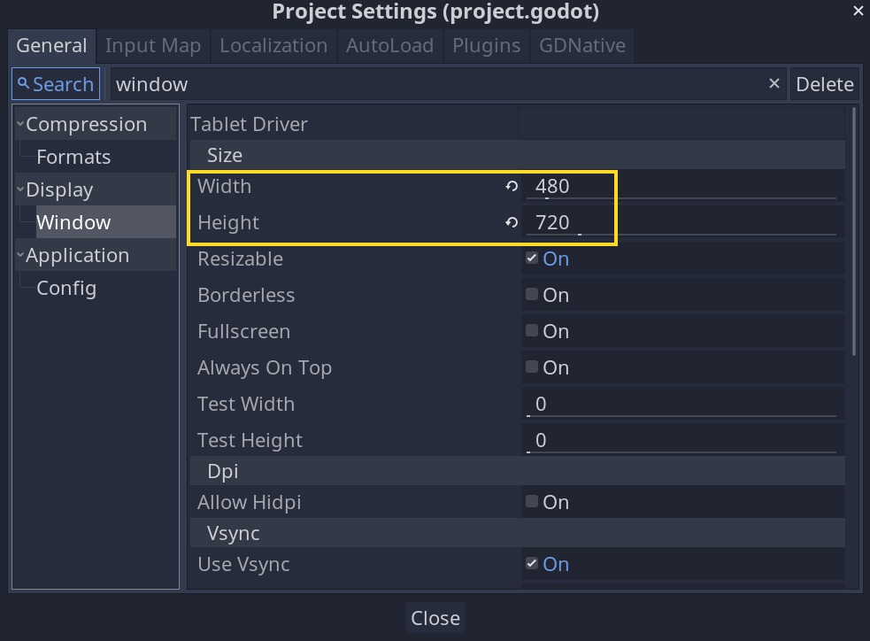
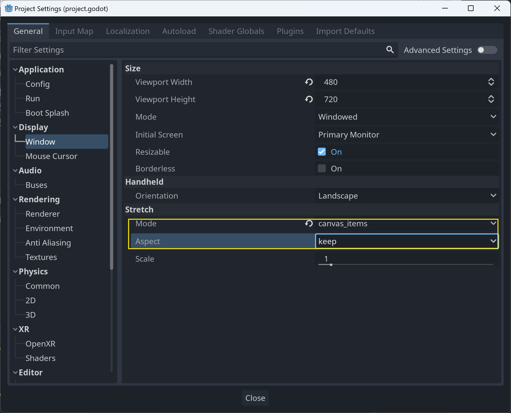
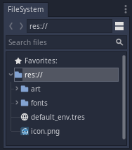

.. _doc_your_first_2d_game_project_setup:

Setting up the project
======================

In this short first part, we'll set up and organize the project.

Launch Godot and create a new project.

.. tabs::
 .. tab:: GDScript

    Download :download:`dodge_assets.zip <files/dodge_assets.zip>`.
    The archive contains the images and sounds you'll be using
    to make the game. Extract the archive and move the ``art/``
    and ``fonts/`` directories to your project's directory.

 .. tab:: C#

    Download :download:`dodge_assets.zip <files/dodge_assets.zip>`.
    The archive contains the images and sounds you'll be using
    to make the game. Extract the archive and move the ``art/``
    and ``fonts/`` directories to your project's directory.

    Ensure that you have the required dependencies to use C# in Godot.
    You need the .NET Core 3.1 SDK, and an editor such as VS Code.
    See :ref:`doc_c_sharp_setup`.

 .. tab:: GDNative C++

    Download :download:`dodge_assets_with_gdnative.zip
    <files/dodge_assets_with_gdnative.zip>`.
    The archive contains the images and sounds you'll be using
    to make the game. It also contains a starter GDNative project
    including a ``SConstruct`` file, a ``dodge_the_creeps.gdnlib``
    file, a ``player.gdns`` file, and an ``entry.cpp`` file.

    Ensure that you have the required dependencies to use GDNative C++.
    You need a C++ compiler such as GCC or Clang or MSVC that supports C++14.
    On Windows you can download Visual Studio 2019 and select the C++ workload.
    You also need SCons to use the build system (the SConstruct file).
    Then you need to `download the Godot C++ bindings <https://github.com/godotengine/godot-cpp>`_
    and place them in your project.

Your project folder should look like this.

Because this game is meant to be played in portrait mode, we'll need to change the size of the game window. To open the project settings window, go to *Project -> Project Settings* and then to the *Display -> Window* tab in the left column. Set the "Width" and "Height" to 480 and 720 pixels, respectively.

Also, scroll down to the bottom of the section and, under the "Stretch" options,
set ``Mode`` to "2d" and ``Aspect`` to "keep". This ensures that the game scales
consistently on different sized screens.

Organizing the project
~~~~~~~~~~~~~~~~~~~~~~

In this project, we will make 3 independent scenes: ``Player``, ``Mob``, and
``HUD``, which we will combine into the game's ``Main`` scene.

Creating folders to hold the many scenes and their scripts would be beneficial in a larger project, but for this relatively tiny game, you can save your scenes and scripts in the project's root folder, indicated by res:/. In the FileSystem dock in the lower left corner, you can see your project folders:

With the project in place, we're ready to design the player scene in the next lesson.
