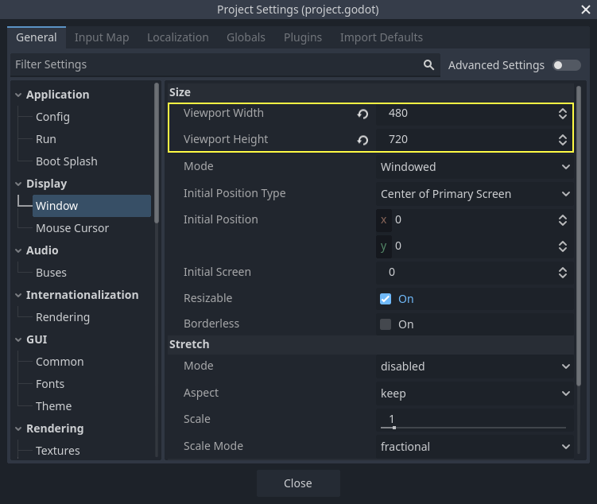
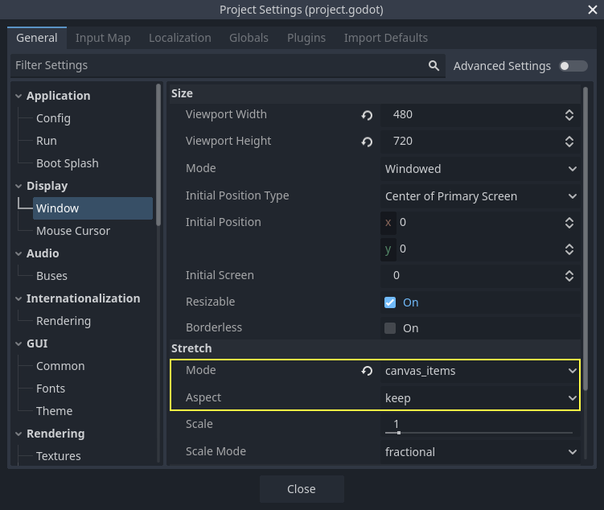

.. _doc_your_first_2d_game_project_setup:

Setting up the project
======================

In this short first part, we'll set up and organize the project.

Launch Godot and create a new project.

.. image:: img/new-project-button.webp

When creating the new project, you only need to choose a valid *Project Path*. You can leave the other default settings alone.

.. tabs::
 .. tab:: GDScript

    Download `dodge_the_creeps_2d_assets.zip <https://github.com/godotengine/godot-docs-project-starters/releases/download/latest-4.x/dodge_the_creeps_2d_assets.zip>`_.
    The archive contains the images and sounds you'll be using
    to make the game. Extract the archive and move the ``art/``
    and ``fonts/`` directories to your project's directory.

 .. tab:: C#

    Download `dodge_the_creeps_2d_assets.zip <https://github.com/godotengine/godot-docs-project-starters/releases/download/latest-4.x/dodge_the_creeps_2d_assets.zip>`_.
    The archive contains the images and sounds you'll be using
    to make the game. Extract the archive and move the ``art/``
    and ``fonts/`` directories to your project's directory.

    Ensure that you have the required dependencies to use C# in Godot.
    You need the latest stable .NET SDK, and an editor such as VS Code.
    See :ref:`doc_c_sharp_setup`.

 .. tab:: C++

    The C++ part of this tutorial wasn't rewritten for the new GDExtension system yet.

Your project folder should look like this.

.. image:: img/folder-content.webp

This game is designed for portrait mode, so we need to adjust the size of the
game window. Click on *Project -> Project Settings* to open the project settings
window, in the left column open the *Display -> Window* tab. There, set
"Viewport Width" to ``480`` and "Viewport Height" to ``720``.

Also, under the **Stretch** options, set **Mode** to ``canvas_items`` and **Aspect** to ``keep``.
This ensures that the game scales consistently on different sized screens.

Organizing the project
~~~~~~~~~~~~~~~~~~~~~~

In this project, we will make 3 independent scenes: ``Player``, ``Mob``, and
``HUD``, which we will combine into the game's ``Main`` scene.

In a larger project, it might be useful to create folders to hold the various
scenes and their scripts, but for this relatively small game, you can save your
scenes and scripts in the project's root folder, identified by ``res://``. You
can see your project folders in the FileSystem dock in the lower left corner:

.. image:: img/filesystem_dock.webp

With the project in place, we're ready to design the player scene in the next lesson.
