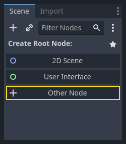
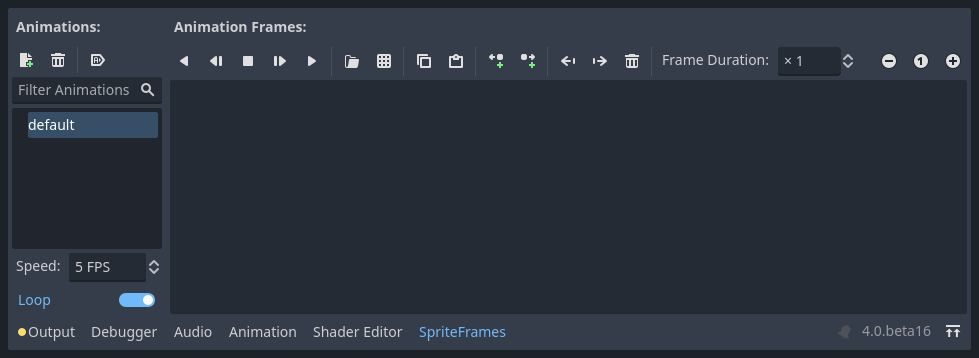
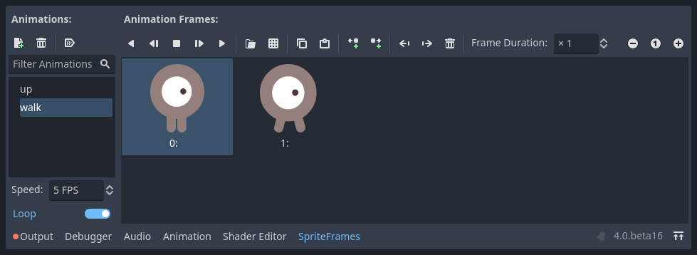
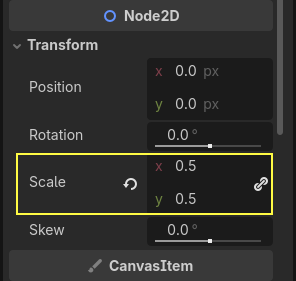
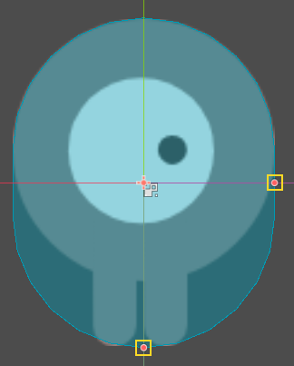

.. _doc_your_first_2d_game_player_scene:

Creating the player scene
=========================

With the project settings in place, we can start working on the
player-controlled character.

The first scene will define the ``Player`` object. One of the benefits of
creating a separate Player scene is that we can test it separately, even before
we've created other parts of the game.

Node structure
~~~~~~~~~~~~~~

To begin, we need to choose a root node for the player object. As a general
rule, a scene's root node should reflect the object's desired functionality -
what the object *is*. Click the "Other Node" button and add an :ref:`Area2D
<class_Area2D>` node to the scene.

Godot will display a warning icon next to the node in the scene tree. You can
ignore it for now. We will address it later.

With ``Area2D`` we can detect objects that overlap or run into the player.
Change the node's name to ``Player`` by double-clicking on it. Now that we've
set the scene's root node, we can add additional nodes to give it more
functionality.

Before we add any children to the ``Player`` node, we want to make sure we don't
accidentally move or resize them by clicking on them. Select the node and click
the icon to the right of the lock. Its tooltip says "Groups the selected node 
with its children. This causes the parent to be to be selected when any child
node is clicked in 2D and 3D view."

.. image:: img/lock_children.webp

Save the scene. Click Scene -> Save, or press :kbd:`Ctrl + S` on Windows/Linux
or :kbd:`Cmd + S` on macOS.

.. note:: For this project, we will be following the Godot naming conventions.

          - **GDScript**: Classes (nodes) use PascalCase, variables and
            functions use snake_case, and constants use ALL_CAPS (See
            :ref:`doc_gdscript_styleguide`).

          - **C#**: Classes, export variables and methods use PascalCase,
            private fields use _camelCase, local variables and parameters use
            camelCase (See :ref:`doc_c_sharp_styleguide`). Be careful to type
            the method names precisely when connecting signals.

Sprite animation
~~~~~~~~~~~~~~~~

Click on the ``Player`` node and add (:kbd:`Ctrl + A` on Windows/Linux or
:kbd:`Cmd + A` on macOS) a child node :ref:`AnimatedSprite2D
<class_AnimatedSprite2D>`. The ``AnimatedSprite2D`` will handle the
appearance and animations for our player. Notice that there is a warning symbol
next to the node. An ``AnimatedSprite2D`` requires a :ref:`SpriteFrames
<class_SpriteFrames>` resource, which is a list of the animations it can
display. To create one, find the ``Sprite Frames`` property under the ``Animation`` tab in the Inspector and click
"[empty]" -> "New SpriteFrames". Click on the ``SpriteFrames`` you just
created to open the "SpriteFrames" panel:

On the left is a list of animations. Click the "default" one and rename it to
"walk". Then click the "Add Animation" button to create a second animation named
"up". Find the player images in the "FileSystem" tab - they're in the ``art``
folder you unzipped earlier. Drag the two images for each animation, named
``playerGrey_up[1/2]`` and ``playerGrey_walk[1/2]``, into the "Animation Frames"
side of the panel for the corresponding animation:

The player images are a bit too large for the game window, so we need to scale
them down. Click on the ``AnimatedSprite2D`` node and set the ``Scale`` property
to ``(0.5, 0.5)``. You can find it in the Inspector under the ``Node2D``
heading.

Finally, add a :ref:`CollisionShape2D <class_CollisionShape2D>` as a child of
``Player``. This will determine the player's "hitbox", or the bounds of its
collision area. For this character, a ``CapsuleShape2D`` node gives the best
fit, so next to "Shape" in the Inspector, click "[empty]" -> "New
CapsuleShape2D". Using the two size handles, resize the shape to cover the
sprite:

When you're finished, your ``Player`` scene should look like this:

.. image:: img/player_scene_nodes.webp

Make sure to save the scene again after these changes.

In the next part, we'll add a script to the player node to move and animate it.
Then, we'll set up collision detection to know when the player got hit by
something.
