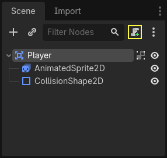
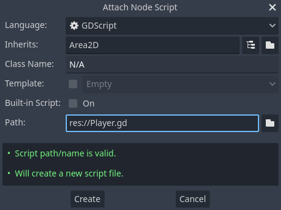
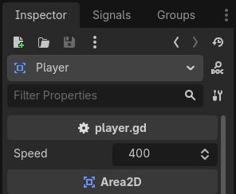
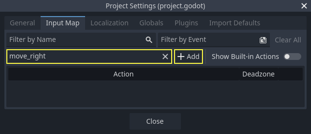
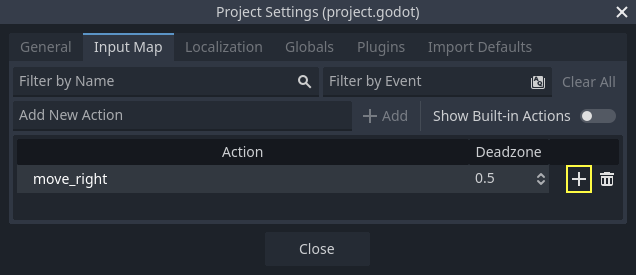
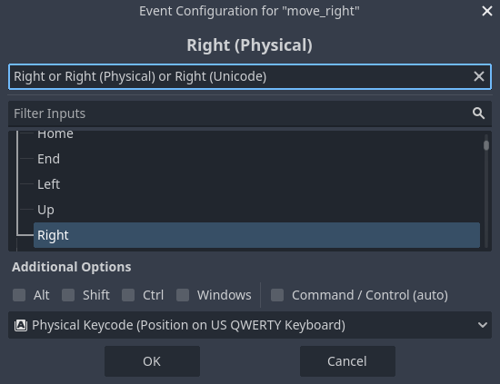
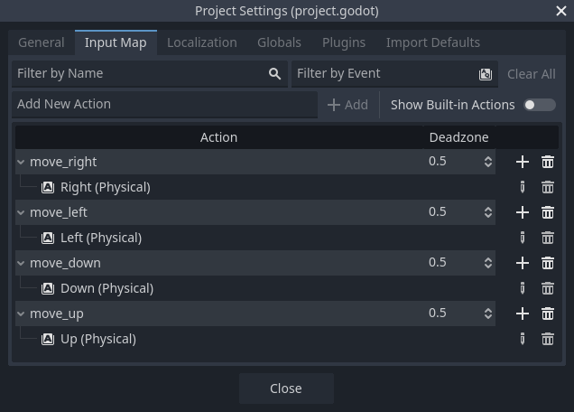
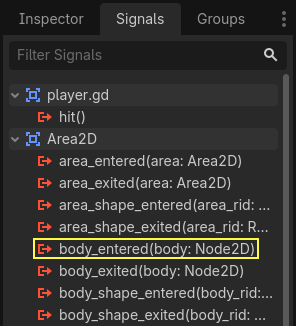
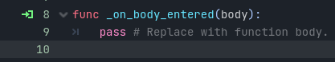

.. _doc_your_first_2d_game_coding_the_player:

Coding the player
=================

In this lesson, we'll add player movement, animation, and set it up to detect
collisions.

To do so, we need to add some functionality that we can't get from a built-in
node, so we'll add a script. Click the ``Player`` node and click the "Attach
Script" button:

In the script settings window, you can leave the default settings alone. Just
click "Create":

.. note:: If you're creating a C# script or other languages, select the language
          from the `language` drop down menu before hitting create.

.. note:: If this is your first time encountering GDScript, please read
          :ref:`doc_scripting` before continuing.

Start by declaring the member variables this object will need:

.. tabs::
 .. code-tab:: gdscript GDScript

    extends Area2D

    @export var speed = 400 # How fast the player will move (pixels/sec).
    var screen_size # Size of the game window.

 .. code-tab:: csharp

    using Godot;

    public partial class Player : Area2D
    {
        [Export]
        public int Speed { get; set; } = 400; // How fast the player will move (pixels/sec).

        public Vector2 ScreenSize; // Size of the game window.
    }

Using the ``export`` keyword on the first variable ``speed`` allows us to set
its value in the Inspector. This can be handy for values that you want to be
able to adjust just like a node's built-in properties. Click on the ``Player``
node and you'll see the property now appears in the Inspector in a new section
with the name of the script. Remember, if you change the value here, it will
override the value written in the script.

.. warning::

    If you're using C#, you need to (re)build the project assemblies
    whenever you want to see new export variables or signals. This
    build can be manually triggered by clicking the **Build** button at
    the top right of the editor.

    .. image:: img/build_dotnet.webp

Your ``player.gd`` script should already contain
a ``_ready()`` and a ``_process()`` function.
If you didn't select the default template shown above,
create these functions while following the lesson.

The ``_ready()`` function is called when a node enters the scene tree, which is
a good time to find the size of the game window:

.. tabs::
 .. code-tab:: gdscript GDScript

    func _ready():
        screen_size = get_viewport_rect().size

 .. code-tab:: csharp

    public override void _Ready()
    {
        ScreenSize = GetViewportRect().Size;
    }

Now we can use the ``_process()`` function to define what the player will do.
``_process()`` is called every frame, so we'll use it to update elements of our
game, which we expect will change often. For the player, we need to do the
following:

- Check for input.
- Move in the given direction.
- Play the appropriate animation.

First, we need to check for input - is the player pressing a key? For this game,
we have 4 direction inputs to check. Input actions are defined in the Project
Settings under "Input Map". Here, you can define custom events and assign
different keys, mouse events, or other inputs to them. For this game, we will
map the arrow keys to the four directions.

Click on *Project -> Project Settings* to open the project settings window and
click on the *Input Map* tab at the top. Type "move_right" in the top bar and
click the "Add" button to add the ``move_right`` action.

We need to assign a key to this action. Click the "+" icon on the right, to
open the event manager window.

The "Listening for Input..." field should automatically be selected.
Press the "right" key on your keyboard, and the menu should look like this now.

Select the "ok" button. The "right" key is now associated with the ``move_right`` action.

Repeat these steps to add three more mappings:

1. ``move_left`` mapped to the left arrow key.
2. ``move_up`` mapped to the up arrow key.
3. And ``move_down`` mapped to the down arrow key.

Your input map tab should look like this:

Click the "Close" button to close the project settings.

.. note::

   We only mapped one key to each input action, but you can map multiple keys,
   joystick buttons, or mouse buttons to the same input action.

You can detect whether a key is pressed using ``Input.is_action_pressed()``,
which returns ``true`` if it's pressed or ``false`` if it isn't.

.. tabs::
 .. code-tab:: gdscript GDScript

    func _process(delta):
        var velocity = Vector2.ZERO # The player's movement vector.
        if Input.is_action_pressed("move_right"):
            velocity.x += 1
        if Input.is_action_pressed("move_left"):
            velocity.x -= 1
        if Input.is_action_pressed("move_down"):
            velocity.y += 1
        if Input.is_action_pressed("move_up"):
            velocity.y -= 1

        if velocity.length() > 0:
            velocity = velocity.normalized() * speed
            $AnimatedSprite2D.play()
        else:
            $AnimatedSprite2D.stop()

 .. code-tab:: csharp

    public override void _Process(double delta)
    {
        var velocity = Vector2.Zero; // The player's movement vector.

        if (Input.IsActionPressed("move_right"))
        {
            velocity.X += 1;
        }

        if (Input.IsActionPressed("move_left"))
        {
            velocity.X -= 1;
        }

        if (Input.IsActionPressed("move_down"))
        {
            velocity.Y += 1;
        }

        if (Input.IsActionPressed("move_up"))
        {
            velocity.Y -= 1;
        }

        var animatedSprite2D = GetNode<AnimatedSprite2D>("AnimatedSprite2D");

        if (velocity.Length() > 0)
        {
            velocity = velocity.Normalized() * Speed;
            animatedSprite2D.Play();
        }
        else
        {
            animatedSprite2D.Stop();
        }
    }

We start by setting the ``velocity`` to ``(0, 0)`` - by default, the player
should not be moving. Then we check each input and add/subtract from the
``velocity`` to obtain a total direction. For example, if you hold ``right`` and
``down`` at the same time, the resulting ``velocity`` vector will be ``(1, 1)``.
In this case, since we're adding a horizontal and a vertical movement, the
player would move *faster* diagonally than if it just moved horizontally.

We can prevent that if we *normalize* the velocity, which means we set its
*length* to ``1``, then multiply by the desired speed. This means no more fast
diagonal movement.

.. tip:: If you've never used vector math before, or need a refresher, you can
         see an explanation of vector usage in Godot at :ref:`doc_vector_math`.
         It's good to know but won't be necessary for the rest of this tutorial.

We also check whether the player is moving so we can call ``play()`` or
``stop()`` on the AnimatedSprite2D.

.. tip:: ``$`` is shorthand for ``get_node()``. So in the code above,
         ``$AnimatedSprite2D.play()`` is the same as
         ``get_node("AnimatedSprite2D").play()``.

         In GDScript, ``$`` returns the node at the relative path from the
         current node, or returns ``null`` if the node is not found. Since
         AnimatedSprite2D is a child of the current node, we can use
         ``$AnimatedSprite2D``.

Now that we have a movement direction, we can update the player's position. We
can also use ``clamp()`` to prevent it from leaving the screen. *Clamping* a
value means restricting it to a given range. Add the following to the bottom of
the ``_process`` function (make sure it's not indented under the `else`):

.. tabs::
 .. code-tab:: gdscript GDScript

        position += velocity * delta
        position = position.clamp(Vector2.ZERO, screen_size)

 .. code-tab:: csharp

        Position += velocity * (float)delta;
        Position = new Vector2(
            x: Mathf.Clamp(Position.X, 0, ScreenSize.X),
            y: Mathf.Clamp(Position.Y, 0, ScreenSize.Y)
        );

.. tip:: The `delta` parameter in the `_process()` function refers to the *frame
        length* - the amount of time that the previous frame took to complete.
        Using this value ensures that your movement will remain consistent even
        if the frame rate changes.

Click "Play Scene" (:kbd:`F6`, :kbd:`Cmd + R` on macOS) and confirm you can move
the player around the screen in all directions.

.. warning:: If you get an error in the "Debugger" panel that says

            ``Attempt to call function 'play' in base 'null instance' on a null
            instance``

            this likely means you spelled the name of the AnimatedSprite2D node
            wrong. Node names are case-sensitive and ``$NodeName`` must match
            the name you see in the scene tree.

Choosing animations
~~~~~~~~~~~~~~~~~~~

Now that the player can move, we need to change which animation the
AnimatedSprite2D is playing based on its direction. We have the "walk" animation,
which shows the player walking to the right. This animation should be flipped
horizontally using the ``flip_h`` property for left movement. We also have the
"up" animation, which should be flipped vertically with ``flip_v`` for downward
movement. Let's place this code at the end of the ``_process()`` function:

.. tabs::
 .. code-tab:: gdscript GDScript

        if velocity.x != 0:
            $AnimatedSprite2D.animation = "walk"
            $AnimatedSprite2D.flip_v = false
            # See the note below about the following boolean assignment.
            $AnimatedSprite2D.flip_h = velocity.x < 0
        elif velocity.y != 0:
            $AnimatedSprite2D.animation = "up"
            $AnimatedSprite2D.flip_v = velocity.y > 0

 .. code-tab:: csharp

        if (velocity.X != 0)
        {
            animatedSprite2D.Animation = "walk";
            animatedSprite2D.FlipV = false;
            // See the note below about the following boolean assignment.
            animatedSprite2D.FlipH = velocity.X < 0;
        }
        else if (velocity.Y != 0)
        {
            animatedSprite2D.Animation = "up";
            animatedSprite2D.FlipV = velocity.Y > 0;
        }

.. Note:: The boolean assignments in the code above are a common shorthand for
          programmers. Since we're doing a comparison test (boolean) and also
          *assigning* a boolean value, we can do both at the same time. Consider
          this code versus the one-line boolean assignment above:

          .. tabs::
           .. code-tab :: gdscript GDScript

             if velocity.x < 0:
                 $AnimatedSprite2D.flip_h = true
             else:
                 $AnimatedSprite2D.flip_h = false

           .. code-tab:: csharp

             if (velocity.X < 0)
             {
                 animatedSprite2D.FlipH = true;
             }
             else
             {
                 animatedSprite2D.FlipH = false;
             }

Play the scene again and check that the animations are correct in each of the
directions.

.. tip:: A common mistake here is to type the names of the animations wrong. The
        animation names in the SpriteFrames panel must match what you type in
        the code. If you named the animation ``"Walk"``, you must also use a
        capital "W" in the code.

When you're sure the movement is working correctly, add this line to
``_ready()``, so the player will be hidden when the game starts:

.. tabs::
 .. code-tab:: gdscript GDScript

    hide()

 .. code-tab:: csharp

    Hide();

Preparing for collisions
~~~~~~~~~~~~~~~~~~~~~~~~

We want ``Player`` to detect when it's hit by an enemy, but we haven't made any
enemies yet! That's OK, because we're going to use Godot's *signal*
functionality to make it work.

Add the following at the top of the script. If you're using GDScript, add it after
``extends Area2D``. If you're using C#, add it after ``public partial class Player : Area2D``:

.. tabs::
 .. code-tab:: gdscript GDScript

    signal hit

 .. code-tab:: csharp

    // Don't forget to rebuild the project so the editor knows about the new signal.

    [Signal]
    public delegate void HitEventHandler();

This defines a custom signal called "hit" that we will have our player emit
(send out) when it collides with an enemy. We will use ``Area2D`` to detect the
collision. Select the ``Player`` node and click the "Node" tab next to the
Inspector tab to see the list of signals the player can emit:

Notice our custom "hit" signal is there as well! Since our enemies are going to
be ``RigidBody2D`` nodes, we want the ``body_entered(body: Node2D)`` signal. This
signal will be emitted when a body contacts the player. Click "Connect.." and
the "Connect a Signal" window appears.

Godot will create a function with that exact name directly in script
for you. You don't need to change the default settings right now.

.. warning::

    .. The issue for this bug is #41283

    If you're using an external text editor (for example, Visual Studio Code),
    a bug currently prevents Godot from doing so. You'll be sent to your external
    editor, but the new function won't be there.

    In this case, you'll need to write the function yourself into the Player's
    script file.

Note the green icon indicating that a signal is connected to this function; this does
not mean the function exists, only that the signal will attempt to connect to a function
with that name, so double-check that the spelling of the function matches exactly!

Next, add this code to the function:

.. tabs::
 .. code-tab:: gdscript GDScript

    func _on_body_entered(body):
        hide() # Player disappears after being hit.
        hit.emit()
        # Must be deferred as we can't change physics properties on a physics callback.
        $CollisionShape2D.set_deferred("disabled", true)

 .. code-tab:: csharp

    // We also specified this function name in PascalCase in the editor's connection window.
    private void OnBodyEntered(Node2D body)
    {
        Hide(); // Player disappears after being hit.
        EmitSignal(SignalName.Hit);
        // Must be deferred as we can't change physics properties on a physics callback.
        GetNode<CollisionShape2D>("CollisionShape2D").SetDeferred(CollisionShape2D.PropertyName.Disabled, true);
    }

Each time an enemy hits the player, the signal is going to be emitted. We need
to disable the player's collision so that we don't trigger the ``hit`` signal
more than once.

.. Note:: Disabling the area's collision shape can cause an error if it happens
          in the middle of the engine's collision processing. Using
          ``set_deferred()`` tells Godot to wait to disable the shape until it's
          safe to do so.

The last piece is to add a function we can call to reset the player when
starting a new game.

.. tabs::
 .. code-tab:: gdscript GDScript

    func start(pos):
        position = pos
        show()
        $CollisionShape2D.disabled = false

 .. code-tab:: csharp

    public void Start(Vector2 position)
    {
        Position = position;
        Show();
        GetNode<CollisionShape2D>("CollisionShape2D").Disabled = false;
    }

With the player working, we'll work on the enemy in the next lesson.
