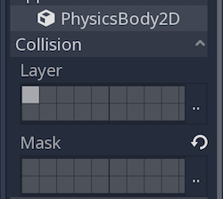

.. _doc_your_first_2d_game_creating_the_enemy:

Creating the enemy
==================

Now it's time to make the enemies our player will have to dodge. Their behavior
will not be very complex: mobs will spawn randomly at the edges of the screen,
choose a random direction, and move in a straight line.

We'll create a ``Mob`` scene, which we can then *instance* to create any number
of independent mobs in the game.

Node setup
~~~~~~~~~~

Click Scene -> New Scene and add the following nodes:

- :ref:`RigidBody2D <class_RigidBody2D>` (named ``Mob``)

   - :ref:`AnimatedSprite <class_AnimatedSprite>`
   - :ref:`CollisionShape2D <class_CollisionShape2D>`
   - :ref:`VisibilityNotifier2D <class_VisibilityNotifier2D>`

Don't forget to set the children so they can't be selected, like you did with
the Player scene.

In the :ref:`RigidBody2D <class_RigidBody2D>` properties, set ``Gravity Scale``
to ``0``, so the mob will not fall downward. In addition, under the
``PhysicsBody2D`` section, click the ``Mask`` property and uncheck the first
box. This will ensure the mobs do not collide with each other.

Set up the :ref:`AnimatedSprite <class_AnimatedSprite>` like you did for the
player. This time, we have 3 animations: ``fly``, ``swim``, and ``walk``. There
are two images for each animation in the art folder.

Adjust the "Speed (FPS)" to ``3`` for all animations.

.. image:: img/mob_animations.gif

Set the ``Playing`` property in the Inspector to "On".

We'll select one of these animations randomly so that the mobs will have some
variety.

Like the player images, these mob images need to be scaled down. Set the
``AnimatedSprite``'s ``Scale`` property to ``(0.75, 0.75)``.

As in the ``Player`` scene, add a ``CapsuleShape2D`` for the collision. To align
the shape with the image, you'll need to set the ``Rotation Degrees`` property
to ``90`` (under "Transform" in the Inspector).

Save the scene.

Enemy script
~~~~~~~~~~~~

Add a script to the ``Mob`` and add the following member variables:

.. tabs::
 .. code-tab:: gdscript GDScript

    extends RigidBody2D

    export var min_speed = 150  # Minimum speed range.
    export var max_speed = 250  # Maximum speed range.

 .. code-tab:: csharp

    public class Mob : RigidBody2D
    {
        // Don't forget to rebuild the project so the editor knows about the new export variables.

        [Export]
        public int MinSpeed = 150; // Minimum speed range.

        [Export]
        public int MaxSpeed = 250; // Maximum speed range.
    }

When we spawn a mob, we'll pick a random value between ``min_speed`` and
``max_speed`` for how fast each mob will move (it would be boring if they were
all moving at the same speed).

Now let's look at the rest of the script. In ``_ready()`` we play the animation
and randomly choose one of the three animation types:

.. tabs::
 .. code-tab:: gdscript GDScript

    func _ready():
        $AnimatedSprite.playing = true
        var mob_types = $AnimatedSprite.frames.get_animation_names()
        $AnimatedSprite.animation = mob_types[randi() % mob_types.size()]

 .. code-tab:: csharp

    public override void _Ready()
    {
        var animSprite = GetNode<AnimatedSprite>("AnimatedSprite");
        animSprite.Playing = true;
        string[] mobTypes = animSprite.Frames.GetAnimationNames();
        animSprite.Animation = mobTypes[GD.Randi() % mobTypes.Length];
    }

First, we get the list of animation names from the AnimatedSprite's ``frames``
property. This returns an Array containing all three animation names: ``["walk",
"swim", "fly"]``.

We then need to pick a random number between ``0`` and ``2`` to select one of
these names from the list (array indices start at ``0``). ``randi() % n``
selects a random integer between ``0`` and ``n-1``.

.. note:: You must use ``randomize()`` if you want your sequence of "random"
            numbers to be different every time you run the scene. We're going to
            use ``randomize()`` in our ``Main`` scene, so we won't need it here.

The last piece is to make the mobs delete themselves when they leave the screen.
Connect the ``screen_exited()`` signal of the ``VisibilityNotifier2D`` node and
add this code:

.. tabs::
 .. code-tab:: gdscript GDScript

    func _on_VisibilityNotifier2D_screen_exited():
        queue_free()

 .. code-tab:: csharp

    public void OnVisibilityNotifier2DScreenExited()
    {
        QueueFree();
    }

This completes the `Mob` scene.

With the player and enemies ready, in the next part, we'll bring them together
in a new scene. We'll make enemies spawn randomly around the game board and move
forward, turning our project into a playable game.
